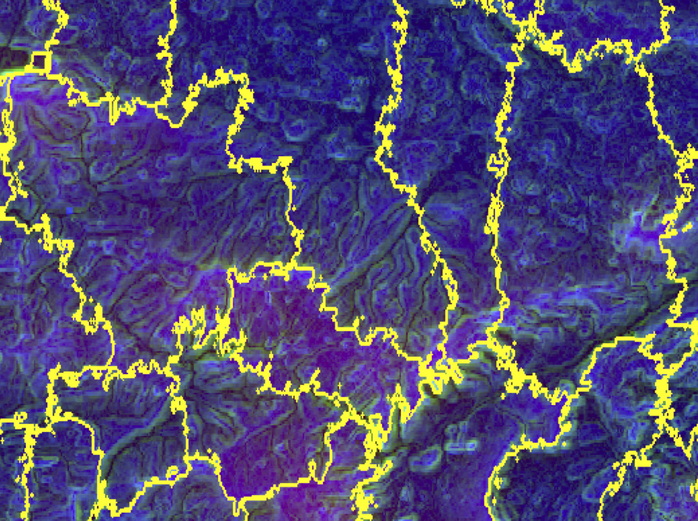

## One-page summary
Use 200 years of data from England and Wales. 

Large, contiguous plots of land around the city are associated with:

- stronger specialization
- fast population growth earlier, decline later

## Broader comments
Economies of scale, scope and density are most interesting in economics.

Big shifts in sectoral specialization, population, productivity and economic geography likely related.

Spatial macroeconomics is promising not only for historical development.

## One point about empirics
Meanshift algorithm clusters points in multidimensional space.

### But 
Much depends on relative weights of other dimensions; need to know more.

Very few spatial data is truly raster; often based on vectoral data; can be misleading.

## Example: WorldPop raster

## Example: OpenStreetMap vector

## One point about theory

