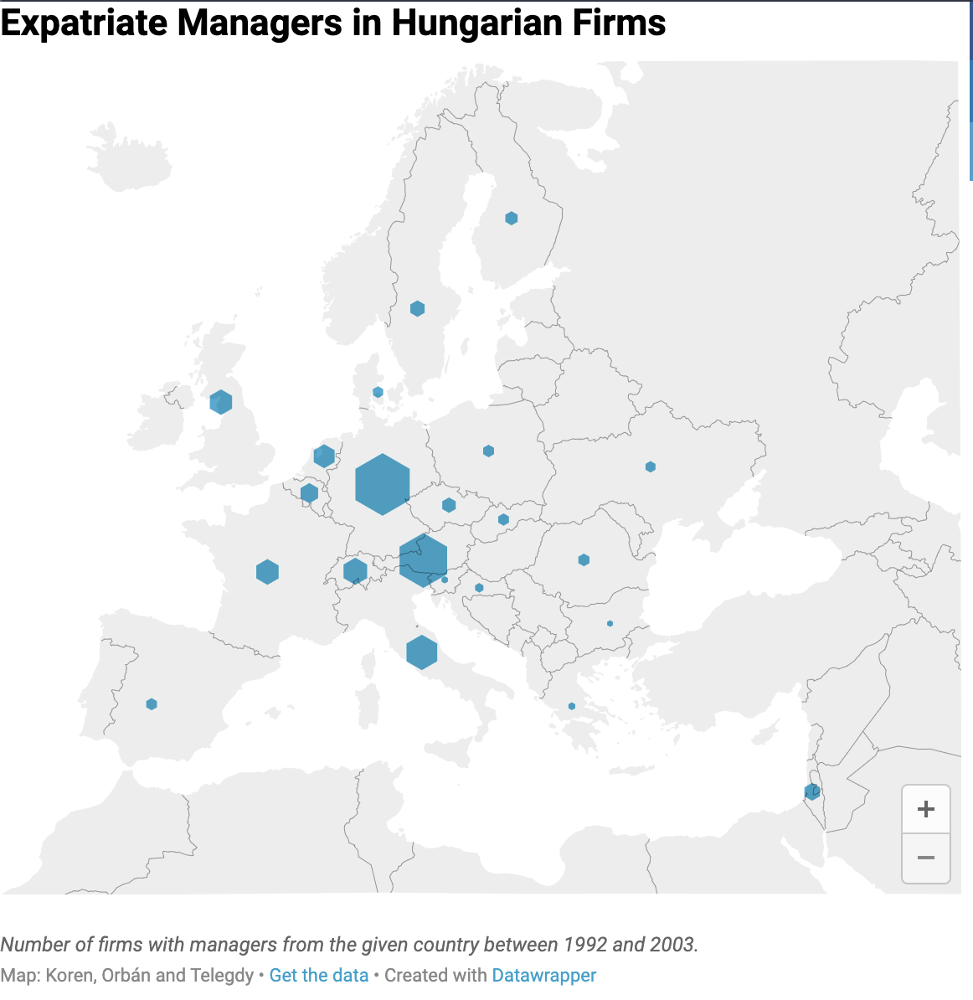
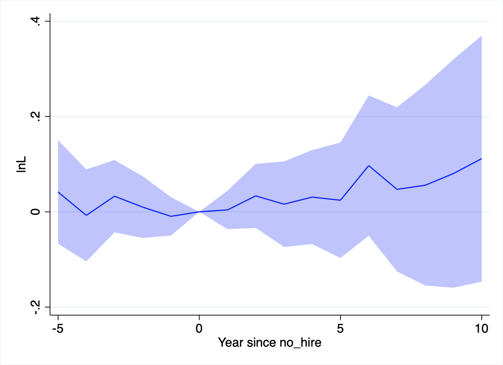
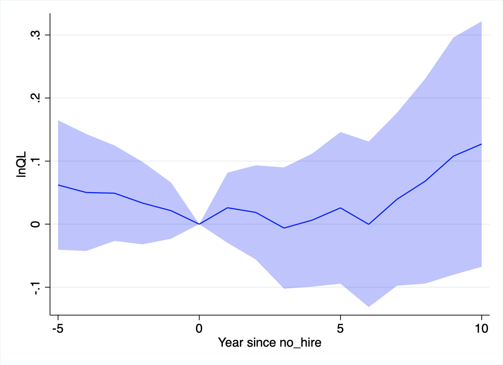
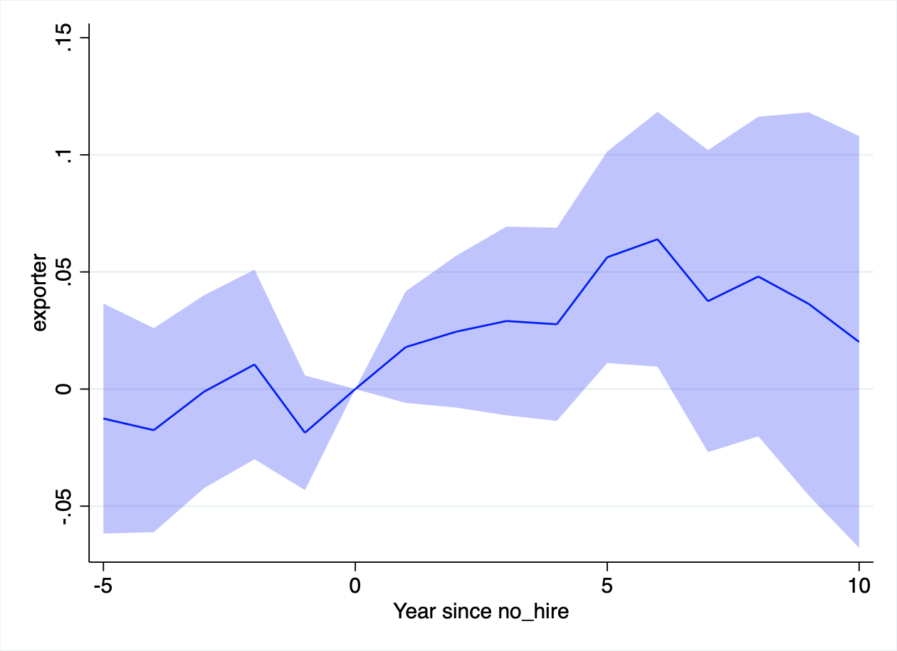
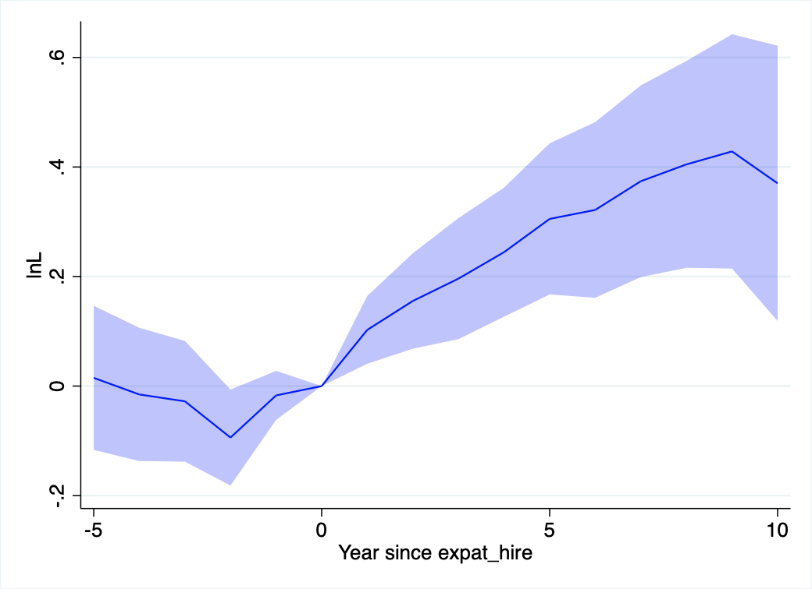
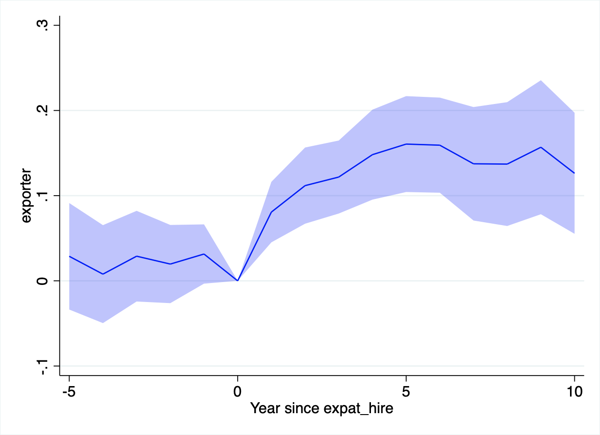
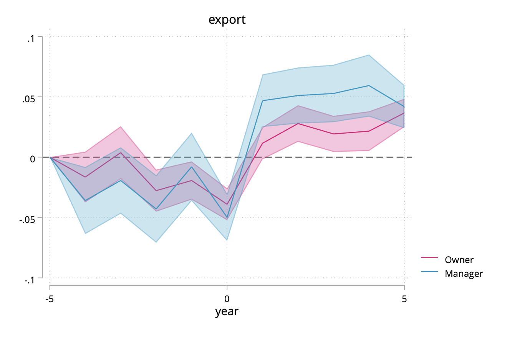

# Motivation
## The end of a Qatari project in Budapest

## The end of a Qatari project in Budapest
* Qatari real estate investors made several high-value investments in Budapest in 2015 (Brückner 2021).
* For them, however, the projects were small, not worth delegating an expatriate manager.
* Business deals, even simple decisions often took months.
* Finally, they sold their stake in December 2020.

## Research question
* What role do expatriate managers play in foreign direct investment?
* Do they improve firm performance?
* Do they facilitate trade with their "home country"?

# Data
## Data
* Administrative data on *all* Hungarian corporations, 1992--2018.
* Financial data, trade transactions (1992--2003)

# Motivation
## Motivation
Why and how do firms produce abroad?

1. What are the boundaries of (global) firms?
2. Foreign owned firms perform better than domestic firms
3. Managers matter

## What are the boundaries of (global) firms?
\begin{tikzpicture}
\node (a) at (0,0) {arm's length};
\node (b) at (3,0) {relational};
\node (c) at (6,0) {acquisition};
\node (d) at (9,0) {management};
\graph { (a) -> (b) -> (c) -> (d)};
\end{tikzpicture}

## Foreign owned firms perform better than domestic firms
* US: Doms and Jensen (1998)
* UK: Griffith (1999)
* Hungary, Romania, Russia, Ukraine: Brown, Earle, Telegdy (2006)
* Indonesia: Arnold and Javorcik (2009)

## Managers matter
* Good management practices  increase  productivity  (Bloom  and  Van  Reenen  2010;  Bloom  et  al.  2012;  Bloom  et  al.  2014) and market access (Bloom et al. 2016). 
* CEOs behaving like ``leaders" gradually improve firm performance. (Bandiera, Hansen, Prat and Sadun 2018)
* Large increase  in  the  level  and  inequality  of  CEO  pay.  (Murphy  and  Zábojník  2004;  Gabaix  and  Landier  2008;  Tervio  2008; Frydman and Saks 2010)
* Managers have persistent effects across firms on investment policy, R\&D, advertising, return on assets.  (Bertrand and Schoar 2003)
* Sudden CEO death worsens firm performance. (Bennedsen, Pérez-González and Wolfenzon 2007) 
* Managers having past export experience increase likelihood of exporting (Mion and Opromolla 2014; Mion, Opromolla and Sforza 2016) and importing (Bisztray, Koren and Szeidl 2018).

## This paper
* Compile new data on which firm is run by which manager: Hungary, 1980--2018. 
* Measure different degrees of foreign control:
    1. acquisition
    2. replace CEO
    3. hire expat CEO
* Results:
    * Exporters and low-productivity firms become more tightly controlled. 
    * Firms with high immaterial capital receive local managers.
    * Foreign controlled firms become more productive and more likely to export. 

# Data

### Hungarian Manager Database
* coverage: universe of corporations, 1980--2018
* CEO: highest officer of corporation as specified in corporate law.
    - information: name, mother's name, address, tenure at firm
* 1 million firms, 2 million CEOs, 5 million job spells

### Balance sheet data
* coverage: universe of double entry firms, 1980--2018
* information: sales, exports, employment, equipment, immaterials etc.

### Customs statistics
* coverage: universe of direct exports and imports, 1992--2003
* information: product code, partner country, firm id, value

## Names
* We use manager names to infer 
    1. CEO change
    2. ethnicity
    3. gender (not used today)
* Foreign manager: firm representative with a non-Hungarian first name
    1. e.g. Eva Bauer v Bauer Éva
    2. but: George Soros v Soros György
* Allow for misspelling, omitted middle name, missing data (jr, dr)

## Shape of data
`firm,manager,country,from,to`
`123456,Szilágyi Erika,HU,1992-01-01,1996-12-31`
`123456,Pálffy György,HU,1997-01-01,1999-12-31`
`123456,Greta Schröder,DE,2000-01-01,2003-03-31`

## Data cleaning
1. Convert names to numerical IDs
2. Infer Hungarian ethnicity from name
3. Classify everyone else as foreign
4. Clean up time interval and position description
5. Create annual panel for June 21
6. In progress: Infer ethnicity (other than Hungarian) from name

## Sample
- Exclude: 
    - employing less than 20 people
    - financial sector
    - domestic firms with expat CEO
    - greenfield FDI
    - firms with more than 15 CEOs
- Left with 24,500 firms

# Descriptives
## The number of CEOs increased sharply until 2010

## The share of firms managed by founders gradually decreases with age

## Founders stay longest at the firm

## Largest investment partners of Hungary 1992--2003

## Foreign owners often replace managers

## Degree of control
\begin{tikzpicture}
\node (a) [text width=1.5cm] at (0,0) {domestic (243,388) (22,761)};
\node (b) [text width=1.5cm] at (3,0) {acquired (20,781) (1,770)};
\node (c) [text width=1.5cm] at (6,0) {mgr replaced (15,784) (1,235)};
\node (d) [text width=1.5cm] at (9,0) {expat hired (9,184) (654)};
\graph { (a) -> (b) -> (c) -> (d)};
\end{tikzpicture}

# Estimation
## Variables
* **foreign**: firm has majority foreign owner
* **foreign\_hire**: firm has a manager hired by foreign owner
* **has\_expat**: firm has an expat manager
* **CONTROL${}^k$**: one of the three ($k=1,2,3$)
* **lnL**: log employment
* **lnQL**: log output per worker
* **TFP\_cd**: TFP (simple Cobb--Douglas)
* **exporter**: firm has positive exports
* **RperK**: share of immaterial assets in total [0,1]

## Estimating equations
### Selection
Sample: $\text{CONTROL}_{i}^{k-1} = 1$, years before acquisition
$$
\text{CONTROL}_{i}^k = \mu_{st} + \gamma X_{it}  + u_{ist}
$$

### Diff-in-diff (!)
Sample: acquisitions
$$
Y_{ist} = \alpha_i + \mu_{st} + \sum_{k=1}^3 \beta_k \text{CONTROL}_{it}^k + u_{ist}
$$

## Differences in differences
$$
Y_{it} = \alpha_i + \nu_t + \beta \text{CONTROL}_{it} + u_{it}
\tag{*}
$$

### Old diff-in-diff
Estimate (\*) by two-way fixed effects.

### New diff-in-diff
Compute group-specific treatment effects and aggregate. (Callaway and Sant'Anna 2020)

## Problem with TWFE
Model may be misspecified. Often, $\beta$ is heterogeneous or increases over treatment length.

This is a problem if treatment is staggered, especially in long panel (our case). 

Long treated firms will act as a control, biasing $\hat\beta$. May even have different sign than all the individual treatment effects.

## Callaway - Sant'Anna solution
$G_{i}$: time of treatment of unit $i$ (may be $\infty$)

$C_{gt} = \{i: G_i > \max(g,t)\}$: control group is not yet treated

$$
\gamma_{gt} := \sum_{i: G_i=g} (Y_{it} - Y_{ig})
- \sum_{i\in C_{gt}} (Y_{it} - Y_{ig})
$$

Aggregate $\gamma_{gt}$ with "suitable" weights

## Multiple treatments
We have three treatments: acquisition only, domestic hire, expat hire.

How to do Callaway-Sant'Anna in this case? 

Make sure treatments don't "leak" into controls. 

## Our solution
$G_{i}^k$: time of treatment $k$ of unit $i$ (may be $\infty$)

$C_{gt} = \{i: \min_k G_i^k > \max(g,t)\}$: control group is not yet treated with **any** of the treatments

$$
\gamma_{gt}^k := \sum_{i: G_i=g} (Y_{it} - Y_{ig})
- \sum_{i\in C_{gt}} (Y_{it} - Y_{ig})
$$

Each treatment has the **same** control group.

## Callaway-Sant'Anna estimates

## Abadie (2005)

# Results

## Positive selection on exports, negative on TFP
\input{table/selection.tex}

# Without change in management
## No effects of foreign acquisition on employment

## No effects of foreign acquisition on capital

## No effects of foreign acquisition on productivity

## Some transitory increase in exporting

# Hire a local manager
## Fast productivity growth after local manager is hired

# Hire an expat manager
## Fast employment growth after expat manager is hired

## Positive capital investments after expat manager is hired

## Productivity growth of same magnitude as with local manager

## Large effects on exporting

# Market access
## Inferring ethnicity from name
\begin{tabular}{lll|ccc}
Address & Name & Partner & \texttt{count} & \texttt{lang} & \texttt{ethn} \\
\hline
DE & Klaudia Wolf & DE & 1 & 1 & 1\\
DE & Klaudia Wolf & AT & 0 & 1 & 1\\
DE & Klaudia Wolf & IT & 0 & 0 & 0\\
\hline
DE & Enrico Mazzanti & DE & 1 & 1 & 0\\
DE & Enrico Mazzanti & AT & 0 & 1 & 0\\
DE & Enrico Mazzanti & IT & 0 & 0 & 1\\
\hline
IT & Fioretta Luchesi & DE & 0 & 0 & 0 \\
IT & Fioretta Luchesi & AT & 0 & 0 & 0 \\
IT & Fioretta Luchesi & IT & 1 & 1 & 1 
\end{tabular}

## Estimating equation
For each firm-year, take 24 major partner countries. What is the hazard of starting to export/import to/from that country?

$$
\Pr(X_{ict}=1|X_{ict-1}=0) = 
\alpha_{ic} + \mu_{ct} + \nu_{it} 
$$
$$
{}+ \beta_o \text{OWNER}_{ict} 
{}+ \beta_m \text{MANAGER}_{ict} 
{}+ u_{ict}
$$

## Large and permanent effects on exports

## And on imports

# Discussion 

## Effects are large
### Fixed-cost estimates in Halpern, Koren and Szeidl (2015)
Equivalent to \$12-14,000 drop in fixed costs ''per year''.

\begin{tabular}{l|cc}
Scenario & Import hazard & Fixed cost \\
\hline
Average firm & 0.010 & \$15,000\\
Only owner & 0.081 & \$2,300\\
Only manager & 0.106 & \$1,700\\
Both & 0.226 & \$600
\end{tabular}

### Trade experience premia
Mion, Opromolla and Sforza (2016) estimate a 0.01--0.04 increase in hazard after manager with relevant export experience joins. Bisztray, Koren and Szeidl (2018) estimiate 0.002--0.005 peer effects in importing.

## Three stories
### Vertical integration 
Foreign owner takes over firm to export/import within own supply chain.

### Professional network
Managers help connect different firms within their professional network.

### Business culture
Managers know the business culture of their home country.

## Why managers matter
Three broader implications:

1. Trade within "supply chains" larger than previously thought.
2. Entry into new trade markets is inelastic.
3. Experience with existing partners leads to preferential attachment.

## Business network trade
* Contrary to evidence from US, investment in Hungary leads to large increases in trade with home region.

## Inelastic market entry 
* If professional networks are hard to build, extensive margin of trade is less responsive.
* Competitiveness leads to higher manager wages, not more entry.
* Complementarity of trade and migration policies.

## Preferential attachment 
* It may be easier to trade with friends of friends.
* We (will) highlight a mechanism for why that is.

# Conclusions 
## Conclusions 
* We find firm-level evidence that the nationality and ethnicity of owners and managers matters for the direction of trade.
* Whatever the specific mechanism, we need to model markets and individuals jointly.

# Conclusions
## Conclusions
* What are the causes and consequences of foreign acquisitions?
* We ask when managers are also replaced.
* Using data on the universe of foreign acquisitions in Hungary, 1980-2018, we estimate that exporters and low-productivity firms become more tightly controlled. 
* Foreign controlled firms become more productive and more likely to export. 
* These facts help inform theories about the boundaries of global firms and about the role of managers in firm performance.

## Next steps
* Collect data on parent firms.
* Build an incomplete-contract model.
