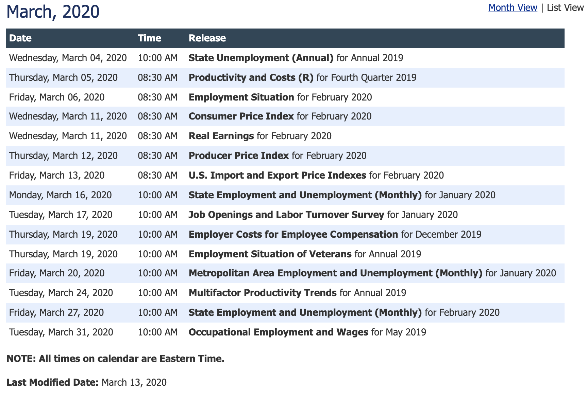
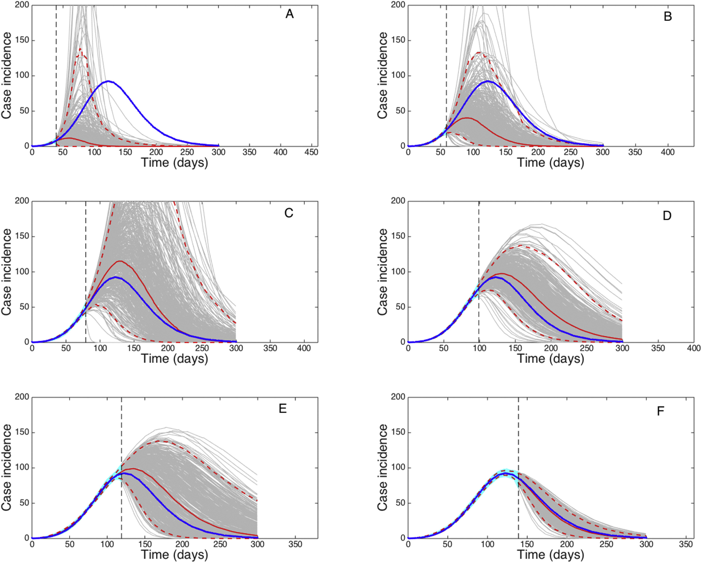
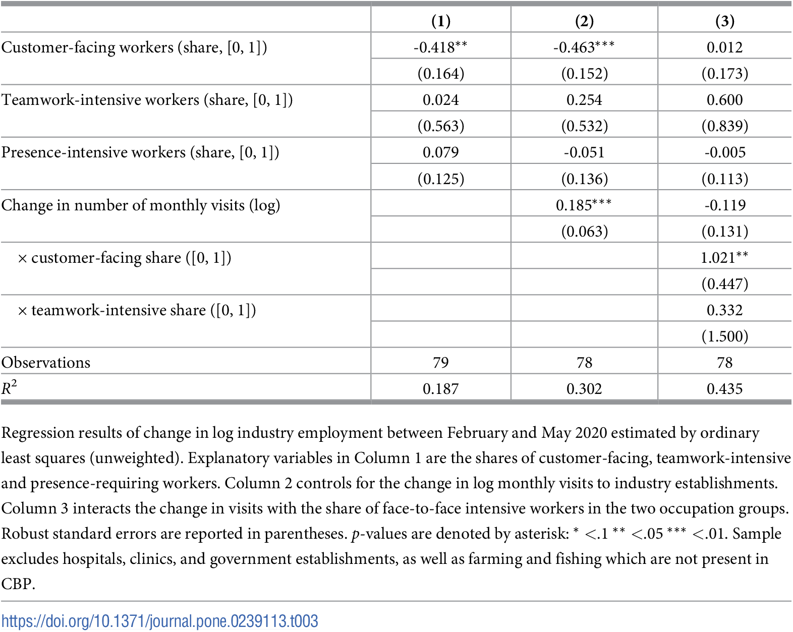
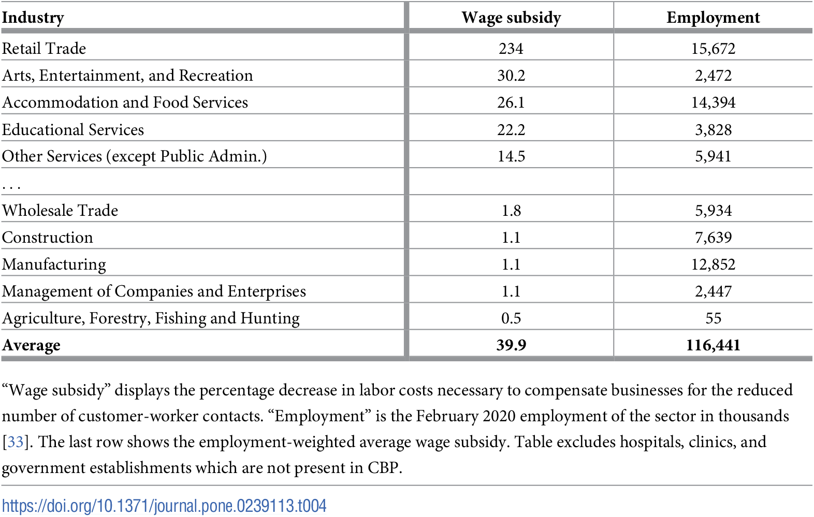

# When time really matters
## When time really matters
- November 2019: outbreak in Wuhan
- December 27, 2019: new coronarivurs
- December 31, 2019: WHO informed
- January 30, 2020: WHO declares "public health emergency"
- March 11, 2020: WHO declares pandemic
- by March 31, 2020: most countries adopted strict social distancing measures

## Typical statistics publication calendar (BLS.gov)

## Time-sensitive questions
- How does the virus spread?
- How many ventilators, PPEs, nurses etc. will we need? By when?
- What (non-pharmaceutical) interventions are effective against it?
- Which of these are most cost effective?
- What can policy do to mitigate the costs?
- (in addition to genome sequencing, drug and vaccine development, clinical research)

# The response of open science
## The response of open science
- Government, academia and industry came together quickly and effectively. (But: pressing issues remain.)
- Troves of data shared.
- Research results published fast.
    - 83 issues of *Covid Economics*, about 500 papers published.

### Is this the future of policy analysis?

## About 250,000 Covid-related articles

## Timely data collection
How to avoid the 2-3-month lag of official statistical releases? (Plus several months of peer review.)

Reuse existing data collected during "normal course of business":

- administrative
- private

## Good examples with data
### Medical
enormous amount of clinical, epi, virology data OPEN

### Stock returns
STANDARD

### Financial transactions
- What and how did people buy during the Great Lockdown? Evidence from electronic payments. Bruno P. Carvalho, Susana Peralta and João Pereira dos Santos
- Who spent their COVID-19 stimulus payment? Evidence from personal finance software in Japan. Michiru Kaneda, So Kubota and Satoshi Tanaka
- The English Patient: Evaluating Local Lockdowns Using Real-Time COVID-19 & Consumption Data. John Gathergood and Benedict Guttman-Kenney
- Consumption Dynamics in the COVID Crisis: Real Time Insights from French Transaction & Bank Data. David Bounie, Youssouf Camara, Etienne Fize, John Galbraith, Camille Landais, Chloe Lavest, Tatiana Pazem and Baptiste Savatier
- Disentangling the effect of government restrictions and consumers’ reaction function to the Covid-19 pandemic: Evidence from geo-located transactions data for the Netherlands. Pascal Golec, George Kapetanios, Nora Neuteboom, Feiko Ritsema and Alexia Ventouri
- Tracking inflation on a daily basis. Santiago E. Alvarez, Sarah M. Lein
- The COVID-19 Shock and Consumer Credit: Evidence from Credit Card Data. Akos Horvath, Benjamin Kay and Carlo Wix
- Consumer Responses to the COVID-19 Crisis: Evidence From Bank Account Transaction Data. Asger Lau Andersen, Emil Toft Hansen, Niels Johannesen and Adam Sheridan

### Tracking mobility, spatial effects
- Flattening the Curve: Pandemic-Induced Revaluation of Urban Real Estate. Arpit Gupta, Vrinda Mittal, Jonas Peeters and Stijn Van Nieuwerburgh
- The Impact of COVID-19 on the European Short-Term Rental Market. Elisa Guglielminetti, Michele Loberto and Alessandro Mistretta> Airbnb
- Spatial distancing: air traffic, Covid-19 propagation, and the cost efficiency of air travel restrictions. Nicolas Gonne and Olivier Hubert
- A first look at the impact of COVID-19 on commercial real estate prices: Asset-level evidence. David C. Ling, Chongyu Wang and Tingyu Zhou
- Air passenger mobility, travel restrictions, and the transmission of the covid-19 pandemic between countries. Sekou Keita
- Staying at home: Mobility effects of Covid-19. Sam Engle, John Stromme and Anson Zhou
- Business disruptions from social distancing. Miklós Koren and Rita Pető

### Economic activity on platforms
- Restaurant Closures during the Pandemic: A Descriptive Analysis (Dmitry Sedov): Yelp
- Sharing when stranger equals danger: Ridesharing during Covid-19 pandemic. Marc Ivaldi and Emil Palikot
- Seller reputation and price gouging: Evidence from the COVID-19 pandemic. Luís Cabral and Lei Xu
- Mobility Restrictions and Remote Work: Empirical Evidence on Demand and Supply on a European Online Labour Market. Frank Mueller-Langera and Estrella Gomez-Herrera
- The Impact of COVID-19 on the European Short-Term Rental Market. Elisa Guglielminetti, Michele Loberto and Alessandro Mistretta> Airbnb

### Using Covid as a natural experiment
- COVID-19, Home Advantage in Professional Soccer, and Betting Market Efficiency (Kai Fischer and Justus Haucap)

### Other data to track infections
- sewage
- air traffic

### Other data to track the economy
- Firms and Households during the Pandemic: What do we learn from their electricity consumption? Olympia Bover, Natalia Fabra, Sandra Garcıa-Uribe, Aitor Lacuesta, and Roberto Ramos
- How Has Labor Demand Been Affected by the COVID-19 Pandemic? Evidence from Job Ads in Mexico. Raymundo M. Campos-Vazquez, Gerardo Esquivel, Raquel Y. Badillo
- The short-run effect of COVID-19 on new marketing endeavors: Evidence from EUIPO’s trademark applications. Kyriakos Drivas
- Using the eye of the storm to predict the wave of Covid-19 UI claims. Daniel Aaronson, Scott A. Brave, R. Andrew Butters, Daniel W. Sacks and Boyoung Seo [Google Trends]

### Other data to track social outcomes
- U.S. Churches' Response to Covid-19: Results from Facebook. Eva Raiber and Paul Seabright
- Online learning during school closure due to COVID-19. Masato Ikeda and Shintaro Yamaguchi
- COVID-19 and the Future of US Fertility: What Can We Learn from Google? Joshua Wilde, Wei Chen, and Sophie Lohmann
- Did the COVID-19 Pandemic trigger nostalgia? Evidence of Music Consumption on Spotify. Timothy Yu-Cheong Yeung
- Consumption and Geographic Mobility in Pandemic Times: Evidence from Mexico. Raymundo M. Campos-Vazquez, and Gerardo Esquivel
- Valuing goods online and offline: the impact of Covid19. Diane Coyle and David Nguyen
- The Early Impact of COVID-19 on Local Commerce: Changes in Spend Across Neighborhoods and Online. Lindsay E. Relihan, Marvin M. Ward Jr., Chris W. Wheat and Diana Farrell
- In crisis, we pray: Religiosity and the Covid-19 pandemic. Jeanet Sinding Bentzen

## Bad examples with data

# Benefits
## Speed
## Universal coverage

# Concerns
## Statistics
- Sampling
- representativity
	- only for small random samples

## Economics / system modeling
- Lucas critique
- relative to SIR model of pandemic
- nonlinear responses
	- Gerardo Chowell, 2017. Fitting dynamic models to epidemic outbreaks with quantified uncertainty: A primer for parameter uncertainty, identifiability, and forecasts, Infectious Disease Modelling, Volume 2, Issue 3, https://doi.org/10.1016/j.idm.2017.08.001.

## Peaks of pandemic are notoriously hard to forecast (Chowell 2017)

## Politics
- incentives to hide/share information
	- governments
	- corporations

# The COVID shock

## Visits to retail and recreation places collapsed 
{width=100%}

## Many workplaces are shuttered 
{width=100%}

## People are staying at home 
{width=100%}

## Which jobs are most affected?
Important for economic subsidy, vaccination programs.

[The most communication intensive sectors](https://www.datawrapper.de/_/NNmIa/)

## Many occupations rely heavily on face-to-face communication
{ height=65% }

## Face-to-face intensive industries have contracted the most
{height=70%}

## Job losses explained by fewer customer visits *and* communication intensity 

## Tax-equivalent losses are huge

# The year after

## The year after
What will be the long-run consequences? To speculate, we use

* The 2017 CEU-MTA Business Relations Survey.
* A mini survey of 2020 CEU MBA students.

## The CEU-MTA Business Relations Survey
CEU and MTA asked 1,200 Hungarian, Slovakian and Romanian manufacturing firms about relationships with their key buyers and suppliers.

## Meetings are important for joint innovation

## This collaboration remained after start

## Major business changes are expected

## Most meetings are with coworkers and clients

## Lack of new business opportunities is strongest risk

## Why are face-to-face meetings important for you work?

> "I work as a sales professional, where face-to-face interactions are key to build trustful relationships with my customers."
>
> "Face-to-face meetings ensure better quality of transferring strategic messages."
>
> "Non-verbal communication counts at least 30% of the total messages during meetings."
>
> "To build strong, lasting relationships."

## Can videoconferencing tools substitute for face-to-face meetings in your work?

> “We tried several times videoconferencing with customers, but not successfully. I doubt that we can switch to videoconferencing completely.”
> 
> “Lack of client and staff interaction reduces quality of service “
>
> “They can, up to certain level.”
>
> “Yes, we already moved to video conferencing, no loss in productivity”

# Conclusion
## Conclusion
* Face-to-face interaction is a key aspect of many jobs.
* In internal teamwork, working from home is a good alternative. But not for customer contact.
* Retail services suffer the most, in proportion to our predictions.

## Thank you
Connect on Twitter:
- @[korenmiklos](https://twitter.com/korenmiklos)

