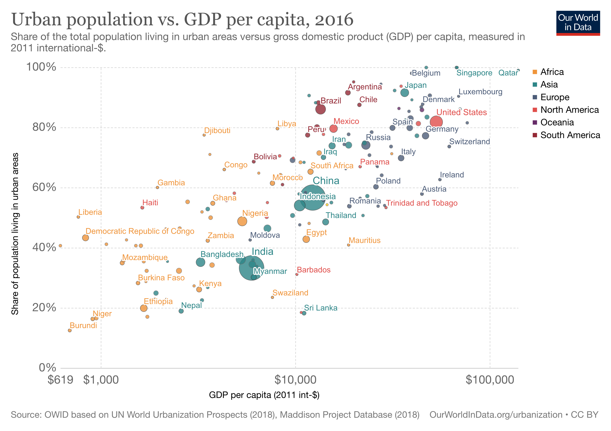
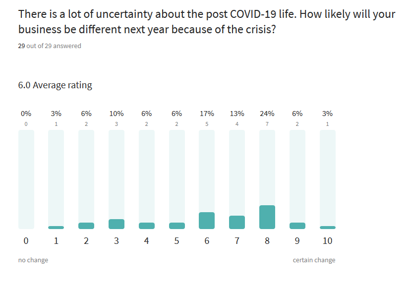
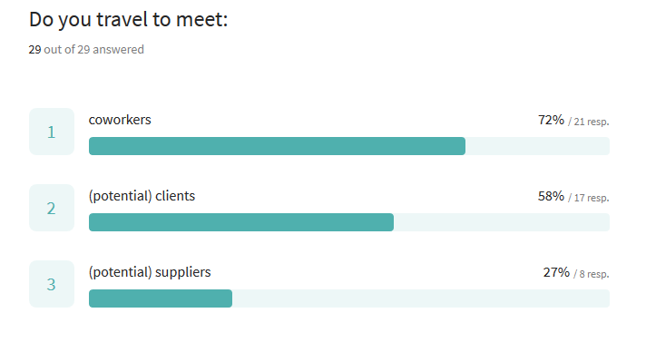
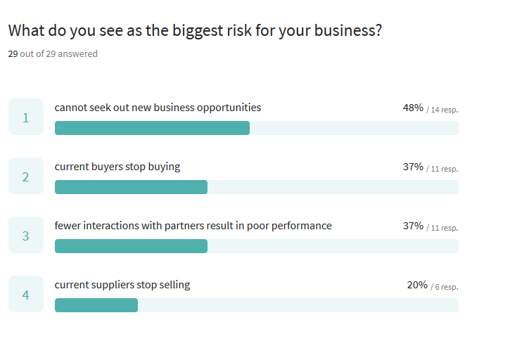

# The changing nature of work

## City life is a key fact of developed economies

## Cities serve a very different function than 100 years ago

## Communication and the division of labor
\exhibit{fig1.eps}

## Survey evidence on how people work
\exhibit{t001.png}

# The COVID shock

## Visits to retail and recreation places collapsed 
{width=100%}

## Many workplaces are shuttered 
{width=100%}

## People are staying at home 
{width=100%}

## Which jobs are most affected?
Important for economic subsidy, vaccination programs.

[The most communication intensive sectors](https://www.datawrapper.de/_/NNmIa/)

## Many occupations rely heavily on face-to-face communication
{ height=65% }

## Face-to-face intensive industries have contracted the most
{height=70%}

## Job losses explained by fewer customer visits *and* communication intensity 
\exhibit{t003.png}

## Tax-equivalent losses are huge
\exhibit{t004.png}

# The year after

## The year after
What will be the long-run consequences? To speculate, we use

* The 2017 CEU-MTA Business Relations Survey.
* A mini survey of 2020 CEU MBA students.

## The CEU-MTA Business Relations Survey
CEU and MTA asked 1,200 Hungarian, Slovakian and Romanian manufacturing firms about relationships with their key buyers and suppliers.

## Meetings are important for joint innovation

## This collaboration remained after start

## Major business changes are expected

## Most meetings are with coworkers and clients

## Lack of new business opportunities is strongest risk

## Why are face-to-face meetings important for you work?

> "I work as a sales professional, where face-to-face interactions are key to build trustful relationships with my customers."
>
> "Face-to-face meetings ensure better quality of transferring strategic messages."
>
> "Non-verbal communication counts at least 30% of the total messages during meetings."
>
> "To build strong, lasting relationships."

## Can videoconferencing tools substitute for face-to-face meetings in your work?

> “We tried several times videoconferencing with customers, but not successfully. I doubt that we can switch to videoconferencing completely.”
> 
> “Lack of client and staff interaction reduces quality of service “
>
> “They can, up to certain level.”
>
> “Yes, we already moved to video conferencing, no loss in productivity”

# Conclusion
## Conclusion
* Face-to-face interaction is a key aspect of many jobs.
* In internal teamwork, working from home is a good alternative. But not for customer contact.
* Retail services suffer the most, in proportion to our predictions.

## Thank you
Connect on Twitter:
- @[korenmiklos](https://twitter.com/korenmiklos)

