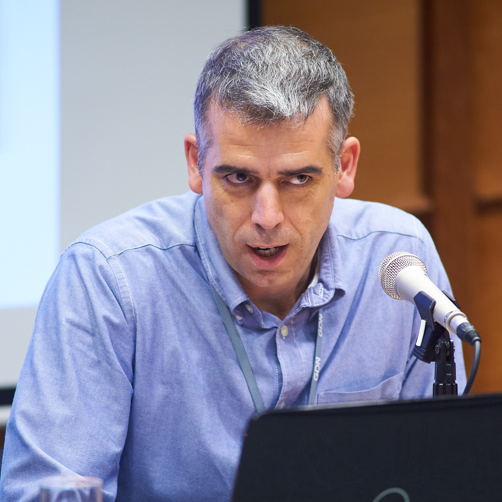
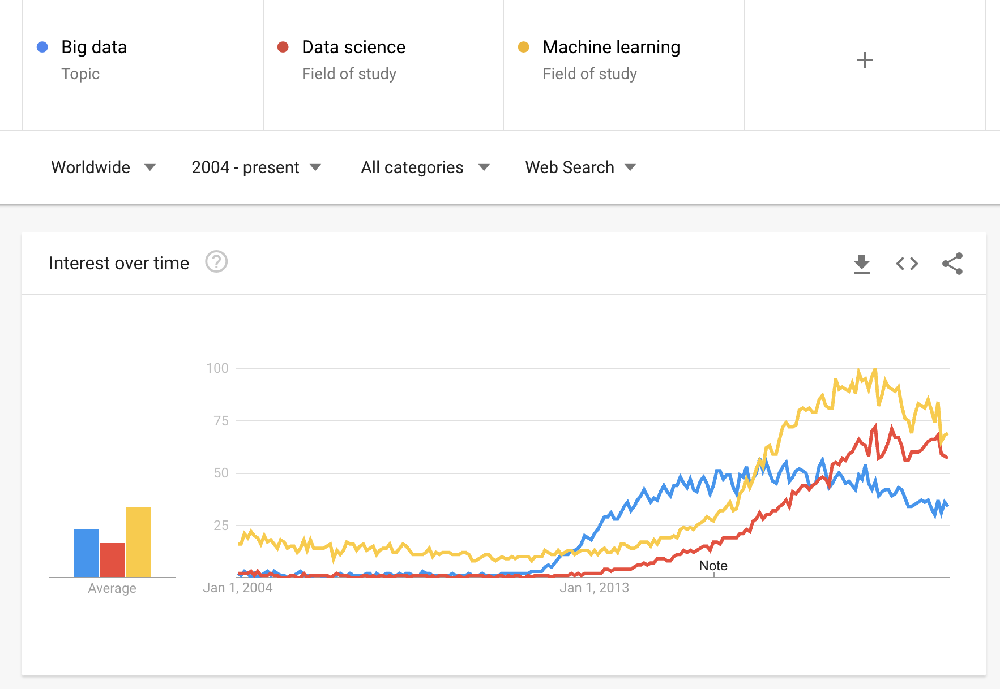
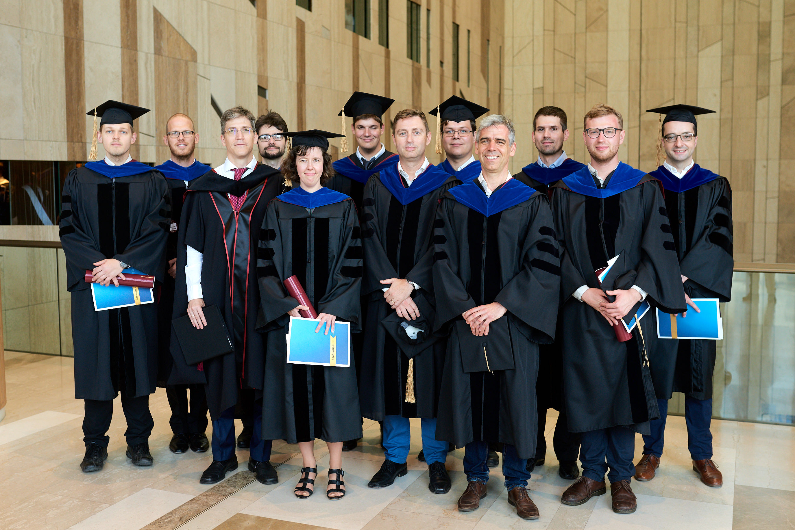
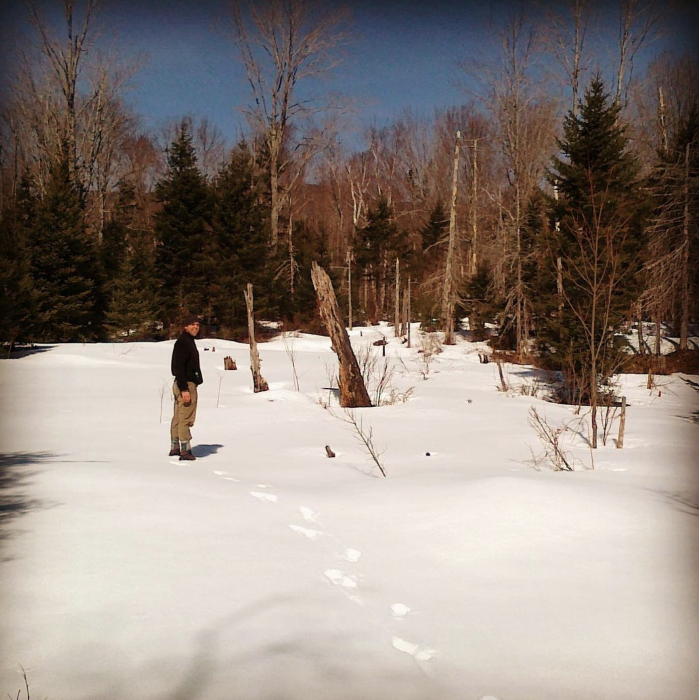

# ,,Kérdezzük meg Kézdit!''
## Miért?
- ,,Nincs algoritmus. Döntéseket kell hozni.''
- Valódi átváltások. Érteni kell, mi a fontos, mi nem az.
- Tapasztalat és bölcsesség szerepe.

## Néhány példa nehéz kérdésekre
- Mit kezdjek a hiányzó / kiugró változóértékekkel?
- Mit tudok mondani az okságról, ha nincs RCT-m?
- Hogyan tároljam az adataimat?
- Milyen módszertant / technológiát tanítsunk a diákoknak?
- Kutatás vagy tanítás (vagy service)?
- Mi egy közgazdaságtan tanszék szerepe Magyarországon / Közép-Európában?
- Kell-e magyarul művelni a közgadaságtant?

## Itt például nem értünk egyet

## Újdonság és fejlődés
- Se divat, se dogma.
- ,,Strong opinions, loosely held.''

# Mi az a data science?

## Divatok jönnek, mennek

## Data science a CEU-n
- 2009: Institute for New Economic Thinking
- 2011: Tools for Academic Research
- 2012: MS in Data Science for Economics (-)
- 2014: MS in Business Analytics 
- 2021: Data Analysis for Business, Economics, and Policy

# A tudomány szolgálata
## Magyar Közgazdaságtudományi Egyesület
- Alapító tag.
- Elnökségi tag 2007-10.

## Defacto blog
- 2014 óta 105 cikk
- Összesen több, mint 3 milliós olvasottság

## CEU tanszék
- Legyen-e a tanszéknek fókusza?
- Új institucionalizmus javaslat vs fősodor (2005)
    - időzítés
    - kutatás vs tanítás
- Tanszékvezetés 2010-14

# Tanítás
## Tanítás

## Tanítás
- Rajk
- Corvinus
- CEU 
- Michigan

## Diák-visszajelzések (1)
> “Professor Kezdi is a very good professor and professional. He is among the best teachers in the Department of Economics within CEU. He is always straight-to-the-point, answers the emails and it really shows that he knows what he is talking about. 10/10”

> “I would like to thank professor Kezdi for his immense work that he put in his class and the knowledge he shared. The knowledge I received helped me to advance my little skills I already possessed in this field when starting the course. Coming from a different background, I can surely say that I did a huge progress. Some of the courses at your university studies grab you to a different direction that you might want to follow in the future. This course was one of them for me. Thank you.”

## Diák-visszajelzések (2)

>“Gabor is a great instructor, it’s visible during classes that he **enjoys teaching and enjoys data analysis** in general. He is **putting the needs of the students before everything else**, he is easily accessible and friendly.” 1

## Kézdi Gábor 1971-2021

