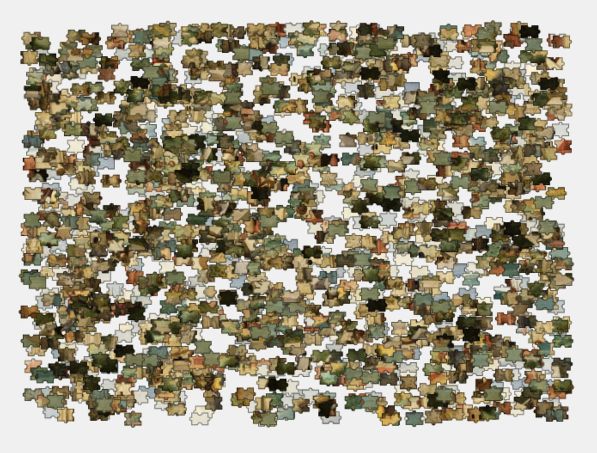
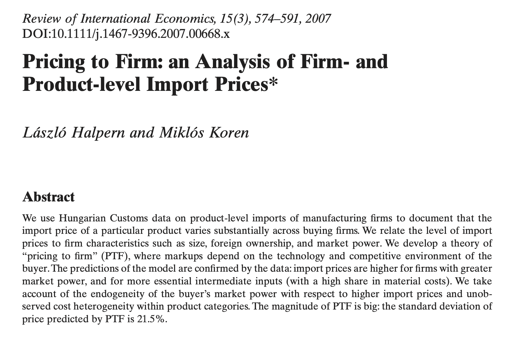
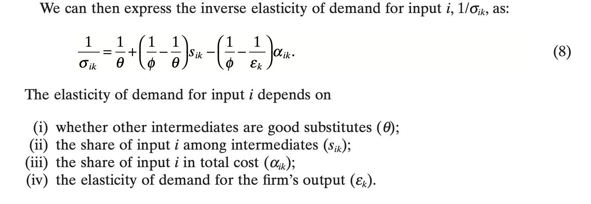
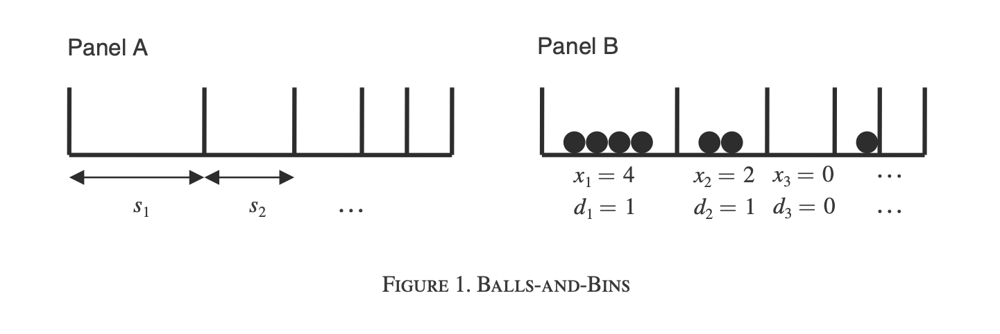
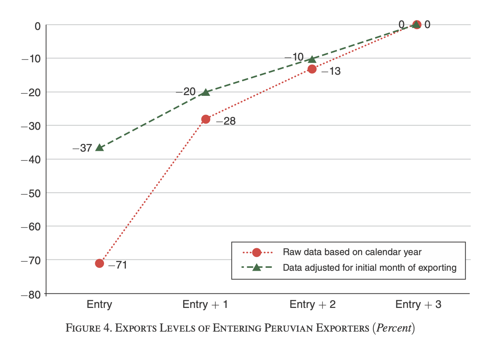

# A leíró elemzésről
## Beszéljenek az adatok!

## Ugye, milyen gyönyörűek?

## Gondolati keret
1. formális modell
2. adatgeneráló folyamat
3. verbális modell

# A formális modellek korlátai

## Halpern-Koren 2007

## Piaci erő és árazási viselkedés

# Adatgeneráló folyamat

## Extenzív határ a külkereskedelemben (Armenter-Koren 2014)

## Exporter Dynamics and Partial-Year Effects (Bernard et al 2017)

# A kutatási kérdésről
## Miért érdekes az új termékek külföldi és belföldi ára?
1. Versenyképesség / minőség jelzése
2. Kapcsolódás a nemzetközi piacokhoz
3. Innováció

## Melyikről mit tanulunk az adatokból?
- A cégszintű termékárak piaconként (haza, export, import) nagyon erősen korrelálnak. (1)
- Az ár és a mennyiség is növekszik a piacra lépés első három évében. (2,3)
    - nemcsak az elsőben (DGP)
- Nagyobb, külföldi cégek alacsonyabb relatív exportáron értékesítenek. (1)
- Kisebb cégek export- és import-kosara is gyakrabban cserélődik. (DGP)

## Vagyis
A piacra lépés ($\approx$ kereslet megteremtése) fontos és lassú folyamat.