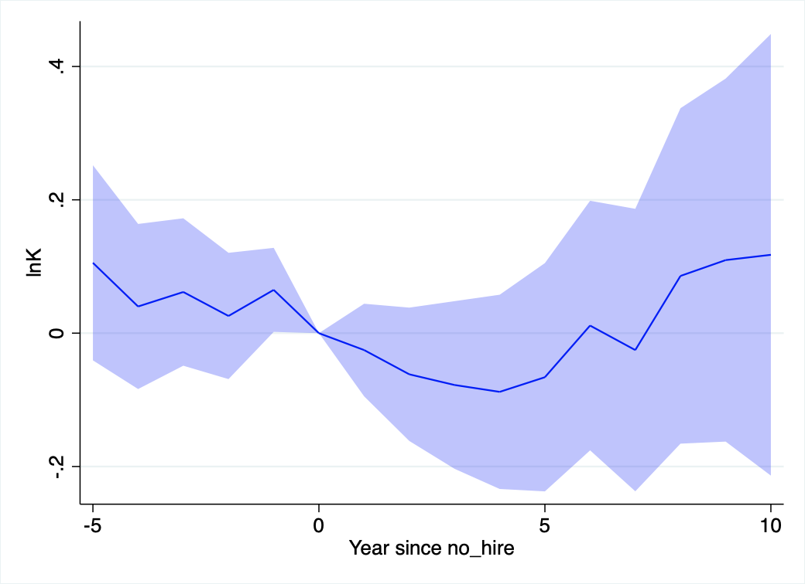

# Motivation
## Research question
* What role do expatriate managers play in foreign direct investment?
    * Do they improve firm performance?
    * Do they facilitate trade with their "home country"?
* What role for personal connections and face-to-face meetings in globalization?

## Related to four strands of literature
1. What are the boundaries of (global) firms?
2. Foreign owned firms perform better than domestic firms
3. Management/managers matter
4. Personal networks matter


## Degrees of control between/within firms
\begin{tikzpicture}
\node (a) at (0,0) {arm's length};
\node (b) at (3,0) {relational};
\node (c) at (6,0) {acquisition};
\node (d) at (9,0) {management};
\graph { (a) -> (b) -> (c) -> (d)};
\end{tikzpicture}


## This paper
* Compile new data on which firm is run by which manager: Hungary, 1980--2018. 
* Measure different degrees of foreign control:
    1. acquisition
    2. replace CEO
    3. hire expat CEO
* Results:
    * Exporters and low-productivity firms become more tightly controlled. 
    * Firms with high intangible capital receive local managers.
    * Expat controlled firms become more productive and more likely to export (relative to other forms of control). 

# Data
### Hungarian Manager Database
* coverage: universe of corporations, 1980--2018
* CEO: highest officer of corporation as specified in corporate law.
    - information: name, mother's name, address, tenure at firm
* 1 million firms, 2 million CEOs, 5 million job spells

### Balance sheet data
* coverage: universe of double entry firms, 1980--2018
* information: sales, exports, employment, equipment, immaterials etc.

### Customs statistics
* coverage: universe of direct exports and imports, 1992--2003
* information: product code, partner country, firm id, value


## Names
* We use manager names to infer 
    1. CEO change
    2. ethnicity
    3. gender (not used today)
* Foreign manager: firm representative with a non-Hungarian first name
    1. e.g. Eva Bauer v Bauer Éva
    2. but: George Soros v Soros György
* Allow for misspelling, omitted middle name, missing data (jr, dr)

## Shape of data
```
firm,manager,country,from,to
123456,Szilágyi Erika,HU,1992-01-01,1996-12-31
123456,Pálffy György,HU,1997-01-01,1999-12-31
123456,Greta Schröder,DE,2000-01-01,2003-03-31
```

## Data cleaning
1. Convert names to numerical IDs
2. Infer Hungarian ethnicity from name
3. Classify everyone else as foreign
4. Clean up time interval and position description
5. Create annual panel for June 21
6. In progress: Infer ethnicity (other than Hungarian) from name

# Descriptives
## The number of CEOs increased sharply until 2010


## The share of firms managed by founders gradually decreases with age


## Founders stay longest at the firm


## Sample
- Exclude: 
    - employing less than 20 people
    - financial sector
    - domestic firms with expat CEO
    - greenfield FDI
    - firms with more than 15 CEOs
- Left with 24,500 firms

## Largest investment partners of Hungary 1992--2003


## Foreign owners often replace managers


# Estimation
## Variables
* **foreign**: firm has majority foreign owner
* **foreign\_hire**: firm has a manager hired by foreign owner
* **has\_expat**: firm has an expat manager
* **CONTROL${}^k$**: one of the three ($k=1,2,3$)
* **lnL**: log employment
* **lnQL**: log output per worker
* **exporter**: firm has positive exports


## Estimating equations
### Selection
Sample: $\text{CONTROL}_{i}^{k-1} = 1$, years before acquisition
$$
\text{CONTROL}_{i}^k = \mu_{st} + \gamma X_{it}  + u_{ist}
$$

### Diff-in-diff (!)
Sample: acquisitions
$$
Y_{ist} = \alpha_i + \mu_{st} + \sum_{k=1}^3 \beta_k \text{CONTROL}_{it}^k + u_{ist}
$$

## Differences in differences
$$
Y_{it} = \alpha_i + \nu_t + \beta \text{CONTROL}_{it} + u_{it}
$$

### Old diff-in-diff
Estimate by two-way fixed effects.

### New diff-in-diff
Compute group-specific treatment effects and aggregate. (Callaway and Sant'Anna 2020)

## Problem with TWFE
Model may be misspecified. Often, $\beta$ is heterogeneous or increases over treatment length.

This is a problem if treatment is staggered, especially in long panel (our case). 

Long treated firms will act as a control, biasing $\hat\beta$. May even have different sign than all the individual treatment effects.

## Callaway - Sant'Anna solution
$G_{i}$: time of treatment of unit $i$ (may be $\infty$)

$C_{gt} = \{i: G_i > \max(g,t)\}$: control group is not yet treated

$$
\gamma_{gt} := E_{i: G_i=g} (Y_{it} - Y_{ig})
- E_{i\in C_{gt}} (Y_{it} - Y_{ig})
$$

Aggregate $\gamma_{gt}$ with "suitable" weights


## Multiple treatments
We have three treatments: acquisition only, domestic hire, expat hire.

How to do Callaway-Sant'Anna in this case? 

Make sure treatments don't "leak" into controls. 

## Our solution
$G_{i}^k$: time of treatment $k$ of unit $i$ (may be $\infty$)

$C_{gt} = \{i: \min_k G_i^k > \max(g,t)\}$: control group is not yet treated with **any** of the treatments

$$
\gamma_{gt}^k := E_{i: G_i=g} (Y_{it} - Y_{ig})
- E_{i\in C_{gt}} (Y_{it} - Y_{ig})
$$

Each treatment has the **same** control group.

We also do inverse-probability weighting within control group (Abadie 2005). This helps kill pretrends.

# Results

## Positive selection on exports, negative on TFP
\input{table/selection.tex}

# Without change in management
## No effects of foreign acquisition on employment


## No effects of foreign acquisition on capital


## No effects of foreign acquisition on labor productivity


## ...or TFP


## Some transitory increase in exporting


# Hire a local manager
## Fast productivity growth after local manager is hired


# Hire an expat manager
## Fast employment growth after expat manager is hired


## Positive capital investments after expat manager is hired


## Productivity growth of same magnitude as with local manager


## Large effects on exporting


# Market access
## Market access
Ongoing work with Krisztina Orbán and Álmos Telegdy.

## Infer ethnicity from name
\begin{tabular}{lll|ccc}
Address & Name & Partner & \texttt{count} & \texttt{lang} & \texttt{ethn} \\
\hline
DE & Klaudia Wolf & DE & 1 & 1 & 1\\
DE & Klaudia Wolf & AT & 0 & 1 & 1\\
DE & Klaudia Wolf & IT & 0 & 0 & 0\\
\hline
DE & Enrico Mazzanti & DE & 1 & 1 & 0\\
DE & Enrico Mazzanti & AT & 0 & 1 & 0\\
DE & Enrico Mazzanti & IT & 0 & 0 & 1\\
\hline
IT & Fioretta Luchesi & DE & 0 & 0 & 0 \\
IT & Fioretta Luchesi & AT & 0 & 0 & 0 \\
IT & Fioretta Luchesi & IT & 1 & 1 & 1 
\end{tabular}

## Estimating equation
For each firm-year, take 24 major partner countries. What is the probability to export/import to/from that country, *relative to all other countries*?

$$
\Pr(X_{ict}=1) = 
\mu_{ct} + \nu_{it} 
$$
$$
{}+ \beta_o \text{OWNER}_{ict} 
{}+ \beta_m \text{MANAGER}_{ict} 
{}+ u_{ict}
$$

## Managers matter for exports
```
      export | Coefficient  std. err.      t    P>|t|     [95% conf. interval]
-------------+----------------------------------------------------------------
     manager |   .0860192   .0337138     2.55   0.011     .0197129    .1523256
       owner |   .0746909   .0228919     3.26   0.001     .0296682    .1197135
```

## Even more form imports
```
      import | Coefficient  std. err.      t    P>|t|     [95% conf. interval]
-------------+----------------------------------------------------------------
     manager |   .2418064   .0507659     4.76   0.000     .1417964    .3418165
       owner |   .1097679   .0309542     3.55   0.000     .0487873    .1707485
```

# Discussion 

## Effects are large
### Fixed-cost estimates in Halpern, Koren and Szeidl (2015)
Equivalent to \$12-14,000 drop in fixed costs ''per year''.

\begin{tabular}{l|cc}
Scenario & Import hazard & Fixed cost \\
\hline
Average firm & 0.010 & \$15,000\\
Only owner & 0.081 & \$2,300\\
Only manager & 0.106 & \$1,700\\
Both & 0.226 & \$600
\end{tabular}

### Trade experience premia
Mion, Opromolla and Sforza (2016) estimate a 0.01--0.04 increase in hazard after manager with relevant export experience joins. Bisztray, Koren and Szeidl (2018) estimiate 0.002--0.005 peer effects in importing.


## Three stories
### Vertical integration 
Foreign owner takes over firm to export/import within own supply chain.

### Professional network
Managers help connect different firms within their professional network.

### Business culture
Managers know the business culture of their home country.

# A potential model
## Production function
Firm $j$, market $i$
$$
Q_{ij}=A_j K_{ij}^\alpha L_{ij}^{1-\alpha}\text{ with } i=H,F
$$
in contrast to
$$
\sum_iQ_{ij} = A_jK_j^\alpha L_j^{1-\alpha}
$$
Firm characterized by $(A_j, K_{Hj}, K_{Fj})$

## Market access skills
Manager $m$, market $i$
$$
\kappa_{im}p_i \text{ with }\kappa_{im} \in (0,1)
$$
Manager characterized by $(\kappa_{Hm}, \kappa_{Fm})$

## Net revenue per market
$$
\kappa_{im}p_i A_j K_{ij}^{\alpha} L_{ij}^{1-\alpha} - w L_{ij}
$$
Labor frictionlessly hired,
$$
R_{ijm} =  \left(\frac {1-\alpha} {w}\right)^{1/\alpha-1} 
{(\kappa_{im}p_i)^{1/\alpha}\strut} {A_j^{1/\alpha} K_{ij}\strut}
$$
$$
R_{ijm} = \tilde \kappa_{im} \tilde K_{ij}
$$

## Assignment
Firms hire managers in frictionless, competitive markets. Optimal manager maximizes net revenue minus her wage,
$$
\max_m \alpha\sum_i R_{ijm} - \nu_m =  \max_m \alpha\sum_i \tilde\kappa_{im}\tilde K_{ij} - \nu_m,
$$

## Equilibrium
Given fixed distributions over $(A_j, K_{Hj}, K_{Fj})$ and $(\kappa_{Hm}, \kappa_{Fm})$ (with $\#j = \#m$), determine

- firm-manager assignment: $\mu(j,m)$
- manager wages: $\nu_m$
- firm profits: $\pi_j$
- revenue per market: $R_{ijm}$

## Key ingredients
1. Diminishing returns within each market
2. Inelastic supply of manager skills
3. Complementarity of manager skills with firm capital


## Optimal transport
Equilibrium assingment is equivalent to following optimal transport problem (Galichon 2016)
$$
\int_{j,m}\mu(j,m) (\tilde {\mathbf K}_j - \tilde{\mathbf\kappa}_m)^2 djdm \to \min
$$
s.t.
$$
\int_j \mu(j,m) dj = \mu(j)
$$
$$
\int_m \mu(j,m) dm = \mu(m)
$$
Focus on discrete manager types, continuous firm types.

# Predictions
## Cross sectional predictions
1. Conditional on $R_{j}$, there is heterogeneity in $R_{Fj}/R_{Dj}$.
2. Managers at larger firms earn more.
3. Manager wages convex in $\mathbf K$.
4. Conditional on $R_{Dj}$, managers at high $R_{Fj}$ firms earn more.

## Export heterogeneity
$$
\text{Var}\ln R_{ij} =
	\text{Var}\ln \tilde \kappa_{im} +
	\text{Var}\ln \tilde K_{jm} +
	2\text{Cov}(\ln \tilde \kappa_{im},
				\ln \tilde K_{jm})
$$

- additional heterogeneity in managers: $\text{Var}\ln \tilde \kappa_{im}>0$
- complementarity of managers and firms: $2\text{Cov}(\ln \tilde \kappa_{im},\ln \tilde K_{jm})>0$

# Comparative statics
## Supply shock

## Trade liberalization
Export markets become liberalized ($p_F$ increases).

1. Managers with export skills earn more.
2. Net entry into exporting is zero (by assumption).
3. Export-skilled managers move from low export-intensity firms to high export-intensity firms. (magnifying export heterogeneity)


# Conclusions
## Conclusions
* What are the causes and consequences of foreign acquisitions?
* We ask when managers are also replaced.
* Using data on the universe of foreign acquisitions in Hungary, 1980-2018, we estimate that exporters and low-productivity firms become more tightly controlled. 
* Foreign controlled firms become more productive and more likely to export. 
* These facts help inform theories about the boundaries of global firms and about the role of managers in firm performance.

