# Motivation
## Research question
* What role do expatriate managers play in foreign direct investment?
    * Do they improve firm performance?
    * Do they facilitate trade with their "home country"?
* What role for personal connections and face-to-face meetings in globalization?

## Related to four strands of literature
1. What are the boundaries of (global) firms?
2. Foreign owned firms perform better than domestic firms
3. Management/managers matter
4. Personal networks matter


## Degrees of control between/within firms
\begin{tikzpicture}
\node (a) at (0,0) {arm's length};
\node (b) at (3,0) {relational};
\node (c) at (6,0) {acquisition};
\node (d) at (9,0) {management};
\graph { (a) -> (b) -> (c) -> (d)};
\end{tikzpicture}


## This paper
* Compile new data on which firm is run by which manager: Hungary, 1980--2018. 
* Measure different degrees of foreign control:
    1. acquisition
    2. replace CEO
    3. hire expat CEO
* Results:
    * Exporters and low-productivity firms become more tightly controlled. 
    * Firms with high intangible capital receive local managers.
    * Expat controlled firms become more productive and more likely to export (relative to other forms of control). 

# Data
### Hungarian Manager Database
* coverage: universe of corporations, 1980--2018
* CEO: highest officer of corporation as specified in corporate law.
    - information: name, mother's name, address, tenure at firm
* 1 million firms, 2 million CEOs, 5 million job spells

### Balance sheet data
* coverage: universe of double entry firms, 1980--2018
* information: sales, exports, employment, equipment, immaterials etc.

### Customs statistics
* coverage: universe of direct exports and imports, 1992--2003
* information: product code, partner country, firm id, value


## Names
* We use manager names to infer 
    1. CEO change
    2. ethnicity
    3. gender (not used today)
* Foreign manager: firm representative with a non-Hungarian first name
    1. e.g. Eva Bauer v Bauer Éva
    2. but: George Soros v Soros György
* Allow for misspelling, omitted middle name, missing data (jr, dr)

## Sample
- Exclude: 
    - employing less than 20 people
    - financial sector
    - domestic firms with expat CEO
    - greenfield FDI
    - firms with more than 15 CEOs
- Left with 24,500 firms

## Largest investment partners of Hungary 1992--2003
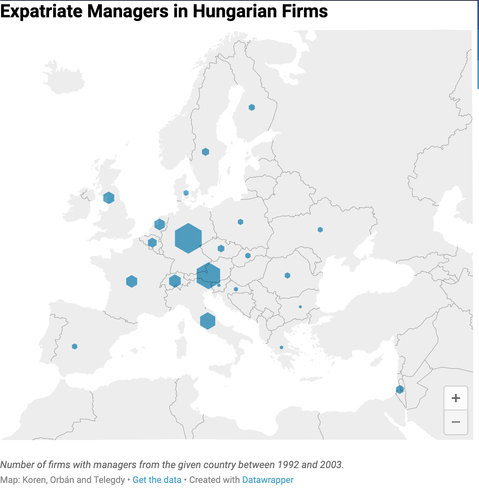

## Foreign owners often replace managers


# Estimation
## Estimating equations
### Selection
Sample: $\text{CONTROL}_{i}^{k-1} = 1$, years before acquisition
$$
\text{CONTROL}_{i}^k = \mu_{st} + \gamma X_{it}  + u_{ist}
$$

### Diff-in-diff (!)
Sample: acquisitions
$$
Y_{ist} = \alpha_i + \mu_{st} + \sum_{k=1}^3 \beta_k \text{CONTROL}_{it}^k + u_{ist}
$$

## Differences in differences
$$
Y_{it} = \alpha_i + \nu_t + \beta \text{CONTROL}_{it} + u_{it}
$$

### Old diff-in-diff
Estimate by two-way fixed effects.

### New diff-in-diff
Compute group-specific treatment effects and aggregate. (Callaway and Sant'Anna 2020)

## Problem with TWFE
Model may be misspecified. Often, $\beta$ is heterogeneous or increases over treatment length.

This is a problem if treatment is staggered, especially in long panel (our case). 

Long treated firms will act as a control, biasing $\hat\beta$. May even have different sign than all the individual treatment effects.

## Callaway - Sant'Anna solution
$G_{i}$: time of treatment of unit $i$ (may be $\infty$)

$C_{gt} = \{i: G_i > \max(g,t)\}$: control group is not yet treated

$$
\gamma_{gt} := E_{i: G_i=g} (Y_{it} - Y_{ig})
- E_{i\in C_{gt}} (Y_{it} - Y_{ig})
$$

Aggregate $\gamma_{gt}$ with "suitable" weights


## Multiple treatments
We have three treatments: acquisition only, domestic hire, expat hire.

How to do Callaway-Sant'Anna in this case? 

Make sure treatments don't "leak" into controls. 

## Our solution
$G_{i}^k$: time of treatment $k$ of unit $i$ (may be $\infty$)

$C_{gt} = \{i: \min_k G_i^k > \max(g,t)\}$: control group is not yet treated with **any** of the treatments

$$
\gamma_{gt}^k := E_{i: G_i=g} (Y_{it} - Y_{ig})
- E_{i\in C_{gt}} (Y_{it} - Y_{ig})
$$

Each treatment has the **same** control group.

We also do inverse-probability weighting within control group (Abadie 2005). This helps kill pretrends.

# Results

## Positive selection on exports, negative on TFP
\input{table/selection.tex}

# Without change in management
## No effects of foreign acquisition on employment
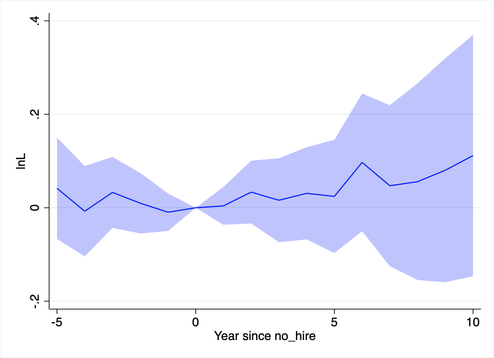

## No effects of foreign acquisition on capital
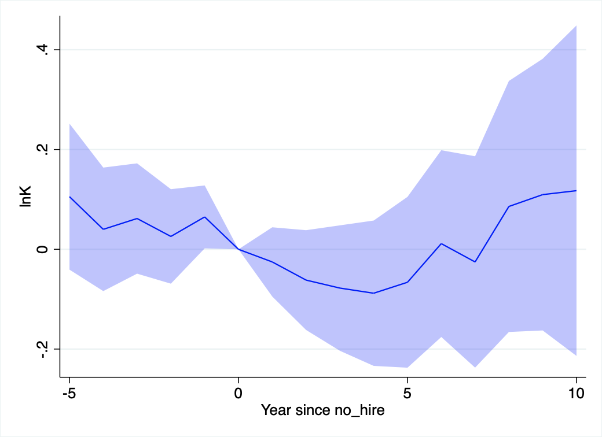

## No effects of foreign acquisition on labor productivity
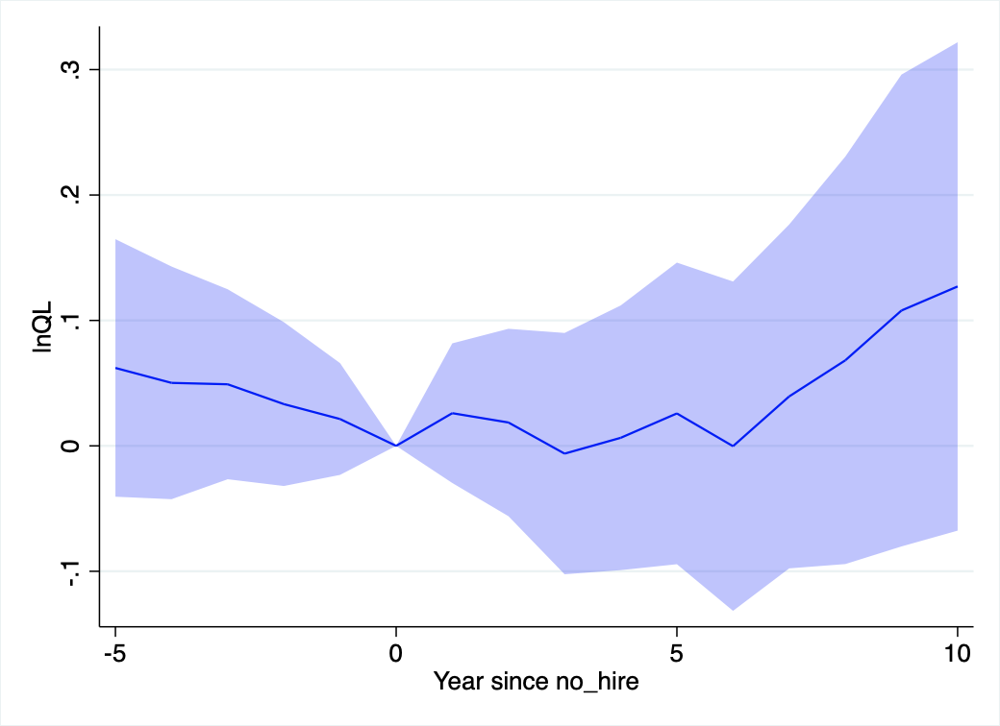

## ...or TFP
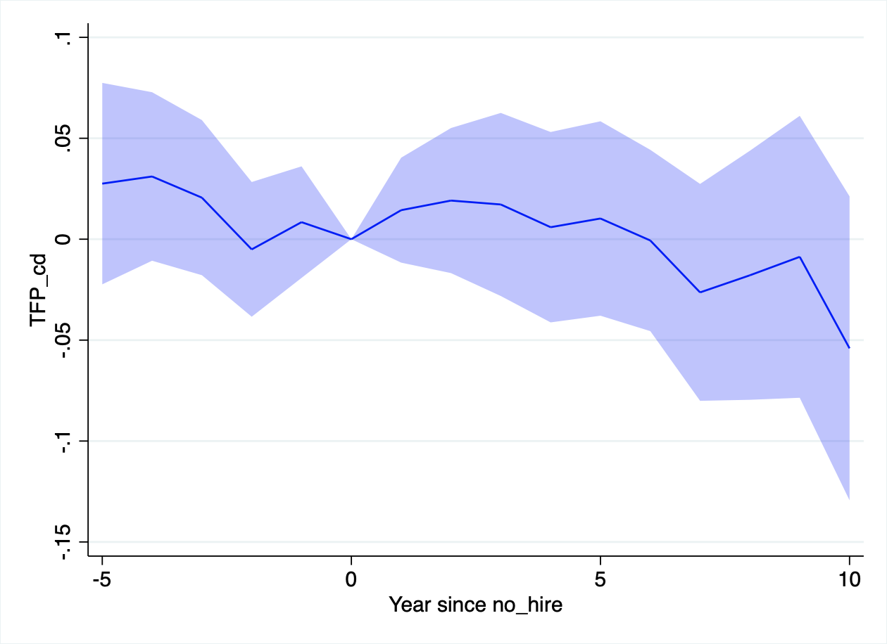

## Some transitory increase in exporting


# Hire a local manager
## Fast productivity growth after local manager is hired
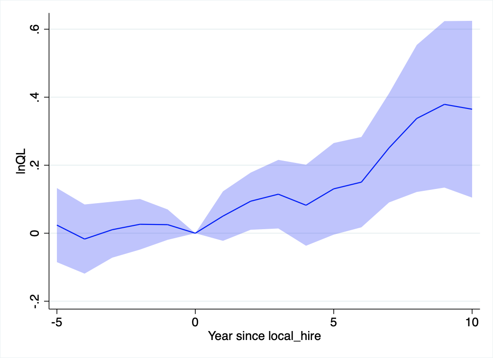

## Also in TFP
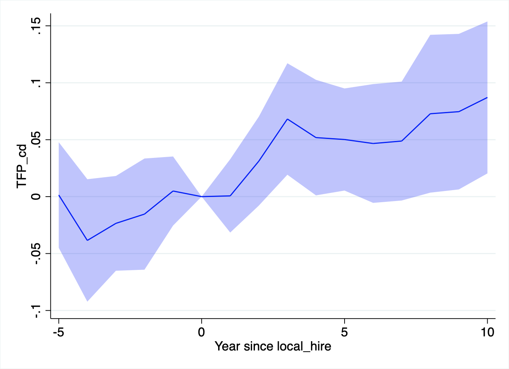


# Hire an expat manager
## Fast employment growth after expat manager is hired
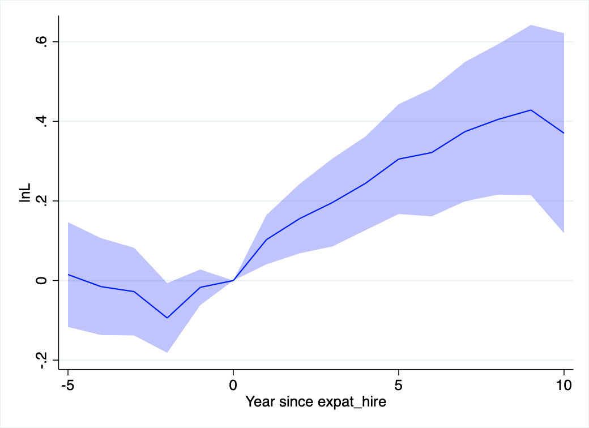

## Positive capital investments after expat manager is hired


## Productivity growth of same magnitude as with local manager
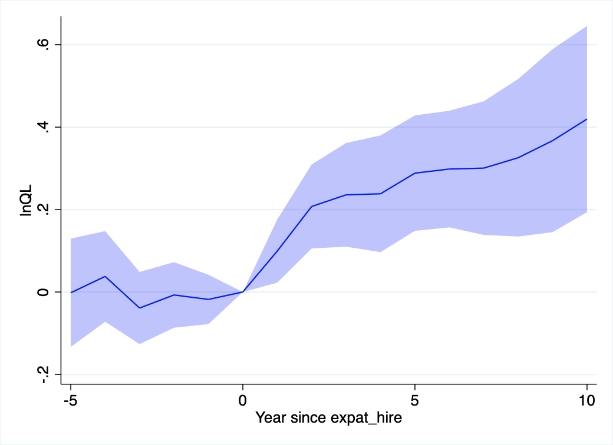

## Also in TFP


## Large effects on exporting
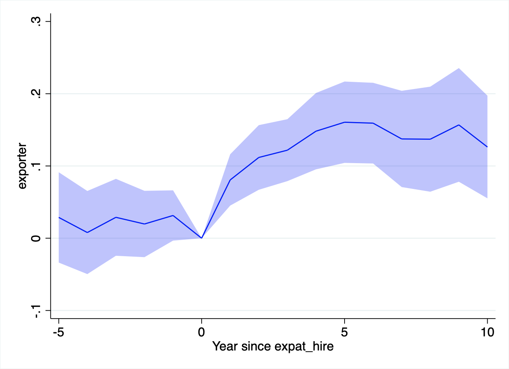


# Market access
## Market access
Ongoing work with Krisztina Orbán and Álmos Telegdy.

## Infer ethnicity from name
\begin{tabular}{lll|ccc}
Address & Name & Partner & \texttt{count} & \texttt{lang} & \texttt{ethn} \\
\hline
DE & Klaudia Wolf & DE & 1 & 1 & 1\\
DE & Klaudia Wolf & AT & 0 & 1 & 1\\
DE & Klaudia Wolf & IT & 0 & 0 & 0\\
\hline
DE & Enrico Mazzanti & DE & 1 & 1 & 0\\
DE & Enrico Mazzanti & AT & 0 & 1 & 0\\
DE & Enrico Mazzanti & IT & 0 & 0 & 1\\
\hline
IT & Fioretta Luchesi & DE & 0 & 0 & 0 \\
IT & Fioretta Luchesi & AT & 0 & 0 & 0 \\
IT & Fioretta Luchesi & IT & 1 & 1 & 1 
\end{tabular}

## Estimating equation
For each firm-year, take 24 major partner countries. What is the probability to export/import to/from that country, *relative to all other countries*?

$$
\Pr(X_{ict}=1) = 
\mu_{ct} + \nu_{it} 
$$
$$
{}+ \beta_o \text{OWNER}_{ict} 
{}+ \beta_m \text{MANAGER}_{ict} 
{}+ u_{ict}
$$

## Managers matter for exports
```
      export | Coefficient  std. err.      t    P>|t|     [95% conf. interval]
-------------+----------------------------------------------------------------
     manager |   .0860192   .0337138     2.55   0.011     .0197129    .1523256
       owner |   .0746909   .0228919     3.26   0.001     .0296682    .1197135
```

## Even more form imports
```
      import | Coefficient  std. err.      t    P>|t|     [95% conf. interval]
-------------+----------------------------------------------------------------
     manager |   .2418064   .0507659     4.76   0.000     .1417964    .3418165
       owner |   .1097679   .0309542     3.55   0.000     .0487873    .1707485
```

# Discussion 

## Effects are large
### Fixed-cost estimates in Halpern, Koren and Szeidl (2015)
Equivalent to \$12-14,000 drop in fixed costs ''per year''.

\begin{tabular}{l|cc}
Scenario & Import hazard & Fixed cost \\
\hline
Average firm & 0.010 & \$15,000\\
Only owner & 0.081 & \$2,300\\
Only manager & 0.106 & \$1,700\\
Both & 0.226 & \$600
\end{tabular}

### Trade experience premia
Mion, Opromolla and Sforza (2016) estimate a 0.01--0.04 increase in hazard after manager with relevant export experience joins. Bisztray, Koren and Szeidl (2018) estimiate 0.002--0.005 peer effects in importing.


## Three stories
### Vertical integration 
Foreign owner takes over firm to export/import within own supply chain.

### Professional network
Managers help connect different firms within their professional network.

### Business culture
Managers know the business culture of their home country.

# A potential model
## Production function
Firm $j$, market $i$
$$
Q_{ij}=A_j K_{ij}^\alpha L_{ij}^{1-\alpha}\text{ with } i=H,F
$$
in contrast to
$$
\sum_iQ_{ij} = A_jK_j^\alpha L_j^{1-\alpha}
$$
Firm characterized by $(A_j, K_{Hj}, K_{Fj})$

## Market access skills
Manager $m$, market $i$
$$
\kappa_{im}p_i \text{ with }\kappa_{im} \in (0,1)
$$
Manager characterized by $(\kappa_{Hm}, \kappa_{Fm})$

## Net revenue per market
$$
\kappa_{im}p_i A_j K_{ij}^{\alpha} L_{ij}^{1-\alpha} - w L_{ij}
$$
Labor frictionlessly hired,
$$
R_{ijm} =  \left(\frac {1-\alpha} {w}\right)^{1/\alpha-1} 
{(\kappa_{im}p_i)^{1/\alpha}\strut} {A_j^{1/\alpha} K_{ij}\strut}
$$
$$
R_{ijm} = \tilde \kappa_{im} \tilde K_{ij}
$$

## Assignment
Firms hire managers in frictionless, competitive markets. Optimal manager maximizes net revenue minus her wage,
$$
\max_m \alpha\sum_i R_{ijm} - \nu_m =  \max_m \alpha\sum_i \tilde\kappa_{im}\tilde K_{ij} - \nu_m,
$$

## Equilibrium
Given fixed distributions over $(A_j, K_{Hj}, K_{Fj})$ and $(\kappa_{Hm}, \kappa_{Fm})$ (with $\#j = \#m$), determine

- firm-manager assignment: $\mu(j,m)$
- manager wages: $\nu_m$
- firm profits: $\pi_j$
- revenue per market: $R_{ijm}$

## Key ingredients
1. Diminishing returns within each market
2. Inelastic supply of manager skills
3. Complementarity of manager skills with firm capital


## Optimal transport
Equilibrium assingment is equivalent to following optimal transport problem (Galichon 2016)
$$
\int_{j,m}\mu(j,m) (\tilde {\mathbf K}_j - \tilde{\mathbf\kappa}_m)^2 djdm \to \min
$$
s.t.
$$
\int_j \mu(j,m) dj = \mu(j)
$$
$$
\int_m \mu(j,m) dm = \mu(m)
$$
Focus on discrete manager types, continuous firm types.

# Predictions
## Cross sectional predictions
1. Conditional on $R_{j}$, there is heterogeneity in $R_{Fj}/R_{Dj}$.
2. Managers at larger firms earn more.
3. Manager wages convex in $\mathbf K$.
4. Conditional on $R_{Dj}$, managers at high $R_{Fj}$ firms earn more.

## Export heterogeneity
$$
\text{Var}\ln R_{ij} =
	\text{Var}\ln \tilde \kappa_{im} +
	\text{Var}\ln \tilde K_{jm} +
	2\text{Cov}(\ln \tilde \kappa_{im},
				\ln \tilde K_{jm})
$$

- additional heterogeneity in managers: $\text{Var}\ln \tilde \kappa_{im}>0$
- complementarity of managers and firms: $2\text{Cov}(\ln \tilde \kappa_{im},\ln \tilde K_{jm})>0$

# Comparative statics
## Supply shock

## Trade liberalization
Export markets become liberalized ($p_F$ increases).

1. Managers with export skills earn more.
2. Net entry into exporting is zero (by assumption).
3. Export-skilled managers move from low export-intensity firms to high export-intensity firms. (magnifying export heterogeneity)

## Wage returns to exporting increased among CEOs
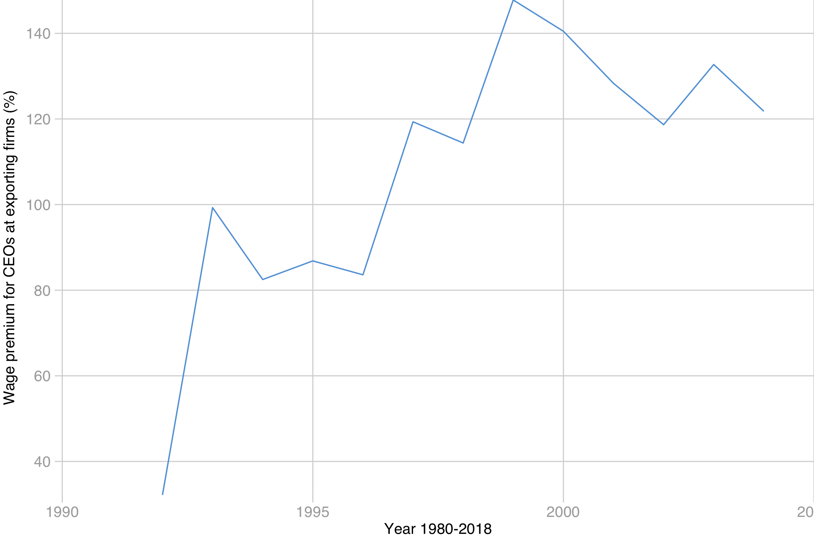

# Conclusions
## Conclusions
* What are the causes and consequences of foreign acquisitions?
* We ask when managers are also replaced.
* Using data on the universe of foreign acquisitions in Hungary, 1980-2018, we estimate that exporters and low-productivity firms become more tightly controlled. 
* Foreign controlled firms become more productive and more likely to export. 
* These facts help inform theories about the boundaries of global firms and about the role of managers in firm performance.

