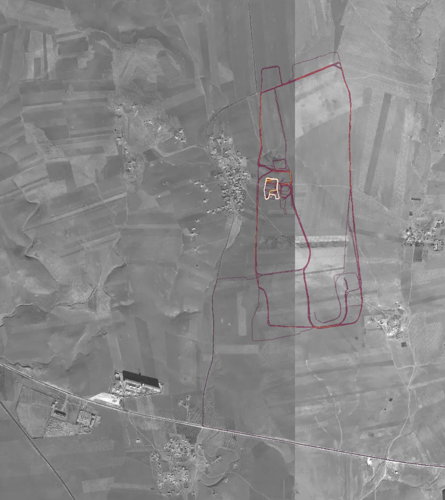

# Introduction
## Can you carbon date me?


## My tools
```
economics,1994-
econometrics,1996-
stata,1997-
python,2003-
julia,2017-
```

## Outline
1. When time really matters
2. Examples of real-time data
3. Challenges of private data


# When time really matters
## When time really matters
- November 2019: outbreak in Wuhan
- December 27, 2019: new coronarivus
- December 31, 2019: WHO informed
- January 30, 2020: WHO declares ``public health emergency''
- March 11, 2020: WHO declares pandemic
- by March 31, 2020: most countries adopted strict social distancing measures

## Typical statistics publication calendar (BLS.gov)


## Time-sensitive questions
- How does the virus spread?
- How many ventilators, PPEs, nurses etc. will we need? By when?
- What (non-pharmaceutical) interventions are effective against it?
- Which of these are most cost effective?
- What can policy do to mitigate the costs?
- (in addition to genome sequencing, drug and vaccine development, clinical research)


# The response of open science
## The response of open science
- Government, academia and industry came together quickly and effectively. (But: pressing issues remain.)
- Troves of data shared.
- Research results published fast.
    - 83 issues of *Covid Economics*, about 500 papers published.

### Is this the future of policy analysis?

## About 250,000 Covid-related articles


## Timely data collection
How to avoid the 2-3-month lag of official statistical releases? (Plus several months of peer review.)

Reuse existing data collected during ``normal course of business'':

- administrative
- private


# Examples of real-time data
## Visits to retail and recreation places collapsed 
{width=100%}

## Many workplaces are shuttered 
{width=100%}

## People are staying at home 
{width=100%}


## Examples of real-time data (1)
### Medical
Enormous amount of clinical, epi, virology data sharing 

### Stock returns
Stock prices react to news almost instantaneously. But: noisy, only for traded stocks.

### Financial transactions
Credit cards. Bank transactions. 

## Examples of real-time data (2)
### Tracking mobility, spatial effects
Cell phone tracking. Visiting POIs. Contact tracing. Air travel. Real estate pricing.

### Economic activity on platforms
Restaurant closures (Yelp). Ride sharing. Airbnb. Online work. E-commerce.

## Other data sources
### Other data to track infections
Virus concentration in sewage. 

### Other data to track the economy
Electricity consumption. Job ads. Trademark applications.

### Other data to track social outcomes
Religiousity. Schools and learning. Fertility. Nostalgia.


# Challenges of private data
## Challenges of private data
1. Statistics
2. Economics
3. Politics
4. Law and ethics

# Statistics

## A short history of (frequentist) statistics (Salsburg 2002)


## The evolution of statistics (Efron and Hastie)


## Why statistics matters
Statistics provides rules for generalizing from (limited) data. 

## Stories vs statistics
Suppose you want to predict the outcome of U.S. presidential elections in Pennsylvania. What are the benefits of a statistical prediction relative to talking to friends and watching TV pundits?

1. $n=1$ vs $n=\text{many}$. (``The plural of anecdote is data.'' /Raymond Wolfinger)
2. Stories subject to biases.
3. Biases are unknown and hard to account for.

## Sample vs population

Suppose you ask 1,000 Pennsylvania voters. 
$$
\hat p = \frac {\# \text{Republican}}{1000}
$$
$$
\text{s.e.}(\hat p) = \sqrt{\frac {\hat p (1-\hat p)}{1000}} \approx 0.016
$$
if $\hat p\approx 0.5$.

## Rules of generalizing from sample
Suppose

1. random
2. independent sample
3. full compliance. 

(1+3 ensure representativity, 2 dictates statistical properties)

- Then estimation accuracy increases with $\sqrt{n}$.
- Irrespective of size of population.

# Selection bias
## Selection bias
If sample is not representative, may suffer from **selection bias**.

1. nonrandom selection into sample
2. nonrandom response rate

## Getting a representative sample


Selection may occur at each of these steps.

- phone survey not representative
- people do not respond
- some voters hide their preferences

## A tactic to improve response rates


## Sample vs big data
Why take a sample when we can study the population directly?

## Electoral forecasts
* based on random sample
* based on votes already counted

Both are helpful but have very different properties.

## The blue shift
{height=80%}

## Lessons from statistics
- Human judgement is necessary for good data analysis
- Understand selection bias
- Models and domain expertise matter

# Economics
## Why economics matters
1. People respond to incentives.
2. Systems matter.
3. Scarce resources are worth more.

## The Susceptible-Infectious-Recovered model
{height=80%}

## Flattening the curve


## Flattening the curve


## People respond to incentives
- Past data may lose its predictive power once people change their behavior (Lucas critique).
	- key missing element of SIR model
- There is voluntary social distancing, as well as non-compliance with policy measures.

## Systems matter
The SIR model is highly nonlinear. My getting sick depends on behavior of others.

- difficult to forecast
- externalities
- non-intuitive

## Peaks of epidemics are notoriously hard to forecast
{height=80%}

## Lessons from economics
- Even big data not sufficient to describe *future* behavior. Understand incentives and externalities.
- Hard to forecast non-linear system without theory.

# Politics, law and ethics
## Politics, law and ethics
1. Conflict of interest to share information
	- governments
	- corporations
2. Privacy and surveillance

## Is ride sharing killing people?
Barrios, Hochberg and Yi (2018): Uber and Lyft increased traffic and congestion. Associated with 2--3% increase in fatalities.

Got no data from Uber! (unlike other researchers)

## Your phone knows everything about you
Thomson and Warzel (2019): Twelve Million Phones, One Dataset, Zero Privacy (New York Times)

Tracking individuals in location data dumps can (i) identify them, (ii) reveal highly sensitive information.

## Mapping U.S. bases


# Conclusion and discussion
## Conclusion and discussion
1. Private sources of data can effectively *complement* official statistics in times of urgency.
2. But *rules* of statistics should always be followed.
3. Big data will never *substitute* domain expertise, human judgement, ethical and political accountability.


