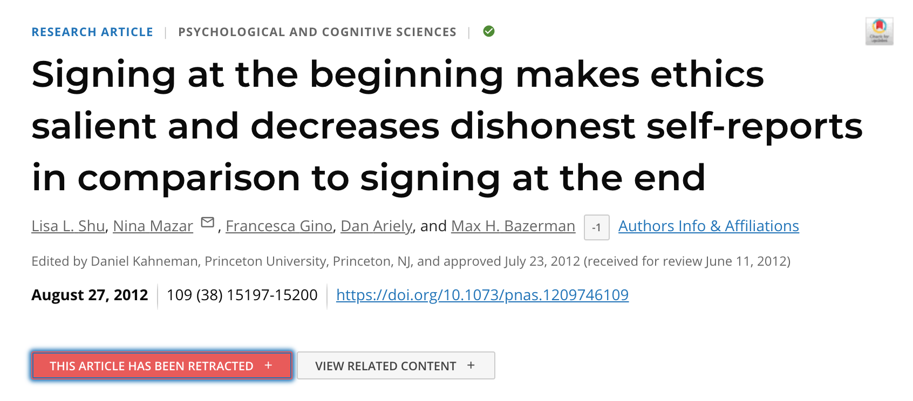
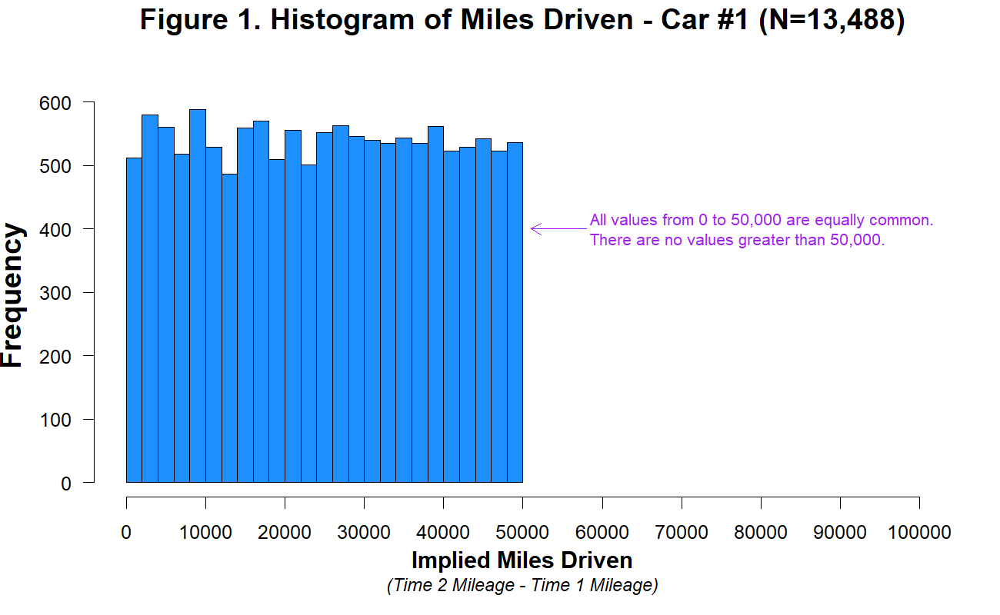

# Introduction
## My first investment into econometrics


## My tools
```
economics,1994-
econometrics,1996-
stata,1997-
python,2003-
julia,2017-
```

## Outline
1. When time really matters
2. Examples of real-time data
3. Challenges of private data
4. What can economists do?

# When time really matters
## When time really matters
- November 2019: outbreak in Wuhan
- December 27, 2019: new coronarivus
- December 31, 2019: WHO informed
- January 30, 2020: WHO declares ``public health emergency''
- March 11, 2020: WHO declares pandemic
- by March 31, 2020: most countries adopted strict social distancing measures

## Typical statistics publication calendar (BLS.gov)


## Time-sensitive questions
- How does the virus spread?
- How many ventilators, PPEs, nurses etc. will we need? By when?
- What (non-pharmaceutical) interventions are effective against it?
- Which of these are most cost effective?
- What can policy do to mitigate the costs?
- (in addition to genome sequencing, drug and vaccine development, clinical research)


# The response of open science
## The response of open science
- Government, academia and industry came together quickly and effectively. (But: pressing issues remain.)
- Troves of data shared.
- Research results published fast.
    - 83 issues of *Covid Economics*, about 500 papers published.

### Is this the future of policy analysis?

## About 250,000 Covid-related articles


## Timely data collection
How to avoid the 2-3-month lag of official statistical releases? (Plus several months of peer review.)

Reuse existing data collected during ``normal course of business'':

- administrative
- private


# Examples of real-time data
## Visits to retail and recreation places collapsed 
{width=100%}

## Many workplaces are shuttered 
{width=100%}

## People are staying at home 
{width=100%}


## Examples of real-time data (1)
### Medical
Enormous amount of clinical, epi, virology data sharing 

### Stock returns
Stock prices react to news almost instantaneously. But: noisy, only for traded stocks.

### Financial transactions
Credit cards. Bank transactions. 

## Examples of real-time data (2)
### Tracking mobility, spatial effects
Cell phone tracking. Visiting POIs. Contact tracing. Air travel. Real estate pricing.

### Economic activity on platforms
Restaurant closures (Yelp). Ride sharing. Airbnb. Online work. E-commerce.

## Other data sources
### Other data to track infections
Virus concentration in sewage. 

### Other data to track the economy
Electricity consumption. Job ads. Trademark applications.

### Other data to track social outcomes
Religiousity. Schools and learning. Fertility. Nostalgia.


# Challenges of private data
## Challenges of private data
1. Statistics
2. Accountability

# Statistics

## Data Science
``procedures for analyzing data, techniques for interpreting the results of such procedures, ways of planning the gathering of data to make its analysis easier, more precise or more accurate, and all the machinery and results of (mathematical) statistics which apply to analyzing data." (Tukey, \uncover<2>{1962})

## Why statistics matters
Statistics provides rules for generalizing from (limited) data. 

## A short history of (frequentist) statistics (Salsburg 2002)


## The evolution of statistics (Efron and Hastie)


## Stories vs statistics
Suppose you want to predict the outcome of U.S. presidential elections in Pennsylvania. What are the benefits of a statistical prediction relative to talking to friends and watching TV pundits?

1. $n=1$ vs $n=\text{many}$. (``The plural of anecdote is data.'' /Raymond Wolfinger)
2. Stories subject to biases.
3. Biases are unknown and hard to account for.

## Sample vs population

Suppose you ask 1,000 Pennsylvania voters. 
$$
\hat p = \frac {\# \text{Republican}}{1000}
$$
$$
\text{s.e.}(\hat p) = \sqrt{\frac {\hat p (1-\hat p)}{1000}} \approx 0.016
$$
if $\hat p\approx 0.5$.

## Rules of generalizing from sample
Suppose

1. random
2. independent sample
3. full compliance. 

(1+3 ensure representativity, 2 dictates statistical properties)

- Then estimation accuracy increases with $\sqrt{n}$.
- Irrespective of size of population.

# Selection bias
## Selection bias
If sample is not representative, may suffer from **selection bias**.

1. nonrandom selection into sample
2. nonrandom response rate

## Getting a representative sample


Selection may occur at each of these steps.

- phone survey not representative
- people do not respond
- some voters hide their preferences

## Sample vs big data
Selection bias surely does not matter if we observe (almost) everyone?!

## Electoral forecasts
* based on random sample
* based on votes already counted

Both are helpful but have very different properties.

## The blue shift
{height=80%}

## Lessons from statistics
> **It is better to have a small unbiased sample than a large biased one.**

Can you think of sources of selection bias in private data?


# Accountability
## Accountability
1. Conflict of interest to share information
	- governments
	- corporations
2. Privacy and surveillance

## Uber uses data and economists as PR props
“Ride-hailing apps have created jobs for Paris’s poorer youth, but a regulatory clampdown looms,” the [FT] article said. Thesmar was quoted in the piece saying that Uber was a “social gamechanger”.

“We see low risk here because we can work with Landier on framing the study and we also decide what data we share with him.” (senior Uber staffer quoted in Lawrence 2022)

## Is ride sharing killing people?
Barrios, Hochberg and Yi (2018): Uber and Lyft increased traffic and congestion. Associated with 2--3% increase in fatalities.

Got no data from Uber!

## A case study in accountability
Simonsohn, Simmons, Nelson and anonymous (2021) show that Shu, Mazar, Gino, Ariely and Bazerman (2012 PNAS) is based on **fraudulent** data.



## The data as (purportedly) shared with the private company


## Distribution of miles driven in a year


## No rounding in end-of-year reported mileage


## Most observations seem to be duplicated


## The chain of data provenance
insurance company $\to$ Ariely $\to$ Mazar $\to$ PNAS

# What can economists do?
## What can economists do?
Three tenets of economics:

1. People respond to incentives.
2. Systems matter.
3. Scarce resources are worth more.

## The Susceptible-Infectious-Recovered model
{height=80%}

## Flattening the curve


## Flattening the curve


## People respond to incentives
- Past data may lose its predictive power once people change their behavior (Lucas critique).
	- key missing element of SIR model
- There is voluntary social distancing, as well as non-compliance with policy measures.

## Systems matter
The SIR model is highly nonlinear. My getting sick depends on behavior of others.

- difficult to forecast
- externalities
- non-intuitive

## Peaks of epidemics are notoriously hard to forecast
{height=80%}

## Lessons from economics
- Even big data not sufficient to describe *future* behavior. Understand incentives and externalities.
- Hard to forecast non-linear system without theory.

# Conclusion and discussion
## Conclusion and discussion
1. Private sources of data can effectively *complement* official statistics in times of urgency.
2. But *rules* of statistics should always be followed.
3. Big data will never *substitute* domain expertise, human judgement, ethical and political accountability.


