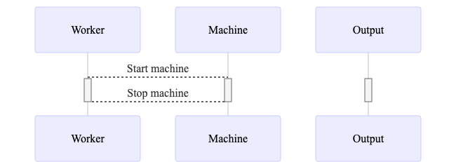
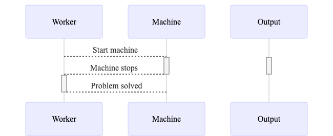
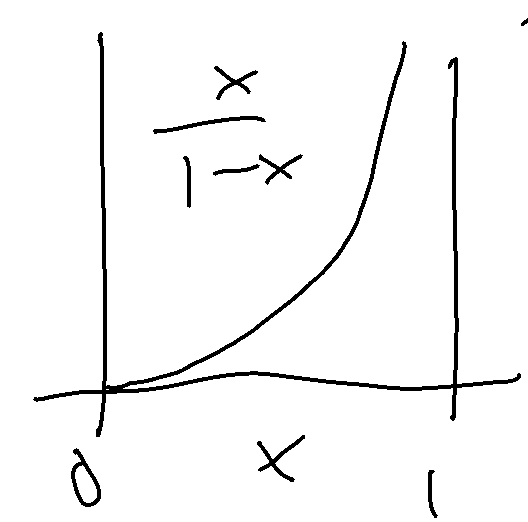
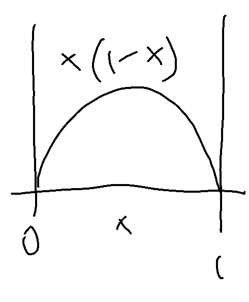
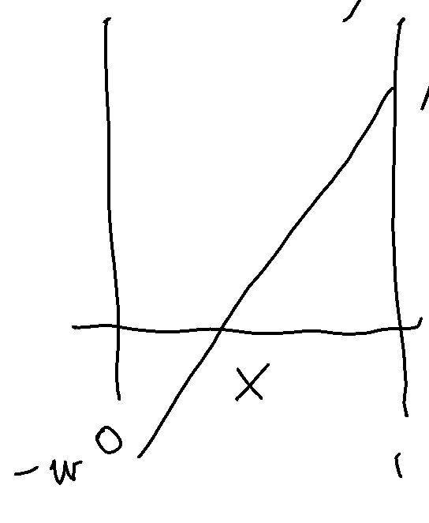

# Motivation

## Motivation
1. Wage inequality in past decades
2. Technological revolutions

## Weaver productivity across countries and over time

### Clark, 1987
"In 1910 one New  England cotton  textile  operative performed as much work as  1.5  British,  2.3 German,  and nearly 6 Greek,  Japanese,  Indian, or Chinese  workers."

### Bessen, 2012
"A typical weaver in the United States in 1902 produced over *50 times* as many yards of cloth in an hour of weaving as did a weaver a century earlier producing a comparable cloth."

## Not all of it is _quantity_ of capital

### Bessen, 2012
"The weaver in 1902, however, achieved that output using *eighteen* power-driven looms while the weaver of 1802 used a single handloom."

### Sutton, 2001
"On technical performance, there was a small but significant quality gap in favour of the imported [rather than Indian] machine."

## Outline
1. An engineering model of machines and machinists
2. A case study of a weaving mill
3. Imported machines and wages in Hungary, 1992-2003
4. Discussion and conclusion

# An engineering model of machines and machinists
## Standard model
$$
Y = K^\alpha L^{1-\alpha}
$$

## How do machines and people work together?
Tool model
: A worker feeds material into a metal press (both worker and machine busy) to produce.

Operator model
: A power loom produces in an autonomous fashion (worker idle), until a problem arises. The operator fixes it (machine idle) to get it back to work as fast as possible.

## Tool model

## Operator model

## Two measures of quality
machine quality
: Expected autonomous uptime $\theta$

worker quality
: Speed of fixing problems $h$

Machine busy for $\theta$, idle for $1/h$. 

Expected fraction of time working : $\theta h / (1 + \theta h) \equiv x$. 

Worker busy $(1-x)$ fraction of the time.

## Production function
$$
dY = \begin{cases}
A dt    & \text{if machine running, $s=1$}\\
0       & \text{if not, $s=0$}
\end{cases}
$$

## Markov chain for machine uptime
Kolmogorov equation:
$$
\dot\pi_1(t) = -\frac 1{\theta}\pi_1(t) + h\pi_0(t).
$$

## Ergodic distribution
$$
\frac1T\int_{t=0}^T \pi_1(t)dt \approx \pi_1^*.
$$
The steady-state probability is the solution to $-\frac 1{\theta_m}\pi_1(t) + h_i\pi_0(t)=0$,
$$
\pi_1^* = \frac{\theta_m h_i}{1+\theta_m h_i}.
$$

## Expected output
A worker type $h$ operating $k$ units of a machine type $\theta$ produces, in expectation,
\begin{equation}\label{eq:output:1}
	F(A,k,\theta,h)=A k \frac{\theta h}{1+\theta h}
\end{equation}

## Machine assignment and wage setting by worker skill
\begin{figure}[h!]\centering
\input{figure/sorting1.tex}
\end{figure}

## Technology upgrading by worker skill
\begin{figure}[h!]\centering
\input{figure/sorting2.tex}
\end{figure}

# Appendix

## Worker wages
Workers earn $w$ in agriculture. Large $L$ number of workers, few $K$ machines.

## Net output over agriculture
$$
x - w(1-x) = x(1+w) - w
$$

## Equilibrium
$$
K(1-x) \le L
$$

## Output per worker hour
$$
\frac {xK_i}{L_i} = \frac {x}{1-x}
$$

## Output per worker hour

## Return to machine quality
$$
\frac{\partial Q}{\partial \theta} = 
x(1-x)(1+w)
$$

## Return to machine quality

## Value of a machine
$$
Q_i - w L_i = 
x(1 + w) - w
$$

## Value of a machine

# Innovation
## Two types of innovation
1. Improve quality $\theta$
2. Build more machines $K$

Suppose both cost the same amount of final goods.

## Three epochs of innovation
1. Artisanal period. Labor is slack, wages are determined in agriculture. Improving machine quality has higher return. $x(1-x)(1+w) > x(1+w)-w$. $x$ continues to increase.
2. Mass production. Value of a machine is high enough to produce more. $K/L$ increases with constant $x$.
3. Automation. After all $L$ has been absorbed from agriculture, wages start to rise. The returns to labor-saving machine quality improvement now exceed the value of an old machine. $x$ keeps increasing.

## Plus one
4. Singularity (never reached). As $x\to1$, the ratio of machine time to worker time grows without bound. Nobody works, all work is done by robots. But to reach this state from a very large degree of automation (say, $x=0.999$), labor has to capture almost all of the output, otherwise there is no incentive to innovate further.

## Artisanal period
$$
\frac w{1+w} \le x \le \sqrt{\frac w{1+w}}
$$

# Production function
## Production function
$$
    Q_{it} = \Omega_{it} (\lambda K_{it}^F + K_{it}^D)^{\alpha} L_{it}^{\beta} M_{it}^\gamma
$$
with $\lambda>1$
$$
    q_{it} \approx \omega_{it} + \alpha k_{it} + \beta l_{it} + \gamma m_{it}
    + \alpha(\lambda-1) \frac{K_{it}^F}{K_{it}}
$$

# Patterns of capital imports
## Data
- Hungarian Customs Statistics, 1992--2003
    - all _direct_ exporter and importer
    - detailed by product (HS6): capital goods
    - and country of origin
- Balance Sheet and Earnings Statement
    - revenue, employment, material cost
    - capital: book value of equipment

## Stocks and flows
- Imports are flows, equipment value is stock.
- Gross investment _flow_:
$$
\hat I_{it} = K_{it} - (1-\delta_{it})K_{i,t-1}
$$
with $\hat I_{it} = \hat I_{it}^D + I_{it}^F$
- Imported equipment _stock_:
$$
\hat K_{it}^F = (1-\hat\delta_{it})\hat K_{i,t-1}^F + I_{it}^F
$$
- Complications: what if $I_{it}^F>I_{it}$?

## Distribution of investment rates (following Khan and Thomas, 2008)

## Capital intensity around import peaks

## Material intensity around import peaks

## Investment rate distribution

## Imported investment rate distribution

## Import share in capital sock

# Event studies around large investments
## Capital stock increases by same amount (by construction)

## TFP improves more for imported investment

## Material intensity increases for both types of investment

## Material import intensity jumps more for imported investment

## Average wage reacts to domestic investment

# Identification

## Interim Agreement with EEA (1991) phased out tariffs

## Faster phaseout results in faster imports (Koren, Csillag and Köllő, 2019)

## When do firms import?
- Lumpy imported investment suggests fixed cost of importing (also see Halpern, Koren and Szeidl, 2015)
- Import if $p^F_t/p^D_t < f(L_{it})$.
- Hazard of _starting to import_ (flow):
$$
\Pr(K_{it}^F>0| K_{i,t-1}^F=0) = \mu_{st} -\xi \Delta \tau_{st} L_{it}
$$
- Probability of _having imported_ in the past (stock):
$$
\Pr(K_{it}^F>0) \approx \tilde\mu_{st} -\xi L_{it-\text{age}_{it}}\sum_{a=0}^{\text{age}_{it}} \Delta \tau_{st-a} 
$$

## Example of cumulated import hazards

# Results

## First stage

## Productivity

# Complementarity
## Complementarity
- Are imported machines complementary with other inputs?
- If so, can explain
    - large gaps
    - divergence
- Two ways to measure complementarity (Brynjolfsson and Milgrom, 2013):
    - performance: $f_{xy} > 0$
    - behavior: $\partial x/\partial y > 0$

## Positive cross derivative of output (Koren, Csillag and Köllő, 2019)

## Assortative assignment (Koren, Csillag and Köllő, 2019)

## Imported machines are more material intensive

## Imported machines are more _imported_ material intensive

## Imported machines use higher quality labor

