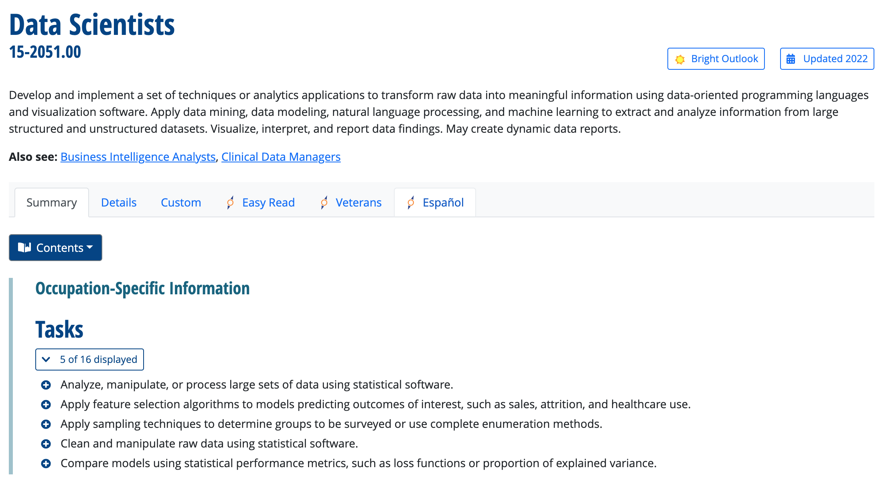
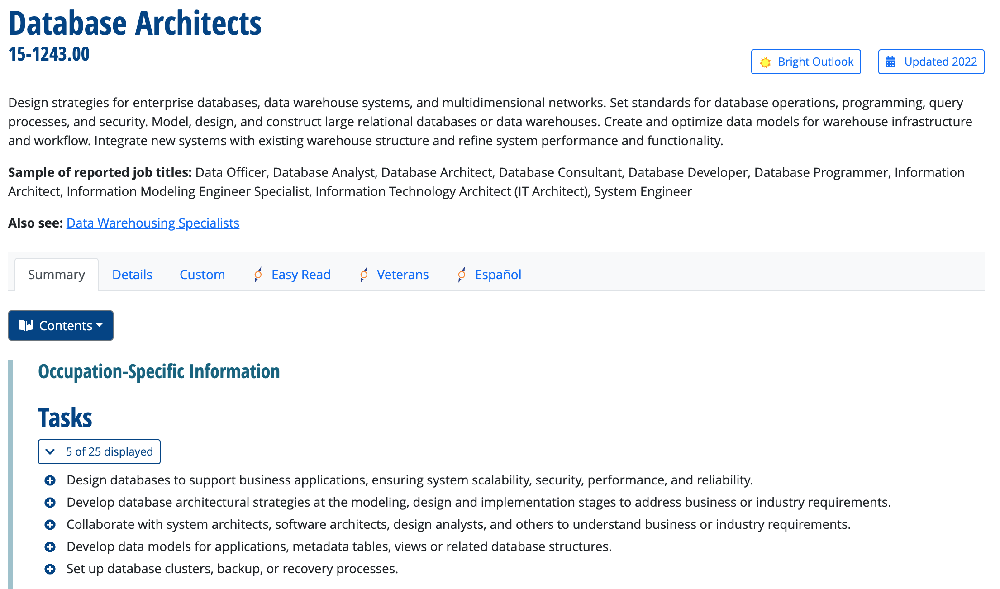

# Introduction

## Do you want to like be like her?

## ...or like him?

## What is the energy bill of your company?
You work for a global company with offices in many locations world wide. You are tasked with forecasting the total energy bill of all offices for next month.

## Some factors influencing your forecast

## Key concerns in this project
### Data Scientist
What model predicts energy bill best?
\pause

### Data Engineer
How to gather and deliver timely and harmonized data?
\pause

### Commonalities
Work with **data** to solve business **problems**.

## What do data scientists do? (O\*NET 2022)

## What do data engineers do? (O\*NET 2022)

## Outline
1. Mindset
2. Toolset
3. Job market

# Mindset
## Mindset
Evaluate alternative solutions to solve complex problems.

### Data Scientist
1. Explore alternative hypotheses.
2. Evaluate them on their performance.

### Data Engineer
1. Break down complex problems to smaller parts.
2. Make sure parts hang together.

<!---
https://www.onetonline.org/link/details/15-2051.00
!--->

# Toolset

## Survey data from US (O\*NET 2022)
1. [Business Intelligence Analysts](https://www.onetonline.org/link/summary/15-2051.01)
2. [Database Architects](https://www.onetonline.org/link/summary/15-1243.00)

## Toolset
### Data Scientist
statistics, machine learning, data visualization, R, Python

### Data Engineer
relational database management, SQL, document stores, Unix/Linux, cloud services, task orchestration, Python

# Job market

## Who is hiring?
- Every large firm has a data warehouse $\to$ needs data engineers.
- Every data-drive business needs (a few) data scientists.

## Average annual salary in Germany (Payscale 2022)

| Job title | Entry level | Experienced |
|---|---|---|
| Data Scientist | 50k | 119k |
| Data Engineer | 46k | 70k |

<!---https://www.payscale.com/research/US/Job=Data_Scientist/Salary

https://www.payscale.com/research/US/Job=Data_Engineer/Salary
!-->

## Median annual salary in USA (O\*NET 2022)

| Occupation | Salary |
|-----------|-------------|
| Business Intelligence Analyst | 109k |
| Database Architect | 123k |

## Job market summary
1. Data scientist jobs are fewer but have more upside risk. (You can become a superstar!)
2. There are more data engineer jobs and they are more stable. But you neeed a multitude of tools.

You need to be a bit of both!