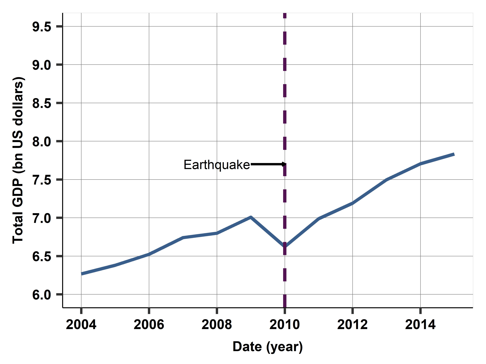
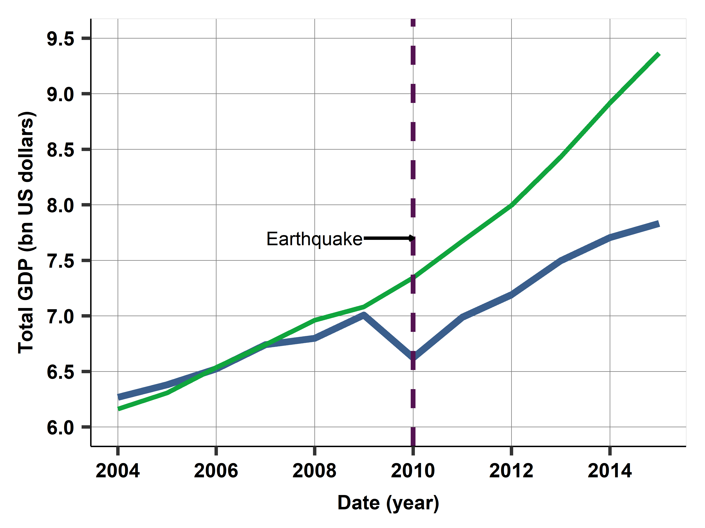
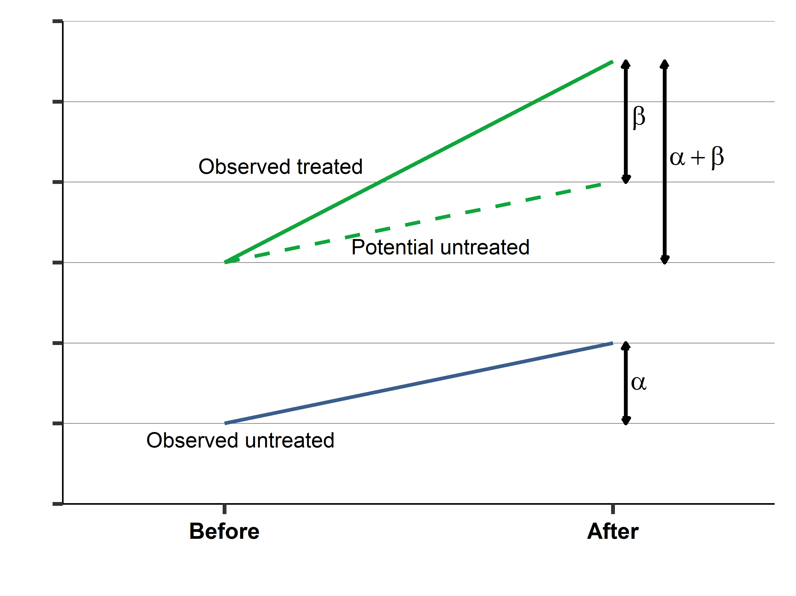

# Két módszertan
## Két módszertan
1. modell mint nyelv
2. oksági mérés

# Modell
1. termelési függvény
2. verseny

# És azok határai

# Ábrák
## Egy főre jutó hozzáadott érték

## Haiti a földrengés után

## Egy tényellentétes Haiti

## A differences-in-differences módszere

## A tőke és a munka változása

## Becsült hatások

