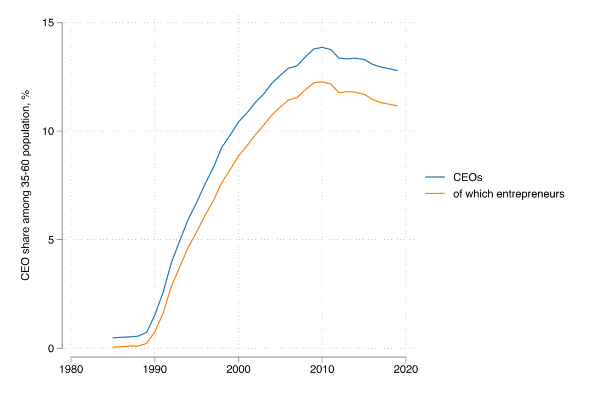
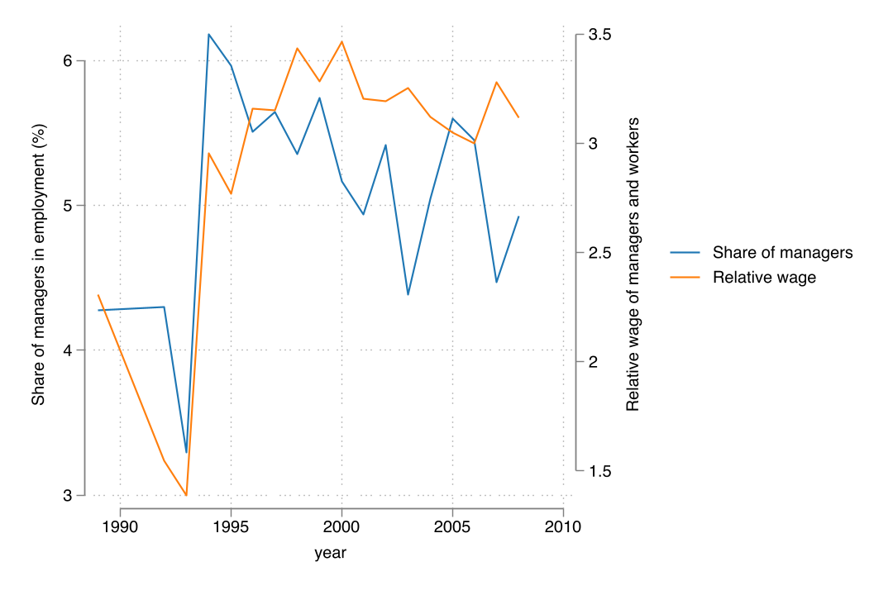
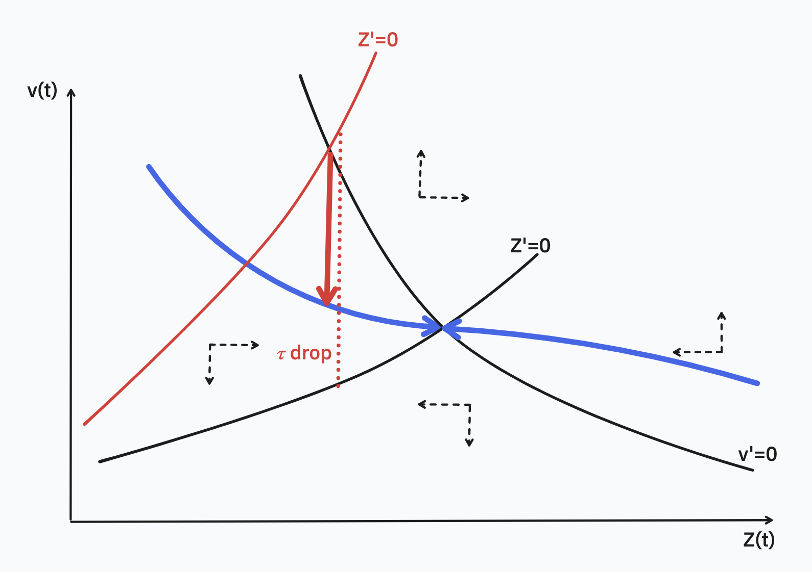
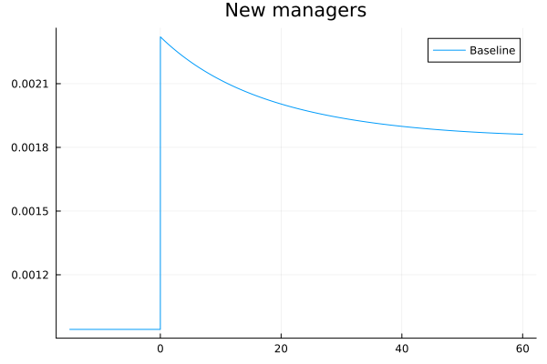
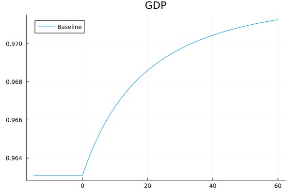
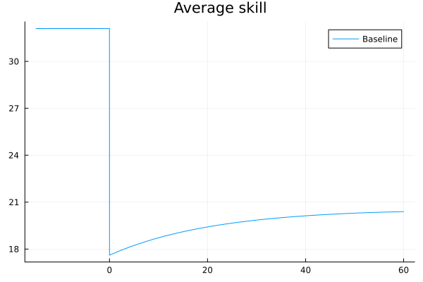

---
author:
    - Miklós Koren
    - Krisztina Orbán
title: Sudden Liberalization and the Baby Boom of Managers
date: June 2, 2023
aspectratio: 1610
lang: en
titlepage: true
abstract: Good management practices are important determinants of firm success. Better managed firms are larger and more productive, and management interventions lead to sizeable and persistent positive effects on firm performance. It is unclear, however, to what extent aggregate outcomes are shaped by good management. We build an overlapping generations model of managers to study the demand and supply of good management and the competition between managers of  heterogeneous skills. We use data on the universe of corporations and their top managers in Hungary between 1985 and 2019 to study the rapid liberalization of the 1990s through the lens of our model. We use the model to evaluate hypothetical policies aiming to improve aggregate productivity through management education and corporate liberalization. Our results suggest that the inelastic supply of good managers is an important constraint to the success of management interventions.
---
# Introduction
## Research Question
1. How elastic is the supply of good management?
2. What are the consequences for aggregate outcomes of a potential low elasticity? 
3.  How long-lasting are the aggregate effects of the low elasticity?

## Why Supply Matters
### The McKinsey view
Everyone can be a good manager after paying $$$. If demand for management goes up, all firms become better.

### Inelastic supply
There is a fixed number of good managers. If demand for management goes up, good managers earn more.

## But Can Management Increase Aggregate GDP?
We don't know:

1. How elastic is the aggregate supply of good managers?
2. What role for equilibrium feedback?

## Literature
1. **Management as technology**: Bloom et al (2010), Bertrand and Schoar (2003), Bloom et al (2013), Giorcelli (2019)    
   - This paper: Acknowledging that often these interventions are very hard to scale, what are the aggregate implications of heterogeneity in management?
2. **Firm heterogeneity at entry along the business cycle**: Sedlaček and Sterk (2018)
   - This paper: What is the role of manager selection in this firm selection?
3. **Consequences of lack of delegation in family firms for development**: Caselli, Gennaioli (2013), Akcigit, Alp, Peters (2021)
   - This paper: Dynamics and anatomy of adjustment via managers to a demand increase

## This paper
1. Assemble a dataset on the universe of managers in the Hungarian economy (1985 -- 2021) + firm balance sheet info
2. Examine a large liberalization episode in Hungary in which the demand for management skills increased 20-fold 
3. Build an OLG model of managers with heterogeneous manager skills to capture:
   - Existing manager stock in an economy is an important determinant of current manager entry
   - Large existing competition reduces current entry to an inefficient extent
   - Friction to occupational switching cause this reduced entry to have long-term consequences on aggregates
4. Model will be used for counterfactuals: effect of education reform, effect of spacing out liberalization's effect on manager entry.

## Outline
1. Setup and data
2. An OLG model of managers
3. A numerical example for policy analysis
4. Facts about Hungarian corporations and their CEOs, 1988-2019

# Data

## Manager Data 1988-2019
### Manager
Top officer of corporation (CEO). 1m corporations, 1.3m CEOs.

No socioeconomic or demographic information, only identifiers. Sometimes
age, can infer gender and nationality (not today).

### Worker
10% sample of workforce. Repeated cross section. All managerial occupations, including middle management.

## Financials
- Annual panel of balance sheets and earning statements of corporations with double-entry bookkeeping. 936k firms, 8.4m observations.
- Use sales inflated to 2019, employment, and 2-digit NACE sector.

## The Stock of Managers Increased Sharply Relative to 35-60 Age Group

## Managerial Jobs Increased in Both Quantity and Price

# An OLG Model of Managers
## An OLG Model of Managers

An overlapping generations model with heterogeneous manager skill, limited span of control and career choice. Each time $t$, $l$ individuals are born. Only $n(t) < l$ choose to become managers. They remain a manager until they die.

### Key decision
career choice

### Key equilibrium feedback
competition across cohorts

### Key friction
managers cannot switch out of their choice to become managers

## Production Function

Managers differ in their innate skill level. A manager with skill $z$ can hire $h$ workers to produce output with the production function 
$$q = z^\nu h^{1-\nu}$$ 
$\nu>0$ captures span of control (Lucas 1978): hard to run a large firm.

## Competition Between Managers

Potential new managers have a time invariant skill distribution $F(z)$. 

Only the best become managers: a time varying truncation of $F$. 

The distribution of skill among the stock of managers, denoted by $G(t, z)$, is a mixture of these truncated distributions.

## Dynamics
The change in the overall skill of managers is a slowly moving state variable.
$$Z'(t) = n(t)\tilde z(t) - \delta Z(t)$$

Bellman equation for manager value: 
$$\rho v(t) = \nu p \left[\frac {L^{p}(t)}{Z(t)}\right]^{1-\nu} - \delta v(t) + v'(t)$$

## Career Choice

Potential managers choose to enter if value exceeds exogenous cost $\tau$ and the opportunity cost, 
$$v(t)z > (1+\tau)J(t)$$

Selection on manager skill, $z > \frac {(1+\tau)J(t)} {v(t)}$.

## Predictions

The steady-state stock of manager skills *and GDP* are increasing in:

1. Number of workers
2. Manager elasticity $\nu$ and prices
3. The location shifter of manager skill distribution.

They are decreasing in:

1. Discount rate and death rate
2. Costs of doing business.

## Transitional Dynamics

# Taking the Model to the Data

## Calibration
| Parameter | Value | Meaning | Target |
|---|---|---|---|
| $\nu$ | $0.15$ | Manager elasticity | Income share of managers  |
| $\theta$ | $1.5$ | Skill heterogeneity | Wage premium of managers |
| $\tau$ | $2$ | Cost of doing business | Suppressed income share of managers |
| $\delta$ | $0.033$ | Exit rate of managers | Manager life cycle |

## Alternative calibrations (todo)
### No skill heterogeneity
$\theta\to\infty$ so that average = marginal manager

### Immediate response
$\delta\to\infty$ so that manager turnaround is quick

# Policy Counterfactuals
## Sudden liberalization
Transition from communism to capitalism, leading to a drastic fall in $\tau$.

## Sudden Liberalization

## Entry Jumps Then Gradually Declines

## GDP Slowly Converges to New Steady State

## Entrant Skill Drops Sharply

# Conclusion
## Conclusion

- OLG model with manager heterogeneity, featuring inefficient entry of managers in response to demand shock, with long run consequences for aggregates
- Slow response to sudden liberalization.
- New cohort of managers has lower skill levels.

## Next Steps

- Track distribution of manager skills, not just Z, allows exit by worst managers
- Allow old generation to build customer capital
- Allow managers' skill to evolve over time
- Separate firm and manager, allow firm heterogeneity
