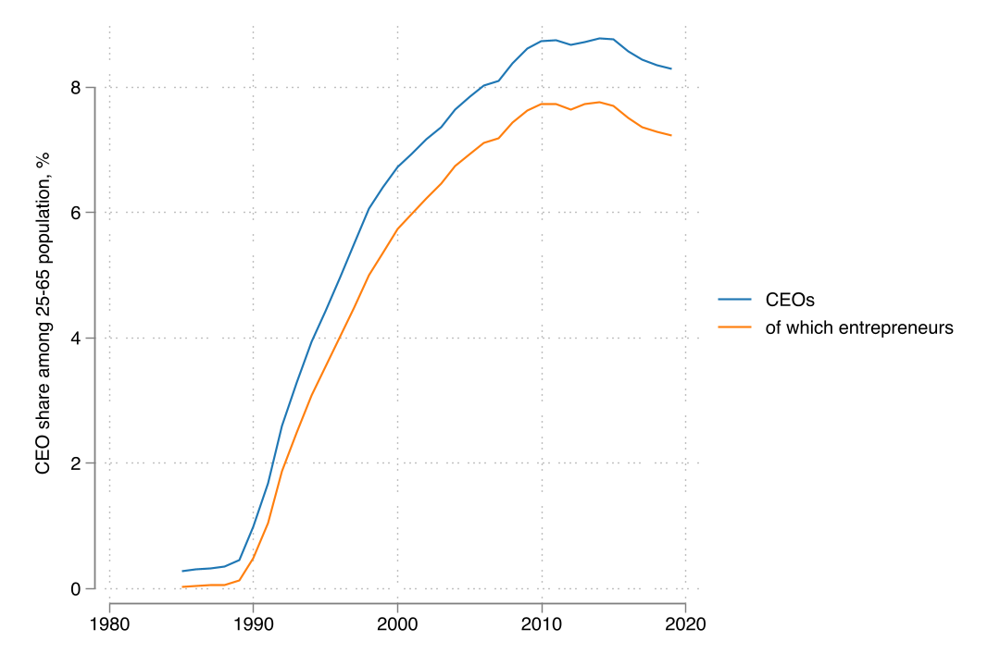
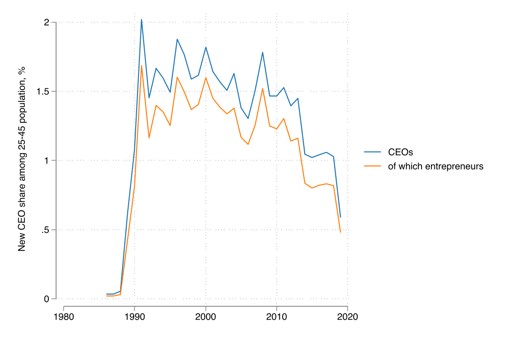
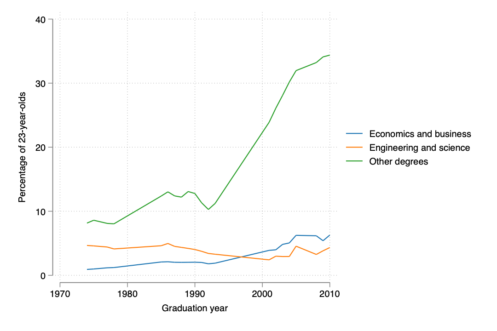
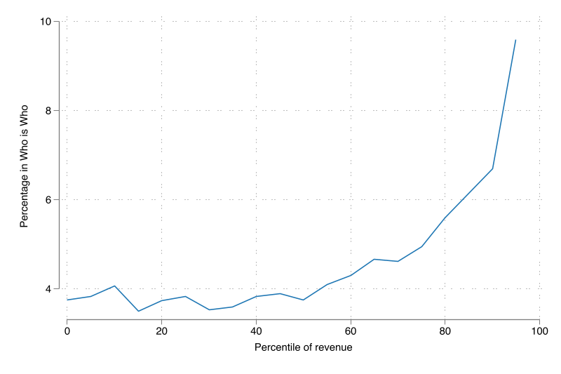
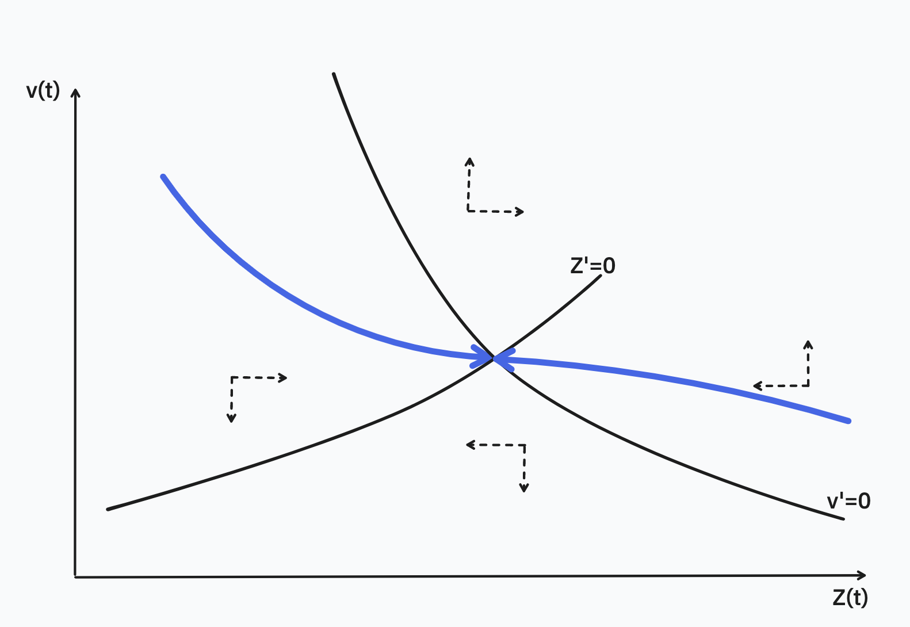
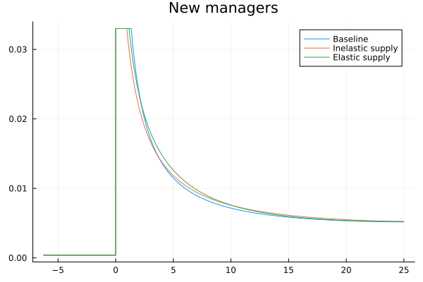
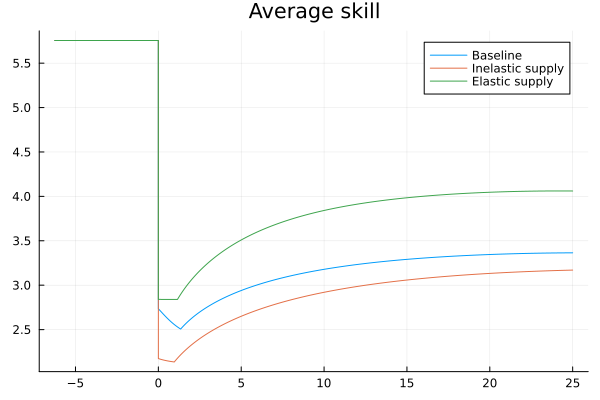
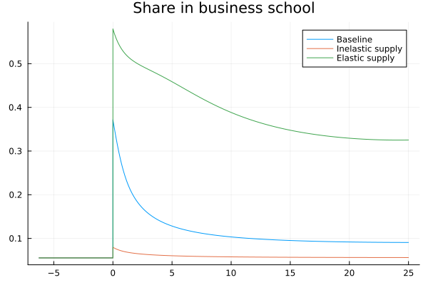
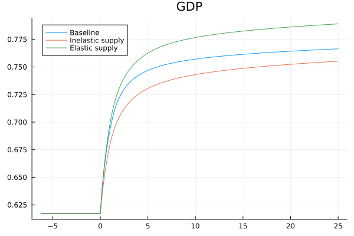

---
author:
    - Miklós Koren (CEU and KRTK)
    - Krisztina Orbán (Monash)
title: "The Macroeconomics of Managers: Supply, Selection and Competition"
date: October 25, 2023^[Supported by Élvonal grant of NKFIH (grant no. 144193)]
aspectratio: 1610
lang: en
titlepage: true
---
# Introduction

## We know that...
### Management matters
- Firms with better management practices are more productive (Bloom et al 2010).
- Management can be improved by intensive training (Bloom et al 2013, Giorcelli 2019).

### Managers matter
- Managers are important for firm performance (Bertrand and Schoar 2003, Bennedsen et al 2007).
- Top CEOs are paid a lot (Gabaix and Landier 2008, Frydman et al 2010).

## What we don't know
1. What policy interventions can improve management for an entire country?
2. How to quantify the macro effects of these policies?

## Why micro $\neq$ macro
Suppose the government subsidizes management trainings. 

### Supply
How many people will take up this training and become managers?

### Selection
Who will become managers? How will the quality of managers change?

### Competition
How will the training affect the existing managers? How will the existing managers affect the incentives to take up the training?

## This paper
1. Assemble a dataset on the universe of managers in the Hungarian economy (1985 -- 2019) + firm balance sheet info + some manager biographies.
2. Examine a large liberalization episode in Hungary in which the demand for management skills increased 20-fold. 
3. Build a dynamic equilibrium model of managers with heterogeneous manager skills to capture:
   - schooling choice and career choice based on innate skills and expected benefits from training
   - competition between managers with different skills and different cohorts
4. Calibrate the model to data on managers, firms, and education.
5. Study counterfactual policies:
   - corporate liberalization
   - business education reform

## Outline
1. Setup and data
2. An OLG model of managers
3. A numerical example for policy analysis
4. Facts about Hungarian corporations and their CEOs, 1988-2019

# Setup and Data
## Setup and Data
Large increase in demand for management skills:

- Pre: very small number of firms, small demand for management
- Post: the number of firms and managers explode

## Manager Data 1985-2019
### Manager
Top officer of corporation (CEO).

Who is the CEO of each corporation? 1m corporations, 1.3m CEOs.

No socioeconomic or demographic information, only identifiers. Sometimes
age, can infer gender and nationality (not today).

## Financials
- Annual panel of balance sheets and earning statements of corporations with double-entry bookkeeping. 936k firms, 8.4m observations.
- Use sales inflated to 2019, employment, and 2-digit NACE sector.

## Schooling data
### Hübner's Who is Who
Full biographies (school, work experience, etc.) for 63k people in 2013. 30k matched to CEO panel.

### College graduates
Number of gradues by degree and year

## The Stock of Managers Increased Sharply Relative to 35-60 Age Group

## The Inflow of Managers Jumped Suddenly

## Business Degrees Became More Prominent

## Large Firms are Overrepresented in Hübner

# An OLG Model of Managers
## An OLG Model of Managers

An overlapping generations model with heterogeneous manager skill, limited span of control and career choice.

### Key decisions
school choice: business, engineering or other

career choice: manager or worker

### Key equilibrium feedback
competition within and across cohorts

### Key friction
school and career choice are irreversible

## Outline
1. Static problem: production function, input prices, competition
2. Manager schooling and career choice
3. Demographics: evolution of cohorts

# Static Problem

## Production Function
Managers differ in their innate skill level. A manager with skill $z$ can hire $h$ workers to produce output with the production function 
$$q = z^\nu h^{1-\nu}$$ 
$\nu>0$ captures span of control (Lucas 1978): hard to run a large firm.

## Firm Revenue
$$r(z) = q(z) = z w^{1-1/\nu}(1-\nu)^{1/\nu-1}$$

Employment, production wage bill, revenue, and manager wages are all linear in $z$. 

Real wage ($w$) is endogenous, determined in competition with other managers.

## Labor Market Clearing
$$L^{p} = N w^{-1/\nu}(1-\nu)^{1/\nu}\int z dG(z)$$ 

With $Z := N\int z dG(z)$ denoting the sum of all manager skills, labor market clearing becomes 
$$w  = (1-\nu)\left(\frac {L^{p}}{Z}\right)^{-\nu}$$ 

Aggregate GDP: 
$$Y = Z^\nu {L^{p}}^{1-\nu}$$

## Manager Wages in Equilibrium
In equilibrium, firms make zero profit. Manager wages capture all quasi-rents.

$$\omega(z) = \nu z \left(\frac {L^{p}}{Z}\right)^{1-\nu}$$
This is increasing in $z$ but decreasing in $Z$. Better managers make more, but competition from other managers reduces the wages available to each individual manager.

# Education and Career Choice
## Education and Career Choice
1. Choose school $i$
2. Draw innate manager skill $z$
3. Get trained in school: $z\to\lambda_i z$
4. Choose whether manager or worker

We solve the model backwards.

## Distribution of Manager Skills
We assume that $z$ is distributed Pareto, depending on schooling
$$1-F_i(x) = \Pr(z > x|\text{school}=i) = \left(\frac x{\lambda_i z_0}\right)^{-\theta}$$
for $\theta>1$ (so that the distribution has a finite mean). 

## Career Choice After Graduation
Potential managers choose to enter if net value exceeds the opportunity cost, 
$$(1-\tau)v(t)z > J(t)$$
Selection on manager skill, $$z > z_{\min}(t) := \frac {J(t)} {(1-\tau)v(t)}.$$

Manager wages may be taxed at rate $\tau\in[0,1)$.

Entry cutoff $z_{\min}$ independent of school $i$.

## Expected Career When Entering School
Schools affect

1. the probability of becoming a manager
2. expected skills and wages

## Probability of becoming a manager
$$
\pi_i(t) = 
	z_{\min}(t)^{-\theta}
		(\lambda_i z_0)^{\theta}
$$

## Average manager skills
$$\tilde z(t) = \frac {\theta}{\theta-1} z_{\min}(t) $$

## Manager Value
Bellman equation for manager value: 
$$\rho V(t,z) = \omega[z,Z(t)] - \delta V(t,z) + V_t(t,z)$$
Guess solution: 
$$V(t,z) = v(t)z$$
If this is the case, the Bellman can be rewritten as 
$$\rho v(t) = \nu p \left[\frac {L^{p}(t)}{Z(t)}\right]^{1-\nu} - \delta v(t) + v'(t)$$

## Expected labor income from a degree
\begin{multline*}
E_i(t) = 
\pi_i(t)(1-\tau) v(t) \tilde z(t) + [1-\pi_i(t)] J(t) = \\
J(t) \left[
1 + (\lambda_i z_0)^\theta (1-\tau)^{\theta} v(t)^\theta J(t)^{-\theta}/(\theta-1)
\right]
\end{multline*}

## Probability of choosing school $i$
$$
x_i = \frac {e^{\alpha_i} \left[
1 + (\lambda_i z_0)^\theta (1-\tau)^{\theta} v(t)^\theta J(t)^{-\theta}/(\theta-1)
\right]^{1/\gamma}   } 
{\sum_j e^{\alpha_j}\left[
1 + (\lambda_j z_0)^\theta (1-\tau)^{\theta} v(t)^\theta J(t)^{-\theta}/(\theta-1)
\right]^{1/\gamma}   }.
$$

$1/\gamma$: elasticity of school choice

$\alpha_i$: attractiveness of school $i$

## Aggregate skill level
$$
\Lambda(t) = \left[\sum_i x_i \lambda_i^\theta \right]^{1/\theta}
$$

# Demographics
## Manager and Worker Demographics
Workers and managers die at a constant rate $\delta$. 

The stock of population:
$$
L := \int_{-\infty}^t e^{\delta{(s-t)}}l ds = l/\delta.
$$
The mass of active managers: 
$$
N(t) := \int_{-\infty}^t e^{\delta{(s-t)}}n(s) ds.
$$ 
The stock of workers: 
$$L^{p} (t) := L-N(t)$$

## Competition Between Firms
Potential new managers have a time invariant skill distribution $F(z)$. 

Only the best become managers: a time varying truncation of $F$. 

The distribution of skill among the stock of managers, denoted by $G(t, z)$, is a mixture of these truncated distributions.

## What can policy do?
1. Lower $\tau$ $\to$ more managers
2. Increase $\alpha_i$ for high-$\lambda_i$ schools $\to$ better composition $\to$ higher $\Lambda$
3. Increase $\lambda_i$ directly $\to$ higher $\Lambda$ (directly and indirectly)

## A taxonomy of macro effects
### Supply
Higher $x_i$ going to business schools

### Selection
Better innate ability of managers, *conditional* on school choice

### Competition
Worker and manager wages respond to entry of new managers

## Dynamics
Bellman equation of manager wages 
$$v'(t) = (\rho+\delta) v(t) - \nu \left[\frac {L^{p}(t)}{Z(t)}\right]^{1-\nu}$$
The set of managers will be a slowly moving state variable. 
$$N'(t) = n(t) - \delta N(t)$$
The change in the overall skill of managers is 
$$Z'(t) = n(t)\tilde z(t) - \delta Z(t)$$
The change in the discounted PV of worker wages is 
$$J'(t)=(\rho+\delta)J(t)-w(t)$$

## Dynamic Equilibrium

Ordinary differential equations in $Z$ and $N$ (state) and $v$ and $J$ (co-state):

\begin{align*}
v'(t) &= (\rho+\delta) v(t) - \nu \left[\frac {L - N(t)}{Z(t)}\right]^{1-\nu} \\
Z'(t) &= \frac{\theta}{\theta-1} \delta L [\Lambda(t)z_0]^\theta (1-\tau)^{\theta-1} [v(t)/J(t)]^{\theta-1} - \delta Z(t) \\
N'(t) &= \delta L [\Lambda(t)z_0]^\theta (1-\tau)^{\theta} [v(t)/J(t)]^\theta - \delta N(t) \\
J'(t) &= (\rho+\delta) J(t) - (1-\nu) \left[\frac {L - N(t)}{Z(t)}\right]^{-\nu}
\end{align*}

## Steady State

The steady state of this economy is when $v'(t) = Z'(t) = N'(t) = J'(t) = 0$. 

We have an almost analytical solution.

Steady state is saddle-path stable.

## Manager share in the steady state
$$
\frac{N_*}{L} = \frac 1{1+  
\frac {1-\nu}{(1-\tau)\nu}
\frac {\theta}{\theta - 1}}
$$

## GDP accounting
Value added per worker in the steady state:
$$
\frac{Y_*}{L} = 
\left(\frac{\nu}{1-\nu} \right)^\nu
(1-\tau)^\nu
(\Lambda_* z_0)^\nu
\left(\frac {N_*}{L}
\right)^{-\nu/\theta}
\left(1-\frac {N_*}{L}
\right)
$$

## Predictions
GDP per capita is increasing in:

1. Innate manager skill
2. Average manager training

Effect of $\tau$ and manager share are ambiguous. There may be too many managers.

## Transitional Dynamics

# Taking the Model to the Data

## Goal
Calibrate model to match two steady states:

1. communism (1985)
2. capitalism (2010)

with only one change, $\tau\to 0$.

## Calibration
\begin{table}[ht!]
\centering
\caption{Calibrated parameter values under communism}   
\begin{tabular}{clr}
  \hline
Parameter & Explanation & Value \\
    \hline
$\nu$ & Steady-state ratio of managers to workers & 0.174 \\
$\tau$ & Tax rate & 0.929 \\
$\rho$ & Discount rate & 0.050 \\
$\delta$ & Retirement rate & 0.033 \\
$\theta$ & Skill distribution, shape & 4.380 \\
$\lambda_1$ & Skill multiplier in business schools & 2.197 \\
$\lambda_2$ & Skill multiplier in engineering & 2.185 \\
$\lambda_3$ & Skill multiplier in other college & 1.649 \\
$\alpha_1$ & Relative preference for business schools & -2.23 \\
$\alpha_2$ & Relative preference for engineering & -2.02 \\
$\alpha_3$ & Relative preference for other college & -0.204 \\
$\gamma$ & Importance of non-pecuniary education benefits & 0.059 \\
    \hline
\end{tabular}
\end{table}

## Measuring manager quality
Log revenue of firm $i$ in year $t$ in industry $s$, with a mananager having entered in cohort $c$ is
$$
\ln R_{icst} = \beta_1\text{manager\_age}_{ict} + \beta_2\text{firm\_age}_{ict}  + \mu_{c} + \xi_{st} + \epsilon_{ict}.
$$

## Degree of Selection
$$
\ln \pi_{ic} = \theta\ln\lambda_i  - \theta \mu_c + \varepsilon_{ic}.
$$

## Manager Selection by Degree
\input{table/selectivity.tex}

## Policy Counterfactuals

1. **Transition**: Reduce $\tau$ to 0 suddenly.
2. **Manager tax**: Reduce $\tau$ to increase GDP by 5 percent.
3. **School benefit**: Increase $\alpha_i$ to increase GDP by 5 percent.
4. **Curriculum reform**: Increase $\lambda_i$ to increase GDP by 5 percent.

## Transition: Manager entry increases suddenly
{#fig:entry width=13cm height=8cm }

## Transition: Entrant skill drops sharply
{#fig:skill width=13cm height=8cm }

## Transition: Business schools become more popular
{#fig:econ width=13cm height=8cm }

## Transition: GDP converges to a higher steady state
{#fig:gdp width=13cm height=8cm }

## Policy Counterfactuals
\begin{tabular}{lcccc}
\toprule
{} & Transition ($\tau$) & Manager tax & School benefit & Curriculum \\
\midrule
Percentage change        &         -100.0 &        -3.7 &       26.7 &           47.4 \\
Manager entry            &           58.4 &         7.1 &         0.0 &            0.0 \\
Average education        &            2.3 &         0.1 &         5.0 &            5.0 \\
Selection                &           -9.5 &        -1.5 &         0.0 &            0.0 \\
Competition              &          -13.0 &        -0.6 &         0.0 &            0.0 \\
\midrule
Total GDP change         &           27.6 &         5.0 &         5.0 &            5.0 \\
\midrule
Share in business school &          10.8 &       3.6 &       61.4 &          5.5 \\
\bottomrule
\end{tabular}

## Discussion
1. Manager entry can increase GDP substantially. But
   - Only if starting from a very low level.
   - There are large pushbacks from selection...
   - ...and competition.
2. Subsidizing business schools has more direct effect on GDP. But
   - Requires implausibly large increase in enrollment.
3. Curriculum reform has the most direct effect on GDP. 

# Conclusion
## Conclusion
### Go Corvinus!
