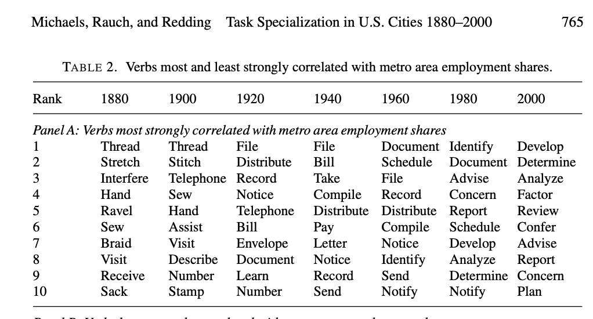

## Mennyi az ideális népsűrűség?

\pause
### Várostervező
..., ... (oszt, szoroz) ... 1,100 fő/km${}^2$

\pause
### Közgazdász
Attól függ! Mennyi a lakbér? Milyen az infrastruktúra? Milyen munkalehetőségek vannak?

## 1. Bevezetés
- **Fókusz**: Edward Glaesert a városok érdeklik. Városok növekedése és hanyatlása, az agglomeráció okai és következményei, szakpolitikai beavatkozások, történelmi példák.
- **Háttér**: PhD Chicago 1992. Harvard University 1992--. 162 ezer hivatkozás.

## 2. Egyedülálló Fókusz a Városi Dinamikára
- **Városok Fejlődése és Hanyatlása**: Emberi tőke és oktatás fontossága. A városok növekedése szorosan kapcsolódik a tudás és az innováció központi szerepéhez. A városok hanyatlását gyakran a gazdasági diverzifikáció hiánya, a merev szabályozások és a társadalmi problémák okozzák.
- **Agglomeráció Gazdaságtana**: Emberi interakciók és az információcsere hatékonysága. Jobb munkalehetőségekhez való hozzáférés, a szolgáltatások és infrastruktúra koncentrációja, de magasabb megélhetési költségek és a forgalmi dugók.

## Michaels, Rauch és Redding 2019

## 3. Változatos Módszertan
- **Mikroadatok Elemzése**: Háztartási és vállalati census, ingatlanadatok, földrajzi adatok, GIS. 
- **Multidiszciplináris Megközelítés**: Közgazdaságtan, ökonometria (pl. jobb null modellek), földrajz, történelem, város-szoicológia.

## Ellison és Glaeser 1997 (JPE)
Geographic Concentration in U.S. Manufacturing Industries: A Dartboard Approach

A tradicionális koncentráció-mérőszámok fölfele torzítanak. Kevés telephely $\to$ látszólagos koncentráció még akkor is, ha véletlenszerű a telephelyek térbeli eloszlása (dartboard approach).

## 4. Tudás Bizonytalanság Idején
Sokan nem mernek bizonytalanság idején előrejelezni. (Nincs rá adat! Nincs rá kísérlet!)

De mikor jelezzünk előre, ha nem akkor, amikor senki nem tud semmit?

- **9/11**: Modellek és történelmi példák alapján: a nagyvárosok ellenállnak még az ilyen nagy sokkoknak is.
- **Covid-19**: Valószínűbb hosszútávú hatás. (Cutler és Glaeser 2021, Survival of the City.)

## 5. Következtetés
Glaeser fókuszált, de nem szakbarbár. Még akkor sem, ha Chicagóban végzett. (*There are no libertarians in cities.*)

És nem fél előrejelzéseket tenni.
