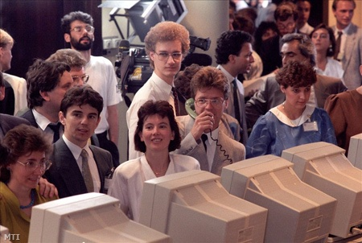
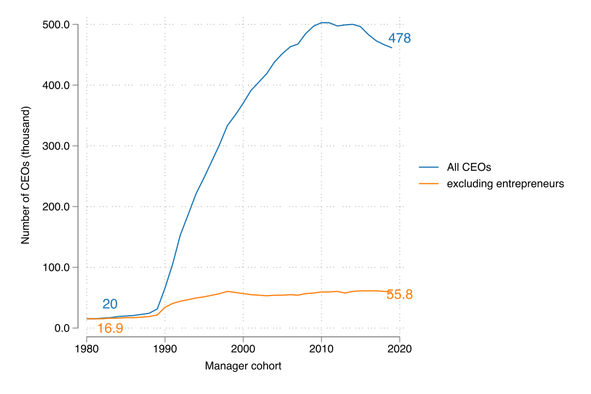
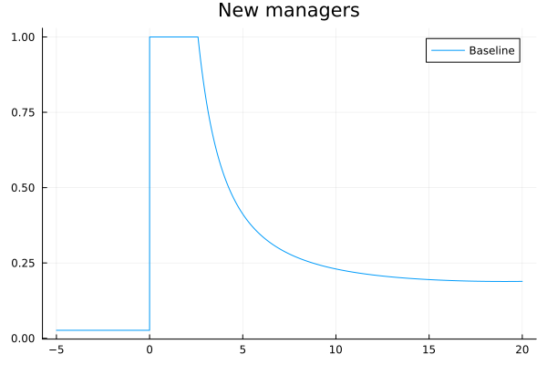
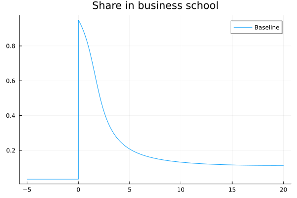

---
author:
    - Miklós Koren (CEU, KRTK, CEPR and CESifo)
    - Krisztina Orbán (Monash)
title: "The Macroeconomics of Managers: Supply, Selection and Competition"
date: December 14, 2023^[Supported by Forefront Research Excellence Grant (144193) and ERC Advanced Grant (101097789)]
aspectratio: 1610
lang: en
titlepage: true
---
# Introduction

## Hungary, 1980 (Fortepan / Szalay Zoltán)

## Hungary, 1990 (MTI)

## Number of Executive Positions Increased

## Business Degrees Became More Prominent

## What Can We Learn From Hungary?

Use Hungarian post-socialist transition as a natural experiment to study the supply side of the market for managers.

## Why Micro $\neq$ Macro
### What we know 
1. Management matters
2. Training works
3. Managers matter

\pause

### What we don't know
1. What policy interventions can improve management for an entire country?
2. How to quantify the macro effects of these policies?

\pause

### What we need
1. Endogenous supply: how to incentivize people to become managers?
2. Selection: who will become managers?
3. Competition: what are the GE feedbacks of interventions?

# Setup and Data
## Data
### Manager Data 1985-2019
Universe of corporations (1m) and their CEOs (1.3m). Firm size (employment) as proxy for manager quality.

### Biographies
Full biographies (school, work experience, etc.) for 63k people in 2013. 30k matched to CEO panel.

### College graduates
Number of gradues by degree and year.

## Quantity Up, Quality Down

# An Equilibrium Model of Managers
## An Equilibrium Model of Managers
1. Managers have innate skill and can be trained (at university). 
2. Schooling responds to incentives.
3. Self-selection into management based on skill (frictions + dynamics).
4. Wages determined in equilibrium. 

## Production Function
A manager with skill $z$ can hire $l$ workers to produce output 
$$q = z^\nu l^{1-\nu}.$$ 

\pause

Aggregate GDP: 
$$Y = Z^\nu {L^{p}}^{1-\nu}$$
with sum of manager skills
$$Z = N\cdot \tilde z = N\cdot\int\! z dG(z)$$ 

\pause

Policy goal: Increase $Z$ via either $N$ (more managers) or $\bar z$ (better training).

## Corporate Governance Friction
Operating surplus,
$$\Pi(z) = q(z) - w l(z) = z \pi(w) $$
linear in $z$. Worker wage ($w$) is endogenous.
\pause

**Owners cannot commit to sharing more than a fraction of surplus**.

Manager wage is
$$
\omega(z) \le \phi \Pi(z) = \phi z \pi(w) 
$$
with $\phi < 1$. 

**Underprovision of manager skills.**

## Education and Career Choice

### Career Choice
Manager if $\omega(z) > w$,
$$ z > z_{\min}(Z).$$ 

### Education
Different degrees lead to different $z$ distributions (Pareto). Discrete choice over degrees given tuition, expected income, and non-pecuniary preferences.

## What Can Policy Do?
1. Reduce corporate governance frictions.
2. Subsidize business schools. 
3. Reform business school curriculum.

## A Taxonomy of Equilibrium Feedback Effects
### Supply
Higher share going to business schools, more managers

### Selection
Different innate ability of managers, *conditional* on school choice

### Competition
Worker and manager wages respond to entry of new managers

## Steady State Results
### Manager share
$$
\frac{N_*}{L} = \frac 1{1+  
\frac {1-\nu}{\phi\nu}
\frac {\theta}{\theta - 1}}
$$
with $\theta>1$ the shape of the Pareto skill distribution.

\pause 

### Value added per worker
$$
\frac{Y_*}{L} = 
\left(\frac{\nu}{1-\nu} \right)^\nu
\phi^\nu
(\Lambda_* z_0)^\nu
\left(\frac {N_*}{L}
\right)^{-\nu/\theta}
\left(1-\frac {N_*}{L}
\right)
$$
with $\Lambda_* = \left[\sum_i x_i \lambda_i^\theta \right]^{1/\theta}$ the average skill multiplier across degrees.

# Taking the Model to the Data

## Goal
Calibrate model to match two steady states:

1. communism (-1989)
2. capitalism (2005-2010)

with only one change, $\phi_0 \to \phi_1$.

## Calibration
\begin{table}[ht!]
\centering
\caption{Calibrated parameter values}   
\begin{tabular}{clr}
  \hline
Parameter & Explanation & Value \\
    \hline
$\nu$ & Steady-state ratio of managers to workers & 0.174 \\
$\phi_0$ & Surplus sharing under communism & 0.130 \\
$\phi_1$ & Surplus sharing under capitalism & 1.000 \\
$\theta$ & Skill distribution, shape & 6.87 \\
$\lambda_1$ & Skill multiplier in business school & 1.80 \\
$\lambda_2$ & Skill multiplier in engineering & 1.71 \\
$\lambda_3$ & Skill multiplier in other college & 1.35 \\
$\gamma$ & Importance of non-pecuniary education benefits & 0.06 \\
    \hline
\end{tabular}
\end{table}

## Policy Counterfactuals

1. **Transition**: Increase $\phi$ to 1 suddenly.
2. **Manager subsidy**: Increase $\phi$ to increase GDP by 5 percent.
3. **School benefit**: Increase $\alpha_i$ to increase GDP by 5 percent.
4. **Curriculum reform**: Increase $\lambda_i$ to increase GDP by 5 percent.

## Policy Counterfactuals
\begin{tabular}{lcccc}
\toprule
{} & Transition & Manager subsidy & School benefit & Curriculum \\
\midrule
Percentage change        &                &        41.5 &       28.0 &           41.8 \\
Manager entry            &           49.1 &         7.0 &         0.0 &            0.0 \\
Average education        &            1.6 &         0.2 &         5.0 &            5.0 \\
Selection                &           -5.2 &        -1.0 &         0.0 &            0.0 \\
Competition              &          -15.0 &        -1.1 &         0.0 &            0.0 \\
\midrule
Total GDP change         &           22.1 &         5.0 &         5.0 &            5.0 \\
\midrule
Share in business school &          10.6 &       4.0 &       72.0 &          6.0 \\
\bottomrule
\end{tabular}

# Conclusion
## Results
- Transition results in "gold rush" of managers and business schools.
- Every policy faces strong pushback from selection and competition.
- Curriculum reform has most direct effect.  

## Contributions
- Tractable, quantifiable model of manager demand and supply.
- Novel data for Hungary, 1985-2019.
- Use transition as macro shock to identify macro model.

# Appendix

## Literature
- Large-scale management interventions: Italy (Giorcelli 2019), US (Bianchi and Giorcelli 2022, Giorcelli 2023)
- Large-scale education interventions: Italy (Bianchi and Giorcelli 2020), Colombia (Ferreyra et al 2023), Vietnam (Vu 2023)
- Selection by skill: Denmark (Akcigit, Pearce and Prato 2020)
- Calibrated models with education and selection: Guner et al 2008, Bhattacharya et al. 2013, Gomes and Kuehn 2017 and Esfahani 2019.

# Education and Career Choice
## Education and Career Choice
1. Choose school $i$
2. Draw innate manager skill $z$
3. Get trained in school: $z\to\lambda_i z$
4. Choose whether manager or worker

We solve the model backwards.

## Distribution of Manager Skills
We assume that $z$ is distributed Pareto, depending on schooling
$$1-F_i(x) = \Pr(z > x|\text{school}=i) = \left(\frac x{\lambda_i z_0}\right)^{-\theta}$$
for $\theta>1$ (so that the distribution has a finite mean). 

## Career Choice After Graduation
Potential managers choose to enter if net value exceeds the opportunity cost, 
$$\phi v(t)z > J(t)$$
Selection on manager skill, $$z > z_{\min}(t) := \frac {J(t)} {\phi v(t)}.$$

Entry cutoff $z_{\min}$ independent of school $i$.

## Expected Career When Entering School
Schools affect

1. the probability of becoming a manager
2. expected skills and wages

## Probability of becoming a manager
$$
\pi_i(t) = 
	z_{\min}(t)^{-\theta}
		(\lambda_i z_0)^{\theta}
$$

## Average manager skills
$$\tilde z(t) = \frac {\theta}{\theta-1} z_{\min}(t) $$

## Manager Value
Bellman equation for manager value: 
$$\rho V(t,z) = \omega[z,Z(t)] - \delta V(t,z) + V_t(t,z)$$
Guess solution: 
$$V(t,z) = v(t)z$$
If this is the case, the Bellman can be rewritten as 
$$\rho v(t) = \nu p \left[\frac {L^{p}(t)}{Z(t)}\right]^{1-\nu} - \delta v(t) + v'(t)$$

## Expected labor income from a degree
\begin{multline*}
E_i(t) = 
\pi_i(t)\phi v(t) \tilde z(t) + [1-\pi_i(t)] J(t) = \\
J(t) \left[
1 + (\lambda_i z_0)^\theta \phi^{\theta} v(t)^\theta J(t)^{-\theta}/(\theta-1)
\right]
\end{multline*}

## Probability of choosing school $i$
$$
x_i = \frac {e^{\alpha_i} \left[
1 + (\lambda_i z_0)^\theta \phi^{\theta} v(t)^\theta J(t)^{-\theta}/(\theta-1)
\right]^{1/\gamma}   } 
{\sum_j e^{\alpha_j}\left[
1 + (\lambda_j z_0)^\theta \phi^{\theta} v(t)^\theta J(t)^{-\theta}/(\theta-1)
\right]^{1/\gamma}   }.
$$

$1/\gamma$: elasticity of school choice

$\alpha_i$: attractiveness of school $i$

## Aggregate skill level
$$
\Lambda(t) = \left[\sum_i x_i \lambda_i^\theta \right]^{1/\theta}
$$

# Demographics
## Manager and Worker Demographics
Workers and managers die at a constant rate $\delta$. 

The stock of population:
$$
L := \int_{-\infty}^t e^{\delta{(s-t)}}l ds = l/\delta.
$$
The mass of active managers: 
$$
N(t) := \int_{-\infty}^t e^{\delta{(s-t)}}n(s) ds.
$$ 
The stock of workers: 
$$L^{p} (t) := L-N(t)$$

## Competition Between Firms
Potential new managers have a time invariant skill distribution $F(z)$. 

Only the best become managers: a time varying truncation of $F$. 

The distribution of skill among the stock of managers, denoted by $G(t, z)$, is a mixture of these truncated distributions.

# Dynamics
## Dynamics
Bellman equation of manager wages 
$$v'(t) = (\rho+\delta) v(t) - \nu \left[\frac {L^{p}(t)}{Z(t)}\right]^{1-\nu}$$
The set of managers will be a slowly moving state variable. 
$$N'(t) = n(t) - \delta N(t)$$
The change in the overall skill of managers is 
$$Z'(t) = n(t)\tilde z(t) - \delta Z(t)$$
The change in the discounted PV of worker wages is 
$$J'(t)=(\rho+\delta)J(t)-w(t)$$

## Dynamic Equilibrium

Ordinary differential equations in $Z$ and $N$ (state) and $v$ and $J$ (co-state):

\begin{align*}
v'(t) &= (\rho+\delta) v(t) - \nu \left[\frac {L - N(t)}{Z(t)}\right]^{1-\nu} \\
Z'(t) &= \frac{\theta}{\theta-1} \delta L [\Lambda(t)z_0]^\theta \phi^{\theta-1} [v(t)/J(t)]^{\theta-1} - \delta Z(t) \\
N'(t) &= \delta L [\Lambda(t)z_0]^\theta \phi^{\theta} [v(t)/J(t)]^\theta - \delta N(t) \\
J'(t) &= (\rho+\delta) J(t) - (1-\nu) \left[\frac {L - N(t)}{Z(t)}\right]^{-\nu}
\end{align*}

## Transitional Dynamics

## Transition: Manager entry increases suddenly
{#fig:entry width=13cm height=8cm }

## Transition: Entrant skill drops sharply
{#fig:skill width=13cm height=8cm }

## Transition: Business schools become more popular
{#fig:econ width=13cm height=8cm }

## Transition: GDP converges to a higher steady state
{#fig:gdp width=13cm height=8cm }

# Measuring Manager Quality
## Measuring Manager Quality
Log employment of firm $i$ in year $t$ in industry $s$, with a mananager having entered in cohort $c$ is
$$
\ln L_{icst} = \beta_1\text{manager\_age}_{ict} + \beta_2\text{firm\_age}_{ict}  + \mu_{c} + \xi_{st} + \epsilon_{ict}.
$$

Quality: $\mu_c$

## Degree of Selection
$$
\ln \pi_{ic} = \theta\ln\lambda_i  - \theta \mu_c + \varepsilon_{ic}.
$$

Selectivity: $\theta$

## Manager Selection by Degree
\input{table/selectivity.tex}

