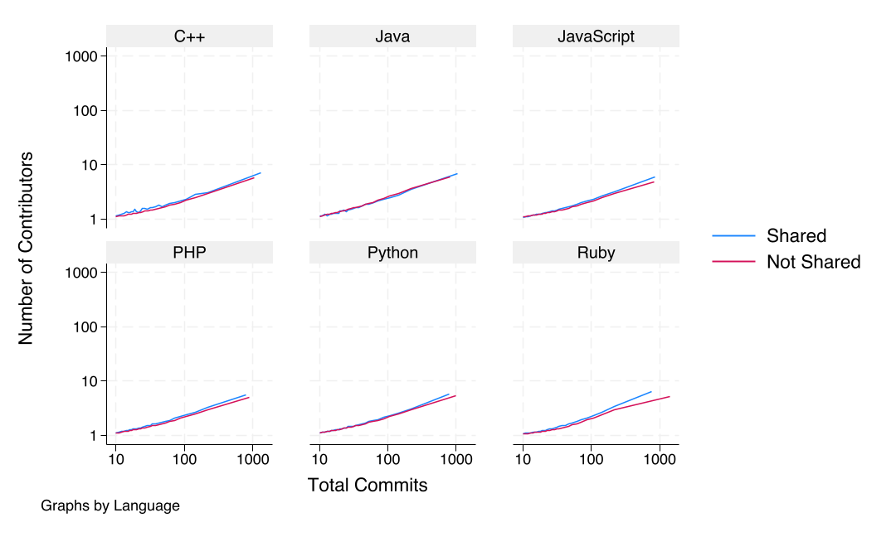
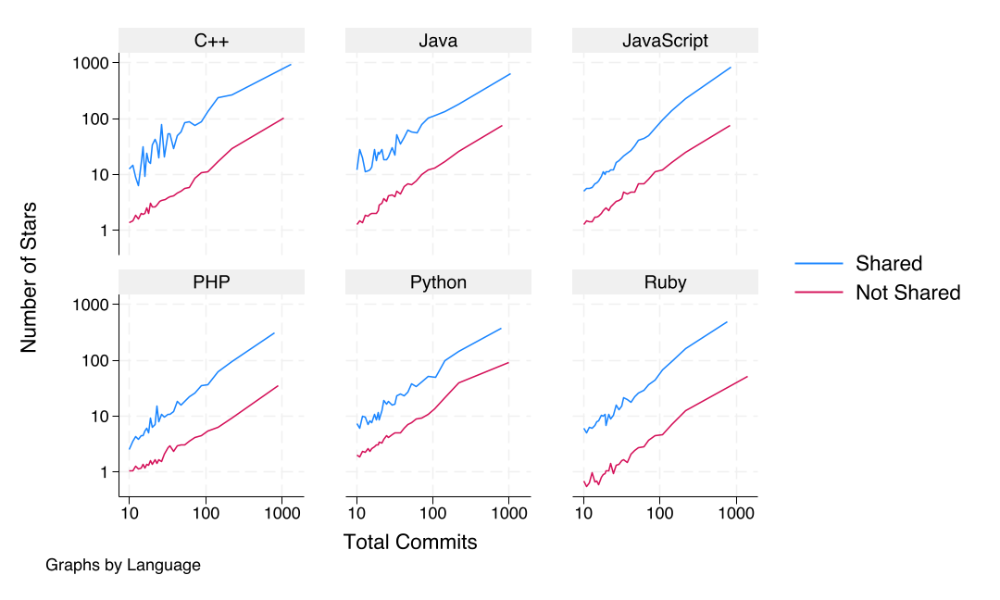
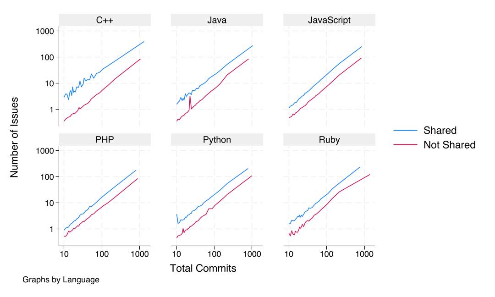
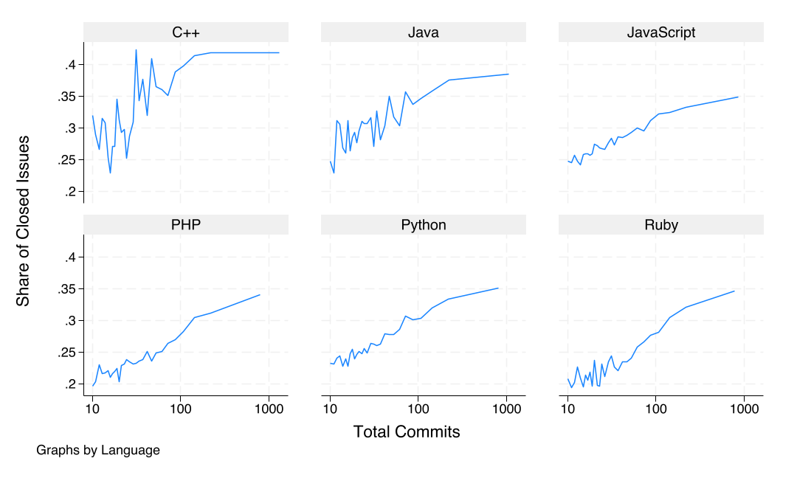
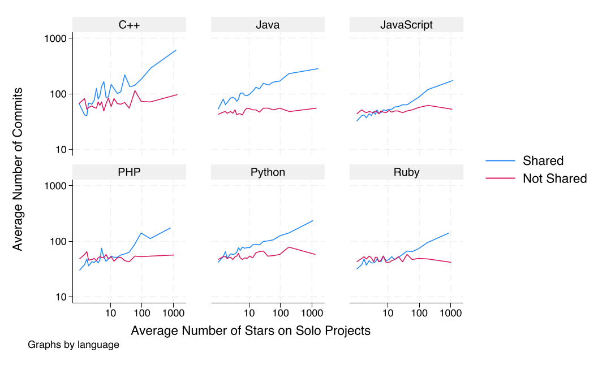
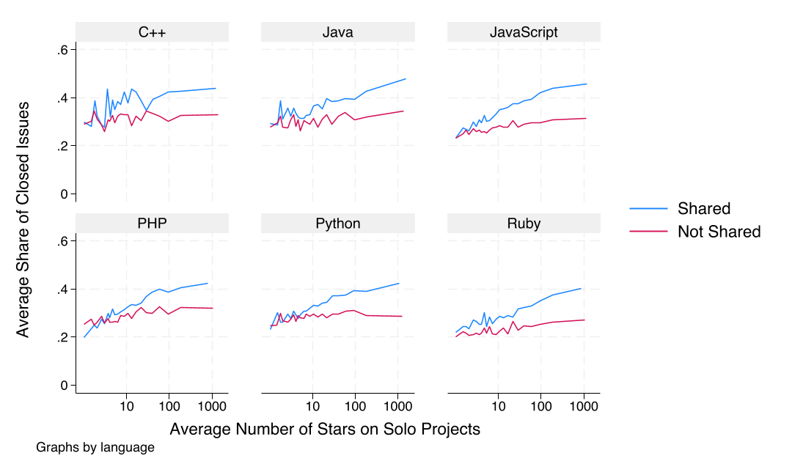

## Software is eating the world
### The weightless economy
"Software is eating the world." (Andreessen, 2011)

### Open-source software (OSS) is everywhere
Linux, Apache, MySQL, PHP, Python, R, Julia, Android, Firefox, Chrome, etc.

Also included in proprietary software

## Two economic puzzles in open source
### Why do people work for free?
Altruism, reputation concerns, alternative business models. Sizeable economic literature.

\pause

### How can a bunch of amateurs produce quality software?

## Salient features of OSS
### Price is zero
Not even that unique.

\pause

### Scratch your own itch
Developers are often their own first users: grep, TeX, Linux,  git, etc.

### Free access to source code
"Given enough eyeballs, all bugs are shallow." (Raymond, 1999)

### Software quality is only partly observable
Testing is important.

## Based on two studies

### Success and geography in the weightless economy: Evidence from open-source software
Békés, Hinz, Koren, and Lohman. 2024.

### Bugs \emoji{lady-beetle}
Koren, Békés, and Hinz. 2024.

## Data
### GitHub
Snapshot of all public repositories on GitHub on 2019-06-01. Six largest languages: JavaScript, Python, Java, Ruby, PHP, and C++. Drop smallest and largest projects. 4.4m projects, 2.7m users. Self-reported location.

### libraries.io
Dependency data for projects on major package managers (npm, PyPI, Maven, RubyGems, etc). Studying npm (JavaScript) today.

# Success and geography in the weightless economy: Evidence from open-source software

## Developer density around the globe

## Large variation in number of projects and developers
{ width=50% } { width=50% }

## With limits on how many projects one imports
{ width=50% } { width=50% }

## Measuring collalboration and dependencies
\begin{figure}
    \begin{subfigure}{0.5\textwidth}
        \centering
        \begin{tikzpicture}[scale=0.9]
            % Nodes and arrows for the first figure
            \node[circle, draw] (A) at (0,2) {A};
            \node[circle, draw] (B) at (4,2) {B};
            \node[circle, draw] (C) at (4,0) {C};
            \node[rectangle, draw, minimum width=2cm, minimum height=1cm] (repo) at (0,0) {Repo}; % Adjust the width and height as needed

            \draw[->] (A) -- (repo);
            \draw[->] (B) -- (repo);
            \draw[->] (C) -- (repo);
        \end{tikzpicture}
        \caption{Developers committing to a repository.}
    \end{subfigure}%
    \begin{subfigure}{0.5\textwidth}
        \centering
        \begin{tikzpicture}
            % Nodes and lines for the first figure
            \node[draw, circle, minimum size=1cm] (A) at (0,1.5) {A};
            \node[draw, circle, minimum size=1cm] (B) at (0,0) {B};
            \node[draw, rectangle, minimum width=1.5cm, minimum height=1cm] (Repo1) at (0,-1.5) {Repo 1};

            \node[draw, circle, minimum size=1cm] (C) at (3,1.5) {C};
            \node[draw, circle, minimum size=1cm] (D) at (3,0) {D};
            \node[draw, rectangle, minimum width=1.5cm, minimum height=1cm] (Repo2) at (3,-1.5) {Repo 2};

            \draw[solid] (1.5,-1.5) -- (1.5,2.5);
            \draw[->] (Repo1.east) -- (Repo2.west);
        \end{tikzpicture}
        \caption{Dependency of repository 1 on repository 2 with the respective developers.}
    \end{subfigure}%
\end{figure}

## Gravity model of collaboration
Developer $i$ and $j$ collaborate with probability
$$
\Pr(\text{Collaboration}_{ij}) = \exp(\alpha x_i + \beta x_j -\gamma\times\text{distance}_{ij})
$$
Aggregate across city pairs $d$ and $o$:
$$
E(N_{do}) = \exp(\alpha x_d + \beta x_o -\gamma\times\text{distance}_{do})
$$
Estimate this with Poisson maximum likelihood.

## Three margins of collaboration
1. Committing to the same project
2. Importing someone else's project
3. Members of the same organization

## Strong localization of collaboration patterns

## No localization of dependencies

## Diverse teams produce more popular software

## Additional results
Organizations help overcome distance. Almost no distance penalty for developers within the same GitHub organization.

# Bugs \emoji{lady-beetle}

## Model

Long-standing question in economics: how does competition affect innovation?

Model the special features of the OSS market.

## Special features
1. Price is zero. Only compete in quality.
2. Software projects often start as a developer's own need.
3. Quality is only partly observable.
4. Collaboration is important.

## Outline
1. Defining software quality
2. Producing quality
3. The market for software
4. Testable predictions
5. First evidence from GitHub

# Quality

## Software quality
Users have a use case $X$.

Developers write code $\bar z$ and tests $\underline z$. Software quality is random $Z \sim U[\underline z, \bar z]$.

Software only works if $Z > X$.

$$
\Pr(Z \text{works for} X) := \pi = \frac{\bar z - X}{\bar z - \underline z}.
$$

## Software quality
\begin{tikzpicture}[scale=4]
    % Draw axes
    \draw[->] (0,0) -- (1.2,0) node[right] {$Z$};
    \draw[->] (0,0) -- (0,1.2) node[above] {$X$};
    
    % Draw boundaries at 1
    \draw (1,0) -- (1,1);
    \draw (0,1) -- (1,1);
    
    % Draw interval [\underline{z}, \bar{z}]
    \fill[gray!50] (0.3,0) rectangle (0.7,1);
    \draw (0.3,0) -- (0.3,1);
    \draw (0.7,0) -- (0.7,1);
    
    % Label \underline{z} and \bar{z}
    \draw (0.3,0) node[below] {$\underline{z}$};
    \draw (0.7,0) node[below] {$\bar{z}$};
    
    % Draw 45-degree dotted line
    \draw[dotted] (0,0) -- (1,1);
    
    % Draw use case X = x_0
    \draw[red, thick] (0,0.5) -- (0.5,0.5); % Left of the 45-degree line
    \draw[red, ultra thick] (0.5,0.5) -- (1,0.5) node[right] {$X = x_0$}; % Right of the 45-degree line (thicker)
\end{tikzpicture}

## Probability of software working for a given use case
\begin{tikzpicture}[scale=1.5]  % Increase the scale value to increase the size of the figure
    % Axes
    \draw[thick, ->] (0,0) -- (5,0) node[below] {$x$};
    \draw[thick, ->] (0,0) -- (0,2) node[left] {$\pi(x)$};

    % x-axis labels
    \draw (1,0.1) -- (1,-0.1) node[below] {$\underline{z}$};
    \draw (3,0.1) -- (3,-0.1) node[below] {$\bar{z}$};

    % y-axis labels
    \draw (0.1,1) -- (-0.1,1) node[left] {1};

    % Line segments
    \draw[blue, thick] (0,1) -- (1,1); % Constant segment
    \draw[blue, thick] (1,1) -- (3,0); % Linear decreasing segment
    % Note: The line automatically stops at x=3

    % Dotted lines for clarity
    \draw[dotted] (1,1) -- (1,0);
    \draw[dotted] (3,1) -- (3,0);
\end{tikzpicture}

## The production of quality
Coding up to $\bar z$ costs $c(\bar z)$. Increasing and convex.

Testing up to $\underline z$ costs $t(\underline z)$. Increasing and convex.

(Current results for $t(z) = \tau c(z)$ with $\tau \le 1$.)

## Cost of quality
\begin{tikzpicture}
\begin{axis}[
    axis lines = left,
    xlabel = $z$,
    ylabel = {Cost},
    legend pos = north west,
    ymin=0,
    ymax=1,
    xmax=1,
    xmin=0,
    clip=false,
    domain=0:1
]
% Add c(z)
\addplot [
    domain=0:1, 
    samples=100, 
    color=red,
] {x^2};
\addlegendentry{$c(\bar{z})$}

% Add t(z)
\addplot [
    domain=0:1, 
    samples=100, 
    color=blue,
    style=dashed,
] {0.8*(x^2)};
\addlegendentry{$t(\underline{z})$}

% Add points for z_bar and z_underline
\draw[dotted] (axis cs:0.5,0) -- (axis cs:0.5,{0.5^2});
\node[label={90:{$\bar{z}$}},circle,fill,inner sep=2pt] at (axis cs:0.5,{0.5^2}) {};

\draw[dotted] (axis cs:0.3,0) -- (axis cs:0.3,{0.8*(0.3^2)});
\node[label={270:{$\underline{z}$}},circle,fill,inner sep=2pt] at (axis cs:0.3,{0.8*(0.3^2)}) {};

\end{axis}
\end{tikzpicture}

# Market

## Three market environments
1. Do-it-yourself: developer writes code for own use. $X=u$ is known.
2. Shared platform: developer writes code for others. $X\sim F$ is unknown.
3. Competition: $n$ developers write code for the same set of users.

## The DIY economy
The developer maximizes
$$
\max_{\underline z, \bar z} \frac{\bar z- u}{\bar z - \underline z} - t(\underline z) - c(\bar z)
$$
subject to $\underline z, \bar z \ge 0$ and $\underline z \le \bar z$.

## The platform economy
Assume developer can capture $\phi \ll 1$ share of the value of the software. 

She maximizes
$$
\max_{\underline z, \bar z} \phi \int \frac{\bar z- x}{\bar z - \underline z} dF(x) - t(\underline z) - c(\bar z)
$$
subject to $\underline z, \bar z \ge 0$ and $\underline z \le \bar z$.

## Competition
Two-sided market with $U$ users and $D$ developers. 

Each user meets $n$ developers at random. 

They choose the software with the highest $\underline z$.

## Competition
With $G(z)$ is the distribution of tested software quality in the marketplace,
$$
\Pr(z_j \text{ wins}|x_i,\underline z_j,n) = G^{n-1}(\underline z_j),
$$

## Developer's problem
Maximize
$$
\max_{\underline z, \bar z} \frac {\phi nU}{D} \int \frac{\bar z- x}{\bar z - \underline z} dF(x) G^{n-1}(\underline z)
 - t(\underline z) - c(\bar z) 
$$

## Collaboration
Collaboration helps overcome diminishing returns to coding. With $n$ collaborators, the total coding cost up to $\bar z$ is
$$
C(\bar z) :=
\min_{\{z_i\}} \sum_{i=1}^n
	c_i(z_i)
	\,\text{ s.t. }\,
	\sum_{i=1}^n z_i \ge \bar z
$$
$$
n c(\bar z/n) < c(\bar z)
$$

There may be increasing returns to collaboration: lower marginal cost $\to$ higher demand $\to$ more individual contribution.

# Predictions

## Predictions on testing
1. DIY projects are not fully tested. 
2. Shared projects are.

## Predictions on code quality
1. Standalone projects are limited by developer's own need. Diminishing returns to quality.
2. Shared projects have higher quality. Constant returns to quality.
3. Competition increases quality. Increasing returns to quality.

## Predictions on collaboration
1. Collaborative project may have *more* individual contribution.
2. Especially in shared projects.

## Measurement
Six biggest languages on GitHub: JavaScript, Python, Java, Ruby, PHP, and C++.

Contribution: number of commits per developer per project.

Compare the *same* developer in the *same* language across projects.

Developer skill: average number of stars per solo-authored project. 

## Larger projects are written by more people

## Larger projects are more popular

## Larger projects have more bug discovery

## Larger projects solve a larger share of issues

## Better developers contribute more to shared projects

## Shared projects are better quality

## Good developers contribute more to shared projects
\input{tables/quality_ln_n_commits.tex}

## Popular projects attract better developers
\input{tables/quality_heterogeneity.tex}

## Next steps
Measure test coverage.

Interaction with users: bug reports, feature requests.

Sorting into collaboration.

## Get in touch
@korenmiklos

@gaborbekes

@julianhinz