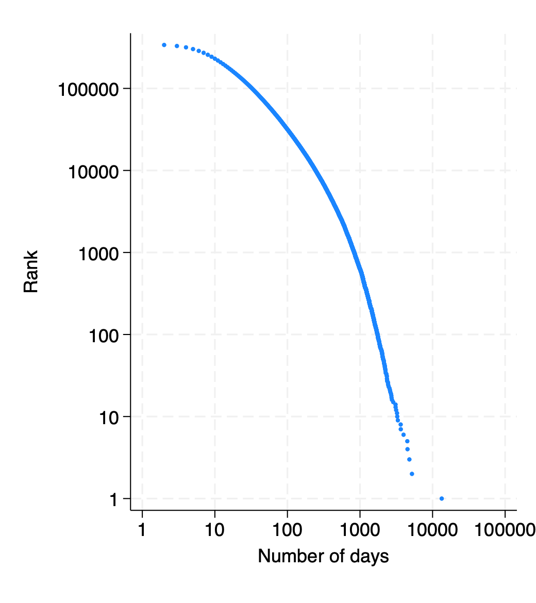
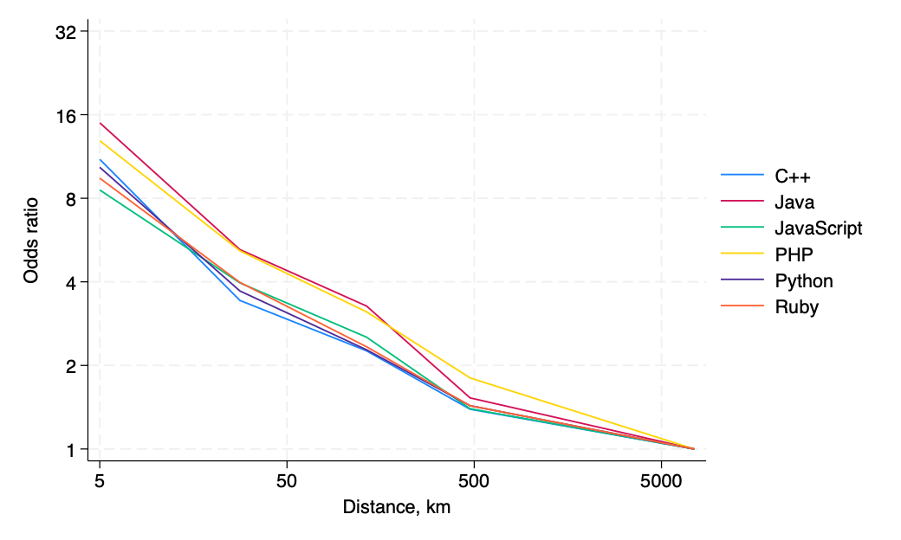

# Introduction
## Research question
- How and where is open source software developed?
- Can spatially dispersed developers produce quality software?

# GitHub poll

# `if (poll == "no") {`

## Why Open Source Software (OSS)?
### OSS is huge
-   Software industry -- 1% of global GDP
-   90+% of software has open source components

### OSS is everywhere
OSS plays an important roles in

-   Websites (PHP, JavaScript)
-   Operating systems (Linux, Android)
-   Data (R Tidyverse, Python Pandas, Julia)
-   Machine Learning and AI (PyTorch, LLaMA)

### OSS is observable

## Collaboration is done mostly online

## Collaboration is done mostly online

## Open Source vocabulary

`Package`: A unit of software, provision of a (bundle of) functionality

`Project`: A software project offering solution to a use case. Typically
one package, but may be more.

`Repository`: A storage for one project (what we observe)

`Commit`: The smallest unit of contribution

`Git`: Distributed version control system for software projects

`GitHub`: A platform to collaboratively work on software projects

`Dependency`: An imported package that provides a functionality

# `}`

## Related literature
-   **Geographical Distance / Network formation / Agglomeration**:
    [@chaney2014network] [@bernard2019production] [@davis2019spatial]
    [@BaileyGuptaHillenbrandEtAl2021], [@Atkin_2022_F2F]
-   **Gravity:** **Digital:** [@blum2006does] [@anderson2018dark]
-   **Frictions in services:** [@stein2007longitude]
    [@bahar2020hardships]
-   **Patents and science**: [@BircanJavorcikPauly2021],
    [@head_li_minondo_math_2019], [@jaffe1993geographic], Singh (2008)
    [@AlShebli_nature_2018], [@Li2014-patents-eer]
-   **OSS**: [@lerner2002some] , [@Laurentsyeva:2019] [@Wachs_etal_2022]
    [@fackler_hofmann_laurentsyeva_2023]

## Data
### GitHub
Snapshot of all public repositories on GitHub on 2019-06-01. Six largest languages: JavaScript, Python, Java, Ruby, PHP, and C++. Drop smallest and largest projects. 4.4m projects, 2.7m users. Self-reported location for about 1/3 os users.

### libraries.io
Dependency data for projects on major package managers (npm, PyPI, Maven, RubyGems, etc). 

## Developer density around the globe

# Descriptives

## Project size and popularity
{ width=7cm } { width=7cm }

## Team size and total developer effort
{ width=7cm } { width=7cm }

## Geographic diversity of teams
{ width=7cm } { width=7cm }

## Collaboration across cities is mostly North-North

Most frequent city-pairs for repos developed from 2 cities

# Collaboration
## Measuring collalboration and dependencies
\begin{figure}
    \begin{subfigure}{0.5\textwidth}
        \centering
        \begin{tikzpicture}[scale=0.9]
            % Nodes and arrows for the first figure
            \node[circle, draw] (A) at (0,2) {A};
            \node[circle, draw] (B) at (4,2) {B};
            \node[circle, draw] (C) at (4,0) {C};
            \node[rectangle, draw, minimum width=2cm, minimum height=1cm] (repo) at (0,0) {Repo}; % Adjust the width and height as needed

            \draw[->] (A) -- (repo);
            \draw[->] (B) -- (repo);
            \draw[->] (C) -- (repo);
        \end{tikzpicture}
        \caption{Developers committing to a repository.}
    \end{subfigure}%
    \begin{subfigure}{0.5\textwidth}
        \centering
        \begin{tikzpicture}
            % Nodes and lines for the first figure
            \node[draw, circle, minimum size=1cm] (A) at (0,1.5) {A};
            \node[draw, circle, minimum size=1cm] (B) at (0,0) {B};
            \node[draw, rectangle, minimum width=1.5cm, minimum height=1cm] (Repo1) at (0,-1.5) {Repo 1};

            \node[draw, circle, minimum size=1cm] (C) at (3,1.5) {C};
            \node[draw, circle, minimum size=1cm] (D) at (3,0) {D};
            \node[draw, rectangle, minimum width=1.5cm, minimum height=1cm] (Repo2) at (3,-1.5) {Repo 2};

            \draw[solid] (1.5,-1.5) -- (1.5,2.5);
            \draw[->] (Repo1.east) -- (Repo2.west);
        \end{tikzpicture}
        \caption{Dependency of repository 1 on repository 2 with the respective developers.}
    \end{subfigure}%
\end{figure}

## Multiplexing

## Multiplexing

## Some work is done within organizations

# Collaboration in space
## Gravity model of collaboration
Developer $i$ and $j$ collaborate with probability
$$
\Pr(\text{Collaboration}_{ij}) = \exp(\alpha_i + \beta_j -\gamma\times\text{distance}_{ij})
$$
Aggregate across city pairs $d$ and $o$:
$$
E(N_{do}) = \exp(\tilde\alpha_d + \tilde\beta_o -\gamma\times\text{distance}_{do})
$$
Estimate this with Poisson maximum likelihood.

## Four margins of collaboration
1. Committing to the same project
2. Commenting on the same issue
3. Editor rights on the same project
4. Members of the same organization

## Gravity model of the developer-to-developer network
\input{tables/activities.tex}

## Odds ratios of collaboration

## Editor rights are most localized

## Small differences across languages

# Success
## Spatial diversity reduces amount of work
\hspace*{-2em}\input{tables/diversity_quantity.tex}

## Spatial diversity associated with higher quality
\hspace*{-2em}\input{tables/diversity_quality.tex}
