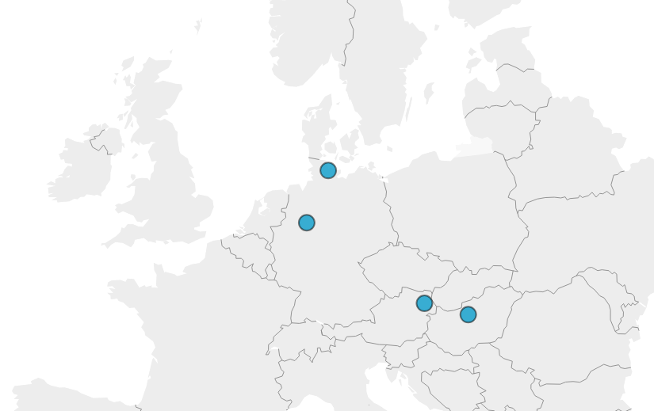
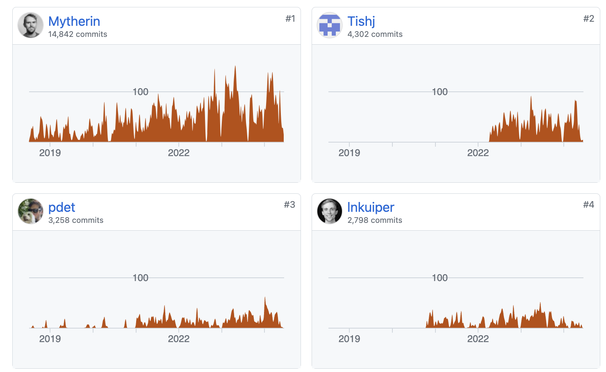
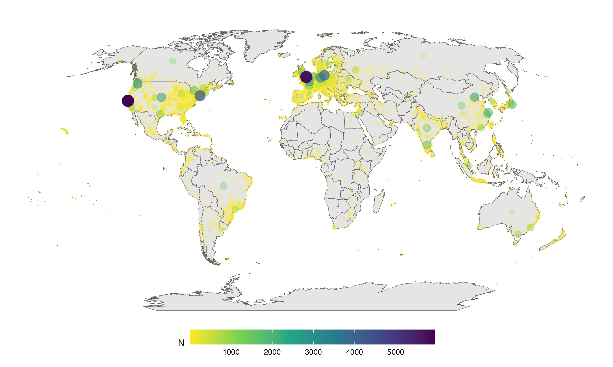
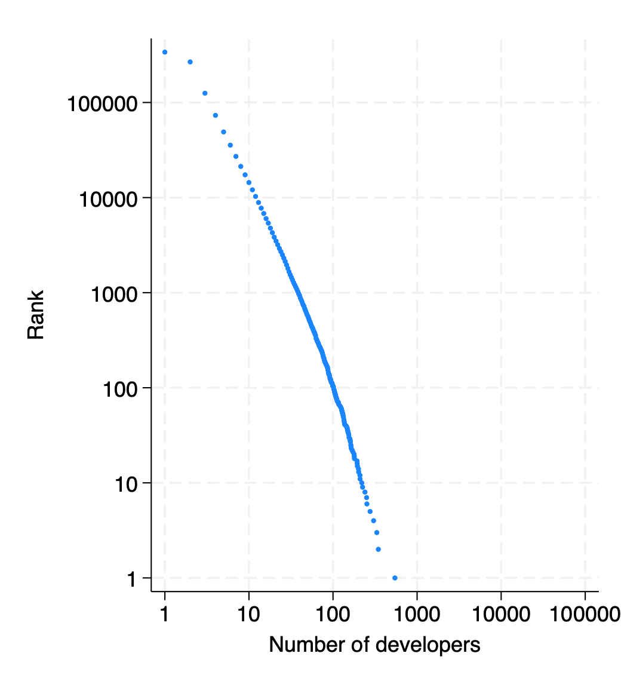
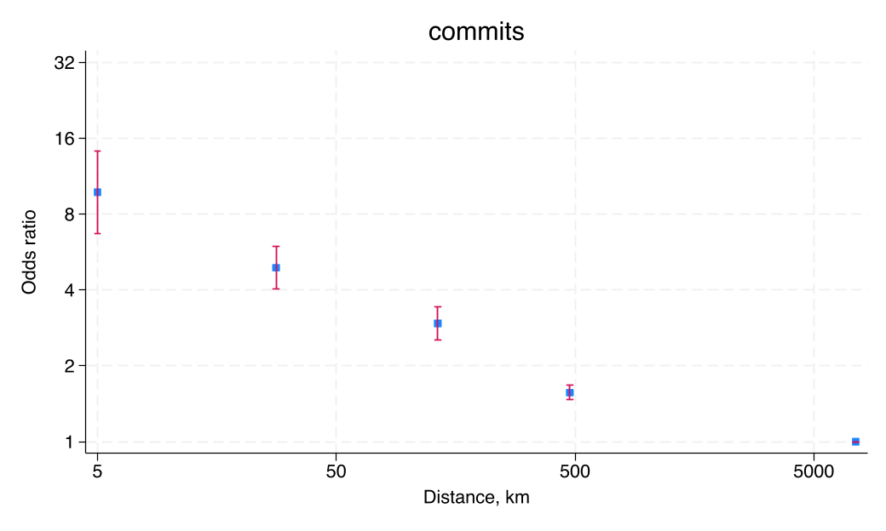
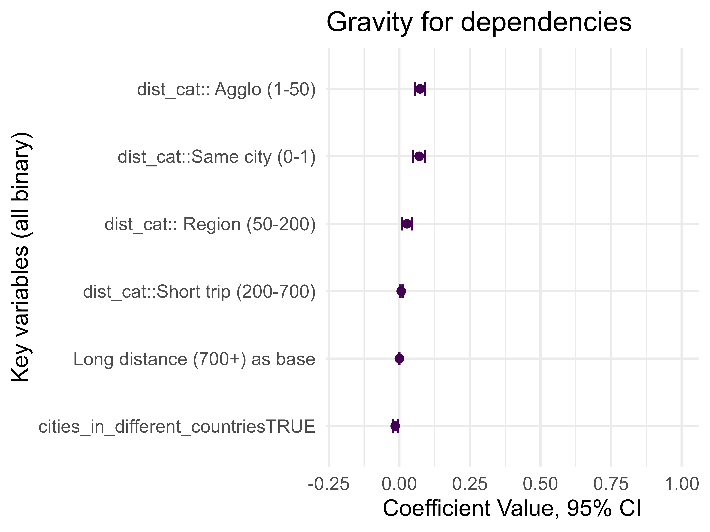
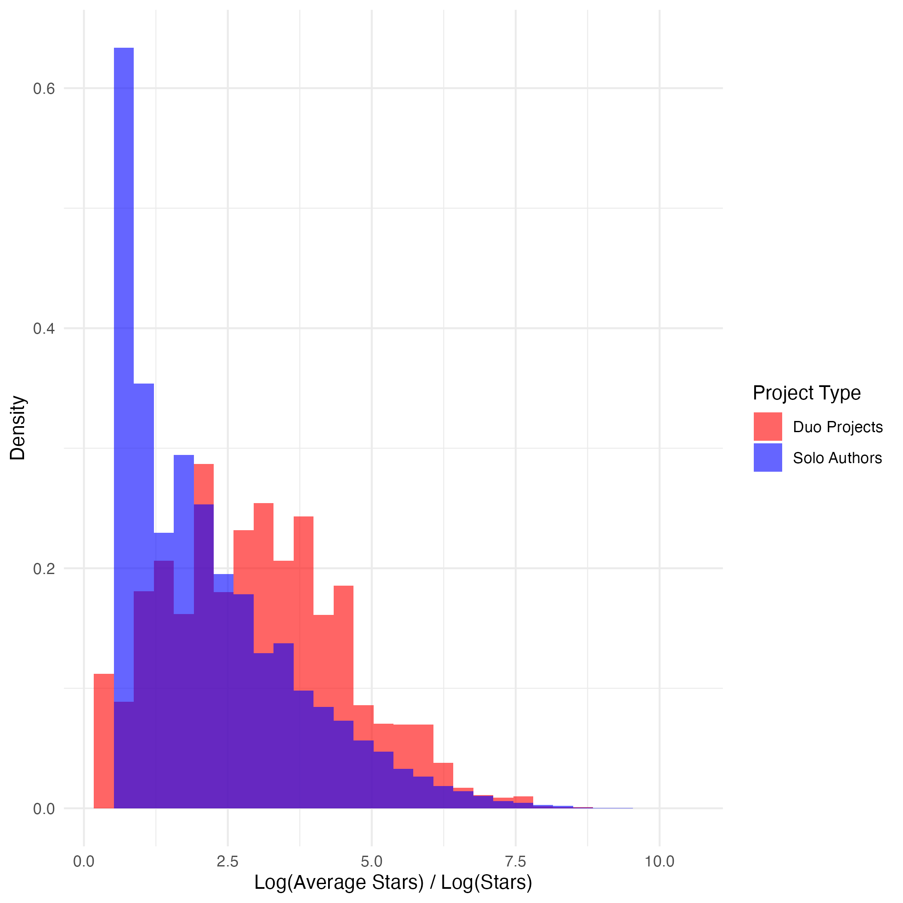
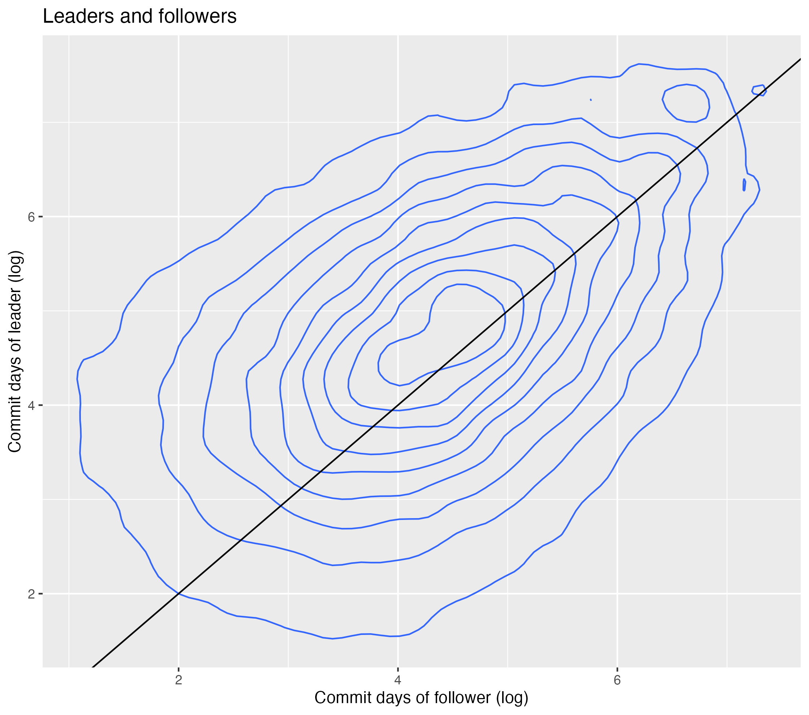
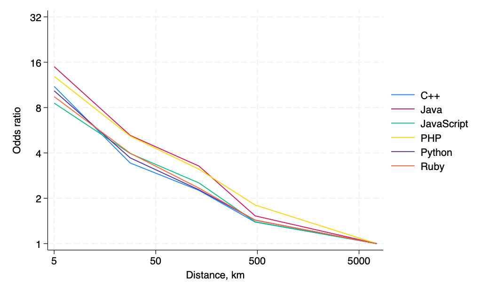

## Authors' dispersion in space

# Introduction
## Research questions
- How and where is open source software developed?
- Can spatially dispersed developers produce quality software?
- How do frictions affect collaboration and software quality?

## Two economic puzzles in open source
### Why do people work for free?
Altruism, reputation concerns, alternative business models. Sizeable economic literature.

### How can spatially dispersed developers produce quality software?

# GitHub poll

# `if (poll == "no") {`

## Why Open Source Software (OSS)?
### OSS is huge
-   Software industry -- 1% of global GDP
-   90+% of software has open source components

### OSS is everywhere
OSS plays an important roles in
-   Websites (PHP, JavaScript)
-   Operating systems (Linux, Android)
-   Data (R Tidyverse, Python Pandas, Julia)
-   Machine Learning and AI (PyTorch, LLaMA)

### OSS is observable

## A platform for sharing and discussing code

## Not all developers contribute equally

## (Many) developers report their location

## Open Source vocabulary

`Project`: A software project offering solution to a use case, a.k.a. library, package.

`Repository`: A storage for one project (what we observe)

`Commit`: The smallest unit of contribution

`Git`: Distributed version control system for software projects

`GitHub`: A platform to collaboratively work on software projects

`Dependency`: An imported project that provides a functionality

# `}`

## Related literature
-   **Geographical Distance / Network formation / Agglomeration**:
    [@chaney2014network] [@bernard2019production] [@davis2019spatial]
    [@BaileyGuptaHillenbrandEtAl2021], [@Atkin_2022_F2F]
-   **Gravity:** **Digital:** [@blum2006does] [@anderson2018dark]
-   **Frictions in services:** [@stein2007longitude]
    [@bahar2020hardships]
-   **Patents and science**: [@BircanJavorcikPauly2021],
    [@head_li_minondo_math_2019], [@jaffe1993geographic], Singh (2008)
    [@AlShebli_nature_2018], [@Li2014-patents-eer]
-   **OSS**: [@lerner2002some] , [@Laurentsyeva:2019] [@Wachs_etal_2022]
    [@fackler_hofmann_laurentsyeva_2023]

## Outline
1. Data and stylized facts about OSS production
2. A model of global team formation and collaboration
3. Test(able) implications

# Stylized facts
## Data
### GitHub
Snapshot of all public repositories on GitHub on 2019-06-01. Six largest languages: JavaScript, Python, Java, Ruby, PHP, and C++. Drop smallest and largest projects. 4.4m projects, 2.7m users. Self-reported location for about 1/3 os users.

### libraries.io
Dependency data for projects on major package managers (npm, PyPI, Maven, RubyGems, etc). 

## JavaScript developer density around the globe

## Project size and popularity
{ width=45% } { width=45% }

## Closer developers are more likely to contribute to the same project

## There is no distance penalty for *using* other's software

## Better developers build more popular software, but developers' skills are substitutes
\vspace*{-2ex}\hspace*{-2em}\input{tables/success_regressions_stars_n_stars.tex}

# Model
## Model questions
We take OSS payoffs as given. 

higher software quality $\to$ more payoff ("kudos")

1. How do teams form?
2. How do they collaborate?
3. How do they distribute kudos?

## Primitives
- Software developers vary in location, skill $Z_i$ and preference for fame $\xi_i$.
- Fixed supply of developers at each location.
- Team formation as well as collaboration across locations are costly.

## Timing
1. Two developers meet at random
    - partially observe each other's skills
2. Decide whether to do a project together
    - If not, enjoy outside option.
3. Software is developed to a certain quality.
4. Users download it, distributing kudos to developers.

## Model outline
\begin{tikzpicture}
    % Nodes
    \node[draw, rectangle] (O1) at (2, 1) {opportunity cost 1};
    \node[draw, rectangle] (J1) at (2, 3) {payoff 1};
    \node[draw, rectangle] (J2) at (2, -3) {payoff 2};
    \node[draw, rectangle] (O2) at (2, -1) {opportunity cost 2};
    \node[draw, rectangle] (T1) at (4, 2) {developer skill 1};
    \node[draw, rectangle] (T2) at (4, -2) {developer skill 2};
    \node[draw, rectangle] (F) at (6, 0) {software quality};
    \node[draw, rectangle] (K) at (10, 0) {kudos};
    
    % Edges
    \draw[->] (O1) -- (T1);
    \draw[->] (J1) -- (T1);
    \draw[->] (O2) -- (T2);
    \draw[->] (J2) -- (T2);
    \draw[->, bend right] (K) to (J1);
    \draw[->, bend left] (K) to (J2);
    \draw[->] (F) -- (K);
    \draw[->] (T1) -- (F);
    \draw[->] (T2) -- (F);
\end{tikzpicture}

## Spatial frictions
\begin{tikzpicture}
    % Nodes
    \node[draw, rectangle] (O1) at (2, 1) {opportunity cost 1};
    \node[draw, rectangle] (J1) at (2, 3) {payoff 1};
    \node[draw, rectangle] (J2) at (2, -3) {payoff 2};
    \node[draw, rectangle] (O2) at (2, -1) {opportunity cost 2};
    \node[draw, rectangle] (T1) at (4, 2) {developer skill 1};
    \node[draw, rectangle] (T2) at (4, -2) {developer skill 2};
    \node[draw, rectangle] (F) at (6, 0) {software quality};
    \node[draw, rectangle] (K) at (10, 0) {kudos};
    
    % Edges
    \draw[->] (O1) -- (T1);
    \draw[->] (J1) -- (T1);
    \draw[->] (O2) -- (T2);
    \draw[->] (J2) -- (T2);
    \draw[->, bend right, blue, line width=1mm] (K) to (J1);
    \draw[->, bend left, blue, line width=1mm] (K) to (J2);
    \draw[->] (F) -- (K);
    \draw[->, red, line width=1mm] (T1) -- (F);
    \draw[->, red, line width=1mm] (T2) -- (F);
\end{tikzpicture}

## Team composition
Project $p$ is developed by two developers with skills $Z_1$ and $Z_2$. 

Developer skill drawn from Fréchet distribution:
$$
\Pr(Z_i \le x) = e^{-T_{ip}x^{-\theta}}
$$

### Developer skill
$T_{ip}$ observable (programming language, years of experience, etc.)

$1/\theta$ captures importance of unobservable skill

## Software production function
Software quality depends on the best idea:
$$
X_p := \max \{Z_{1p}, Z_{2p}/\tau_{2p}\}
$$

### Knowledge sharing cost
$\tau_{ip} \ge 1$. Not all good ideas are heard (language, time zone, culture, clarity). 

Normalize $\tau_{1p}=1$ for presentation.

### Gravity
$$
\tau_{ip} = \text{distance}_{ip}^{\gamma_k}
$$

## Distribution of software quality
Software quality is also Fréchet. 
$$
\Pr(X_p \le x) = e^{-\Phi_p x^{-\theta}}
$$
with
$$
\Phi_p := T_{1p} + \tau_{2p}^{-\theta}T_{2p}
$$

### Testable implications
1. Larger teams produce better software.
2. Better developers produce better software.
3. Knowledge sharing frictions reduce software quality.

## Sharing kudos
Overall customer happiness increases in software quality:
$$
V_p := e^{X_p}
$$

### Attribution of kudos
The better-skilled developer gets all the kudos for $V_p$. ($\approx$ "First author bias")

## Expected developer payoff from project $p$
$$
\mathcal U_{ip} = \begin{cases}
e^{\xi_i Z_i/\tau_{ip}} & \text{if }Z_i/\tau_{ip} > Z_j/\tau_{jp}\\
0 & \text{otherwise}
\end{cases}
$$
where $\xi_i$ is a taste parameter for enjoying kudos. In expectation,
$$
U_{ip} = \text{E}\,\mathcal U_{ip} =
e^{-T_{jp}\tau_{ip}^\theta Z_i^{-\theta}}
e^{\xi Z_i/\tau_{ip}}
$$
Increases in $Z_i$, decreases in $T_{jp}$, $\tau_{ip}$.

## Team formation
Does developer $i$ join project $p$?
$$
U_{ip}(Z_i, T_{jp}, \xi_i) > \text{cost}_{i}(Z_i, d_{ip}) := e^{d_{ip}\xi_i Z_i}
$$

### Distribution cost
$d_{ip} \ge 1$. Not all benefits of distant projects can be captured (private cost of participation, time zones, misappropriate of credit).

### Gravity
$$
d_{ip} = \text{distance}_{ip}^{\gamma_s} 
$$
where $\gamma_s$ may be different from $\gamma_k$

## Join team $p$ if
$$
Z_i > \frac{\tau_{ip} T_{jp}^{1/(\theta+1)} }
{(\tau_{ip} d_{ip} - 1)^{1/(\theta+1)}} 
\xi_i^{-1/(\theta+1)}
$$

### Selection
1. Better skilled developers are more likely to join.
2. Spatial frictions reduce team formation.
3. Projects with high-skilled developers are more selective. 

## Fréchet magic
Assume $Z_i$ is Fréchet with parameters $T_i$ and $\theta$, 

$\xi_i$ is Weibull with $\kappa$ and $\theta/(\theta+1)$. Then
$$
\Pr(Z_i \le x | i\text{ joins project }p) = e^{-T_{ip}x^{-\theta}}
$$
with
$$
T_{ip} = T_i + \frac1\kappa \frac{\tau_{ip}^\theta T_{jp}^{\theta/(\theta+1)} }
{(\tau_{ip} d_{ip} - 1)^{\theta/(\theta+1)}}
$$

## Closing the model
Both developers want to join, knowing what to expect from the other.

### Mutual coincidence of wants
$$
\begin{aligned}
T_{1p} & = T_1 + \frac1\kappa \frac{T_{2p}^{\theta/(\theta+1)} }
{(d_{1p} - 1)^{\theta/(\theta+1)}} \\
T_{2p} &= T_2 + \frac1\kappa \frac{\tau_{2p}^\theta T_{1p}^{\theta/(\theta+1)} }
{(\tau_{2p} d_{2p} - 1)^{\theta/(\theta+1)}}
\end{aligned}
$$

### Team forms with probability
$$
\frac{T_1}{T_{1p}}
\frac{T_2}{T_{2p}}
$$

# Testable predictions
## Testable predictions
### Gravity of team formation
1. Distant developers are less likely to join a team.

### Knowledge production
2. Two-person projects are better than one-person projects.
3. Projects with better developers are more successful.
4. Project success depends disproportionately on "lead developer."

### Assortative matching
5. Skilled developers team up with skilled developers.

### Selection
6. Projects with distant developers are more successful.
7. But not if we condition on developer skill.

# Results
## Measuring skill and quality
### Developer skill
1. Commits in other projects
2. Days worked on other projects
3. Total stars on other projects

### Software quality
1. Number of stars
2. Number of downstream libraries

## Two-person projects have better developers

## Leaders are better than followers

# Collaboration in space
## Gravity model of collaboration
Developer $i$ and $j$ collaborate with probability
$$
\Pr(\text{Collaboration}_{ij}) = \exp(\alpha_i + \beta_j -\gamma\times\text{distance}_{ij})
$$
Aggregate across city pairs $d$ and $o$:
$$
E(N_{do,\text{collab}}) = N_o\times N_d\times\exp(\tilde\alpha_d + \tilde\beta_o -\gamma\times\text{distance}_{do})
$$
Estimate this with Poisson maximum likelihood.

## Gravity of team formation across languages

## Frictions reduce work but increase quality
\vspace*{-2ex}\hspace*{-2em}\input{tables/diversity_R.tex}

# Conclusion
1. Tractable modle of global team formation and collaboration.
2. Team formation in OSS is highly localized.
3. Spatial diversity is associated with higher quality of work.

## Get in touch
@GaborBekes, @JulianHinz, @korenmiklos
