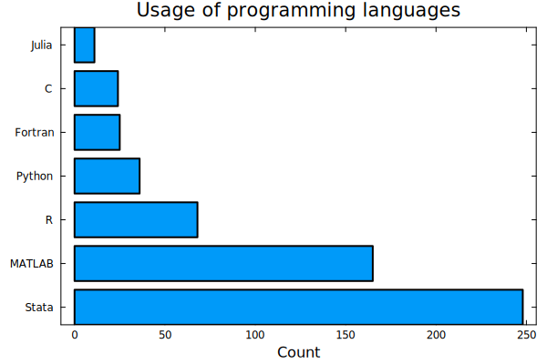
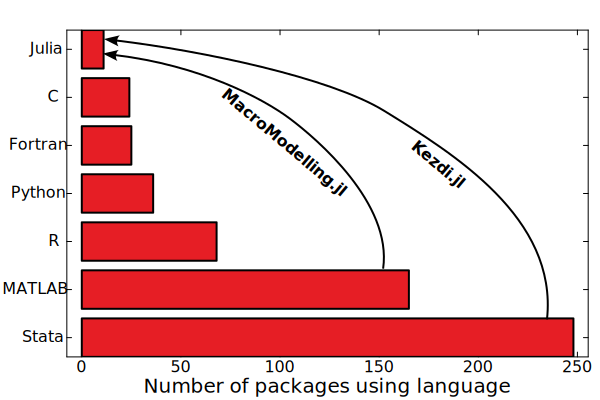
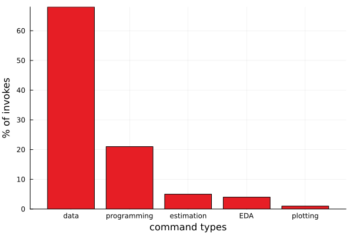
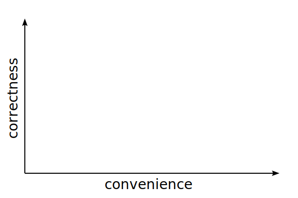
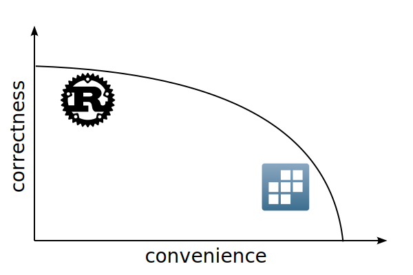
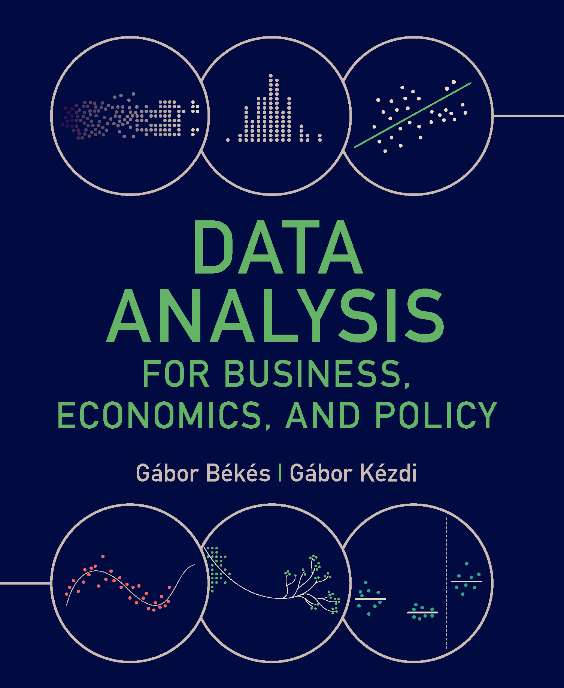

## Who am I?
### Help economists adopt computing best practices to maximize their scientific impact
::: {.columns}
::: {.column width="60%"}
| Economist | ceu.edu |
|-----|-------|
| Data editor | restud.com |
| Developer | thnk.ng |
:::

::: {.fragment .column width="40%"}
| Stata®    | 1997  |
|----------|-------|
| Python   | 2003  |
| Julia    | 2015  |
:::
:::


# What do economists do?

## They don't use Julia


## Aspirations


## What is Stata?
::: {.columns}
::: {.column}
### Stata
```stata
use "trade.dta"

replace distance = 5 if distance < 5
generate log_trade = log(trade)
generate log_distance = log(distance)

regress log_trade log_distance, robust
```
:::
::: {.column}
### vs
```python
import pandas as pd
import math
import statsmodels.api as sm
import statsmodels.formula.api as smf

df = pd.read_stata("trade.dta")
df.loc[df['distance'] < 5, 'distance'] = 5
df['log_trade'] = df['trade'].apply(math.log)
df['log_distance'] = df['distance'].
    apply(math.log)

model = smf.ols('log_trade ~ log_distance', 
    data=df).fit(cov_type='HC3')
print(model.summary())
```
:::
:::

## The vast majority of commands are for data manipulation


# Tradeoffs in user interface design

## 


##


## What do users want?

## The Production Possibilities Frontier


## The Production Possibilities Frontier



# Features of Kezdi.jl
## Command syntax is $\approx$exactly like in Stata
::: {.columns}
:::: {.column}
### Stata
```stata
use "trade.dta"

replace distance = 5 if distance < 5
generate log_trade = log(trade)
generate log_distance = log(distance)

regress log_trade log_distance, robust
```
::::
:::: {.column}
### Kezdi.jl
```julia
@use "trade.dta"

@replace distance = 5 @if distance < 5
@generate log_trade = log(trade)
@generate log_distance = log(distance)

@regress log_trade log_distance, robust
```
::::
:::

:::{.fragment}
### Note
1. Every command is a macro. So is row-level `@if`. Options are given with `, option`
3. Variable names refer to column names in the *default* DataFrame
4. Function calls are vectorized automatically
:::

## More idiomatic version of the same code
::: {.columns}
:::: {.column}
```julia
@use "trade.dta"

@replace distance = 5 @if distance < 5
@generate log_trade = log(trade)
@generate log_distance = log(distance)

@regress log_trade log_distance, robust
```
::::
:::: {.column}
```julia
df = @use "trade.dta"

results = @with df begin 
  @replace distance = 5 @if distance < 5
  @regress log(trade) log(distance), robust
end
```
::::
:::

:::{.fragment}
### Note
Use the former for interactive exploration in the REPL,<br> the latter for scripts.
:::


## Every command can operate on a subset of rows
::: {.columns}
:::: {.column}
```julia
@keep @if !ismissing(distance)
@replace distance = 5 @if distance < 5
@regress log(trade) log(distance)↩
  @if distance > 100, robust
@collapse mean_distance = mean(distance)↩
  @if distance < 100
```
::::
:::: {.column}
:::{.fragment}
### Note
1. Useful for quick data exploration
2. In `@if`, `missing` is `false` 
3. `@replace x = 4.99 @if x == 5` changes `eltype` 
::::
:::
:::

## Handling missing values
## Handling missing values
::: {.columns}
:::: {.column-wide}
Given the DataFrame on the right, can you guess the output of
```julia
@collapse sum_x = sum(x)
```
:::: {.fragment}
```julia
1×1 DataFrame
 Row │ sum_x
     │ Int64
─────┼───────
   1 │     7
```
::::
::::
:::: {.column-narrow}
```julia
4×1 DataFrame
 Row │ x
     │ Int64?
─────┼─────────
   1 │       1
   2 │       2
   3 │ missing
   4 │       4
```
::::
:::

## Handling missing values
::: {.columns}
:::: {.column-wide}
Given the DataFrame on the right, can you guess the output of
```julia
@keep @if x < 3
```
:::: {.fragment}
```julia
2×1 SubDataFrame
 Row │ x
     │ Int64?
─────┼────────
   1 │      1
   2 │      2
```
::::
::::
:::: {.column-narrow}
```julia
4×1 DataFrame
 Row │ x
     │ Int64?
─────┼─────────
   1 │       1
   2 │       2
   3 │ missing
   4 │       4
```
::::
:::


## Proper data structures
::: {.columns}
:::: {.column-wide}
```julia
@generate n_terms = length.(split(text, ","))
```
:::: {.fragment}
```julia
3×2 DataFrame
 Row │ text    n_terms
     │ String  Int64
─────┼─────────────────
   1 │ a,b           2
   2 │ c,d,e         3
   3 │ f             1
```
::::
::::
:::: {.column-narrow}
```julia
3×1 DataFrame
 Row │ text
     │ String
─────┼────────
   1 │ a,b
   2 │ c,d,e
   3 │ f
```
::::
:::


## User-defined functions
::: {.columns}
:::: {.column-wide}
```julia
count_terms(text) = length(split(text, ","))
count_terms(x) = sum(count_terms.(x))
```
:::: {.fragment}
```julia
julia> @generate n_terms = count_terms.(text)

3×2 DataFrame
 Row │ text    n_terms
     │ String  Int64
─────┼─────────────────
   1 │ a,b           2
   2 │ c,d,e         3
   3 │ f             1
```
::::
:::: {.fragment}
```julia
julia> @collapse sum_terms = DNV(count_terms(text))

1×1 DataFrame
 Row │ sum_terms
     │ Int64
─────┼───────────
   1 │         6
```
::::
::::
:::: {.column-narrow}
```julia
3×1 DataFrame
 Row │ text
     │ String
─────┼────────
   1 │ a,b
   2 │ c,d,e
   3 │ f
```
::::
:::


# Roadmap
##
```julia
pkg> add Kezdi
   Resolving package versions...
   Installed Kezdi ─ v0.4.7
```

[](https://codedthinking.github.io/Kezdi.jl/stable/)
[](https://codedthinking.github.io/Kezdi.jl/dev/)
[](https://github.com/codedthinking/Kezdi.jl/actions/workflows/CI.yml?query=branch%3Amain)
[](https://codecov.io/gh/codedthinking/Kezdi.jl)

## Roadmap
### Statistics
- Current dependency is FixedEffectModels.jl (@matthieugomez)
- We will add support for nonlinear models (GLM.jl) with many fixed effects (GLFixedEffectModels.jl)
- Checks against Stata edge cases (multicollinearity, missing values)
- RegressionTables.jl or SummaryTables.jl for output formatting
- Wald testing

### Data wrangling
- Obvious next steps: `@merge`, `@append`, `@reshape`
- Annotating variable names and values: `@label`, `@encode`
- Variable name handling
- Performance improvements (**help needed**): CSV.jl/CSVFiles.jl, StatFiles.jl

## Programming convenience
- Set risk tolerance for users (Preferences.jl?)
- Allow for variable to be passed into `@with`
```julia
@with scalars(min_dist, y) df begin
  @replace distance = min_dist @if distance < min_dist
  for y = 2000:2020
    @regress log(trade) log(distance) @if year == y, robust
  end
end
```

# Acknowledgements
## Inspiration
::: {.columns}
:::: {.column}
### Tidier.jl
{ width=30% }

Tidyverse $\to$ Julia
::::
:::: {.column}
### Douglass.jl
Johannes Boehm

Stata $\to$ Julia
::::
:::

## Acknowledgements
| **Who** | **What** |
|-----|-------|
| @bkamins | DataFrames.jl |
| @matthieugomez | FixedEffectModels.jl |
| @davidanthoff | StatFiles.jl |
| @nalimilan | FreqTables.jl |

## Why Kezdi?
::: {.columns}
:::: {.column}
### Gábor Kézdi (1971-2021)


kezdigabor.life
::::
:::: {.column}
### 


gabors-data-analysis.com
::::
:::

# Feedback and contributions welcome
## Feedback and contributions welcome
@korenmiklos

@gergeleyattilakiss

thnk.ng/kezdi.jl