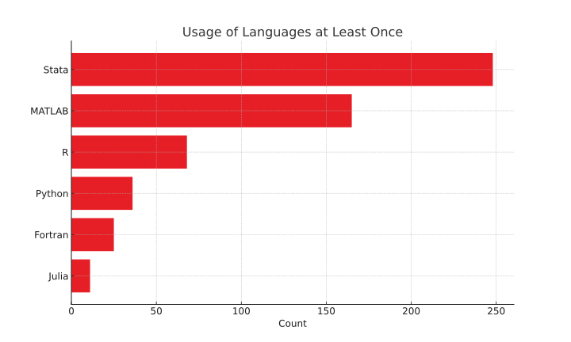

## Who am I?
::: {.columns}
::: {.column width="60%"}
| **Who** | **Where** |
|-----|-------|
| Economist | ceu.edu |
| Data editor | restud.com |
| Software Developer | thnk.ng |
:::

::: {.fragment .column width="40%"}
| **Language** | **Since** |
|----------|-------|
| Stata®    | 1997  |
| Python   | 2003  |
| Julia    | 2015  |
:::
:::


# What do economists do?

##


## They don't use Julia

## They use multiple languages

## What is Stata?
::: {.columns}
::: {.column}
### Stata
```stata
use "trade.dta"

replace distance = 5 if distance < 5
generate log_trade = log(trade)
generate log_distance = log(distance)

regress log_trade log_distance, robust
```
:::
::: {.column}
### vs
```python
import pandas as pd
import math
import statsmodels.api as sm
import statsmodels.formula.api as smf

df = pd.read_stata("trade.dta")
df.loc[df['distance'] < 5, 'distance'] = 5
df['log_trade'] = df['trade'].apply(math.log)
df['log_distance'] = df['distance'].
    apply(math.log)

model = smf.ols('log_trade ~ log_distance', 
    data=df).fit(cov_type='HC3')
print(model.summary())
```
:::
:::

## What commands do economists use?

# Tradeoffs in user interface design

## 


<div class="slide-footer">
    Image credit: <a href="https://example.com">example.com</a>
    Link to slides: <a href="https://example.com/slides">example.com/slides</a>
</div>

##


## What do users want?
1. convenience
2. correctness

## The Production Possibilities Frontier


- Rust: static typing, memory safe
- ChatGPT: convenient, may or may not be correct

## Good example: row-level `if`
```stata
replace distance = 5 if distance < 5
```

## Bad example: implicit variable abbreviation:
```stata
summarize gdp_per_capita
regress gdp population
```

# Features of Kezdi.jl

## Command syntax is $\approx$exactly like in Stata
::: {.columns}
:::: {.column}
### Stata
```stata
use "trade.dta"

replace distance = 5 if distance < 5
generate log_trade = log(trade)
generate log_distance = log(distance)

regress log_trade log_distance, robust
```
::::
:::: {.column}
### Kezdi.jl
```julia
@use "trade.dta"

@replace distance = 5 @if distance < 5
@generate log_trade = log(trade)
@generate log_distance = log(distance)

@regress log_trade log_distance, robust
```
::::
:::

:::{.fragment}
### Note
1. Every command is a macro. So is row-level `@if`. Options are given with `, option`
3. Variable names refer to column names in the *default* DataFrame
4. Function calls are vectorized automatically
:::

## More idiomatic version of the same code
::: {.columns}
:::: {.column}
```julia
@use "trade.dta"

@replace distance = 5 @if distance < 5
@generate log_trade = log(trade)
@generate log_distance = log(distance)

@regress log_trade log_distance, robust
```
::::
:::: {.column}
```julia
df = @use "trade.dta"

results = @with df begin 
  @replace distance = 5 @if distance < 5
  @regress log(trade) log(distance), robust
end
```
::::
:::

:::{.fragment}
### Note
Use the former for interactive exploration in the REPL,<br> the latter for scripts.
:::


## Every command can operate on a subset of rows
::: {.columns}
:::: {.column}
```julia
@keep @if !ismissing(distance)
@replace distance = 5 @if distance < 5
@regress log(trade) log(distance)↩
  @if distance > 100, robust
@collapse mean_distance = mean(distance)↩
  @if distance < 100
```
::::
:::: {.column}
:::{.fragment}
### Note
1. Useful for quick data exploration
2. In `@if`, `missing` is `false` 
3. `@replace x = 4.99 @if x == 5` changes `eltype` 
::::
:::
:::

## Handling missing values
::: {.columns}
:::: {.column}
Given the DataFrame on the right, can you guess the output of
```julia
@collapse sum_x = sum(x)
```
:::: {.fragment}
```julia
1×1 DataFrame
 Row │ sum_x
     │ Int64
─────┼───────
   1 │     7
```
::::
::::
:::: {.column}
```julia
4×1 DataFrame
 Row │ x
     │ Int64?
─────┼─────────
   1 │       1
   2 │       2
   3 │ missing
   4 │       4
```
::::
:::

## Handling missing values
::: {.columns}
:::: {.column}
Given the DataFrame on the right, can you guess the output of
```julia
@keep @if x < 3
```
:::: {.fragment}
```julia
2×1 SubDataFrame
 Row │ x
     │ Int64?
─────┼────────
   1 │      1
   2 │      2
```
::::
::::
:::: {.column}
```julia
4×1 DataFrame
 Row │ x
     │ Int64?
─────┼─────────
   1 │       1
   2 │       2
   3 │ missing
   4 │       4
```
::::
:::


## Proper data structures
::: {.columns}
:::: {.column}
```julia
@generate n_terms = length.(split.(text))
```
:::: {.fragment}
```julia
3×2 DataFrame
 Row │ text    list
     │ String  Array…
─────┼──────────────────────────────────
   1 │ a,b     SubString{String}["a,b"]
   2 │ c,d     SubString{String}["c,d"]
   3 │ e,f     SubString{String}["e,f"]
```
::::
::::
:::: {.column}
```julia
3×1 DataFrame
 Row │ text
     │ String
─────┼────────
   1 │ a,b
   2 │ c,d,e
   3 │ f
```
::::
:::


## User-defined functions

## Roadmap
### Data wrangling
### Programming convenience
### Statistics

# Acknowledgements