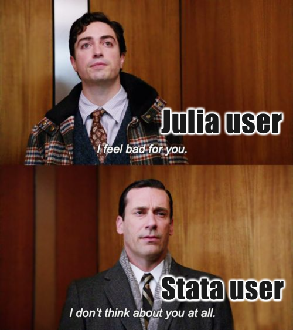
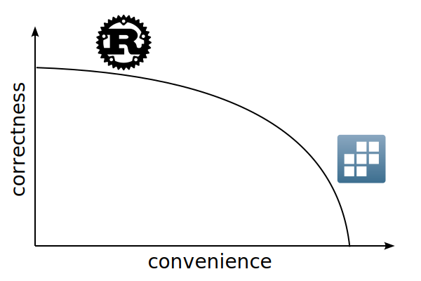

## Who am I?
::: {.columns}
::: {.column}
| **Who** | **Where** |
|-----|-------|
| Economist | ceu.edu |
| Data editor | restud.com |
| Software Developer | thnk.ng |
:::

::: {.column}
| **Language** | **Since** |
|----------|-------|
| Stata®    | 1997  |
| Python   | 2003  |
| Julia    | 2015  |
:::
:::


# What do economists do?

##


## They don't use Julia

## They use multiple languages

## What is Stata?
::: {.columns}
::: {.column}
### Stata
```stata
use "trade.dta"

replace distance = 5 if distance < 5
generate log_trade = log(trade)
generate log_distance = log(distance)

regress log_trade log_distance, robust
```
:::
::: {.column}
### vs
```python
import pandas as pd
import math
import statsmodels.api as sm
import statsmodels.formula.api as smf

df = pd.read_stata("trade.dta")
df.loc[df['distance'] < 5, 'distance'] = 5
df['log_trade'] = df['trade'].apply(math.log)
df['log_distance'] = df['distance'].
    apply(math.log)

model = smf.ols('log_trade ~ log_distance', 
    data=df).fit(cov_type='HC3')
print(model.summary())
```
:::
:::

## What commands do economists use?

# Tradeoffs in user interface design

## 


##


## What do users want?
1. convenience
2. correctness

## The Production Possibilities Frontier


- Rust: static typing, memory safe
- ChatGPT: convenient, may or may not be correct

## Good example: row-level `if`
```stata
replace distance = 5 if distance < 5
```

## Bad example: implicit variable abbreviation:
```stata
summarize gdp_per_capita
regress gdp population
```

# Features of Kezdi.jl

## Command syntax is $\approx$exactly like in Stata
::: {.columns}
:::: {.column width="34%"}
```julia
@use "trade.dta"
@replace distance = 5 @if distance < 5
@generate log_trade = log(trade)
@generate log_distance = log(distance)
@regress log_trade log_distance, robust
```
::::
:::: {.column width="66%"}
### Notes
1. Commands are macros
2. Variable names refer to column names in the *default* DataFrame
3. Function calls are vectorized automatically
4. Options are given with `, option`
::::
:::

## Every command can operate on a subset of rows
```julia
@keep @if !ismissing(distance)
@replace distance = 5 @if distance < 5
@regress log_trade log_distance @if exporter_country != importer_country, robust
```

### Notes

## Handling missing values
Given a DataFrame
```julia
 Row │ x
   1 │       1
   2 │       2
   3 │ missing
   4 │       4
```
can you guess the output of
```julia
@collapse mean_x = mean(x)
@keep @if x < 3
```


## Proper data structures

## User-defined functions

## Roadmap
### Data wrangling
### Programming convenience
### Statistics

# Acknowledgements