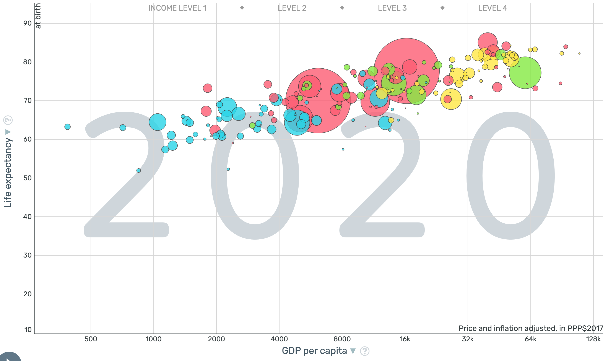

# A summary of the degrowth argument
1. An ever-growing economy leads to ever-growing consumption of resources and ever-growing pollution.
2. Hitting planetary boundaries will lead to catastrophic consequences.
3. Therefore, we need to stop/slow economic growth, focus on well-being instead.
4. 

# Points of agreement
## Need for radical changes

> And you better start swimmin'

> Or you'll sink like a stone

> For the times they are a-changin'

>    (The times they are a-changin', Bob Dylan)

## Markets cannot solve everything

## Decoupling is a tough problem

##

##

##

# Can we "decouple" economic growth from increasing harm?

##

##

##

# CO2 emissions have not decoupled from economic growth
##

##

##

# No evidence of decoupling desirable outcomes, either
##

##

##

# A case of a global, catastrophic event

Covid response:
- stay at home
- wear a mask
- get vaccinated

# Credits

Photos by <a href="https://unsplash.com/@illiyapresents?utm_content=creditCopyText&utm_medium=referral&utm_source=unsplash">Illiya Vjestica</a>, <a href="https://unsplash.com/@cesiraalvarado?utm_content=creditCopyText&utm_medium=referral&utm_source=unsplash">Cesira Alvarado</a>, <a href="https://unsplash.com/@pray4bokeh?utm_content=creditCopyText&utm_medium=referral&utm_source=unsplash">Bruno Guerrero</a>, and  <a href="https://unsplash.com/@mahrous_houses?utm_content=creditCopyText&utm_medium=referral&utm_source=unsplash">Mahrous Houses</a> on <a href="https://unsplash.com/photos/black-flat-screen-tv-turned-on-near-brown-brick-wall-GHX68AmE1gQ?utm_content=creditCopyText&utm_medium=referral&utm_source=unsplash">Unsplash</a>
