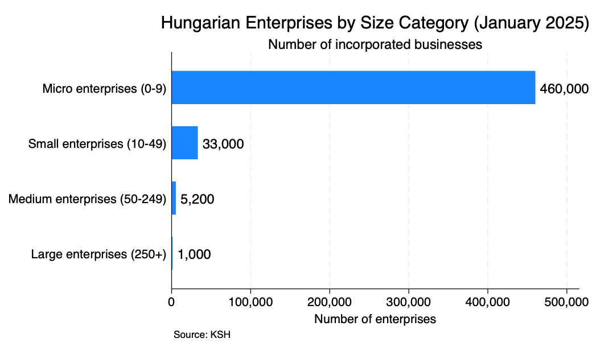
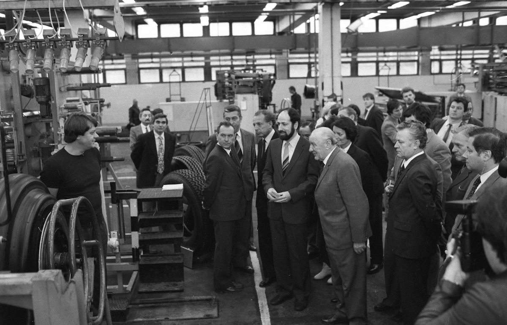
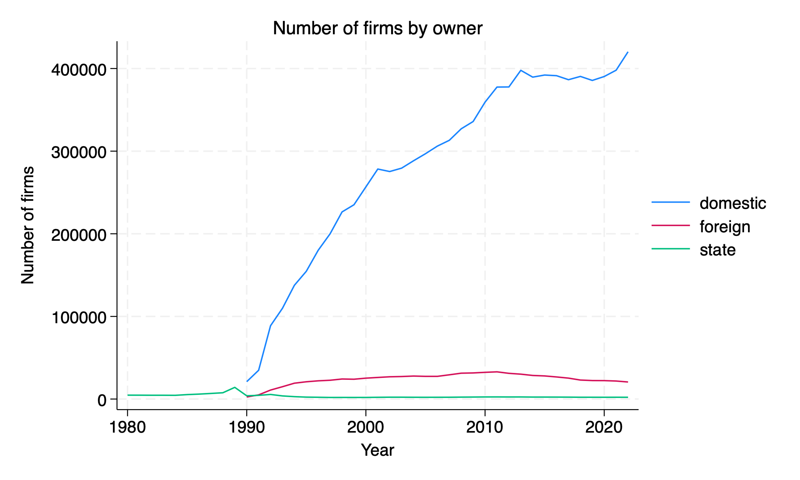
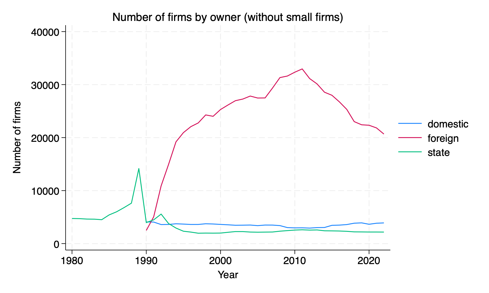
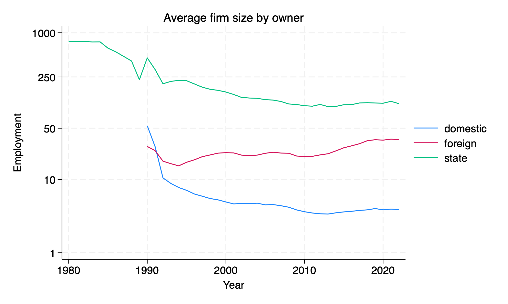
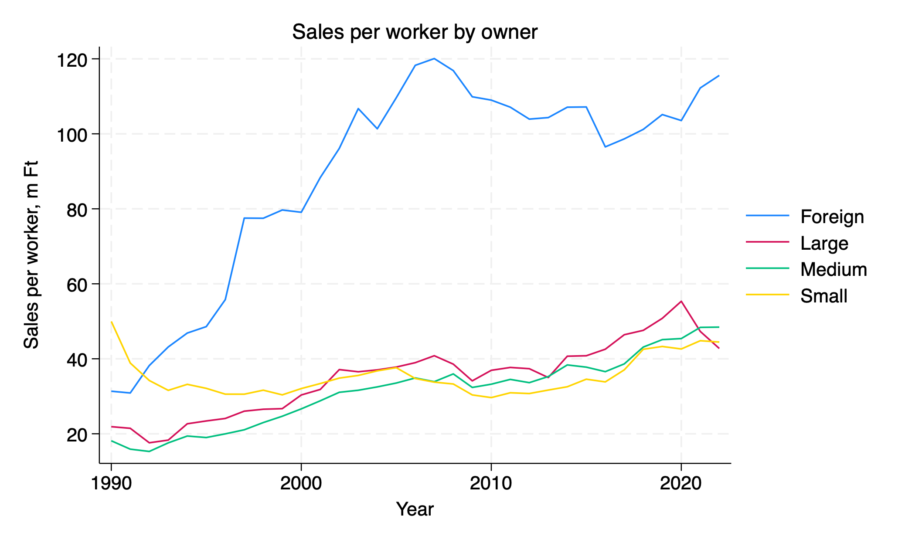
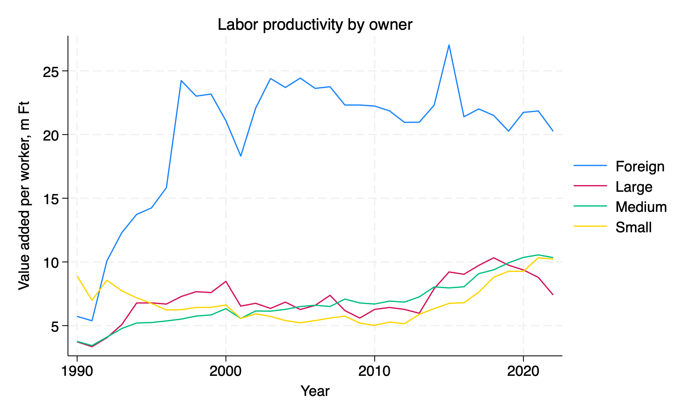
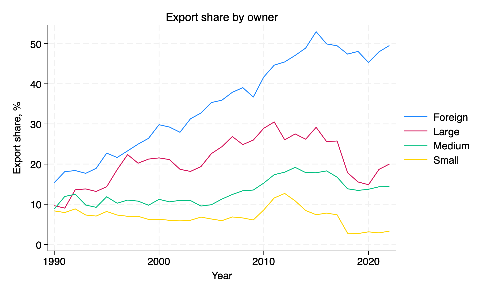
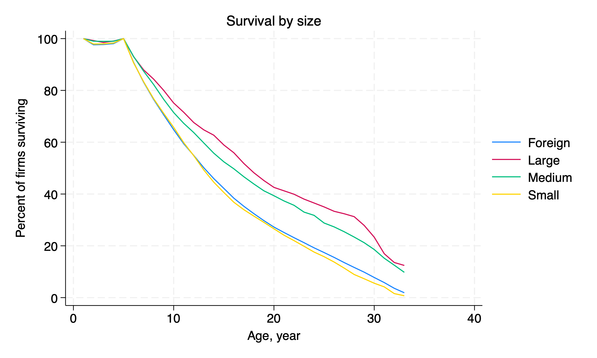
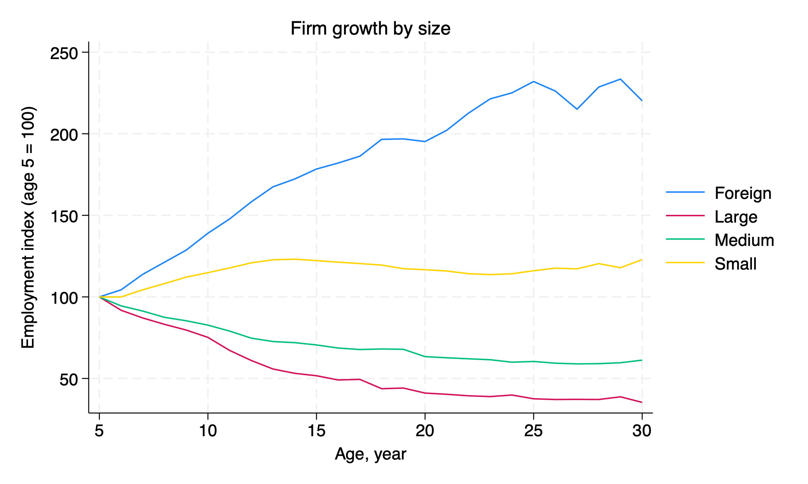

# Politicians love small businesses

# Current snapshot
## Size distribution of enterprises

## Politicians love small businesses
In addition, 1.3 **million** solo entrepreneurs.

SMEs **employ** two-thirds of all private sector workers. 

With an average family size of 2.3, at least 4 million people—a significant portion of Hungary's population—live in households that **own** a small business.

## The emergence of private enterprise in Hungary

**1980s:** The economy was dominated by approximately 1,000 "corporations" and 4,000 "cooperatives" (large socialist enterprises)

**1983 onwards:** Between 1,000 and 7,000 GMKs ("economic partnerships") emerged as a form of spinoff microenterprise

**1988:** New corporate law introduced, total businesses reached 25,000

**1990:** Business count increased to 60,000

**1992:** Following new bankruptcy and corporate laws, total businesses surged to 164,000

## Hungary, 1980 (Fortepan / Szalay Zoltán)

## Hungary, 1990 (MTI)

## Extreme growth in entrepreneurship

## Most dynamism in foreign firms

## Domestic firms remain very small

# The dual economy
## Foreign firms are something else

## Large gaps in labor productivity

GDP per worker over time

## Widening gap in export share

# Why don't small firms develop?
## Business survival is very similar

## But foreign firms grow faster

# Ongoing research

