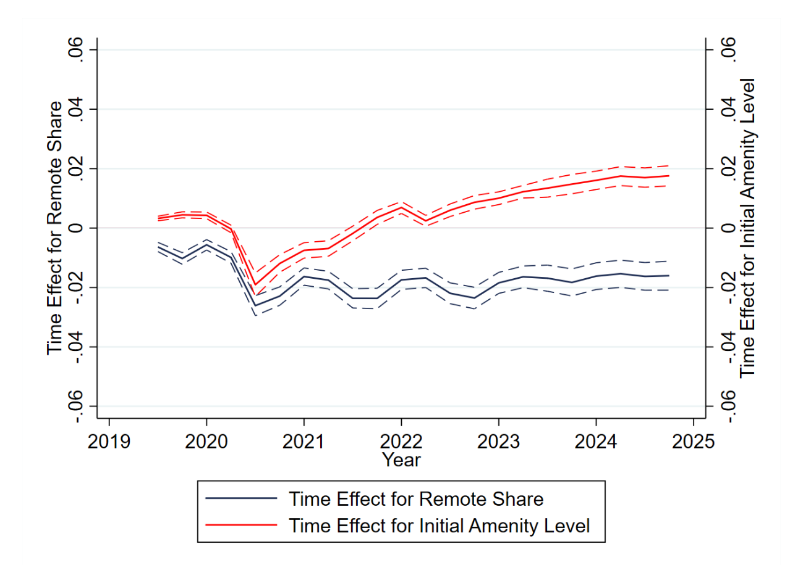

## "8 óra munka, 8 óra pihenés, 8 óra szórakozás" (Beatrice, 1991)

## Working from home remained, but amenity visits came back

## How does working from home affect demand from amenities?

\begin{center}
\begin{tabular}{l|c|c}
\hline
                        & Urban & Suburban \\
\hline
Lower commuting time    & $+$   & $+$      \\
More time at home       & $-$   & $+$      \\
More people around      & $\sim$& $+$      \\
Lower rents             & $+$   & $-$      \\
\hline
\end{tabular}
\end{center}

## Is demand for amenities homothetic?
People will spend more time (and money) on amenities.

\pause

But why urban amenities?

- non-homothetic preferences
- minimum scale / density
- space matters: one "urban," many "suburban"

## Recommendations
Explore mechanisms that can make urban amenities *relatively* more attractive.

- How does the "amenity gradient" change with population density after remote work?
- Do amenity visit patterns vary with city structure (mono- vs. polycentric)?
- Separate amenity trips by strength of agglomeration economies (e.g., shopping vs. dining vs. theater).