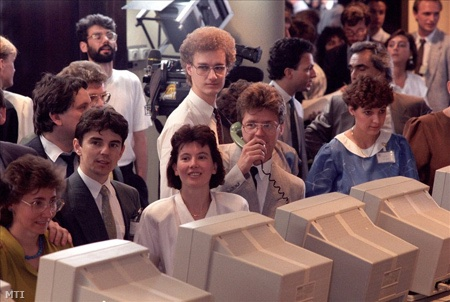
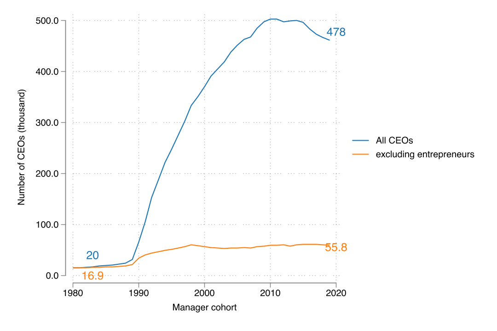
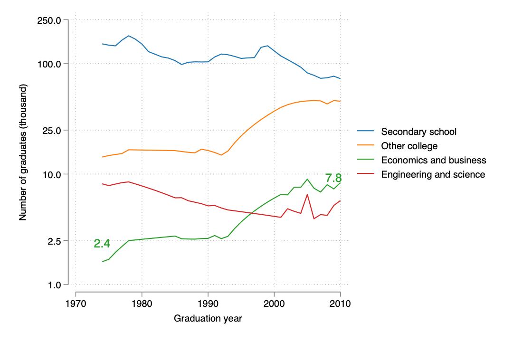
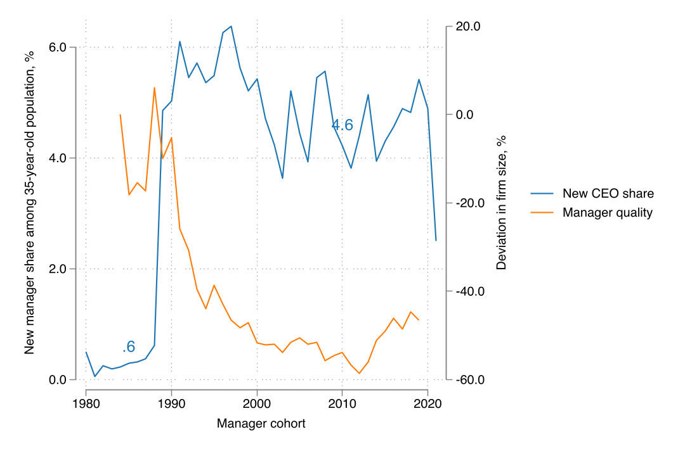
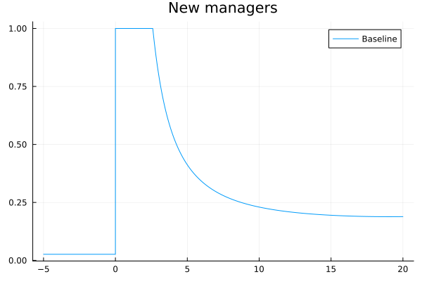
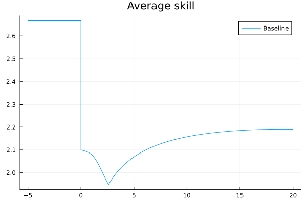
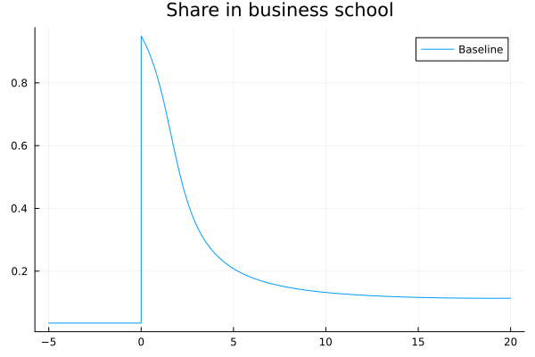
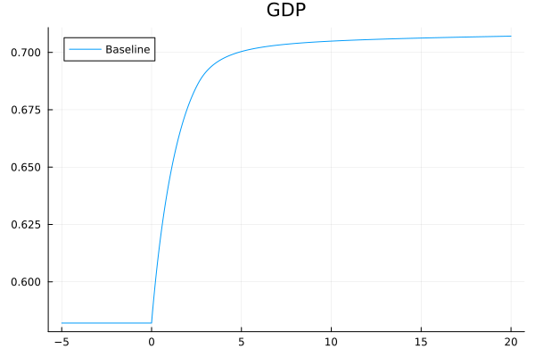
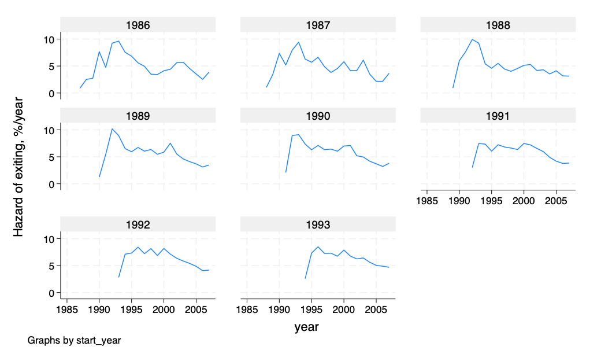

---
author:
    - Miklós Koren (CEU, KRTK, CEPR and CESifo)
    - Krisztina Orbán (Monash)
title: "Are Good Managers Scarce? Evidence from the Hungarian Transition"
date: June 28, 2025
aspectratio: 1610
lang: en
titlepage: true
---
# Acknowledgements
::: {.columns}
:::: {.column width=50%}

::::
:::: {.column width=50%}

::::
:::

This research was funded by the European Research Council (ERC Advanced Grant agreement number 101097789) and by the National Research, Development and Innovation Office (Forefront Research Excellence Program contract number 144193). The views expressed in this project are those of the authors and do not necessary reflect the official view of the European Union, the European Research Council, or the National Research, Development and Innovation Office.

# Introduction

## Hungary, 1980 (Fortepan / Szalay Zoltán)

## Hungary, 1990 (MTI)

## Number of Executive Positions Increased

## Business Degrees Became More Prominent

## What Can We Learn From Hungary?

Use Hungarian post-socialist transition as a natural experiment to study the supply side of the market for managers.

## Why Micro $\neq$ Macro
### What we know 
1. Management matters
2. Training works
3. Managers matter

\pause

### What we don't know
1. What policy interventions can improve management for an entire country?
2. How to quantify the macro effects of these policies?

\pause

### What we need
1. Endogenous supply: how to incentivize people to become managers?
2. Selection: who will become managers?
3. Competition: what are the GE feedbacks of interventions?

# Setup and Data
## Data
### Manager Data 1985-2019
Universe of corporations (1m) and their CEOs (1.3m). 

### Firm Financials 1985-2019
Firm size (employment) as proxy for manager quality.

### Manager Wages 2002-2017 
(not yet used) Annual earnings of 50 percent of workers (including managers).

## Quantity Up, Quality Down

# Outline
## Outline 
1. A steady-state model of manager selection
2. Managers and entrepreneurs
3. Transition dynamics
4. Calibration and counterfactuals (WIP)

# An Equilibrium Model of Managers
## An Equilibrium Model of Managers
1. Managers differ in innate skill
2. Returns to manager skill subject to corporate governance friction
3. Self-selection into management
4. Wages determined in equilibrium

## Production Function
A manager with skill $z$ can hire $l$ workers to produce output 
$$q = (A z)^\nu l^{1-\nu}.$$ 

\pause

Aggregate GDP: 
$$Y = (AZ)^\nu {L^{p}}^{1-\nu}$$
with sum of manager skills
$$Z = N\cdot \tilde z = N\cdot\int\! z dG(z)$$ 

\pause

Policy goal: Increase $Z$ via either $N$ (more managers) or $\bar z$ (better training).

## Corporate Governance Friction
Operating surplus,
$$\Pi(z) = q(z) - w l(z) = z \pi(w) $$
linear in $z$. Worker wage ($w$) is endogenous.
\pause

### Owners cannot commit to sharing more than a fraction of surplus.

Manager wage is
$$
\omega(z) \le \phi \Pi(z) = \phi z \pi(w) 
$$
with $\phi < 1$. 

### Underprovision of manager skills.

## Career Choice and Skill Supply

Manager if $\omega(z) > w$,
$$ z > z_{\min}(Z).$$ 

Supply of manager skills is Pareto
$$\Pr(z > z_{\min}) = z_{\min}^{-\theta}z_0^\theta$$

$$
\text E(z) := z_* = \frac{\theta}{\theta-1}z_0
$$

## Labor Market Clearing
$$
N + L_p = L
$$

$$
n := \frac NL
$$

## Aggregate GDP
$$
\frac YL = 
(Az_*)^\nu
n^{\nu(1-1/\theta)}
(1-n)^{1-\nu}
$$

Increasing $n$

1. adds to stock of manager skills
2. dampened by selection (average manager is worse)
3. reduces production employment

## Equilibrium and First Best
### First best
$$
\frac{n^*}{1-n^*} = \frac{\nu(1-1/\theta)}{1-\nu} 
$$

### Equilibrium
$$
\frac{n}{1-n} = \phi\frac{\nu(1-1/\theta)}{1-\nu} < \frac{n^*}{1-n^*}
$$

### Too few managers.

## What Can Policy Do?
1. Reduce corporate governance frictions.
2. Subsidize managers.
3. Provide management training. 

# Managers and Entrepreneurs
## Managers and Entrepreneurs
Suppose an $\alpha$ share of population has "entrepreneurial spirit":

1. can start own firm
2. capture full rent from running it

Others work for other entrepreneurs, either as manager or as worker.

## Aggregate GDP
$$
\frac YL = 
\left(\frac{\theta}{\theta-1}\right)^\nu
(Az_0)^\nu
\left[
\alpha n_1^{1-1/\theta}+(1-\alpha) n_0^{1-1/\theta}
\right]^\nu
(1-n)^{1-\nu}
$$

### Additional misallocation
$$
n_0 < n^* < n_1
$$
Too few managers, too many entrepreneurs. Uniform pro-manager policy may be harmful.

# Transition Dynamics
## Transition Dynamics
Continuous time. 

1. Birth: $l = \delta L$ individuals born in each instant. 
2. Retirement: Active life ends with Poisson arrival $\delta$. 
3. Career choice:  at birth and with Poisson arrival $\lambda$ ("Calvo fairy") 

Average career spell 
$$1/(\lambda + \delta)$$

$\to$ sluggish, forward-looking adjustment

## Dynamic System
Ordinary differential equations:
$$
\begin{aligned}
v'(t) &= (\rho+\lambda+\delta) v(t) - \nu \left[\frac {L - N(t)}{Z(t)}\right]^{1-\nu} \\
J'(t) &= (\rho+\lambda+\delta) J(t) - (1-\nu) \left[\frac {L - N(t)}{Z(t)}\right]^{-\nu}\\
N'(t) &= (\lambda+\delta) L z_0^\theta {\phi}^{\theta} v(t)^\theta J(t)^{-\theta} - (\lambda+\delta) N(t) \\
Z'(t) &= \frac {\theta} {\theta-1} (\lambda+\delta) L z_0^\theta {\phi}^{\theta-1} v(t)^{\theta-1} J(t)^{1-\theta} - (\lambda+\delta) Z(t) 
\end{aligned}
$$

### Jump variables
value of a managerial position $v$, wage present-value $J$

### Slowly moving state variables
number of managers $N$, total skill of managers $Z$

## Dynamic Stability
System is saddle-path stable.

$\to$ During transition, manager value overshoots.

$\to$ "Gold rush" of business training, manager entry

$\to$ dynamic inefficiency: managers entering during gold rush are less skilled

## Overshooting

# Taking the Model to the Data

## Goal
Calibrate model to match two steady states:

1. communism (-1989)
2. capitalism (2005-2010)

changing only corporate governance parameters, $\phi$ and $\alpha$.

## Calibration
\begin{table}[ht!]
\centering
\caption{Calibrating parameter values}   
\begin{tabular}{clr}
  \hline
Parameter & Target moment & Target value \\
    \hline
$\nu$ & Steady-state ratio of managers to workers & 0.18 \\
$\alpha$ & Share of entrepreneurs & 0.88 \\
$\phi_{\text{new}}$ & Correlation of manager wages with firm size & ... \\
$\phi_{\text{old}}$ & Manager share under communism & 0.007 \\
$1/\theta$ & Elasticity of firm size wrt cohort selectivity & 0.15 \\
$\lambda + \delta$ & Average CEO career length & 14 years \\
    \hline
\end{tabular}
\end{table}

## Policy Counterfactuals

1. **Transition**: Increase $\phi_{\text{old}}$ to $\phi_{\text{new}}$ suddenly.
2. **Manager subsidy**: Subsidize $\omega$ to increase GDP by 5 percent.
3. **Curriculum reform**: Increase $z_0$ to increase GDP by 5 percent.

Study

- transition path (GDP, wage, entry)
- firm-size distribution
- inequality between managers

# Conclusion
## Conclusion
- Tractable, quantifiable model of manager demand and supply.
- Novel data for Hungary, 1985-2019.
- Use transition as macro shock to identify macro model.

# Appendix

## Literature

- **Large-scale management interventions**: Italy (Giorcelli 2019); US WW II (Bianchi & Giorcelli 2022); US business-school expansion (Giorcelli 2023)
- **Large-scale education interventions**: Italy (Bianchi & Giorcelli 2020), Colombia (Ferreyra et al 2023), Vietnam (Vu 2023)
- **Selection of talent**: Denmark (Akcigit, Pearce & Prato 2020)
- **Calibrated models with skill supply + selection**: Guner et al 2008; Bhattacharya et al 2013; Gomes & Kuehn 2017; Esfahani 2019; Akcigit, Alp & Peters 2021; Engbom et al 2024

# Education and Career Choice
## Education and Career Choice
1. Choose school $i$
2. Draw innate manager skill $z$
3. Get trained in school: $z\to\lambda_i z$
4. Choose whether manager or worker

We solve the model backwards.

## Distribution of Manager Skills
We assume that $z$ is distributed Pareto, depending on schooling
$$1-F_i(x) = \Pr(z > x|\text{school}=i) = \left(\frac x{\lambda_i z_0}\right)^{-\theta}$$
for $\theta>1$ (so that the distribution has a finite mean). 

## Career Choice After Graduation
Potential managers choose to enter if net value exceeds the opportunity cost, 
$$\phi v(t)z > J(t)$$
Selection on manager skill, $$z > z_{\min}(t) := \frac {J(t)} {\phi v(t)}.$$

Entry cutoff $z_{\min}$ independent of school $i$.

## Expected Career When Entering School
Schools affect

1. the probability of becoming a manager
2. expected skills and wages

## Probability of becoming a manager
$$
\pi_i(t) = 
	z_{\min}(t)^{-\theta}
		(\lambda_i z_0)^{\theta}
$$

## Average manager skills
$$\tilde z(t) = \frac {\theta}{\theta-1} z_{\min}(t) $$

## Manager Value
Bellman equation for manager value: 
$$\rho V(t,z) = \omega[z,Z(t)] - \delta V(t,z) + V_t(t,z)$$
Guess solution: 
$$V(t,z) = v(t)z$$
If this is the case, the Bellman can be rewritten as 
$$\rho v(t) = \nu p \left[\frac {L^{p}(t)}{Z(t)}\right]^{1-\nu} - \delta v(t) + v'(t)$$

## Expected labor income from a degree
\begin{multline*}
E_i(t) = 
\pi_i(t)\phi v(t) \tilde z(t) + [1-\pi_i(t)] J(t) = \\
J(t) \left[
1 + (\lambda_i z_0)^\theta \phi^{\theta} v(t)^\theta J(t)^{-\theta}/(\theta-1)
\right]
\end{multline*}

## Probability of choosing school $i$
$$
x_i = \frac {e^{\alpha_i} \left[
1 + (\lambda_i z_0)^\theta \phi^{\theta} v(t)^\theta J(t)^{-\theta}/(\theta-1)
\right]^{1/\gamma}   } 
{\sum_j e^{\alpha_j}\left[
1 + (\lambda_j z_0)^\theta \phi^{\theta} v(t)^\theta J(t)^{-\theta}/(\theta-1)
\right]^{1/\gamma}   }.
$$

$1/\gamma$: elasticity of school choice

$\alpha_i$: attractiveness of school $i$

## Aggregate skill level
$$
\Lambda(t) = \left[\sum_i x_i \lambda_i^\theta \right]^{1/\theta}
$$

# Demographics
## Manager and Worker Demographics
Workers and managers die at a constant rate $\delta$. 

The stock of population:
$$
L := \int_{-\infty}^t e^{\delta{(s-t)}}l ds = l/\delta.
$$
The mass of active managers: 
$$
N(t) := \int_{-\infty}^t e^{\delta{(s-t)}}n(s) ds.
$$ 
The stock of workers: 
$$L^{p} (t) := L-N(t)$$

## Competition Between Firms
Potential new managers have a time invariant skill distribution $F(z)$. 

Only the best become managers: a time varying truncation of $F$. 

The distribution of skill among the stock of managers, denoted by $G(t, z)$, is a mixture of these truncated distributions.

# Dynamics
## Dynamics
Bellman equation of manager wages 
$$v'(t) = (\rho+\delta) v(t) - \nu \left[\frac {L^{p}(t)}{Z(t)}\right]^{1-\nu}$$
The set of managers will be a slowly moving state variable. 
$$N'(t) = n(t) - \delta N(t)$$
The change in the overall skill of managers is 
$$Z'(t) = n(t)\tilde z(t) - \delta Z(t)$$
The change in the discounted PV of worker wages is 
$$J'(t)=(\rho+\delta)J(t)-w(t)$$

## Dynamic Equilibrium

Ordinary differential equations in $Z$ and $N$ (state) and $v$ and $J$ (co-state):

\begin{align*}
v'(t) &= (\rho+\delta) v(t) - \nu \left[\frac {L - N(t)}{Z(t)}\right]^{1-\nu} \\
Z'(t) &= \frac{\theta}{\theta-1} \delta L [\Lambda(t)z_0]^\theta \phi^{\theta-1} [v(t)/J(t)]^{\theta-1} - \delta Z(t) \\
N'(t) &= \delta L [\Lambda(t)z_0]^\theta \phi^{\theta} [v(t)/J(t)]^\theta - \delta N(t) \\
J'(t) &= (\rho+\delta) J(t) - (1-\nu) \left[\frac {L - N(t)}{Z(t)}\right]^{-\nu}
\end{align*}

## Transitional Dynamics

## Transition: Manager entry increases suddenly
{#fig:entry width=13cm height=8cm }

## Transition: Entrant skill drops sharply
{#fig:skill width=13cm height=8cm }

## Transition: Business schools become more popular
{#fig:econ width=13cm height=8cm }

## Transition: GDP converges to a higher steady state
{#fig:gdp width=13cm height=8cm }

# Measuring Manager Quality
## Measuring Manager Quality
Log employment of firm $i$ in year $t$ in industry $s$, with a mananager having entered in cohort $c$ is
$$
\ln L_{icst} = \beta_1\text{manager\_age}_{ict} + \beta_2\text{firm\_age}_{ict}  + \mu_{c} + \xi_{st} + \epsilon_{ict}.
$$

Quality: $\mu_c$

## Degree of Selection
$$
\ln \pi_{ic} = \theta\ln\lambda_i  - \theta \mu_c + \varepsilon_{ic}.
$$

Selectivity: $\theta$

## Manager Selection by Degree
\input{table/selectivity.tex}

## Hazard of Manager Exit by Cohort
