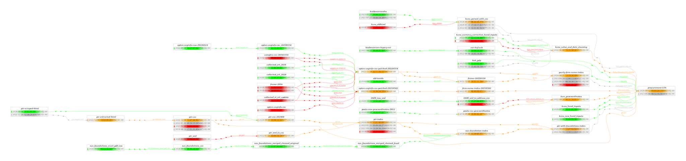
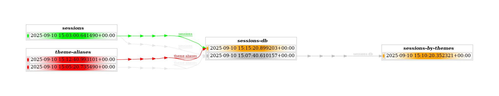

---
author:
- Krisztián Fekete
- Miklós Koren
authors:
- Krisztián Fekete
- Miklós Koren
date: 2025-09-10
subtitle: a provenance tool
title: bead
toc-title: Table of contents
---

## The Editor Gives You One Week

You need to:

1.  Address reviewer concerns about source data
2.  Redo analysis with new data
3.  Recreate Figure 1
4.  Submit within one week

## But the Submission Was Months Ago

-   Research submitted months ago
-   Team has been improving data cleaning since then
    -   Some team members left
-   Different statistical methods now
-   **First question**: How *exactly* was Figure 1 produced?

## Research Results are Functions

$$\text{Figure 1} = \text{code}(\text{data})$$

-   Results depend on both algorithms and data
-   Code under version control (Git) ✓
-   Tagged commit at submission ✓
-   **But what about the data?**

## Data is Also a Function

$$\text{data}_1 = \text{code}_2(\text{data}_2)$$

-   Data transformed by wrangling/cleaning steps
    -   countries dropped
    -   transformations applied
    -   feature engineering details
-   **Chain of data provenance**

## A Real-World Data Pipeline



## The Data Provenance Problem

### Why It Is Complex:

1.  **Frequent changes**: Code and data both evolve
2.  **Complex pipelines**: Many steps, multiple datasets
3.  **Tool heterogeneity**: Python, R, SQL, DuckDB all in one project
4.  **Team dynamics**: People join, leave, change roles

## Existing Solutions

### Version Control (Git)

-   Great for code
-   **Not suitable for large binary data**

### Data Version Control (DVC)

[dvc.org](https://dvc.org)

-   Similar spirit to bead, but delivery/versioning focused\
-   **More complex than needed for provenance tracking**

### Orchestration Tools

-   Apache Airflow (Python) -
    [airflow.apache.org](https://airflow.apache.org)
-   dbt (SQL) - [getdbt.com](https://www.getdbt.com)
-   KNIME (no-code) - [knime.com](https://knime.com)
-   **Too complex for heterogeneous teams**

## Enter bead

**A command-line tool that captures your data's story, step by step.**

-   Much simpler than alternatives
-   Language agnostic
-   Supports heterogeneous teams

## What bead Does NOT Do

### Not a code runner

-   You run your own code
-   Python, R, Stata, SQL - doesn't matter

### Not a file delivery system

-   File system stores your files
-   You copy/move files yourself

### Only requirement:

-   Works with flat files on file system
-   Files not too big (20GB works fine)

## Core bead Concepts

### The bead

-   Self-contained unit of computation
-   Contains code, *reference* to input data, results
-   Packaged as ZIP file
-   Remembers exact provenance

### Simple Commands

``` bash
bead new my-analysis
bead input add source-data
bead save 
```

# Demo Time

## ⚡ Inspiration

-   Data Journalism
-   Human concept of story
    -   Characters, setting, events, theme or message
    -   Variable scope
    -   Stories are composable
    -   Helps us to make sense of the world

## 📐 Design

-   ISBN / ISSN
    -   Identification of books and series with code
-   Task scope
-   Local first
-   Integrity

## 🎬 Demo

Conference session classification by title

Inputs:

-   list of sessions
-   session theme classification rules

Output:

-   list of sessions extended with theme

## ⚙️ Workspace and Box

###  {#section .top}

```{=html}
<div class="top-bottom-layout">
  <div class="top-content">
<div class="terminal"><span class="prompt">/demo $ </span><span class="cursor"></span></div>
  </div>

  <div class="bottom-content">
    <div class="bottom-left">
<pre>

</pre>
    </div>
    <div class="bottom-right">
<pre>

</pre>
    </div>
  </div>
</div>
```
###  {#section-1 .top}

```{=html}
<div class="top-bottom-layout">
  <div class="top-content">
<div class="terminal"><span class="prompt">/demo $ </span><span class="command">: workspace - where we work</span><span class="cursor"></span></div>
  </div>

  <div class="bottom-content">
    <div class="bottom-left">
<pre>

</pre>
    </div>
    <div class="bottom-right">
<pre>

</pre>
    </div>
  </div>
</div>
```
###  {#section-2 .top}

```{=html}
<div class="top-bottom-layout">
  <div class="top-content">
<div class="terminal"><span class="prompt">/demo $ </span><span class="command">: workspace - where we work</span>
<span class="prompt">/demo $ </span><span class="cursor"></span></div>
  </div>

  <div class="bottom-content">
    <div class="bottom-left">
<pre>

</pre>
    </div>
    <div class="bottom-right">
<pre>

</pre>
    </div>
  </div>
</div>
```
###  {#section-3 .top}

```{=html}
<div class="top-bottom-layout">
  <div class="top-content">
<div class="terminal"><span class="prompt">/demo $ </span><span class="command">: workspace - where we work</span>
<span class="prompt">/demo $ </span><span class="command">mkdir /demo/workspace</span><span class="cursor"></span></div>
  </div>

  <div class="bottom-content">
    <div class="bottom-left">
<pre>

</pre>
    </div>
    <div class="bottom-right">
<pre>

</pre>
    </div>
  </div>
</div>
```
###  {#section-4 .top}

```{=html}
<div class="top-bottom-layout">
  <div class="top-content">
<div class="terminal"><span class="prompt">/demo $ </span><span class="command">: workspace - where we work</span>
<span class="prompt">/demo $ </span><span class="command">mkdir /demo/workspace</span>
<span class="prompt">/demo $ </span><span class="cursor"></span></div>
  </div>

  <div class="bottom-content">
    <div class="bottom-left">
<pre>
/demo/workspace
</pre>
    </div>
    <div class="bottom-right">
<pre>

</pre>
    </div>
  </div>
</div>
```
###  {#section-5 .top}

```{=html}
<div class="top-bottom-layout">
  <div class="top-content">
<div class="terminal"><span class="prompt">/demo $ </span><span class="command">: workspace - where we work</span>
<span class="prompt">/demo $ </span><span class="command">mkdir /demo/workspace</span>
<span class="prompt">/demo $ </span><span class="command">cd /demo/workspace</span><span class="cursor"></span></div>
  </div>

  <div class="bottom-content">
    <div class="bottom-left">
<pre>
/demo/workspace
</pre>
    </div>
    <div class="bottom-right">
<pre>

</pre>
    </div>
  </div>
</div>
```
###  {#section-6 .top}

```{=html}
<div class="top-bottom-layout">
  <div class="top-content">
<div class="terminal"><span class="prompt">/demo $ </span><span class="command">: workspace - where we work</span>
<span class="prompt">/demo $ </span><span class="command">mkdir /demo/workspace</span>
<span class="prompt">/demo $ </span><span class="command">cd /demo/workspace</span>
<span class="prompt">/demo/workspace $ </span><span class="cursor"></span></div>
  </div>

  <div class="bottom-content">
    <div class="bottom-left">
<pre>
/demo/workspace
</pre>
    </div>
    <div class="bottom-right">
<pre>

</pre>
    </div>
  </div>
</div>
```
###  {#section-7 .top}

```{=html}
<div class="top-bottom-layout">
  <div class="top-content">
<div class="terminal"><span class="prompt">/demo $ </span><span class="command">: workspace - where we work</span>
<span class="prompt">/demo $ </span><span class="command">mkdir /demo/workspace</span>
<span class="prompt">/demo $ </span><span class="command">cd /demo/workspace</span>
<span class="prompt">/demo/workspace $ </span><span class="command">: box - storage for beads</span><span class="cursor"></span></div>
  </div>

  <div class="bottom-content">
    <div class="bottom-left">
<pre>
/demo/workspace
</pre>
    </div>
    <div class="bottom-right">
<pre>

</pre>
    </div>
  </div>
</div>
```
###  {#section-8 .top}

```{=html}
<div class="top-bottom-layout">
  <div class="top-content">
<div class="terminal"><span class="prompt">/demo $ </span><span class="command">: workspace - where we work</span>
<span class="prompt">/demo $ </span><span class="command">mkdir /demo/workspace</span>
<span class="prompt">/demo $ </span><span class="command">cd /demo/workspace</span>
<span class="prompt">/demo/workspace $ </span><span class="command">: box - storage for beads</span>
<span class="prompt">/demo/workspace $ </span><span class="cursor"></span></div>
  </div>

  <div class="bottom-content">
    <div class="bottom-left">
<pre>
/demo/workspace
</pre>
    </div>
    <div class="bottom-right">
<pre>

</pre>
    </div>
  </div>
</div>
```
###  {#section-9 .top}

```{=html}
<div class="top-bottom-layout">
  <div class="top-content">
<div class="terminal"><span class="prompt">/demo $ </span><span class="command">: workspace - where we work</span>
<span class="prompt">/demo $ </span><span class="command">mkdir /demo/workspace</span>
<span class="prompt">/demo $ </span><span class="command">cd /demo/workspace</span>
<span class="prompt">/demo/workspace $ </span><span class="command">: box - storage for beads</span>
<span class="prompt">/demo/workspace $ </span><span class="command">bead box list</span><span class="cursor"></span></div>
  </div>

  <div class="bottom-content">
    <div class="bottom-left">
<pre>
/demo/workspace
</pre>
    </div>
    <div class="bottom-right">
<pre>

</pre>
    </div>
  </div>
</div>
```
###  {#section-10 .top}

```{=html}
<div class="top-bottom-layout">
  <div class="top-content">
<div class="terminal"><span class="prompt">/demo $ </span><span class="command">: workspace - where we work</span>
<span class="prompt">/demo $ </span><span class="command">mkdir /demo/workspace</span>
<span class="prompt">/demo $ </span><span class="command">cd /demo/workspace</span>
<span class="prompt">/demo/workspace $ </span><span class="command">: box - storage for beads</span>
<span class="prompt">/demo/workspace $ </span><span class="command">bead box list</span>
<span class="output">There are no defined boxes
</span><span class="prompt">/demo/workspace $ </span><span class="cursor"></span></div>
  </div>

  <div class="bottom-content">
    <div class="bottom-left">
<pre>
/demo/workspace
</pre>
    </div>
    <div class="bottom-right">
<pre>

</pre>
    </div>
  </div>
</div>
```
###  {#section-11 .top}

```{=html}
<div class="top-bottom-layout">
  <div class="top-content">
<div class="terminal"><span class="prompt">/demo $ </span><span class="command">: workspace - where we work</span>
<span class="prompt">/demo $ </span><span class="command">mkdir /demo/workspace</span>
<span class="prompt">/demo $ </span><span class="command">cd /demo/workspace</span>
<span class="prompt">/demo/workspace $ </span><span class="command">: box - storage for beads</span>
<span class="prompt">/demo/workspace $ </span><span class="command">bead box list</span>
<span class="output">There are no defined boxes
</span><span class="prompt">/demo/workspace $ </span><span class="command">mkdir /demo/bead-box</span><span class="cursor"></span></div>
  </div>

  <div class="bottom-content">
    <div class="bottom-left">
<pre>
/demo/workspace
</pre>
    </div>
    <div class="bottom-right">
<pre>

</pre>
    </div>
  </div>
</div>
```
###  {#section-12 .top}

```{=html}
<div class="top-bottom-layout">
  <div class="top-content">
<div class="terminal"><span class="prompt">/demo $ </span><span class="command">: workspace - where we work</span>
<span class="prompt">/demo $ </span><span class="command">mkdir /demo/workspace</span>
<span class="prompt">/demo $ </span><span class="command">cd /demo/workspace</span>
<span class="prompt">/demo/workspace $ </span><span class="command">: box - storage for beads</span>
<span class="prompt">/demo/workspace $ </span><span class="command">bead box list</span>
<span class="output">There are no defined boxes
</span><span class="prompt">/demo/workspace $ </span><span class="command">mkdir /demo/bead-box</span>
<span class="prompt">/demo/workspace $ </span><span class="cursor"></span></div>
  </div>

  <div class="bottom-content">
    <div class="bottom-left">
<pre>
/demo/workspace
</pre>
    </div>
    <div class="bottom-right">
<pre>
/demo/bead-box
</pre>
    </div>
  </div>
</div>
```
###  {#section-13 .top}

```{=html}
<div class="top-bottom-layout">
  <div class="top-content">
<div class="terminal"><span class="prompt">/demo $ </span><span class="command">: workspace - where we work</span>
<span class="prompt">/demo $ </span><span class="command">mkdir /demo/workspace</span>
<span class="prompt">/demo $ </span><span class="command">cd /demo/workspace</span>
<span class="prompt">/demo/workspace $ </span><span class="command">: box - storage for beads</span>
<span class="prompt">/demo/workspace $ </span><span class="command">bead box list</span>
<span class="output">There are no defined boxes
</span><span class="prompt">/demo/workspace $ </span><span class="command">mkdir /demo/bead-box</span>
<span class="prompt">/demo/workspace $ </span><span class="command">bead box add demo /demo/bead-box</span><span class="cursor"></span></div>
  </div>

  <div class="bottom-content">
    <div class="bottom-left">
<pre>
/demo/workspace
</pre>
    </div>
    <div class="bottom-right">
<pre>
/demo/bead-box
</pre>
    </div>
  </div>
</div>
```
###  {#section-14 .top}

```{=html}
<div class="top-bottom-layout">
  <div class="top-content">
<div class="terminal"><span class="prompt">/demo $ </span><span class="command">: workspace - where we work</span>
<span class="prompt">/demo $ </span><span class="command">mkdir /demo/workspace</span>
<span class="prompt">/demo $ </span><span class="command">cd /demo/workspace</span>
<span class="prompt">/demo/workspace $ </span><span class="command">: box - storage for beads</span>
<span class="prompt">/demo/workspace $ </span><span class="command">bead box list</span>
<span class="output">There are no defined boxes
</span><span class="prompt">/demo/workspace $ </span><span class="command">mkdir /demo/bead-box</span>
<span class="prompt">/demo/workspace $ </span><span class="command">bead box add demo /demo/bead-box</span>
<span class="output">Will remember box demo
</span><span class="prompt">/demo/workspace $ </span><span class="cursor"></span></div>
  </div>

  <div class="bottom-content">
    <div class="bottom-left">
<pre>
/demo/workspace
</pre>
    </div>
    <div class="bottom-right">
<pre>
/demo/bead-box
</pre>
    </div>
  </div>
</div>
```
###  {#section-15 .top}

```{=html}
<div class="top-bottom-layout">
  <div class="top-content">
<div class="terminal"><span class="prompt">/demo $ </span><span class="command">: workspace - where we work</span>
<span class="prompt">/demo $ </span><span class="command">mkdir /demo/workspace</span>
<span class="prompt">/demo $ </span><span class="command">cd /demo/workspace</span>
<span class="prompt">/demo/workspace $ </span><span class="command">: box - storage for beads</span>
<span class="prompt">/demo/workspace $ </span><span class="command">bead box list</span>
<span class="output">There are no defined boxes
</span><span class="prompt">/demo/workspace $ </span><span class="command">mkdir /demo/bead-box</span>
<span class="prompt">/demo/workspace $ </span><span class="command">bead box add demo /demo/bead-box</span>
<span class="output">Will remember box demo
</span><span class="prompt">/demo/workspace $ </span><span class="command">bead box list</span><span class="cursor"></span></div>
  </div>

  <div class="bottom-content">
    <div class="bottom-left">
<pre>
/demo/workspace
</pre>
    </div>
    <div class="bottom-right">
<pre>
/demo/bead-box
</pre>
    </div>
  </div>
</div>
```
###  {#section-16 .top}

```{=html}
<div class="top-bottom-layout">
  <div class="top-content">
<div class="terminal"><span class="prompt">/demo $ </span><span class="command">: workspace - where we work</span>
<span class="prompt">/demo $ </span><span class="command">mkdir /demo/workspace</span>
<span class="prompt">/demo $ </span><span class="command">cd /demo/workspace</span>
<span class="prompt">/demo/workspace $ </span><span class="command">: box - storage for beads</span>
<span class="prompt">/demo/workspace $ </span><span class="command">bead box list</span>
<span class="output">There are no defined boxes
</span><span class="prompt">/demo/workspace $ </span><span class="command">mkdir /demo/bead-box</span>
<span class="prompt">/demo/workspace $ </span><span class="command">bead box add demo /demo/bead-box</span>
<span class="output">Will remember box demo
</span><span class="prompt">/demo/workspace $ </span><span class="command">bead box list</span>
<span class="output">Boxes:
-------------
demo: /demo/bead-box
</span><span class="prompt">/demo/workspace $ </span><span class="cursor"></span></div>
  </div>

  <div class="bottom-content">
    <div class="bottom-left">
<pre>
/demo/workspace
</pre>
    </div>
    <div class="bottom-right">
<pre>
/demo/bead-box
</pre>
    </div>
  </div>
</div>
```
## 📁 Output: Plain data

###  {#section-17 .top}

```{=html}
<div class="top-bottom-layout">
  <div class="top-content">
<div class="terminal"><span class="prompt">/demo/workspace $ </span><span class="cursor"></span></div>
  </div>

  <div class="bottom-content">
    <div class="bottom-left">
<pre>
/demo/workspace
</pre>
    </div>
    <div class="bottom-right">
<pre>
/demo/bead-box
</pre>
    </div>
  </div>
</div>
```
###  {#section-18 .top}

```{=html}
<div class="top-bottom-layout">
  <div class="top-content">
<div class="terminal"><span class="prompt">/demo/workspace $ </span><span class="command">bead new sessions</span><span class="cursor"></span></div>
  </div>

  <div class="bottom-content">
    <div class="bottom-left">
<pre>
/demo/workspace
</pre>
    </div>
    <div class="bottom-right">
<pre>
/demo/bead-box
</pre>
    </div>
  </div>
</div>
```
###  {#section-19 .top}

```{=html}
<div class="top-bottom-layout">
  <div class="top-content">
<div class="terminal"><span class="prompt">/demo/workspace $ </span><span class="command">bead new sessions</span>
<span class="output">Created workspace &quot;sessions&quot;
</span><span class="prompt">/demo/workspace $ </span><span class="cursor"></span></div>
  </div>

  <div class="bottom-content">
    <div class="bottom-left">
<pre>
/demo/workspace
└── sessions
    ├── input
    ├── output
    └── temp
</pre>
    </div>
    <div class="bottom-right">
<pre>
/demo/bead-box
</pre>
    </div>
  </div>
</div>
```
## Workspace {#workspace .top}

-   name (*sessions*)
    -   input
    -   output
    -   temp

###  {#section-20 .top}

```{=html}
<div class="top-bottom-layout">
  <div class="top-content">
<div class="terminal"><span class="prompt">/demo/workspace $ </span><span class="cursor"></span></div>
  </div>

  <div class="bottom-content">
    <div class="bottom-left">
<pre>
/demo/workspace
└── sessions
    ├── input
    ├── output
    └── temp
</pre>
    </div>
    <div class="bottom-right">
<pre>
/demo/bead-box
</pre>
    </div>
  </div>
</div>
```
###  {#section-21 .top}

```{=html}
<div class="top-bottom-layout">
  <div class="top-content">
<div class="terminal"><span class="prompt">/demo/workspace $ </span><span class="command">cd sessions</span><span class="cursor"></span></div>
  </div>

  <div class="bottom-content">
    <div class="bottom-left">
<pre>
/demo/workspace
└── sessions
    ├── input
    ├── output
    └── temp
</pre>
    </div>
    <div class="bottom-right">
<pre>
/demo/bead-box
</pre>
    </div>
  </div>
</div>
```
###  {#section-22 .top}

```{=html}
<div class="top-bottom-layout">
  <div class="top-content">
<div class="terminal"><span class="prompt">/demo/workspace $ </span><span class="command">cd sessions</span>
<span class="prompt">/demo/workspace/sessions $ </span><span class="cursor"></span></div>
  </div>

  <div class="bottom-content">
    <div class="bottom-left">
<pre>
/demo/workspace
└── sessions
    ├── input
    ├── output
    └── temp
</pre>
    </div>
    <div class="bottom-right">
<pre>
/demo/bead-box
</pre>
    </div>
  </div>
</div>
```
###  {#section-23 .top}

```{=html}
<div class="top-bottom-layout">
  <div class="top-content">
<div class="terminal"><span class="prompt">/demo/workspace $ </span><span class="command">cd sessions</span>
<span class="prompt">/demo/workspace/sessions $ </span><span class="command">cat &gt; output/sessions.csv &lt;&lt;EOF
title,speaker
Advances in Artificial Intelligence,Alice
Blockchain Basics,Bob
Sustainability in Business,Charlie
Future of Quantum Computing,Diane
Data Privacy and Security,Eric
Machine Learning 101,Fiona
AI Ethics and Impact,Grace
Green Tech Innovations,Henry
Distributed Ledger Technologies,Ian
Effective Team Communication,Julia
EOF</span><span class="cursor"></span></div>
  </div>

  <div class="bottom-content">
    <div class="bottom-left">
<pre>
/demo/workspace
└── sessions
    ├── input
    ├── output
    └── temp
</pre>
    </div>
    <div class="bottom-right">
<pre>
/demo/bead-box
</pre>
    </div>
  </div>
</div>
```
###  {#section-24 .top}

```{=html}
<div class="top-bottom-layout">
  <div class="top-content">
<div class="terminal"><span class="prompt">/demo/workspace $ </span><span class="command">cd sessions</span>
<span class="prompt">/demo/workspace/sessions $ </span><span class="command">cat &gt; output/sessions.csv &lt;&lt;EOF
title,speaker
Advances in Artificial Intelligence,Alice
Blockchain Basics,Bob
Sustainability in Business,Charlie
Future of Quantum Computing,Diane
Data Privacy and Security,Eric
Machine Learning 101,Fiona
AI Ethics and Impact,Grace
Green Tech Innovations,Henry
Distributed Ledger Technologies,Ian
Effective Team Communication,Julia
EOF</span>
<span class="prompt">/demo/workspace/sessions $ </span><span class="cursor"></span></div>
  </div>

  <div class="bottom-content">
    <div class="bottom-left">
<pre>
/demo/workspace
└── sessions
    ├── input
    ├── output
    │   └── sessions.csv
    └── temp
</pre>
    </div>
    <div class="bottom-right">
<pre>
/demo/bead-box
</pre>
    </div>
  </div>
</div>
```
###  {#section-25 .top}

```{=html}
<div class="top-bottom-layout">
  <div class="top-content">
<div class="terminal"><span class="prompt">/demo/workspace $ </span><span class="command">cd sessions</span>
<span class="prompt">/demo/workspace/sessions $ </span><span class="command">cat &gt; output/sessions.csv &lt;&lt;EOF
title,speaker
Advances in Artificial Intelligence,Alice
Blockchain Basics,Bob
Sustainability in Business,Charlie
Future of Quantum Computing,Diane
Data Privacy and Security,Eric
Machine Learning 101,Fiona
AI Ethics and Impact,Grace
Green Tech Innovations,Henry
Distributed Ledger Technologies,Ian
Effective Team Communication,Julia
EOF</span>
<span class="prompt">/demo/workspace/sessions $ </span><span class="command">bead save</span><span class="cursor"></span></div>
  </div>

  <div class="bottom-content">
    <div class="bottom-left">
<pre>
/demo/workspace
└── sessions
    ├── input
    ├── output
    │   └── sessions.csv
    └── temp
</pre>
    </div>
    <div class="bottom-right">
<pre>
/demo/bead-box
</pre>
    </div>
  </div>
</div>
```
###  {#section-26 .top}

```{=html}
<div class="top-bottom-layout">
  <div class="top-content">
<div class="terminal"><span class="prompt">/demo/workspace $ </span><span class="command">cd sessions</span>
<span class="prompt">/demo/workspace/sessions $ </span><span class="command">cat &gt; output/sessions.csv &lt;&lt;EOF
title,speaker
Advances in Artificial Intelligence,Alice
Blockchain Basics,Bob
Sustainability in Business,Charlie
Future of Quantum Computing,Diane
Data Privacy and Security,Eric
Machine Learning 101,Fiona
AI Ethics and Impact,Grace
Green Tech Innovations,Henry
Distributed Ledger Technologies,Ian
Effective Team Communication,Julia
EOF</span>
<span class="prompt">/demo/workspace/sessions $ </span><span class="command">bead save</span>
<span class="output">Successfully stored bead at /demo/bead-box/sessions_20250910T150300641490+0000.zip.
</span><span class="prompt">/demo/workspace/sessions $ </span><span class="cursor"></span></div>
  </div>

  <div class="bottom-content">
    <div class="bottom-left">
<pre>
/demo/workspace
└── sessions
    ├── input
    ├── output
    │   └── sessions.csv
    └── temp
</pre>
    </div>
    <div class="bottom-right">
<pre>
/demo/bead-box
└── sessions_20250910T150300641490+0000.zip
</pre>
    </div>
  </div>
</div>
```
###  {#section-27 .top}

```{=html}
<div class="top-bottom-layout">
  <div class="top-content">
<div class="terminal"><span class="prompt">/demo/workspace $ </span><span class="command">cd sessions</span>
<span class="prompt">/demo/workspace/sessions $ </span><span class="command">cat &gt; output/sessions.csv &lt;&lt;EOF
title,speaker
Advances in Artificial Intelligence,Alice
Blockchain Basics,Bob
Sustainability in Business,Charlie
Future of Quantum Computing,Diane
Data Privacy and Security,Eric
Machine Learning 101,Fiona
AI Ethics and Impact,Grace
Green Tech Innovations,Henry
Distributed Ledger Technologies,Ian
Effective Team Communication,Julia
EOF</span>
<span class="prompt">/demo/workspace/sessions $ </span><span class="command">bead save</span>
<span class="output">Successfully stored bead at /demo/bead-box/sessions_20250910T150300641490+0000.zip.
</span><span class="prompt">/demo/workspace/sessions $ </span><span class="command">bead discard</span><span class="cursor"></span></div>
  </div>

  <div class="bottom-content">
    <div class="bottom-left">
<pre>
/demo/workspace
└── sessions
    ├── input
    ├── output
    │   └── sessions.csv
    └── temp
</pre>
    </div>
    <div class="bottom-right">
<pre>
/demo/bead-box
└── sessions_20250910T150300641490+0000.zip
</pre>
    </div>
  </div>
</div>
```
###  {#section-28 .top}

```{=html}
<div class="top-bottom-layout">
  <div class="top-content">
<div class="terminal"><span class="prompt">/demo/workspace $ </span><span class="command">cd sessions</span>
<span class="prompt">/demo/workspace/sessions $ </span><span class="command">cat &gt; output/sessions.csv &lt;&lt;EOF
title,speaker
Advances in Artificial Intelligence,Alice
Blockchain Basics,Bob
Sustainability in Business,Charlie
Future of Quantum Computing,Diane
Data Privacy and Security,Eric
Machine Learning 101,Fiona
AI Ethics and Impact,Grace
Green Tech Innovations,Henry
Distributed Ledger Technologies,Ian
Effective Team Communication,Julia
EOF</span>
<span class="prompt">/demo/workspace/sessions $ </span><span class="command">bead save</span>
<span class="output">Successfully stored bead at /demo/bead-box/sessions_20250910T150300641490+0000.zip.
</span><span class="prompt">/demo/workspace/sessions $ </span><span class="command">bead discard</span>
<span class="output">Deleted workspace /demo/workspace/sessions
</span><span class="prompt">/demo/workspace/sessions $ </span><span class="cursor"></span></div>
  </div>

  <div class="bottom-content">
    <div class="bottom-left">
<pre>
/demo/workspace
</pre>
    </div>
    <div class="bottom-right">
<pre>
/demo/bead-box
└── sessions_20250910T150300641490+0000.zip
</pre>
    </div>
  </div>
</div>
```
###  {#section-29 .top}

```{=html}
<div class="top-bottom-layout">
  <div class="top-content">
<div class="terminal"><span class="prompt">/demo/workspace $ </span><span class="command">cd sessions</span>
<span class="prompt">/demo/workspace/sessions $ </span><span class="command">cat &gt; output/sessions.csv &lt;&lt;EOF
title,speaker
Advances in Artificial Intelligence,Alice
Blockchain Basics,Bob
Sustainability in Business,Charlie
Future of Quantum Computing,Diane
Data Privacy and Security,Eric
Machine Learning 101,Fiona
AI Ethics and Impact,Grace
Green Tech Innovations,Henry
Distributed Ledger Technologies,Ian
Effective Team Communication,Julia
EOF</span>
<span class="prompt">/demo/workspace/sessions $ </span><span class="command">bead save</span>
<span class="output">Successfully stored bead at /demo/bead-box/sessions_20250910T150300641490+0000.zip.
</span><span class="prompt">/demo/workspace/sessions $ </span><span class="command">bead discard</span>
<span class="output">Deleted workspace /demo/workspace/sessions
</span><span class="prompt">/demo/workspace/sessions $ </span><span class="command">cd ..</span><span class="cursor"></span></div>
  </div>

  <div class="bottom-content">
    <div class="bottom-left">
<pre>
/demo/workspace
</pre>
    </div>
    <div class="bottom-right">
<pre>
/demo/bead-box
└── sessions_20250910T150300641490+0000.zip
</pre>
    </div>
  </div>
</div>
```
###  {#section-30 .top}

```{=html}
<div class="top-bottom-layout">
  <div class="top-content">
<div class="terminal"><span class="prompt">/demo/workspace $ </span><span class="command">cd sessions</span>
<span class="prompt">/demo/workspace/sessions $ </span><span class="command">cat &gt; output/sessions.csv &lt;&lt;EOF
title,speaker
Advances in Artificial Intelligence,Alice
Blockchain Basics,Bob
Sustainability in Business,Charlie
Future of Quantum Computing,Diane
Data Privacy and Security,Eric
Machine Learning 101,Fiona
AI Ethics and Impact,Grace
Green Tech Innovations,Henry
Distributed Ledger Technologies,Ian
Effective Team Communication,Julia
EOF</span>
<span class="prompt">/demo/workspace/sessions $ </span><span class="command">bead save</span>
<span class="output">Successfully stored bead at /demo/bead-box/sessions_20250910T150300641490+0000.zip.
</span><span class="prompt">/demo/workspace/sessions $ </span><span class="command">bead discard</span>
<span class="output">Deleted workspace /demo/workspace/sessions
</span><span class="prompt">/demo/workspace/sessions $ </span><span class="command">cd ..</span>
<span class="prompt">/demo/workspace $ </span><span class="cursor"></span></div>
  </div>

  <div class="bottom-content">
    <div class="bottom-left">
<pre>
/demo/workspace
</pre>
    </div>
    <div class="bottom-right">
<pre>
/demo/bead-box
└── sessions_20250910T150300641490+0000.zip
</pre>
    </div>
  </div>
</div>
```
###  {#section-31 .top}

```{=html}
<div class="top-bottom-layout">
  <div class="top-content">
<div class="terminal"><span class="prompt">/demo/workspace $ </span><span class="command">cd sessions</span>
<span class="prompt">/demo/workspace/sessions $ </span><span class="command">cat &gt; output/sessions.csv &lt;&lt;EOF
title,speaker
Advances in Artificial Intelligence,Alice
Blockchain Basics,Bob
Sustainability in Business,Charlie
Future of Quantum Computing,Diane
Data Privacy and Security,Eric
Machine Learning 101,Fiona
AI Ethics and Impact,Grace
Green Tech Innovations,Henry
Distributed Ledger Technologies,Ian
Effective Team Communication,Julia
EOF</span>
<span class="prompt">/demo/workspace/sessions $ </span><span class="command">bead save</span>
<span class="output">Successfully stored bead at /demo/bead-box/sessions_20250910T150300641490+0000.zip.
</span><span class="prompt">/demo/workspace/sessions $ </span><span class="command">bead discard</span>
<span class="output">Deleted workspace /demo/workspace/sessions
</span><span class="prompt">/demo/workspace/sessions $ </span><span class="command">cd ..</span>
<span class="prompt">/demo/workspace $ </span><span class="command">: quick look into the created archive</span><span class="cursor"></span></div>
  </div>

  <div class="bottom-content">
    <div class="bottom-left">
<pre>
/demo/workspace
</pre>
    </div>
    <div class="bottom-right">
<pre>
/demo/bead-box
└── sessions_20250910T150300641490+0000.zip
</pre>
    </div>
  </div>
</div>
```
###  {#section-32 .top}

```{=html}
<div class="top-bottom-layout">
  <div class="top-content">
<div class="terminal"><span class="prompt">/demo/workspace $ </span><span class="command">cd sessions</span>
<span class="prompt">/demo/workspace/sessions $ </span><span class="command">cat &gt; output/sessions.csv &lt;&lt;EOF
title,speaker
Advances in Artificial Intelligence,Alice
Blockchain Basics,Bob
Sustainability in Business,Charlie
Future of Quantum Computing,Diane
Data Privacy and Security,Eric
Machine Learning 101,Fiona
AI Ethics and Impact,Grace
Green Tech Innovations,Henry
Distributed Ledger Technologies,Ian
Effective Team Communication,Julia
EOF</span>
<span class="prompt">/demo/workspace/sessions $ </span><span class="command">bead save</span>
<span class="output">Successfully stored bead at /demo/bead-box/sessions_20250910T150300641490+0000.zip.
</span><span class="prompt">/demo/workspace/sessions $ </span><span class="command">bead discard</span>
<span class="output">Deleted workspace /demo/workspace/sessions
</span><span class="prompt">/demo/workspace/sessions $ </span><span class="command">cd ..</span>
<span class="prompt">/demo/workspace $ </span><span class="command">: quick look into the created archive</span>
<span class="prompt">/demo/workspace $ </span><span class="cursor"></span></div>
  </div>

  <div class="bottom-content">
    <div class="bottom-left">
<pre>
/demo/workspace
</pre>
    </div>
    <div class="bottom-right">
<pre>
/demo/bead-box
└── sessions_20250910T150300641490+0000.zip
</pre>
    </div>
  </div>
</div>
```
###  {#section-33 .top}

```{=html}
<div class="top-bottom-layout">
  <div class="top-content">
<div class="terminal"><span class="prompt">/demo/workspace $ </span><span class="command">cd sessions</span>
<span class="prompt">/demo/workspace/sessions $ </span><span class="command">cat &gt; output/sessions.csv &lt;&lt;EOF
title,speaker
Advances in Artificial Intelligence,Alice
Blockchain Basics,Bob
Sustainability in Business,Charlie
Future of Quantum Computing,Diane
Data Privacy and Security,Eric
Machine Learning 101,Fiona
AI Ethics and Impact,Grace
Green Tech Innovations,Henry
Distributed Ledger Technologies,Ian
Effective Team Communication,Julia
EOF</span>
<span class="prompt">/demo/workspace/sessions $ </span><span class="command">bead save</span>
<span class="output">Successfully stored bead at /demo/bead-box/sessions_20250910T150300641490+0000.zip.
</span><span class="prompt">/demo/workspace/sessions $ </span><span class="command">bead discard</span>
<span class="output">Deleted workspace /demo/workspace/sessions
</span><span class="prompt">/demo/workspace/sessions $ </span><span class="command">cd ..</span>
<span class="prompt">/demo/workspace $ </span><span class="command">: quick look into the created archive</span>
<span class="prompt">/demo/workspace $ </span><span class="command">unzip -v /demo/bead-box/sessions_*.zip | tail -9</span><span class="cursor"></span></div>
  </div>

  <div class="bottom-content">
    <div class="bottom-left">
<pre>
/demo/workspace
</pre>
    </div>
    <div class="bottom-right">
<pre>
/demo/bead-box
└── sessions_20250910T150300641490+0000.zip
</pre>
    </div>
  </div>
</div>
```
###  {#section-34 .top}

```{=html}
<div class="top-bottom-layout">
  <div class="top-content">
<div class="terminal"><span class="prompt">/demo/workspace $ </span><span class="command">cd sessions</span>
<span class="prompt">/demo/workspace/sessions $ </span><span class="command">cat &gt; output/sessions.csv &lt;&lt;EOF
title,speaker
Advances in Artificial Intelligence,Alice
Blockchain Basics,Bob
Sustainability in Business,Charlie
Future of Quantum Computing,Diane
Data Privacy and Security,Eric
Machine Learning 101,Fiona
AI Ethics and Impact,Grace
Green Tech Innovations,Henry
Distributed Ledger Technologies,Ian
Effective Team Communication,Julia
EOF</span>
<span class="prompt">/demo/workspace/sessions $ </span><span class="command">bead save</span>
<span class="output">Successfully stored bead at /demo/bead-box/sessions_20250910T150300641490+0000.zip.
</span><span class="prompt">/demo/workspace/sessions $ </span><span class="command">bead discard</span>
<span class="output">Deleted workspace /demo/workspace/sessions
</span><span class="prompt">/demo/workspace/sessions $ </span><span class="command">cd ..</span>
<span class="prompt">/demo/workspace $ </span><span class="command">: quick look into the created archive</span>
<span class="prompt">/demo/workspace $ </span><span class="command">unzip -v /demo/bead-box/sessions_*.zip | tail -9</span>
<span class="output">----

 Length   Method    Size  Cmpr    Date    Time   CRC-32   Name
--------  ------  ------- ---- ---------- ----- --------  ----
     332  Defl:N      236  29% 2025-08-31 22:29 4aa44c11  data/sessions.csv
     245  Defl:N      171  30% 2025-09-10 15:03 80ce012f  meta/bead
     308  Defl:N      207  33% 2025-09-10 15:03 f4ddb35a  meta/manifest
--------          -------  ---                            -------
     885              614  31%                            3 files
</span><span class="prompt">/demo/workspace $ </span><span class="cursor"></span></div>
  </div>

  <div class="bottom-content">
    <div class="bottom-left">
<pre>
/demo/workspace
</pre>
    </div>
    <div class="bottom-right">
<pre>
/demo/bead-box
└── sessions_20250910T150300641490+0000.zip
</pre>
    </div>
  </div>
</div>
```
###  {#section-35 .top}

```{=html}
<div class="top-bottom-layout">
  <div class="top-content">
<div class="terminal"><span class="prompt">/demo/workspace $ </span><span class="command">cd sessions</span>
<span class="prompt">/demo/workspace/sessions $ </span><span class="command">cat &gt; output/sessions.csv &lt;&lt;EOF
title,speaker
Advances in Artificial Intelligence,Alice
Blockchain Basics,Bob
Sustainability in Business,Charlie
Future of Quantum Computing,Diane
Data Privacy and Security,Eric
Machine Learning 101,Fiona
AI Ethics and Impact,Grace
Green Tech Innovations,Henry
Distributed Ledger Technologies,Ian
Effective Team Communication,Julia
EOF</span>
<span class="prompt">/demo/workspace/sessions $ </span><span class="command">bead save</span>
<span class="output">Successfully stored bead at /demo/bead-box/sessions_20250910T150300641490+0000.zip.
</span><span class="prompt">/demo/workspace/sessions $ </span><span class="command">bead discard</span>
<span class="output">Deleted workspace /demo/workspace/sessions
</span><span class="prompt">/demo/workspace/sessions $ </span><span class="command">cd ..</span>
<span class="prompt">/demo/workspace $ </span><span class="command">: quick look into the created archive</span>
<span class="prompt">/demo/workspace $ </span><span class="command">unzip -v /demo/bead-box/sessions_*.zip | tail -9</span>
<span class="output">----

 Length   Method    Size  Cmpr    Date    Time   CRC-32   Name
--------  ------  ------- ---- ---------- ----- --------  ----
     332  Defl:N      236  29% 2025-08-31 22:29 4aa44c11  data/sessions.csv
     245  Defl:N      171  30% 2025-09-10 15:03 80ce012f  meta/bead
     308  Defl:N      207  33% 2025-09-10 15:03 f4ddb35a  meta/manifest
--------          -------  ---                            -------
     885              614  31%                            3 files
</span><span class="prompt">/demo/workspace $ </span><span class="command">unzip -p /demo/bead-box/sessions_*.zip data/* | csvlook -</span><span class="cursor"></span></div>
  </div>

  <div class="bottom-content">
    <div class="bottom-left">
<pre>
/demo/workspace
</pre>
    </div>
    <div class="bottom-right">
<pre>
/demo/bead-box
└── sessions_20250910T150300641490+0000.zip
</pre>
    </div>
  </div>
</div>
```
###  {#section-36 .top}

```{=html}
<div class="top-bottom-layout">
  <div class="top-content">
<div class="terminal"><span class="prompt">/demo/workspace $ </span><span class="command">cd sessions</span>
<span class="prompt">/demo/workspace/sessions $ </span><span class="command">cat &gt; output/sessions.csv &lt;&lt;EOF
title,speaker
Advances in Artificial Intelligence,Alice
Blockchain Basics,Bob
Sustainability in Business,Charlie
Future of Quantum Computing,Diane
Data Privacy and Security,Eric
Machine Learning 101,Fiona
AI Ethics and Impact,Grace
Green Tech Innovations,Henry
Distributed Ledger Technologies,Ian
Effective Team Communication,Julia
EOF</span>
<span class="prompt">/demo/workspace/sessions $ </span><span class="command">bead save</span>
<span class="output">Successfully stored bead at /demo/bead-box/sessions_20250910T150300641490+0000.zip.
</span><span class="prompt">/demo/workspace/sessions $ </span><span class="command">bead discard</span>
<span class="output">Deleted workspace /demo/workspace/sessions
</span><span class="prompt">/demo/workspace/sessions $ </span><span class="command">cd ..</span>
<span class="prompt">/demo/workspace $ </span><span class="command">: quick look into the created archive</span>
<span class="prompt">/demo/workspace $ </span><span class="command">unzip -v /demo/bead-box/sessions_*.zip | tail -9</span>
<span class="output">----

 Length   Method    Size  Cmpr    Date    Time   CRC-32   Name
--------  ------  ------- ---- ---------- ----- --------  ----
     332  Defl:N      236  29% 2025-08-31 22:29 4aa44c11  data/sessions.csv
     245  Defl:N      171  30% 2025-09-10 15:03 80ce012f  meta/bead
     308  Defl:N      207  33% 2025-09-10 15:03 f4ddb35a  meta/manifest
--------          -------  ---                            -------
     885              614  31%                            3 files
</span><span class="prompt">/demo/workspace $ </span><span class="command">unzip -p /demo/bead-box/sessions_*.zip data/* | csvlook -</span>
<span class="output">| title                               | speaker |
| ----------------------------------- | ------- |
| Advances in Artificial Intelligence | Alice   |
| Blockchain Basics                   | Bob     |
| Sustainability in Business          | Charlie |
| Future of Quantum Computing         | Diane   |
| Data Privacy and Security           | Eric    |
| Machine Learning 101                | Fiona   |
| AI Ethics and Impact                | Grace   |
| Green Tech Innovations              | Henry   |
| Distributed Ledger Technologies     | Ian     |
| Effective Team Communication        | Julia   |
</span><span class="prompt">/demo/workspace $ </span><span class="cursor"></span></div>
  </div>

  <div class="bottom-content">
    <div class="bottom-left">
<pre>
/demo/workspace
</pre>
    </div>
    <div class="bottom-right">
<pre>
/demo/bead-box
└── sessions_20250910T150300641490+0000.zip
</pre>
    </div>
  </div>
</div>
```
###  {#section-37 .top}

```{=html}
<div class="top-bottom-layout">
  <div class="top-content">
<div class="terminal"><span class="prompt">/demo/workspace $ </span><span class="command">cd sessions</span>
<span class="prompt">/demo/workspace/sessions $ </span><span class="command">cat &gt; output/sessions.csv &lt;&lt;EOF
title,speaker
Advances in Artificial Intelligence,Alice
Blockchain Basics,Bob
Sustainability in Business,Charlie
Future of Quantum Computing,Diane
Data Privacy and Security,Eric
Machine Learning 101,Fiona
AI Ethics and Impact,Grace
Green Tech Innovations,Henry
Distributed Ledger Technologies,Ian
Effective Team Communication,Julia
EOF</span>
<span class="prompt">/demo/workspace/sessions $ </span><span class="command">bead save</span>
<span class="output">Successfully stored bead at /demo/bead-box/sessions_20250910T150300641490+0000.zip.
</span><span class="prompt">/demo/workspace/sessions $ </span><span class="command">bead discard</span>
<span class="output">Deleted workspace /demo/workspace/sessions
</span><span class="prompt">/demo/workspace/sessions $ </span><span class="command">cd ..</span>
<span class="prompt">/demo/workspace $ </span><span class="command">: quick look into the created archive</span>
<span class="prompt">/demo/workspace $ </span><span class="command">unzip -v /demo/bead-box/sessions_*.zip | tail -9</span>
<span class="output">----

 Length   Method    Size  Cmpr    Date    Time   CRC-32   Name
--------  ------  ------- ---- ---------- ----- --------  ----
     332  Defl:N      236  29% 2025-08-31 22:29 4aa44c11  data/sessions.csv
     245  Defl:N      171  30% 2025-09-10 15:03 80ce012f  meta/bead
     308  Defl:N      207  33% 2025-09-10 15:03 f4ddb35a  meta/manifest
--------          -------  ---                            -------
     885              614  31%                            3 files
</span><span class="prompt">/demo/workspace $ </span><span class="command">unzip -p /demo/bead-box/sessions_*.zip data/* | csvlook -</span>
<span class="output">| title                               | speaker |
| ----------------------------------- | ------- |
| Advances in Artificial Intelligence | Alice   |
| Blockchain Basics                   | Bob     |
| Sustainability in Business          | Charlie |
| Future of Quantum Computing         | Diane   |
| Data Privacy and Security           | Eric    |
| Machine Learning 101                | Fiona   |
| AI Ethics and Impact                | Grace   |
| Green Tech Innovations              | Henry   |
| Distributed Ledger Technologies     | Ian     |
| Effective Team Communication        | Julia   |
</span><span class="prompt">/demo/workspace $ </span><span class="command">bead new theme-aliases</span><span class="cursor"></span></div>
  </div>

  <div class="bottom-content">
    <div class="bottom-left">
<pre>
/demo/workspace
</pre>
    </div>
    <div class="bottom-right">
<pre>
/demo/bead-box
└── sessions_20250910T150300641490+0000.zip
</pre>
    </div>
  </div>
</div>
```
###  {#section-38 .top}

```{=html}
<div class="top-bottom-layout">
  <div class="top-content">
<div class="terminal"><span class="prompt">/demo/workspace $ </span><span class="command">cd sessions</span>
<span class="prompt">/demo/workspace/sessions $ </span><span class="command">cat &gt; output/sessions.csv &lt;&lt;EOF
title,speaker
Advances in Artificial Intelligence,Alice
Blockchain Basics,Bob
Sustainability in Business,Charlie
Future of Quantum Computing,Diane
Data Privacy and Security,Eric
Machine Learning 101,Fiona
AI Ethics and Impact,Grace
Green Tech Innovations,Henry
Distributed Ledger Technologies,Ian
Effective Team Communication,Julia
EOF</span>
<span class="prompt">/demo/workspace/sessions $ </span><span class="command">bead save</span>
<span class="output">Successfully stored bead at /demo/bead-box/sessions_20250910T150300641490+0000.zip.
</span><span class="prompt">/demo/workspace/sessions $ </span><span class="command">bead discard</span>
<span class="output">Deleted workspace /demo/workspace/sessions
</span><span class="prompt">/demo/workspace/sessions $ </span><span class="command">cd ..</span>
<span class="prompt">/demo/workspace $ </span><span class="command">: quick look into the created archive</span>
<span class="prompt">/demo/workspace $ </span><span class="command">unzip -v /demo/bead-box/sessions_*.zip | tail -9</span>
<span class="output">----

 Length   Method    Size  Cmpr    Date    Time   CRC-32   Name
--------  ------  ------- ---- ---------- ----- --------  ----
     332  Defl:N      236  29% 2025-08-31 22:29 4aa44c11  data/sessions.csv
     245  Defl:N      171  30% 2025-09-10 15:03 80ce012f  meta/bead
     308  Defl:N      207  33% 2025-09-10 15:03 f4ddb35a  meta/manifest
--------          -------  ---                            -------
     885              614  31%                            3 files
</span><span class="prompt">/demo/workspace $ </span><span class="command">unzip -p /demo/bead-box/sessions_*.zip data/* | csvlook -</span>
<span class="output">| title                               | speaker |
| ----------------------------------- | ------- |
| Advances in Artificial Intelligence | Alice   |
| Blockchain Basics                   | Bob     |
| Sustainability in Business          | Charlie |
| Future of Quantum Computing         | Diane   |
| Data Privacy and Security           | Eric    |
| Machine Learning 101                | Fiona   |
| AI Ethics and Impact                | Grace   |
| Green Tech Innovations              | Henry   |
| Distributed Ledger Technologies     | Ian     |
| Effective Team Communication        | Julia   |
</span><span class="prompt">/demo/workspace $ </span><span class="command">bead new theme-aliases</span>
<span class="output">Created workspace &quot;theme-aliases&quot;
</span><span class="prompt">/demo/workspace $ </span><span class="cursor"></span></div>
  </div>

  <div class="bottom-content">
    <div class="bottom-left">
<pre>
/demo/workspace
└── theme-aliases
    ├── input
    ├── output
    └── temp
</pre>
    </div>
    <div class="bottom-right">
<pre>
/demo/bead-box
└── sessions_20250910T150300641490+0000.zip
</pre>
    </div>
  </div>
</div>
```
###  {#section-39 .top}

```{=html}
<div class="top-bottom-layout">
  <div class="top-content">
<div class="terminal"><span class="prompt">/demo/workspace $ </span><span class="command">cd sessions</span>
<span class="prompt">/demo/workspace/sessions $ </span><span class="command">cat &gt; output/sessions.csv &lt;&lt;EOF
title,speaker
Advances in Artificial Intelligence,Alice
Blockchain Basics,Bob
Sustainability in Business,Charlie
Future of Quantum Computing,Diane
Data Privacy and Security,Eric
Machine Learning 101,Fiona
AI Ethics and Impact,Grace
Green Tech Innovations,Henry
Distributed Ledger Technologies,Ian
Effective Team Communication,Julia
EOF</span>
<span class="prompt">/demo/workspace/sessions $ </span><span class="command">bead save</span>
<span class="output">Successfully stored bead at /demo/bead-box/sessions_20250910T150300641490+0000.zip.
</span><span class="prompt">/demo/workspace/sessions $ </span><span class="command">bead discard</span>
<span class="output">Deleted workspace /demo/workspace/sessions
</span><span class="prompt">/demo/workspace/sessions $ </span><span class="command">cd ..</span>
<span class="prompt">/demo/workspace $ </span><span class="command">: quick look into the created archive</span>
<span class="prompt">/demo/workspace $ </span><span class="command">unzip -v /demo/bead-box/sessions_*.zip | tail -9</span>
<span class="output">----

 Length   Method    Size  Cmpr    Date    Time   CRC-32   Name
--------  ------  ------- ---- ---------- ----- --------  ----
     332  Defl:N      236  29% 2025-08-31 22:29 4aa44c11  data/sessions.csv
     245  Defl:N      171  30% 2025-09-10 15:03 80ce012f  meta/bead
     308  Defl:N      207  33% 2025-09-10 15:03 f4ddb35a  meta/manifest
--------          -------  ---                            -------
     885              614  31%                            3 files
</span><span class="prompt">/demo/workspace $ </span><span class="command">unzip -p /demo/bead-box/sessions_*.zip data/* | csvlook -</span>
<span class="output">| title                               | speaker |
| ----------------------------------- | ------- |
| Advances in Artificial Intelligence | Alice   |
| Blockchain Basics                   | Bob     |
| Sustainability in Business          | Charlie |
| Future of Quantum Computing         | Diane   |
| Data Privacy and Security           | Eric    |
| Machine Learning 101                | Fiona   |
| AI Ethics and Impact                | Grace   |
| Green Tech Innovations              | Henry   |
| Distributed Ledger Technologies     | Ian     |
| Effective Team Communication        | Julia   |
</span><span class="prompt">/demo/workspace $ </span><span class="command">bead new theme-aliases</span>
<span class="output">Created workspace &quot;theme-aliases&quot;
</span><span class="prompt">/demo/workspace $ </span><span class="command">cd theme-aliases</span><span class="cursor"></span></div>
  </div>

  <div class="bottom-content">
    <div class="bottom-left">
<pre>
/demo/workspace
└── theme-aliases
    ├── input
    ├── output
    └── temp
</pre>
    </div>
    <div class="bottom-right">
<pre>
/demo/bead-box
└── sessions_20250910T150300641490+0000.zip
</pre>
    </div>
  </div>
</div>
```
###  {#section-40 .top}

```{=html}
<div class="top-bottom-layout">
  <div class="top-content">
<div class="terminal"><span class="prompt">/demo/workspace $ </span><span class="command">cd sessions</span>
<span class="prompt">/demo/workspace/sessions $ </span><span class="command">cat &gt; output/sessions.csv &lt;&lt;EOF
title,speaker
Advances in Artificial Intelligence,Alice
Blockchain Basics,Bob
Sustainability in Business,Charlie
Future of Quantum Computing,Diane
Data Privacy and Security,Eric
Machine Learning 101,Fiona
AI Ethics and Impact,Grace
Green Tech Innovations,Henry
Distributed Ledger Technologies,Ian
Effective Team Communication,Julia
EOF</span>
<span class="prompt">/demo/workspace/sessions $ </span><span class="command">bead save</span>
<span class="output">Successfully stored bead at /demo/bead-box/sessions_20250910T150300641490+0000.zip.
</span><span class="prompt">/demo/workspace/sessions $ </span><span class="command">bead discard</span>
<span class="output">Deleted workspace /demo/workspace/sessions
</span><span class="prompt">/demo/workspace/sessions $ </span><span class="command">cd ..</span>
<span class="prompt">/demo/workspace $ </span><span class="command">: quick look into the created archive</span>
<span class="prompt">/demo/workspace $ </span><span class="command">unzip -v /demo/bead-box/sessions_*.zip | tail -9</span>
<span class="output">----

 Length   Method    Size  Cmpr    Date    Time   CRC-32   Name
--------  ------  ------- ---- ---------- ----- --------  ----
     332  Defl:N      236  29% 2025-08-31 22:29 4aa44c11  data/sessions.csv
     245  Defl:N      171  30% 2025-09-10 15:03 80ce012f  meta/bead
     308  Defl:N      207  33% 2025-09-10 15:03 f4ddb35a  meta/manifest
--------          -------  ---                            -------
     885              614  31%                            3 files
</span><span class="prompt">/demo/workspace $ </span><span class="command">unzip -p /demo/bead-box/sessions_*.zip data/* | csvlook -</span>
<span class="output">| title                               | speaker |
| ----------------------------------- | ------- |
| Advances in Artificial Intelligence | Alice   |
| Blockchain Basics                   | Bob     |
| Sustainability in Business          | Charlie |
| Future of Quantum Computing         | Diane   |
| Data Privacy and Security           | Eric    |
| Machine Learning 101                | Fiona   |
| AI Ethics and Impact                | Grace   |
| Green Tech Innovations              | Henry   |
| Distributed Ledger Technologies     | Ian     |
| Effective Team Communication        | Julia   |
</span><span class="prompt">/demo/workspace $ </span><span class="command">bead new theme-aliases</span>
<span class="output">Created workspace &quot;theme-aliases&quot;
</span><span class="prompt">/demo/workspace $ </span><span class="command">cd theme-aliases</span>
<span class="prompt">/demo/workspace/theme-aliases $ </span><span class="cursor"></span></div>
  </div>

  <div class="bottom-content">
    <div class="bottom-left">
<pre>
/demo/workspace
└── theme-aliases
    ├── input
    ├── output
    └── temp
</pre>
    </div>
    <div class="bottom-right">
<pre>
/demo/bead-box
└── sessions_20250910T150300641490+0000.zip
</pre>
    </div>
  </div>
</div>
```
###  {#section-41 .top}

```{=html}
<div class="top-bottom-layout">
  <div class="top-content">
<div class="terminal"><span class="prompt">/demo/workspace $ </span><span class="command">cd sessions</span>
<span class="prompt">/demo/workspace/sessions $ </span><span class="command">cat &gt; output/sessions.csv &lt;&lt;EOF
title,speaker
Advances in Artificial Intelligence,Alice
Blockchain Basics,Bob
Sustainability in Business,Charlie
Future of Quantum Computing,Diane
Data Privacy and Security,Eric
Machine Learning 101,Fiona
AI Ethics and Impact,Grace
Green Tech Innovations,Henry
Distributed Ledger Technologies,Ian
Effective Team Communication,Julia
EOF</span>
<span class="prompt">/demo/workspace/sessions $ </span><span class="command">bead save</span>
<span class="output">Successfully stored bead at /demo/bead-box/sessions_20250910T150300641490+0000.zip.
</span><span class="prompt">/demo/workspace/sessions $ </span><span class="command">bead discard</span>
<span class="output">Deleted workspace /demo/workspace/sessions
</span><span class="prompt">/demo/workspace/sessions $ </span><span class="command">cd ..</span>
<span class="prompt">/demo/workspace $ </span><span class="command">: quick look into the created archive</span>
<span class="prompt">/demo/workspace $ </span><span class="command">unzip -v /demo/bead-box/sessions_*.zip | tail -9</span>
<span class="output">----

 Length   Method    Size  Cmpr    Date    Time   CRC-32   Name
--------  ------  ------- ---- ---------- ----- --------  ----
     332  Defl:N      236  29% 2025-08-31 22:29 4aa44c11  data/sessions.csv
     245  Defl:N      171  30% 2025-09-10 15:03 80ce012f  meta/bead
     308  Defl:N      207  33% 2025-09-10 15:03 f4ddb35a  meta/manifest
--------          -------  ---                            -------
     885              614  31%                            3 files
</span><span class="prompt">/demo/workspace $ </span><span class="command">unzip -p /demo/bead-box/sessions_*.zip data/* | csvlook -</span>
<span class="output">| title                               | speaker |
| ----------------------------------- | ------- |
| Advances in Artificial Intelligence | Alice   |
| Blockchain Basics                   | Bob     |
| Sustainability in Business          | Charlie |
| Future of Quantum Computing         | Diane   |
| Data Privacy and Security           | Eric    |
| Machine Learning 101                | Fiona   |
| AI Ethics and Impact                | Grace   |
| Green Tech Innovations              | Henry   |
| Distributed Ledger Technologies     | Ian     |
| Effective Team Communication        | Julia   |
</span><span class="prompt">/demo/workspace $ </span><span class="command">bead new theme-aliases</span>
<span class="output">Created workspace &quot;theme-aliases&quot;
</span><span class="prompt">/demo/workspace $ </span><span class="command">cd theme-aliases</span>
<span class="prompt">/demo/workspace/theme-aliases $ </span><span class="command">cat &gt; output/theme_aliases.csv &lt;&lt;EOF
alias,canonical_theme
artificial intelligence,artificial intelligence
machine learning,artificial intelligence
ai,artificial intelligence
blockchain,blockchain
distributed ledger,blockchain
sustainability,sustainability
green tech,sustainability
quantum computing,quantum computing
data privacy,data privacy
privacy,data privacy
EOF</span><span class="cursor"></span></div>
  </div>

  <div class="bottom-content">
    <div class="bottom-left">
<pre>
/demo/workspace
└── theme-aliases
    ├── input
    ├── output
    └── temp
</pre>
    </div>
    <div class="bottom-right">
<pre>
/demo/bead-box
└── sessions_20250910T150300641490+0000.zip
</pre>
    </div>
  </div>
</div>
```
###  {#section-42 .top}

```{=html}
<div class="top-bottom-layout">
  <div class="top-content">
<div class="terminal"><span class="prompt">/demo/workspace $ </span><span class="command">cd sessions</span>
<span class="prompt">/demo/workspace/sessions $ </span><span class="command">cat &gt; output/sessions.csv &lt;&lt;EOF
title,speaker
Advances in Artificial Intelligence,Alice
Blockchain Basics,Bob
Sustainability in Business,Charlie
Future of Quantum Computing,Diane
Data Privacy and Security,Eric
Machine Learning 101,Fiona
AI Ethics and Impact,Grace
Green Tech Innovations,Henry
Distributed Ledger Technologies,Ian
Effective Team Communication,Julia
EOF</span>
<span class="prompt">/demo/workspace/sessions $ </span><span class="command">bead save</span>
<span class="output">Successfully stored bead at /demo/bead-box/sessions_20250910T150300641490+0000.zip.
</span><span class="prompt">/demo/workspace/sessions $ </span><span class="command">bead discard</span>
<span class="output">Deleted workspace /demo/workspace/sessions
</span><span class="prompt">/demo/workspace/sessions $ </span><span class="command">cd ..</span>
<span class="prompt">/demo/workspace $ </span><span class="command">: quick look into the created archive</span>
<span class="prompt">/demo/workspace $ </span><span class="command">unzip -v /demo/bead-box/sessions_*.zip | tail -9</span>
<span class="output">----

 Length   Method    Size  Cmpr    Date    Time   CRC-32   Name
--------  ------  ------- ---- ---------- ----- --------  ----
     332  Defl:N      236  29% 2025-08-31 22:29 4aa44c11  data/sessions.csv
     245  Defl:N      171  30% 2025-09-10 15:03 80ce012f  meta/bead
     308  Defl:N      207  33% 2025-09-10 15:03 f4ddb35a  meta/manifest
--------          -------  ---                            -------
     885              614  31%                            3 files
</span><span class="prompt">/demo/workspace $ </span><span class="command">unzip -p /demo/bead-box/sessions_*.zip data/* | csvlook -</span>
<span class="output">| title                               | speaker |
| ----------------------------------- | ------- |
| Advances in Artificial Intelligence | Alice   |
| Blockchain Basics                   | Bob     |
| Sustainability in Business          | Charlie |
| Future of Quantum Computing         | Diane   |
| Data Privacy and Security           | Eric    |
| Machine Learning 101                | Fiona   |
| AI Ethics and Impact                | Grace   |
| Green Tech Innovations              | Henry   |
| Distributed Ledger Technologies     | Ian     |
| Effective Team Communication        | Julia   |
</span><span class="prompt">/demo/workspace $ </span><span class="command">bead new theme-aliases</span>
<span class="output">Created workspace &quot;theme-aliases&quot;
</span><span class="prompt">/demo/workspace $ </span><span class="command">cd theme-aliases</span>
<span class="prompt">/demo/workspace/theme-aliases $ </span><span class="command">cat &gt; output/theme_aliases.csv &lt;&lt;EOF
alias,canonical_theme
artificial intelligence,artificial intelligence
machine learning,artificial intelligence
ai,artificial intelligence
blockchain,blockchain
distributed ledger,blockchain
sustainability,sustainability
green tech,sustainability
quantum computing,quantum computing
data privacy,data privacy
privacy,data privacy
EOF</span>
<span class="prompt">/demo/workspace/theme-aliases $ </span><span class="cursor"></span></div>
  </div>

  <div class="bottom-content">
    <div class="bottom-left">
<pre>
/demo/workspace
└── theme-aliases
    ├── input
    ├── output
    │   └── theme_aliases.csv
    └── temp
</pre>
    </div>
    <div class="bottom-right">
<pre>
/demo/bead-box
└── sessions_20250910T150300641490+0000.zip
</pre>
    </div>
  </div>
</div>
```
###  {#section-43 .top}

```{=html}
<div class="top-bottom-layout">
  <div class="top-content">
<div class="terminal"><span class="prompt">/demo/workspace $ </span><span class="command">cd sessions</span>
<span class="prompt">/demo/workspace/sessions $ </span><span class="command">cat &gt; output/sessions.csv &lt;&lt;EOF
title,speaker
Advances in Artificial Intelligence,Alice
Blockchain Basics,Bob
Sustainability in Business,Charlie
Future of Quantum Computing,Diane
Data Privacy and Security,Eric
Machine Learning 101,Fiona
AI Ethics and Impact,Grace
Green Tech Innovations,Henry
Distributed Ledger Technologies,Ian
Effective Team Communication,Julia
EOF</span>
<span class="prompt">/demo/workspace/sessions $ </span><span class="command">bead save</span>
<span class="output">Successfully stored bead at /demo/bead-box/sessions_20250910T150300641490+0000.zip.
</span><span class="prompt">/demo/workspace/sessions $ </span><span class="command">bead discard</span>
<span class="output">Deleted workspace /demo/workspace/sessions
</span><span class="prompt">/demo/workspace/sessions $ </span><span class="command">cd ..</span>
<span class="prompt">/demo/workspace $ </span><span class="command">: quick look into the created archive</span>
<span class="prompt">/demo/workspace $ </span><span class="command">unzip -v /demo/bead-box/sessions_*.zip | tail -9</span>
<span class="output">----

 Length   Method    Size  Cmpr    Date    Time   CRC-32   Name
--------  ------  ------- ---- ---------- ----- --------  ----
     332  Defl:N      236  29% 2025-08-31 22:29 4aa44c11  data/sessions.csv
     245  Defl:N      171  30% 2025-09-10 15:03 80ce012f  meta/bead
     308  Defl:N      207  33% 2025-09-10 15:03 f4ddb35a  meta/manifest
--------          -------  ---                            -------
     885              614  31%                            3 files
</span><span class="prompt">/demo/workspace $ </span><span class="command">unzip -p /demo/bead-box/sessions_*.zip data/* | csvlook -</span>
<span class="output">| title                               | speaker |
| ----------------------------------- | ------- |
| Advances in Artificial Intelligence | Alice   |
| Blockchain Basics                   | Bob     |
| Sustainability in Business          | Charlie |
| Future of Quantum Computing         | Diane   |
| Data Privacy and Security           | Eric    |
| Machine Learning 101                | Fiona   |
| AI Ethics and Impact                | Grace   |
| Green Tech Innovations              | Henry   |
| Distributed Ledger Technologies     | Ian     |
| Effective Team Communication        | Julia   |
</span><span class="prompt">/demo/workspace $ </span><span class="command">bead new theme-aliases</span>
<span class="output">Created workspace &quot;theme-aliases&quot;
</span><span class="prompt">/demo/workspace $ </span><span class="command">cd theme-aliases</span>
<span class="prompt">/demo/workspace/theme-aliases $ </span><span class="command">cat &gt; output/theme_aliases.csv &lt;&lt;EOF
alias,canonical_theme
artificial intelligence,artificial intelligence
machine learning,artificial intelligence
ai,artificial intelligence
blockchain,blockchain
distributed ledger,blockchain
sustainability,sustainability
green tech,sustainability
quantum computing,quantum computing
data privacy,data privacy
privacy,data privacy
EOF</span>
<span class="prompt">/demo/workspace/theme-aliases $ </span><span class="command">bead save</span><span class="cursor"></span></div>
  </div>

  <div class="bottom-content">
    <div class="bottom-left">
<pre>
/demo/workspace
└── theme-aliases
    ├── input
    ├── output
    │   └── theme_aliases.csv
    └── temp
</pre>
    </div>
    <div class="bottom-right">
<pre>
/demo/bead-box
└── sessions_20250910T150300641490+0000.zip
</pre>
    </div>
  </div>
</div>
```
###  {#section-44 .top}

```{=html}
<div class="top-bottom-layout">
  <div class="top-content">
<div class="terminal"><span class="prompt">/demo/workspace $ </span><span class="command">cd sessions</span>
<span class="prompt">/demo/workspace/sessions $ </span><span class="command">cat &gt; output/sessions.csv &lt;&lt;EOF
title,speaker
Advances in Artificial Intelligence,Alice
Blockchain Basics,Bob
Sustainability in Business,Charlie
Future of Quantum Computing,Diane
Data Privacy and Security,Eric
Machine Learning 101,Fiona
AI Ethics and Impact,Grace
Green Tech Innovations,Henry
Distributed Ledger Technologies,Ian
Effective Team Communication,Julia
EOF</span>
<span class="prompt">/demo/workspace/sessions $ </span><span class="command">bead save</span>
<span class="output">Successfully stored bead at /demo/bead-box/sessions_20250910T150300641490+0000.zip.
</span><span class="prompt">/demo/workspace/sessions $ </span><span class="command">bead discard</span>
<span class="output">Deleted workspace /demo/workspace/sessions
</span><span class="prompt">/demo/workspace/sessions $ </span><span class="command">cd ..</span>
<span class="prompt">/demo/workspace $ </span><span class="command">: quick look into the created archive</span>
<span class="prompt">/demo/workspace $ </span><span class="command">unzip -v /demo/bead-box/sessions_*.zip | tail -9</span>
<span class="output">----

 Length   Method    Size  Cmpr    Date    Time   CRC-32   Name
--------  ------  ------- ---- ---------- ----- --------  ----
     332  Defl:N      236  29% 2025-08-31 22:29 4aa44c11  data/sessions.csv
     245  Defl:N      171  30% 2025-09-10 15:03 80ce012f  meta/bead
     308  Defl:N      207  33% 2025-09-10 15:03 f4ddb35a  meta/manifest
--------          -------  ---                            -------
     885              614  31%                            3 files
</span><span class="prompt">/demo/workspace $ </span><span class="command">unzip -p /demo/bead-box/sessions_*.zip data/* | csvlook -</span>
<span class="output">| title                               | speaker |
| ----------------------------------- | ------- |
| Advances in Artificial Intelligence | Alice   |
| Blockchain Basics                   | Bob     |
| Sustainability in Business          | Charlie |
| Future of Quantum Computing         | Diane   |
| Data Privacy and Security           | Eric    |
| Machine Learning 101                | Fiona   |
| AI Ethics and Impact                | Grace   |
| Green Tech Innovations              | Henry   |
| Distributed Ledger Technologies     | Ian     |
| Effective Team Communication        | Julia   |
</span><span class="prompt">/demo/workspace $ </span><span class="command">bead new theme-aliases</span>
<span class="output">Created workspace &quot;theme-aliases&quot;
</span><span class="prompt">/demo/workspace $ </span><span class="command">cd theme-aliases</span>
<span class="prompt">/demo/workspace/theme-aliases $ </span><span class="command">cat &gt; output/theme_aliases.csv &lt;&lt;EOF
alias,canonical_theme
artificial intelligence,artificial intelligence
machine learning,artificial intelligence
ai,artificial intelligence
blockchain,blockchain
distributed ledger,blockchain
sustainability,sustainability
green tech,sustainability
quantum computing,quantum computing
data privacy,data privacy
privacy,data privacy
EOF</span>
<span class="prompt">/demo/workspace/theme-aliases $ </span><span class="command">bead save</span>
<span class="output">Successfully stored bead at /demo/bead-box/theme-aliases_20250910T150520735490+0000.zip.
</span><span class="prompt">/demo/workspace/theme-aliases $ </span><span class="cursor"></span></div>
  </div>

  <div class="bottom-content">
    <div class="bottom-left">
<pre>
/demo/workspace
└── theme-aliases
    ├── input
    ├── output
    │   └── theme_aliases.csv
    └── temp
</pre>
    </div>
    <div class="bottom-right">
<pre>
/demo/bead-box
├── sessions_20250910T150300641490+0000.zip
└── theme-aliases_20250910T150520735490+0000.zip
</pre>
    </div>
  </div>
</div>
```
###  {#section-45 .top}

```{=html}
<div class="top-bottom-layout">
  <div class="top-content">
<div class="terminal"><span class="prompt">/demo/workspace $ </span><span class="command">cd sessions</span>
<span class="prompt">/demo/workspace/sessions $ </span><span class="command">cat &gt; output/sessions.csv &lt;&lt;EOF
title,speaker
Advances in Artificial Intelligence,Alice
Blockchain Basics,Bob
Sustainability in Business,Charlie
Future of Quantum Computing,Diane
Data Privacy and Security,Eric
Machine Learning 101,Fiona
AI Ethics and Impact,Grace
Green Tech Innovations,Henry
Distributed Ledger Technologies,Ian
Effective Team Communication,Julia
EOF</span>
<span class="prompt">/demo/workspace/sessions $ </span><span class="command">bead save</span>
<span class="output">Successfully stored bead at /demo/bead-box/sessions_20250910T150300641490+0000.zip.
</span><span class="prompt">/demo/workspace/sessions $ </span><span class="command">bead discard</span>
<span class="output">Deleted workspace /demo/workspace/sessions
</span><span class="prompt">/demo/workspace/sessions $ </span><span class="command">cd ..</span>
<span class="prompt">/demo/workspace $ </span><span class="command">: quick look into the created archive</span>
<span class="prompt">/demo/workspace $ </span><span class="command">unzip -v /demo/bead-box/sessions_*.zip | tail -9</span>
<span class="output">----

 Length   Method    Size  Cmpr    Date    Time   CRC-32   Name
--------  ------  ------- ---- ---------- ----- --------  ----
     332  Defl:N      236  29% 2025-08-31 22:29 4aa44c11  data/sessions.csv
     245  Defl:N      171  30% 2025-09-10 15:03 80ce012f  meta/bead
     308  Defl:N      207  33% 2025-09-10 15:03 f4ddb35a  meta/manifest
--------          -------  ---                            -------
     885              614  31%                            3 files
</span><span class="prompt">/demo/workspace $ </span><span class="command">unzip -p /demo/bead-box/sessions_*.zip data/* | csvlook -</span>
<span class="output">| title                               | speaker |
| ----------------------------------- | ------- |
| Advances in Artificial Intelligence | Alice   |
| Blockchain Basics                   | Bob     |
| Sustainability in Business          | Charlie |
| Future of Quantum Computing         | Diane   |
| Data Privacy and Security           | Eric    |
| Machine Learning 101                | Fiona   |
| AI Ethics and Impact                | Grace   |
| Green Tech Innovations              | Henry   |
| Distributed Ledger Technologies     | Ian     |
| Effective Team Communication        | Julia   |
</span><span class="prompt">/demo/workspace $ </span><span class="command">bead new theme-aliases</span>
<span class="output">Created workspace &quot;theme-aliases&quot;
</span><span class="prompt">/demo/workspace $ </span><span class="command">cd theme-aliases</span>
<span class="prompt">/demo/workspace/theme-aliases $ </span><span class="command">cat &gt; output/theme_aliases.csv &lt;&lt;EOF
alias,canonical_theme
artificial intelligence,artificial intelligence
machine learning,artificial intelligence
ai,artificial intelligence
blockchain,blockchain
distributed ledger,blockchain
sustainability,sustainability
green tech,sustainability
quantum computing,quantum computing
data privacy,data privacy
privacy,data privacy
EOF</span>
<span class="prompt">/demo/workspace/theme-aliases $ </span><span class="command">bead save</span>
<span class="output">Successfully stored bead at /demo/bead-box/theme-aliases_20250910T150520735490+0000.zip.
</span><span class="prompt">/demo/workspace/theme-aliases $ </span><span class="command">bead discard</span><span class="cursor"></span></div>
  </div>

  <div class="bottom-content">
    <div class="bottom-left">
<pre>
/demo/workspace
└── theme-aliases
    ├── input
    ├── output
    │   └── theme_aliases.csv
    └── temp
</pre>
    </div>
    <div class="bottom-right">
<pre>
/demo/bead-box
├── sessions_20250910T150300641490+0000.zip
└── theme-aliases_20250910T150520735490+0000.zip
</pre>
    </div>
  </div>
</div>
```
###  {#section-46 .top}

```{=html}
<div class="top-bottom-layout">
  <div class="top-content">
<div class="terminal"><span class="prompt">/demo/workspace $ </span><span class="command">cd sessions</span>
<span class="prompt">/demo/workspace/sessions $ </span><span class="command">cat &gt; output/sessions.csv &lt;&lt;EOF
title,speaker
Advances in Artificial Intelligence,Alice
Blockchain Basics,Bob
Sustainability in Business,Charlie
Future of Quantum Computing,Diane
Data Privacy and Security,Eric
Machine Learning 101,Fiona
AI Ethics and Impact,Grace
Green Tech Innovations,Henry
Distributed Ledger Technologies,Ian
Effective Team Communication,Julia
EOF</span>
<span class="prompt">/demo/workspace/sessions $ </span><span class="command">bead save</span>
<span class="output">Successfully stored bead at /demo/bead-box/sessions_20250910T150300641490+0000.zip.
</span><span class="prompt">/demo/workspace/sessions $ </span><span class="command">bead discard</span>
<span class="output">Deleted workspace /demo/workspace/sessions
</span><span class="prompt">/demo/workspace/sessions $ </span><span class="command">cd ..</span>
<span class="prompt">/demo/workspace $ </span><span class="command">: quick look into the created archive</span>
<span class="prompt">/demo/workspace $ </span><span class="command">unzip -v /demo/bead-box/sessions_*.zip | tail -9</span>
<span class="output">----

 Length   Method    Size  Cmpr    Date    Time   CRC-32   Name
--------  ------  ------- ---- ---------- ----- --------  ----
     332  Defl:N      236  29% 2025-08-31 22:29 4aa44c11  data/sessions.csv
     245  Defl:N      171  30% 2025-09-10 15:03 80ce012f  meta/bead
     308  Defl:N      207  33% 2025-09-10 15:03 f4ddb35a  meta/manifest
--------          -------  ---                            -------
     885              614  31%                            3 files
</span><span class="prompt">/demo/workspace $ </span><span class="command">unzip -p /demo/bead-box/sessions_*.zip data/* | csvlook -</span>
<span class="output">| title                               | speaker |
| ----------------------------------- | ------- |
| Advances in Artificial Intelligence | Alice   |
| Blockchain Basics                   | Bob     |
| Sustainability in Business          | Charlie |
| Future of Quantum Computing         | Diane   |
| Data Privacy and Security           | Eric    |
| Machine Learning 101                | Fiona   |
| AI Ethics and Impact                | Grace   |
| Green Tech Innovations              | Henry   |
| Distributed Ledger Technologies     | Ian     |
| Effective Team Communication        | Julia   |
</span><span class="prompt">/demo/workspace $ </span><span class="command">bead new theme-aliases</span>
<span class="output">Created workspace &quot;theme-aliases&quot;
</span><span class="prompt">/demo/workspace $ </span><span class="command">cd theme-aliases</span>
<span class="prompt">/demo/workspace/theme-aliases $ </span><span class="command">cat &gt; output/theme_aliases.csv &lt;&lt;EOF
alias,canonical_theme
artificial intelligence,artificial intelligence
machine learning,artificial intelligence
ai,artificial intelligence
blockchain,blockchain
distributed ledger,blockchain
sustainability,sustainability
green tech,sustainability
quantum computing,quantum computing
data privacy,data privacy
privacy,data privacy
EOF</span>
<span class="prompt">/demo/workspace/theme-aliases $ </span><span class="command">bead save</span>
<span class="output">Successfully stored bead at /demo/bead-box/theme-aliases_20250910T150520735490+0000.zip.
</span><span class="prompt">/demo/workspace/theme-aliases $ </span><span class="command">bead discard</span>
<span class="output">Deleted workspace /demo/workspace/theme-aliases
</span><span class="prompt">/demo/workspace/theme-aliases $ </span><span class="cursor"></span></div>
  </div>

  <div class="bottom-content">
    <div class="bottom-left">
<pre>
/demo/workspace
</pre>
    </div>
    <div class="bottom-right">
<pre>
/demo/bead-box
├── sessions_20250910T150300641490+0000.zip
└── theme-aliases_20250910T150520735490+0000.zip
</pre>
    </div>
  </div>
</div>
```
###  {#section-47 .top}

```{=html}
<div class="top-bottom-layout">
  <div class="top-content">
<div class="terminal"><span class="prompt">/demo/workspace $ </span><span class="command">cd sessions</span>
<span class="prompt">/demo/workspace/sessions $ </span><span class="command">cat &gt; output/sessions.csv &lt;&lt;EOF
title,speaker
Advances in Artificial Intelligence,Alice
Blockchain Basics,Bob
Sustainability in Business,Charlie
Future of Quantum Computing,Diane
Data Privacy and Security,Eric
Machine Learning 101,Fiona
AI Ethics and Impact,Grace
Green Tech Innovations,Henry
Distributed Ledger Technologies,Ian
Effective Team Communication,Julia
EOF</span>
<span class="prompt">/demo/workspace/sessions $ </span><span class="command">bead save</span>
<span class="output">Successfully stored bead at /demo/bead-box/sessions_20250910T150300641490+0000.zip.
</span><span class="prompt">/demo/workspace/sessions $ </span><span class="command">bead discard</span>
<span class="output">Deleted workspace /demo/workspace/sessions
</span><span class="prompt">/demo/workspace/sessions $ </span><span class="command">cd ..</span>
<span class="prompt">/demo/workspace $ </span><span class="command">: quick look into the created archive</span>
<span class="prompt">/demo/workspace $ </span><span class="command">unzip -v /demo/bead-box/sessions_*.zip | tail -9</span>
<span class="output">----

 Length   Method    Size  Cmpr    Date    Time   CRC-32   Name
--------  ------  ------- ---- ---------- ----- --------  ----
     332  Defl:N      236  29% 2025-08-31 22:29 4aa44c11  data/sessions.csv
     245  Defl:N      171  30% 2025-09-10 15:03 80ce012f  meta/bead
     308  Defl:N      207  33% 2025-09-10 15:03 f4ddb35a  meta/manifest
--------          -------  ---                            -------
     885              614  31%                            3 files
</span><span class="prompt">/demo/workspace $ </span><span class="command">unzip -p /demo/bead-box/sessions_*.zip data/* | csvlook -</span>
<span class="output">| title                               | speaker |
| ----------------------------------- | ------- |
| Advances in Artificial Intelligence | Alice   |
| Blockchain Basics                   | Bob     |
| Sustainability in Business          | Charlie |
| Future of Quantum Computing         | Diane   |
| Data Privacy and Security           | Eric    |
| Machine Learning 101                | Fiona   |
| AI Ethics and Impact                | Grace   |
| Green Tech Innovations              | Henry   |
| Distributed Ledger Technologies     | Ian     |
| Effective Team Communication        | Julia   |
</span><span class="prompt">/demo/workspace $ </span><span class="command">bead new theme-aliases</span>
<span class="output">Created workspace &quot;theme-aliases&quot;
</span><span class="prompt">/demo/workspace $ </span><span class="command">cd theme-aliases</span>
<span class="prompt">/demo/workspace/theme-aliases $ </span><span class="command">cat &gt; output/theme_aliases.csv &lt;&lt;EOF
alias,canonical_theme
artificial intelligence,artificial intelligence
machine learning,artificial intelligence
ai,artificial intelligence
blockchain,blockchain
distributed ledger,blockchain
sustainability,sustainability
green tech,sustainability
quantum computing,quantum computing
data privacy,data privacy
privacy,data privacy
EOF</span>
<span class="prompt">/demo/workspace/theme-aliases $ </span><span class="command">bead save</span>
<span class="output">Successfully stored bead at /demo/bead-box/theme-aliases_20250910T150520735490+0000.zip.
</span><span class="prompt">/demo/workspace/theme-aliases $ </span><span class="command">bead discard</span>
<span class="output">Deleted workspace /demo/workspace/theme-aliases
</span><span class="prompt">/demo/workspace/theme-aliases $ </span><span class="command">cd ..</span><span class="cursor"></span></div>
  </div>

  <div class="bottom-content">
    <div class="bottom-left">
<pre>
/demo/workspace
</pre>
    </div>
    <div class="bottom-right">
<pre>
/demo/bead-box
├── sessions_20250910T150300641490+0000.zip
└── theme-aliases_20250910T150520735490+0000.zip
</pre>
    </div>
  </div>
</div>
```
###  {#section-48 .top}

```{=html}
<div class="top-bottom-layout">
  <div class="top-content">
<div class="terminal"><span class="prompt">/demo/workspace $ </span><span class="command">cd sessions</span>
<span class="prompt">/demo/workspace/sessions $ </span><span class="command">cat &gt; output/sessions.csv &lt;&lt;EOF
title,speaker
Advances in Artificial Intelligence,Alice
Blockchain Basics,Bob
Sustainability in Business,Charlie
Future of Quantum Computing,Diane
Data Privacy and Security,Eric
Machine Learning 101,Fiona
AI Ethics and Impact,Grace
Green Tech Innovations,Henry
Distributed Ledger Technologies,Ian
Effective Team Communication,Julia
EOF</span>
<span class="prompt">/demo/workspace/sessions $ </span><span class="command">bead save</span>
<span class="output">Successfully stored bead at /demo/bead-box/sessions_20250910T150300641490+0000.zip.
</span><span class="prompt">/demo/workspace/sessions $ </span><span class="command">bead discard</span>
<span class="output">Deleted workspace /demo/workspace/sessions
</span><span class="prompt">/demo/workspace/sessions $ </span><span class="command">cd ..</span>
<span class="prompt">/demo/workspace $ </span><span class="command">: quick look into the created archive</span>
<span class="prompt">/demo/workspace $ </span><span class="command">unzip -v /demo/bead-box/sessions_*.zip | tail -9</span>
<span class="output">----

 Length   Method    Size  Cmpr    Date    Time   CRC-32   Name
--------  ------  ------- ---- ---------- ----- --------  ----
     332  Defl:N      236  29% 2025-08-31 22:29 4aa44c11  data/sessions.csv
     245  Defl:N      171  30% 2025-09-10 15:03 80ce012f  meta/bead
     308  Defl:N      207  33% 2025-09-10 15:03 f4ddb35a  meta/manifest
--------          -------  ---                            -------
     885              614  31%                            3 files
</span><span class="prompt">/demo/workspace $ </span><span class="command">unzip -p /demo/bead-box/sessions_*.zip data/* | csvlook -</span>
<span class="output">| title                               | speaker |
| ----------------------------------- | ------- |
| Advances in Artificial Intelligence | Alice   |
| Blockchain Basics                   | Bob     |
| Sustainability in Business          | Charlie |
| Future of Quantum Computing         | Diane   |
| Data Privacy and Security           | Eric    |
| Machine Learning 101                | Fiona   |
| AI Ethics and Impact                | Grace   |
| Green Tech Innovations              | Henry   |
| Distributed Ledger Technologies     | Ian     |
| Effective Team Communication        | Julia   |
</span><span class="prompt">/demo/workspace $ </span><span class="command">bead new theme-aliases</span>
<span class="output">Created workspace &quot;theme-aliases&quot;
</span><span class="prompt">/demo/workspace $ </span><span class="command">cd theme-aliases</span>
<span class="prompt">/demo/workspace/theme-aliases $ </span><span class="command">cat &gt; output/theme_aliases.csv &lt;&lt;EOF
alias,canonical_theme
artificial intelligence,artificial intelligence
machine learning,artificial intelligence
ai,artificial intelligence
blockchain,blockchain
distributed ledger,blockchain
sustainability,sustainability
green tech,sustainability
quantum computing,quantum computing
data privacy,data privacy
privacy,data privacy
EOF</span>
<span class="prompt">/demo/workspace/theme-aliases $ </span><span class="command">bead save</span>
<span class="output">Successfully stored bead at /demo/bead-box/theme-aliases_20250910T150520735490+0000.zip.
</span><span class="prompt">/demo/workspace/theme-aliases $ </span><span class="command">bead discard</span>
<span class="output">Deleted workspace /demo/workspace/theme-aliases
</span><span class="prompt">/demo/workspace/theme-aliases $ </span><span class="command">cd ..</span>
<span class="prompt">/demo/workspace $ </span><span class="cursor"></span></div>
  </div>

  <div class="bottom-content">
    <div class="bottom-left">
<pre>
/demo/workspace
</pre>
    </div>
    <div class="bottom-right">
<pre>
/demo/bead-box
├── sessions_20250910T150300641490+0000.zip
└── theme-aliases_20250910T150520735490+0000.zip
</pre>
    </div>
  </div>
</div>
```
## 🛠 Calculation 1: CSV to DuckDB

###  {#section-49 .top}

```{=html}
<div class="top-bottom-layout">
  <div class="top-content">
<div class="terminal"><span class="prompt">/demo/workspace $ </span><span class="cursor"></span></div>
  </div>

  <div class="bottom-content">
    <div class="bottom-left">
<pre>
/demo/workspace
</pre>
    </div>
    <div class="bottom-right">
<pre>
/demo/bead-box
├── sessions_20250910T150300641490+0000.zip
└── theme-aliases_20250910T150520735490+0000.zip
</pre>
    </div>
  </div>
</div>
```
###  {#section-50 .top}

```{=html}
<div class="top-bottom-layout">
  <div class="top-content">
<div class="terminal"><span class="prompt">/demo/workspace $ </span><span class="command">bead new sessions-db</span><span class="cursor"></span></div>
  </div>

  <div class="bottom-content">
    <div class="bottom-left">
<pre>
/demo/workspace
</pre>
    </div>
    <div class="bottom-right">
<pre>
/demo/bead-box
├── sessions_20250910T150300641490+0000.zip
└── theme-aliases_20250910T150520735490+0000.zip
</pre>
    </div>
  </div>
</div>
```
###  {#section-51 .top}

```{=html}
<div class="top-bottom-layout">
  <div class="top-content">
<div class="terminal"><span class="prompt">/demo/workspace $ </span><span class="command">bead new sessions-db</span>
<span class="output">Created workspace &quot;sessions-db&quot;
</span><span class="prompt">/demo/workspace $ </span><span class="cursor"></span></div>
  </div>

  <div class="bottom-content">
    <div class="bottom-left">
<pre>
/demo/workspace
└── sessions-db
    ├── input
    ├── output
    └── temp
</pre>
    </div>
    <div class="bottom-right">
<pre>
/demo/bead-box
├── sessions_20250910T150300641490+0000.zip
└── theme-aliases_20250910T150520735490+0000.zip
</pre>
    </div>
  </div>
</div>
```
###  {#section-52 .top}

```{=html}
<div class="top-bottom-layout">
  <div class="top-content">
<div class="terminal"><span class="prompt">/demo/workspace $ </span><span class="command">bead new sessions-db</span>
<span class="output">Created workspace &quot;sessions-db&quot;
</span><span class="prompt">/demo/workspace $ </span><span class="command">cd sessions-db</span><span class="cursor"></span></div>
  </div>

  <div class="bottom-content">
    <div class="bottom-left">
<pre>
/demo/workspace
└── sessions-db
    ├── input
    ├── output
    └── temp
</pre>
    </div>
    <div class="bottom-right">
<pre>
/demo/bead-box
├── sessions_20250910T150300641490+0000.zip
└── theme-aliases_20250910T150520735490+0000.zip
</pre>
    </div>
  </div>
</div>
```
###  {#section-53 .top}

```{=html}
<div class="top-bottom-layout">
  <div class="top-content">
<div class="terminal"><span class="prompt">/demo/workspace $ </span><span class="command">bead new sessions-db</span>
<span class="output">Created workspace &quot;sessions-db&quot;
</span><span class="prompt">/demo/workspace $ </span><span class="command">cd sessions-db</span>
<span class="prompt">/demo/workspace/sessions-db $ </span><span class="cursor"></span></div>
  </div>

  <div class="bottom-content">
    <div class="bottom-left">
<pre>
/demo/workspace
└── sessions-db
    ├── input
    ├── output
    └── temp
</pre>
    </div>
    <div class="bottom-right">
<pre>
/demo/bead-box
├── sessions_20250910T150300641490+0000.zip
└── theme-aliases_20250910T150520735490+0000.zip
</pre>
    </div>
  </div>
</div>
```
###  {#section-54 .top}

```{=html}
<div class="top-bottom-layout">
  <div class="top-content">
<div class="terminal"><span class="prompt">/demo/workspace $ </span><span class="command">bead new sessions-db</span>
<span class="output">Created workspace &quot;sessions-db&quot;
</span><span class="prompt">/demo/workspace $ </span><span class="command">cd sessions-db</span>
<span class="prompt">/demo/workspace/sessions-db $ </span><span class="command">bead input add sessions</span><span class="cursor"></span></div>
  </div>

  <div class="bottom-content">
    <div class="bottom-left">
<pre>
/demo/workspace
└── sessions-db
    ├── input
    ├── output
    └── temp
</pre>
    </div>
    <div class="bottom-right">
<pre>
/demo/bead-box
├── sessions_20250910T150300641490+0000.zip
└── theme-aliases_20250910T150520735490+0000.zip
</pre>
    </div>
  </div>
</div>
```
###  {#section-55 .top}

```{=html}
<div class="top-bottom-layout">
  <div class="top-content">
<div class="terminal"><span class="prompt">/demo/workspace $ </span><span class="command">bead new sessions-db</span>
<span class="output">Created workspace &quot;sessions-db&quot;
</span><span class="prompt">/demo/workspace $ </span><span class="command">cd sessions-db</span>
<span class="prompt">/demo/workspace/sessions-db $ </span><span class="command">bead input add sessions</span>
<span class="output">Verifying archive /demo/bead-box/sessions_20250910T150300641490+0000.zip ... OK
Loading new data to sessions ... Done
</span><span class="prompt">/demo/workspace/sessions-db $ </span><span class="cursor"></span></div>
  </div>

  <div class="bottom-content">
    <div class="bottom-left">
<pre>
/demo/workspace
└── sessions-db
    ├── input
    │   └── sessions
    │       └── sessions.csv
    ├── output
    └── temp
</pre>
    </div>
    <div class="bottom-right">
<pre>
/demo/bead-box
├── sessions_20250910T150300641490+0000.zip
└── theme-aliases_20250910T150520735490+0000.zip
</pre>
    </div>
  </div>
</div>
```
###  {#section-56 .top}

```{=html}
<div class="top-bottom-layout">
  <div class="top-content">
<div class="terminal"><span class="prompt">/demo/workspace $ </span><span class="command">bead new sessions-db</span>
<span class="output">Created workspace &quot;sessions-db&quot;
</span><span class="prompt">/demo/workspace $ </span><span class="command">cd sessions-db</span>
<span class="prompt">/demo/workspace/sessions-db $ </span><span class="command">bead input add sessions</span>
<span class="output">Verifying archive /demo/bead-box/sessions_20250910T150300641490+0000.zip ... OK
Loading new data to sessions ... Done
</span><span class="prompt">/demo/workspace/sessions-db $ </span><span class="command">bead input add theme-aliases</span><span class="cursor"></span></div>
  </div>

  <div class="bottom-content">
    <div class="bottom-left">
<pre>
/demo/workspace
└── sessions-db
    ├── input
    │   └── sessions
    │       └── sessions.csv
    ├── output
    └── temp
</pre>
    </div>
    <div class="bottom-right">
<pre>
/demo/bead-box
├── sessions_20250910T150300641490+0000.zip
└── theme-aliases_20250910T150520735490+0000.zip
</pre>
    </div>
  </div>
</div>
```
###  {#section-57 .top}

```{=html}
<div class="top-bottom-layout">
  <div class="top-content">
<div class="terminal"><span class="prompt">/demo/workspace $ </span><span class="command">bead new sessions-db</span>
<span class="output">Created workspace &quot;sessions-db&quot;
</span><span class="prompt">/demo/workspace $ </span><span class="command">cd sessions-db</span>
<span class="prompt">/demo/workspace/sessions-db $ </span><span class="command">bead input add sessions</span>
<span class="output">Verifying archive /demo/bead-box/sessions_20250910T150300641490+0000.zip ... OK
Loading new data to sessions ... Done
</span><span class="prompt">/demo/workspace/sessions-db $ </span><span class="command">bead input add theme-aliases</span>
<span class="output">Verifying archive /demo/bead-box/theme-aliases_20250910T150520735490+0000.zip ... OK
Loading new data to theme-aliases ... Done
</span><span class="prompt">/demo/workspace/sessions-db $ </span><span class="cursor"></span></div>
  </div>

  <div class="bottom-content">
    <div class="bottom-left">
<pre>
/demo/workspace
└── sessions-db
    ├── input
    │   ├── sessions
    │   │   └── sessions.csv
    │   └── theme-aliases
    │       └── theme_aliases.csv
    ├── output
    └── temp
</pre>
    </div>
    <div class="bottom-right">
<pre>
/demo/bead-box
├── sessions_20250910T150300641490+0000.zip
└── theme-aliases_20250910T150520735490+0000.zip
</pre>
    </div>
  </div>
</div>
```
###  {#section-58 .top}

```{=html}
<div class="top-bottom-layout">
  <div class="top-content">
<div class="terminal"><span class="prompt">/demo/workspace $ </span><span class="command">bead new sessions-db</span>
<span class="output">Created workspace &quot;sessions-db&quot;
</span><span class="prompt">/demo/workspace $ </span><span class="command">cd sessions-db</span>
<span class="prompt">/demo/workspace/sessions-db $ </span><span class="command">bead input add sessions</span>
<span class="output">Verifying archive /demo/bead-box/sessions_20250910T150300641490+0000.zip ... OK
Loading new data to sessions ... Done
</span><span class="prompt">/demo/workspace/sessions-db $ </span><span class="command">bead input add theme-aliases</span>
<span class="output">Verifying archive /demo/bead-box/theme-aliases_20250910T150520735490+0000.zip ... OK
Loading new data to theme-aliases ... Done
</span><span class="prompt">/demo/workspace/sessions-db $ </span><span class="command">cat &gt; run.sh &lt;&lt;EOF
duckdb output/sessions.db &quot;
-- Load sessions
CREATE TABLE sessions AS
SELECT * FROM read_csv_auto(&#x27;input/sessions/sessions.csv&#x27;);

-- Load aliases
CREATE TABLE theme_aliases AS
SELECT * FROM read_csv_auto(&#x27;input/theme-aliases/theme_aliases.csv&#x27;);
&quot;
EOF</span><span class="cursor"></span></div>
  </div>

  <div class="bottom-content">
    <div class="bottom-left">
<pre>
/demo/workspace
└── sessions-db
    ├── input
    │   ├── sessions
    │   │   └── sessions.csv
    │   └── theme-aliases
    │       └── theme_aliases.csv
    ├── output
    └── temp
</pre>
    </div>
    <div class="bottom-right">
<pre>
/demo/bead-box
├── sessions_20250910T150300641490+0000.zip
└── theme-aliases_20250910T150520735490+0000.zip
</pre>
    </div>
  </div>
</div>
```
###  {#section-59 .top}

```{=html}
<div class="top-bottom-layout">
  <div class="top-content">
<div class="terminal"><span class="prompt">/demo/workspace $ </span><span class="command">bead new sessions-db</span>
<span class="output">Created workspace &quot;sessions-db&quot;
</span><span class="prompt">/demo/workspace $ </span><span class="command">cd sessions-db</span>
<span class="prompt">/demo/workspace/sessions-db $ </span><span class="command">bead input add sessions</span>
<span class="output">Verifying archive /demo/bead-box/sessions_20250910T150300641490+0000.zip ... OK
Loading new data to sessions ... Done
</span><span class="prompt">/demo/workspace/sessions-db $ </span><span class="command">bead input add theme-aliases</span>
<span class="output">Verifying archive /demo/bead-box/theme-aliases_20250910T150520735490+0000.zip ... OK
Loading new data to theme-aliases ... Done
</span><span class="prompt">/demo/workspace/sessions-db $ </span><span class="command">cat &gt; run.sh &lt;&lt;EOF
duckdb output/sessions.db &quot;
-- Load sessions
CREATE TABLE sessions AS
SELECT * FROM read_csv_auto(&#x27;input/sessions/sessions.csv&#x27;);

-- Load aliases
CREATE TABLE theme_aliases AS
SELECT * FROM read_csv_auto(&#x27;input/theme-aliases/theme_aliases.csv&#x27;);
&quot;
EOF</span>
<span class="prompt">/demo/workspace/sessions-db $ </span><span class="cursor"></span></div>
  </div>

  <div class="bottom-content">
    <div class="bottom-left">
<pre>
/demo/workspace
└── sessions-db
    ├── input
    │   ├── sessions
    │   │   └── sessions.csv
    │   └── theme-aliases
    │       └── theme_aliases.csv
    ├── output
    ├── run.sh
    └── temp
</pre>
    </div>
    <div class="bottom-right">
<pre>
/demo/bead-box
├── sessions_20250910T150300641490+0000.zip
└── theme-aliases_20250910T150520735490+0000.zip
</pre>
    </div>
  </div>
</div>
```
###  {#section-60 .top}

```{=html}
<div class="top-bottom-layout">
  <div class="top-content">
<div class="terminal"><span class="prompt">/demo/workspace $ </span><span class="command">bead new sessions-db</span>
<span class="output">Created workspace &quot;sessions-db&quot;
</span><span class="prompt">/demo/workspace $ </span><span class="command">cd sessions-db</span>
<span class="prompt">/demo/workspace/sessions-db $ </span><span class="command">bead input add sessions</span>
<span class="output">Verifying archive /demo/bead-box/sessions_20250910T150300641490+0000.zip ... OK
Loading new data to sessions ... Done
</span><span class="prompt">/demo/workspace/sessions-db $ </span><span class="command">bead input add theme-aliases</span>
<span class="output">Verifying archive /demo/bead-box/theme-aliases_20250910T150520735490+0000.zip ... OK
Loading new data to theme-aliases ... Done
</span><span class="prompt">/demo/workspace/sessions-db $ </span><span class="command">cat &gt; run.sh &lt;&lt;EOF
duckdb output/sessions.db &quot;
-- Load sessions
CREATE TABLE sessions AS
SELECT * FROM read_csv_auto(&#x27;input/sessions/sessions.csv&#x27;);

-- Load aliases
CREATE TABLE theme_aliases AS
SELECT * FROM read_csv_auto(&#x27;input/theme-aliases/theme_aliases.csv&#x27;);
&quot;
EOF</span>
<span class="prompt">/demo/workspace/sessions-db $ </span><span class="command">bash run.sh</span><span class="cursor"></span></div>
  </div>

  <div class="bottom-content">
    <div class="bottom-left">
<pre>
/demo/workspace
└── sessions-db
    ├── input
    │   ├── sessions
    │   │   └── sessions.csv
    │   └── theme-aliases
    │       └── theme_aliases.csv
    ├── output
    ├── run.sh
    └── temp
</pre>
    </div>
    <div class="bottom-right">
<pre>
/demo/bead-box
├── sessions_20250910T150300641490+0000.zip
└── theme-aliases_20250910T150520735490+0000.zip
</pre>
    </div>
  </div>
</div>
```
###  {#section-61 .top}

```{=html}
<div class="top-bottom-layout">
  <div class="top-content">
<div class="terminal"><span class="prompt">/demo/workspace $ </span><span class="command">bead new sessions-db</span>
<span class="output">Created workspace &quot;sessions-db&quot;
</span><span class="prompt">/demo/workspace $ </span><span class="command">cd sessions-db</span>
<span class="prompt">/demo/workspace/sessions-db $ </span><span class="command">bead input add sessions</span>
<span class="output">Verifying archive /demo/bead-box/sessions_20250910T150300641490+0000.zip ... OK
Loading new data to sessions ... Done
</span><span class="prompt">/demo/workspace/sessions-db $ </span><span class="command">bead input add theme-aliases</span>
<span class="output">Verifying archive /demo/bead-box/theme-aliases_20250910T150520735490+0000.zip ... OK
Loading new data to theme-aliases ... Done
</span><span class="prompt">/demo/workspace/sessions-db $ </span><span class="command">cat &gt; run.sh &lt;&lt;EOF
duckdb output/sessions.db &quot;
-- Load sessions
CREATE TABLE sessions AS
SELECT * FROM read_csv_auto(&#x27;input/sessions/sessions.csv&#x27;);

-- Load aliases
CREATE TABLE theme_aliases AS
SELECT * FROM read_csv_auto(&#x27;input/theme-aliases/theme_aliases.csv&#x27;);
&quot;
EOF</span>
<span class="prompt">/demo/workspace/sessions-db $ </span><span class="command">bash run.sh</span>
<span class="prompt">/demo/workspace/sessions-db $ </span><span class="cursor"></span></div>
  </div>

  <div class="bottom-content">
    <div class="bottom-left">
<pre>
/demo/workspace
└── sessions-db
    ├── input
    │   ├── sessions
    │   │   └── sessions.csv
    │   └── theme-aliases
    │       └── theme_aliases.csv
    ├── output
    │   └── sessions.db
    ├── run.sh
    └── temp
</pre>
    </div>
    <div class="bottom-right">
<pre>
/demo/bead-box
├── sessions_20250910T150300641490+0000.zip
└── theme-aliases_20250910T150520735490+0000.zip
</pre>
    </div>
  </div>
</div>
```
###  {#section-62 .top}

```{=html}
<div class="top-bottom-layout">
  <div class="top-content">
<div class="terminal"><span class="prompt">/demo/workspace $ </span><span class="command">bead new sessions-db</span>
<span class="output">Created workspace &quot;sessions-db&quot;
</span><span class="prompt">/demo/workspace $ </span><span class="command">cd sessions-db</span>
<span class="prompt">/demo/workspace/sessions-db $ </span><span class="command">bead input add sessions</span>
<span class="output">Verifying archive /demo/bead-box/sessions_20250910T150300641490+0000.zip ... OK
Loading new data to sessions ... Done
</span><span class="prompt">/demo/workspace/sessions-db $ </span><span class="command">bead input add theme-aliases</span>
<span class="output">Verifying archive /demo/bead-box/theme-aliases_20250910T150520735490+0000.zip ... OK
Loading new data to theme-aliases ... Done
</span><span class="prompt">/demo/workspace/sessions-db $ </span><span class="command">cat &gt; run.sh &lt;&lt;EOF
duckdb output/sessions.db &quot;
-- Load sessions
CREATE TABLE sessions AS
SELECT * FROM read_csv_auto(&#x27;input/sessions/sessions.csv&#x27;);

-- Load aliases
CREATE TABLE theme_aliases AS
SELECT * FROM read_csv_auto(&#x27;input/theme-aliases/theme_aliases.csv&#x27;);
&quot;
EOF</span>
<span class="prompt">/demo/workspace/sessions-db $ </span><span class="command">bash run.sh</span>
<span class="prompt">/demo/workspace/sessions-db $ </span><span class="command">bead save</span><span class="cursor"></span></div>
  </div>

  <div class="bottom-content">
    <div class="bottom-left">
<pre>
/demo/workspace
└── sessions-db
    ├── input
    │   ├── sessions
    │   │   └── sessions.csv
    │   └── theme-aliases
    │       └── theme_aliases.csv
    ├── output
    │   └── sessions.db
    ├── run.sh
    └── temp
</pre>
    </div>
    <div class="bottom-right">
<pre>
/demo/bead-box
├── sessions_20250910T150300641490+0000.zip
└── theme-aliases_20250910T150520735490+0000.zip
</pre>
    </div>
  </div>
</div>
```
###  {#section-63 .top}

```{=html}
<div class="top-bottom-layout">
  <div class="top-content">
<div class="terminal"><span class="prompt">/demo/workspace $ </span><span class="command">bead new sessions-db</span>
<span class="output">Created workspace &quot;sessions-db&quot;
</span><span class="prompt">/demo/workspace $ </span><span class="command">cd sessions-db</span>
<span class="prompt">/demo/workspace/sessions-db $ </span><span class="command">bead input add sessions</span>
<span class="output">Verifying archive /demo/bead-box/sessions_20250910T150300641490+0000.zip ... OK
Loading new data to sessions ... Done
</span><span class="prompt">/demo/workspace/sessions-db $ </span><span class="command">bead input add theme-aliases</span>
<span class="output">Verifying archive /demo/bead-box/theme-aliases_20250910T150520735490+0000.zip ... OK
Loading new data to theme-aliases ... Done
</span><span class="prompt">/demo/workspace/sessions-db $ </span><span class="command">cat &gt; run.sh &lt;&lt;EOF
duckdb output/sessions.db &quot;
-- Load sessions
CREATE TABLE sessions AS
SELECT * FROM read_csv_auto(&#x27;input/sessions/sessions.csv&#x27;);

-- Load aliases
CREATE TABLE theme_aliases AS
SELECT * FROM read_csv_auto(&#x27;input/theme-aliases/theme_aliases.csv&#x27;);
&quot;
EOF</span>
<span class="prompt">/demo/workspace/sessions-db $ </span><span class="command">bash run.sh</span>
<span class="prompt">/demo/workspace/sessions-db $ </span><span class="command">bead save</span>
<span class="output">Successfully stored bead at /demo/bead-box/sessions-db_20250910T150740610157+0000.zip.
</span><span class="prompt">/demo/workspace/sessions-db $ </span><span class="cursor"></span></div>
  </div>

  <div class="bottom-content">
    <div class="bottom-left">
<pre>
/demo/workspace
└── sessions-db
    ├── input
    │   ├── sessions
    │   │   └── sessions.csv
    │   └── theme-aliases
    │       └── theme_aliases.csv
    ├── output
    │   └── sessions.db
    ├── run.sh
    └── temp
</pre>
    </div>
    <div class="bottom-right">
<pre>
/demo/bead-box
├── sessions-db_20250910T150740610157+0000.zip
├── sessions_20250910T150300641490+0000.zip
└── theme-aliases_20250910T150520735490+0000.zip
</pre>
    </div>
  </div>
</div>
```
###  {#section-64 .top}

```{=html}
<div class="top-bottom-layout">
  <div class="top-content">
<div class="terminal"><span class="prompt">/demo/workspace $ </span><span class="command">bead new sessions-db</span>
<span class="output">Created workspace &quot;sessions-db&quot;
</span><span class="prompt">/demo/workspace $ </span><span class="command">cd sessions-db</span>
<span class="prompt">/demo/workspace/sessions-db $ </span><span class="command">bead input add sessions</span>
<span class="output">Verifying archive /demo/bead-box/sessions_20250910T150300641490+0000.zip ... OK
Loading new data to sessions ... Done
</span><span class="prompt">/demo/workspace/sessions-db $ </span><span class="command">bead input add theme-aliases</span>
<span class="output">Verifying archive /demo/bead-box/theme-aliases_20250910T150520735490+0000.zip ... OK
Loading new data to theme-aliases ... Done
</span><span class="prompt">/demo/workspace/sessions-db $ </span><span class="command">cat &gt; run.sh &lt;&lt;EOF
duckdb output/sessions.db &quot;
-- Load sessions
CREATE TABLE sessions AS
SELECT * FROM read_csv_auto(&#x27;input/sessions/sessions.csv&#x27;);

-- Load aliases
CREATE TABLE theme_aliases AS
SELECT * FROM read_csv_auto(&#x27;input/theme-aliases/theme_aliases.csv&#x27;);
&quot;
EOF</span>
<span class="prompt">/demo/workspace/sessions-db $ </span><span class="command">bash run.sh</span>
<span class="prompt">/demo/workspace/sessions-db $ </span><span class="command">bead save</span>
<span class="output">Successfully stored bead at /demo/bead-box/sessions-db_20250910T150740610157+0000.zip.
</span><span class="prompt">/demo/workspace/sessions-db $ </span><span class="command">bead discard</span><span class="cursor"></span></div>
  </div>

  <div class="bottom-content">
    <div class="bottom-left">
<pre>
/demo/workspace
└── sessions-db
    ├── input
    │   ├── sessions
    │   │   └── sessions.csv
    │   └── theme-aliases
    │       └── theme_aliases.csv
    ├── output
    │   └── sessions.db
    ├── run.sh
    └── temp
</pre>
    </div>
    <div class="bottom-right">
<pre>
/demo/bead-box
├── sessions-db_20250910T150740610157+0000.zip
├── sessions_20250910T150300641490+0000.zip
└── theme-aliases_20250910T150520735490+0000.zip
</pre>
    </div>
  </div>
</div>
```
###  {#section-65 .top}

```{=html}
<div class="top-bottom-layout">
  <div class="top-content">
<div class="terminal"><span class="prompt">/demo/workspace $ </span><span class="command">bead new sessions-db</span>
<span class="output">Created workspace &quot;sessions-db&quot;
</span><span class="prompt">/demo/workspace $ </span><span class="command">cd sessions-db</span>
<span class="prompt">/demo/workspace/sessions-db $ </span><span class="command">bead input add sessions</span>
<span class="output">Verifying archive /demo/bead-box/sessions_20250910T150300641490+0000.zip ... OK
Loading new data to sessions ... Done
</span><span class="prompt">/demo/workspace/sessions-db $ </span><span class="command">bead input add theme-aliases</span>
<span class="output">Verifying archive /demo/bead-box/theme-aliases_20250910T150520735490+0000.zip ... OK
Loading new data to theme-aliases ... Done
</span><span class="prompt">/demo/workspace/sessions-db $ </span><span class="command">cat &gt; run.sh &lt;&lt;EOF
duckdb output/sessions.db &quot;
-- Load sessions
CREATE TABLE sessions AS
SELECT * FROM read_csv_auto(&#x27;input/sessions/sessions.csv&#x27;);

-- Load aliases
CREATE TABLE theme_aliases AS
SELECT * FROM read_csv_auto(&#x27;input/theme-aliases/theme_aliases.csv&#x27;);
&quot;
EOF</span>
<span class="prompt">/demo/workspace/sessions-db $ </span><span class="command">bash run.sh</span>
<span class="prompt">/demo/workspace/sessions-db $ </span><span class="command">bead save</span>
<span class="output">Successfully stored bead at /demo/bead-box/sessions-db_20250910T150740610157+0000.zip.
</span><span class="prompt">/demo/workspace/sessions-db $ </span><span class="command">bead discard</span>
<span class="output">Deleted workspace /demo/workspace/sessions-db
</span><span class="prompt">/demo/workspace/sessions-db $ </span><span class="cursor"></span></div>
  </div>

  <div class="bottom-content">
    <div class="bottom-left">
<pre>
/demo/workspace
</pre>
    </div>
    <div class="bottom-right">
<pre>
/demo/bead-box
├── sessions-db_20250910T150740610157+0000.zip
├── sessions_20250910T150300641490+0000.zip
└── theme-aliases_20250910T150520735490+0000.zip
</pre>
    </div>
  </div>
</div>
```
###  {#section-66 .top}

```{=html}
<div class="top-bottom-layout">
  <div class="top-content">
<div class="terminal"><span class="prompt">/demo/workspace $ </span><span class="command">bead new sessions-db</span>
<span class="output">Created workspace &quot;sessions-db&quot;
</span><span class="prompt">/demo/workspace $ </span><span class="command">cd sessions-db</span>
<span class="prompt">/demo/workspace/sessions-db $ </span><span class="command">bead input add sessions</span>
<span class="output">Verifying archive /demo/bead-box/sessions_20250910T150300641490+0000.zip ... OK
Loading new data to sessions ... Done
</span><span class="prompt">/demo/workspace/sessions-db $ </span><span class="command">bead input add theme-aliases</span>
<span class="output">Verifying archive /demo/bead-box/theme-aliases_20250910T150520735490+0000.zip ... OK
Loading new data to theme-aliases ... Done
</span><span class="prompt">/demo/workspace/sessions-db $ </span><span class="command">cat &gt; run.sh &lt;&lt;EOF
duckdb output/sessions.db &quot;
-- Load sessions
CREATE TABLE sessions AS
SELECT * FROM read_csv_auto(&#x27;input/sessions/sessions.csv&#x27;);

-- Load aliases
CREATE TABLE theme_aliases AS
SELECT * FROM read_csv_auto(&#x27;input/theme-aliases/theme_aliases.csv&#x27;);
&quot;
EOF</span>
<span class="prompt">/demo/workspace/sessions-db $ </span><span class="command">bash run.sh</span>
<span class="prompt">/demo/workspace/sessions-db $ </span><span class="command">bead save</span>
<span class="output">Successfully stored bead at /demo/bead-box/sessions-db_20250910T150740610157+0000.zip.
</span><span class="prompt">/demo/workspace/sessions-db $ </span><span class="command">bead discard</span>
<span class="output">Deleted workspace /demo/workspace/sessions-db
</span><span class="prompt">/demo/workspace/sessions-db $ </span><span class="command">cd ..</span><span class="cursor"></span></div>
  </div>

  <div class="bottom-content">
    <div class="bottom-left">
<pre>
/demo/workspace
</pre>
    </div>
    <div class="bottom-right">
<pre>
/demo/bead-box
├── sessions-db_20250910T150740610157+0000.zip
├── sessions_20250910T150300641490+0000.zip
└── theme-aliases_20250910T150520735490+0000.zip
</pre>
    </div>
  </div>
</div>
```
###  {#section-67 .top}

```{=html}
<div class="top-bottom-layout">
  <div class="top-content">
<div class="terminal"><span class="prompt">/demo/workspace $ </span><span class="command">bead new sessions-db</span>
<span class="output">Created workspace &quot;sessions-db&quot;
</span><span class="prompt">/demo/workspace $ </span><span class="command">cd sessions-db</span>
<span class="prompt">/demo/workspace/sessions-db $ </span><span class="command">bead input add sessions</span>
<span class="output">Verifying archive /demo/bead-box/sessions_20250910T150300641490+0000.zip ... OK
Loading new data to sessions ... Done
</span><span class="prompt">/demo/workspace/sessions-db $ </span><span class="command">bead input add theme-aliases</span>
<span class="output">Verifying archive /demo/bead-box/theme-aliases_20250910T150520735490+0000.zip ... OK
Loading new data to theme-aliases ... Done
</span><span class="prompt">/demo/workspace/sessions-db $ </span><span class="command">cat &gt; run.sh &lt;&lt;EOF
duckdb output/sessions.db &quot;
-- Load sessions
CREATE TABLE sessions AS
SELECT * FROM read_csv_auto(&#x27;input/sessions/sessions.csv&#x27;);

-- Load aliases
CREATE TABLE theme_aliases AS
SELECT * FROM read_csv_auto(&#x27;input/theme-aliases/theme_aliases.csv&#x27;);
&quot;
EOF</span>
<span class="prompt">/demo/workspace/sessions-db $ </span><span class="command">bash run.sh</span>
<span class="prompt">/demo/workspace/sessions-db $ </span><span class="command">bead save</span>
<span class="output">Successfully stored bead at /demo/bead-box/sessions-db_20250910T150740610157+0000.zip.
</span><span class="prompt">/demo/workspace/sessions-db $ </span><span class="command">bead discard</span>
<span class="output">Deleted workspace /demo/workspace/sessions-db
</span><span class="prompt">/demo/workspace/sessions-db $ </span><span class="command">cd ..</span>
<span class="prompt">/demo/workspace $ </span><span class="cursor"></span></div>
  </div>

  <div class="bottom-content">
    <div class="bottom-left">
<pre>
/demo/workspace
</pre>
    </div>
    <div class="bottom-right">
<pre>
/demo/bead-box
├── sessions-db_20250910T150740610157+0000.zip
├── sessions_20250910T150300641490+0000.zip
└── theme-aliases_20250910T150520735490+0000.zip
</pre>
    </div>
  </div>
</div>
```
###  {#section-68 .top}

```{=html}
<div class="top-bottom-layout">
  <div class="top-content">
<div class="terminal"><span class="prompt">/demo/workspace $ </span><span class="command">bead new sessions-db</span>
<span class="output">Created workspace &quot;sessions-db&quot;
</span><span class="prompt">/demo/workspace $ </span><span class="command">cd sessions-db</span>
<span class="prompt">/demo/workspace/sessions-db $ </span><span class="command">bead input add sessions</span>
<span class="output">Verifying archive /demo/bead-box/sessions_20250910T150300641490+0000.zip ... OK
Loading new data to sessions ... Done
</span><span class="prompt">/demo/workspace/sessions-db $ </span><span class="command">bead input add theme-aliases</span>
<span class="output">Verifying archive /demo/bead-box/theme-aliases_20250910T150520735490+0000.zip ... OK
Loading new data to theme-aliases ... Done
</span><span class="prompt">/demo/workspace/sessions-db $ </span><span class="command">cat &gt; run.sh &lt;&lt;EOF
duckdb output/sessions.db &quot;
-- Load sessions
CREATE TABLE sessions AS
SELECT * FROM read_csv_auto(&#x27;input/sessions/sessions.csv&#x27;);

-- Load aliases
CREATE TABLE theme_aliases AS
SELECT * FROM read_csv_auto(&#x27;input/theme-aliases/theme_aliases.csv&#x27;);
&quot;
EOF</span>
<span class="prompt">/demo/workspace/sessions-db $ </span><span class="command">bash run.sh</span>
<span class="prompt">/demo/workspace/sessions-db $ </span><span class="command">bead save</span>
<span class="output">Successfully stored bead at /demo/bead-box/sessions-db_20250910T150740610157+0000.zip.
</span><span class="prompt">/demo/workspace/sessions-db $ </span><span class="command">bead discard</span>
<span class="output">Deleted workspace /demo/workspace/sessions-db
</span><span class="prompt">/demo/workspace/sessions-db $ </span><span class="command">cd ..</span>
<span class="prompt">/demo/workspace $ </span><span class="command">unzip -v /demo/bead-box/sessions-db_*.zip | tail -9</span><span class="cursor"></span></div>
  </div>

  <div class="bottom-content">
    <div class="bottom-left">
<pre>
/demo/workspace
</pre>
    </div>
    <div class="bottom-right">
<pre>
/demo/bead-box
├── sessions-db_20250910T150740610157+0000.zip
├── sessions_20250910T150300641490+0000.zip
└── theme-aliases_20250910T150520735490+0000.zip
</pre>
    </div>
  </div>
</div>
```
###  {#section-69 .top}

```{=html}
<div class="top-bottom-layout">
  <div class="top-content">
<div class="terminal"><span class="prompt">/demo/workspace $ </span><span class="command">bead new sessions-db</span>
<span class="output">Created workspace &quot;sessions-db&quot;
</span><span class="prompt">/demo/workspace $ </span><span class="command">cd sessions-db</span>
<span class="prompt">/demo/workspace/sessions-db $ </span><span class="command">bead input add sessions</span>
<span class="output">Verifying archive /demo/bead-box/sessions_20250910T150300641490+0000.zip ... OK
Loading new data to sessions ... Done
</span><span class="prompt">/demo/workspace/sessions-db $ </span><span class="command">bead input add theme-aliases</span>
<span class="output">Verifying archive /demo/bead-box/theme-aliases_20250910T150520735490+0000.zip ... OK
Loading new data to theme-aliases ... Done
</span><span class="prompt">/demo/workspace/sessions-db $ </span><span class="command">cat &gt; run.sh &lt;&lt;EOF
duckdb output/sessions.db &quot;
-- Load sessions
CREATE TABLE sessions AS
SELECT * FROM read_csv_auto(&#x27;input/sessions/sessions.csv&#x27;);

-- Load aliases
CREATE TABLE theme_aliases AS
SELECT * FROM read_csv_auto(&#x27;input/theme-aliases/theme_aliases.csv&#x27;);
&quot;
EOF</span>
<span class="prompt">/demo/workspace/sessions-db $ </span><span class="command">bash run.sh</span>
<span class="prompt">/demo/workspace/sessions-db $ </span><span class="command">bead save</span>
<span class="output">Successfully stored bead at /demo/bead-box/sessions-db_20250910T150740610157+0000.zip.
</span><span class="prompt">/demo/workspace/sessions-db $ </span><span class="command">bead discard</span>
<span class="output">Deleted workspace /demo/workspace/sessions-db
</span><span class="prompt">/demo/workspace/sessions-db $ </span><span class="command">cd ..</span>
<span class="prompt">/demo/workspace $ </span><span class="command">unzip -v /demo/bead-box/sessions-db_*.zip | tail -9</span>
<span class="output">
 Length   Method    Size  Cmpr    Date    Time   CRC-32   Name
--------  ------  ------- ---- ---------- ----- --------  ----
  798720  Defl:N     2001 100% 2025-08-31 22:29 36fb105d  data/sessions.db
     249  Defl:N      132  47% 2025-08-31 22:29 1c671ac8  code/run.sh
     937  Defl:N      478  49% 2025-09-10 15:07 bec88543  meta/bead
     458  Defl:N      291  37% 2025-09-10 15:07 68cde410  meta/manifest
--------          -------  ---                            -------
  800364             2902 100%                            4 files
</span><span class="prompt">/demo/workspace $ </span><span class="cursor"></span></div>
  </div>

  <div class="bottom-content">
    <div class="bottom-left">
<pre>
/demo/workspace
</pre>
    </div>
    <div class="bottom-right">
<pre>
/demo/bead-box
├── sessions-db_20250910T150740610157+0000.zip
├── sessions_20250910T150300641490+0000.zip
└── theme-aliases_20250910T150520735490+0000.zip
</pre>
    </div>
  </div>
</div>
```
###  {#section-70 .top}

```{=html}
<div class="top-bottom-layout">
  <div class="top-content">
<div class="terminal"><span class="prompt">/demo/workspace $ </span><span class="command">bead new sessions-db</span>
<span class="output">Created workspace &quot;sessions-db&quot;
</span><span class="prompt">/demo/workspace $ </span><span class="command">cd sessions-db</span>
<span class="prompt">/demo/workspace/sessions-db $ </span><span class="command">bead input add sessions</span>
<span class="output">Verifying archive /demo/bead-box/sessions_20250910T150300641490+0000.zip ... OK
Loading new data to sessions ... Done
</span><span class="prompt">/demo/workspace/sessions-db $ </span><span class="command">bead input add theme-aliases</span>
<span class="output">Verifying archive /demo/bead-box/theme-aliases_20250910T150520735490+0000.zip ... OK
Loading new data to theme-aliases ... Done
</span><span class="prompt">/demo/workspace/sessions-db $ </span><span class="command">cat &gt; run.sh &lt;&lt;EOF
duckdb output/sessions.db &quot;
-- Load sessions
CREATE TABLE sessions AS
SELECT * FROM read_csv_auto(&#x27;input/sessions/sessions.csv&#x27;);

-- Load aliases
CREATE TABLE theme_aliases AS
SELECT * FROM read_csv_auto(&#x27;input/theme-aliases/theme_aliases.csv&#x27;);
&quot;
EOF</span>
<span class="prompt">/demo/workspace/sessions-db $ </span><span class="command">bash run.sh</span>
<span class="prompt">/demo/workspace/sessions-db $ </span><span class="command">bead save</span>
<span class="output">Successfully stored bead at /demo/bead-box/sessions-db_20250910T150740610157+0000.zip.
</span><span class="prompt">/demo/workspace/sessions-db $ </span><span class="command">bead discard</span>
<span class="output">Deleted workspace /demo/workspace/sessions-db
</span><span class="prompt">/demo/workspace/sessions-db $ </span><span class="command">cd ..</span>
<span class="prompt">/demo/workspace $ </span><span class="command">unzip -v /demo/bead-box/sessions-db_*.zip | tail -9</span>
<span class="output">
 Length   Method    Size  Cmpr    Date    Time   CRC-32   Name
--------  ------  ------- ---- ---------- ----- --------  ----
  798720  Defl:N     2001 100% 2025-08-31 22:29 36fb105d  data/sessions.db
     249  Defl:N      132  47% 2025-08-31 22:29 1c671ac8  code/run.sh
     937  Defl:N      478  49% 2025-09-10 15:07 bec88543  meta/bead
     458  Defl:N      291  37% 2025-09-10 15:07 68cde410  meta/manifest
--------          -------  ---                            -------
  800364             2902 100%                            4 files
</span><span class="prompt">/demo/workspace $ </span><span class="command">unzip -p /demo/bead-box/sessions-db_*.zip code/run.sh</span><span class="cursor"></span></div>
  </div>

  <div class="bottom-content">
    <div class="bottom-left">
<pre>
/demo/workspace
</pre>
    </div>
    <div class="bottom-right">
<pre>
/demo/bead-box
├── sessions-db_20250910T150740610157+0000.zip
├── sessions_20250910T150300641490+0000.zip
└── theme-aliases_20250910T150520735490+0000.zip
</pre>
    </div>
  </div>
</div>
```
###  {#section-71 .top}

```{=html}
<div class="top-bottom-layout">
  <div class="top-content">
<div class="terminal"><span class="prompt">/demo/workspace $ </span><span class="command">bead new sessions-db</span>
<span class="output">Created workspace &quot;sessions-db&quot;
</span><span class="prompt">/demo/workspace $ </span><span class="command">cd sessions-db</span>
<span class="prompt">/demo/workspace/sessions-db $ </span><span class="command">bead input add sessions</span>
<span class="output">Verifying archive /demo/bead-box/sessions_20250910T150300641490+0000.zip ... OK
Loading new data to sessions ... Done
</span><span class="prompt">/demo/workspace/sessions-db $ </span><span class="command">bead input add theme-aliases</span>
<span class="output">Verifying archive /demo/bead-box/theme-aliases_20250910T150520735490+0000.zip ... OK
Loading new data to theme-aliases ... Done
</span><span class="prompt">/demo/workspace/sessions-db $ </span><span class="command">cat &gt; run.sh &lt;&lt;EOF
duckdb output/sessions.db &quot;
-- Load sessions
CREATE TABLE sessions AS
SELECT * FROM read_csv_auto(&#x27;input/sessions/sessions.csv&#x27;);

-- Load aliases
CREATE TABLE theme_aliases AS
SELECT * FROM read_csv_auto(&#x27;input/theme-aliases/theme_aliases.csv&#x27;);
&quot;
EOF</span>
<span class="prompt">/demo/workspace/sessions-db $ </span><span class="command">bash run.sh</span>
<span class="prompt">/demo/workspace/sessions-db $ </span><span class="command">bead save</span>
<span class="output">Successfully stored bead at /demo/bead-box/sessions-db_20250910T150740610157+0000.zip.
</span><span class="prompt">/demo/workspace/sessions-db $ </span><span class="command">bead discard</span>
<span class="output">Deleted workspace /demo/workspace/sessions-db
</span><span class="prompt">/demo/workspace/sessions-db $ </span><span class="command">cd ..</span>
<span class="prompt">/demo/workspace $ </span><span class="command">unzip -v /demo/bead-box/sessions-db_*.zip | tail -9</span>
<span class="output">
 Length   Method    Size  Cmpr    Date    Time   CRC-32   Name
--------  ------  ------- ---- ---------- ----- --------  ----
  798720  Defl:N     2001 100% 2025-08-31 22:29 36fb105d  data/sessions.db
     249  Defl:N      132  47% 2025-08-31 22:29 1c671ac8  code/run.sh
     937  Defl:N      478  49% 2025-09-10 15:07 bec88543  meta/bead
     458  Defl:N      291  37% 2025-09-10 15:07 68cde410  meta/manifest
--------          -------  ---                            -------
  800364             2902 100%                            4 files
</span><span class="prompt">/demo/workspace $ </span><span class="command">unzip -p /demo/bead-box/sessions-db_*.zip code/run.sh</span>
<span class="output">duckdb output/sessions.db &quot;
-- Load sessions
CREATE TABLE sessions AS
SELECT * FROM read_csv_auto(&#x27;input/sessions/sessions.csv&#x27;);

-- Load aliases
CREATE TABLE theme_aliases AS
SELECT * FROM read_csv_auto(&#x27;input/theme-aliases/theme_aliases.csv&#x27;);
&quot;
</span><span class="prompt">/demo/workspace $ </span><span class="cursor"></span></div>
  </div>

  <div class="bottom-content">
    <div class="bottom-left">
<pre>
/demo/workspace
</pre>
    </div>
    <div class="bottom-right">
<pre>
/demo/bead-box
├── sessions-db_20250910T150740610157+0000.zip
├── sessions_20250910T150300641490+0000.zip
└── theme-aliases_20250910T150520735490+0000.zip
</pre>
    </div>
  </div>
</div>
```
## 🔗 Calculation 2: Match Themes

###  {#section-72 .top}

```{=html}
<div class="top-bottom-layout">
  <div class="top-content">
<div class="terminal"><span class="prompt">/demo/workspace $ </span><span class="cursor"></span></div>
  </div>

  <div class="bottom-content">
    <div class="bottom-left">
<pre>
/demo/workspace
</pre>
    </div>
    <div class="bottom-right">
<pre>
/demo/bead-box
├── sessions-db_20250910T150740610157+0000.zip
├── sessions_20250910T150300641490+0000.zip
└── theme-aliases_20250910T150520735490+0000.zip
</pre>
    </div>
  </div>
</div>
```
###  {#section-73 .top}

```{=html}
<div class="top-bottom-layout">
  <div class="top-content">
<div class="terminal"><span class="prompt">/demo/workspace $ </span><span class="command">bead new sessions-by-themes</span><span class="cursor"></span></div>
  </div>

  <div class="bottom-content">
    <div class="bottom-left">
<pre>
/demo/workspace
</pre>
    </div>
    <div class="bottom-right">
<pre>
/demo/bead-box
├── sessions-db_20250910T150740610157+0000.zip
├── sessions_20250910T150300641490+0000.zip
└── theme-aliases_20250910T150520735490+0000.zip
</pre>
    </div>
  </div>
</div>
```
###  {#section-74 .top}

```{=html}
<div class="top-bottom-layout">
  <div class="top-content">
<div class="terminal"><span class="prompt">/demo/workspace $ </span><span class="command">bead new sessions-by-themes</span>
<span class="output">Created workspace &quot;sessions-by-themes&quot;
</span><span class="prompt">/demo/workspace $ </span><span class="cursor"></span></div>
  </div>

  <div class="bottom-content">
    <div class="bottom-left">
<pre>
/demo/workspace
└── sessions-by-themes
    ├── input
    ├── output
    └── temp
</pre>
    </div>
    <div class="bottom-right">
<pre>
/demo/bead-box
├── sessions-db_20250910T150740610157+0000.zip
├── sessions_20250910T150300641490+0000.zip
└── theme-aliases_20250910T150520735490+0000.zip
</pre>
    </div>
  </div>
</div>
```
###  {#section-75 .top}

```{=html}
<div class="top-bottom-layout">
  <div class="top-content">
<div class="terminal"><span class="prompt">/demo/workspace $ </span><span class="command">bead new sessions-by-themes</span>
<span class="output">Created workspace &quot;sessions-by-themes&quot;
</span><span class="prompt">/demo/workspace $ </span><span class="command">cd sessions-by-themes</span><span class="cursor"></span></div>
  </div>

  <div class="bottom-content">
    <div class="bottom-left">
<pre>
/demo/workspace
└── sessions-by-themes
    ├── input
    ├── output
    └── temp
</pre>
    </div>
    <div class="bottom-right">
<pre>
/demo/bead-box
├── sessions-db_20250910T150740610157+0000.zip
├── sessions_20250910T150300641490+0000.zip
└── theme-aliases_20250910T150520735490+0000.zip
</pre>
    </div>
  </div>
</div>
```
###  {#section-76 .top}

```{=html}
<div class="top-bottom-layout">
  <div class="top-content">
<div class="terminal"><span class="prompt">/demo/workspace $ </span><span class="command">bead new sessions-by-themes</span>
<span class="output">Created workspace &quot;sessions-by-themes&quot;
</span><span class="prompt">/demo/workspace $ </span><span class="command">cd sessions-by-themes</span>
<span class="prompt">/demo/workspace/sessions-by-themes $ </span><span class="cursor"></span></div>
  </div>

  <div class="bottom-content">
    <div class="bottom-left">
<pre>
/demo/workspace
└── sessions-by-themes
    ├── input
    ├── output
    └── temp
</pre>
    </div>
    <div class="bottom-right">
<pre>
/demo/bead-box
├── sessions-db_20250910T150740610157+0000.zip
├── sessions_20250910T150300641490+0000.zip
└── theme-aliases_20250910T150520735490+0000.zip
</pre>
    </div>
  </div>
</div>
```
###  {#section-77 .top}

```{=html}
<div class="top-bottom-layout">
  <div class="top-content">
<div class="terminal"><span class="prompt">/demo/workspace $ </span><span class="command">bead new sessions-by-themes</span>
<span class="output">Created workspace &quot;sessions-by-themes&quot;
</span><span class="prompt">/demo/workspace $ </span><span class="command">cd sessions-by-themes</span>
<span class="prompt">/demo/workspace/sessions-by-themes $ </span><span class="command">bead input add sessions-db</span><span class="cursor"></span></div>
  </div>

  <div class="bottom-content">
    <div class="bottom-left">
<pre>
/demo/workspace
└── sessions-by-themes
    ├── input
    ├── output
    └── temp
</pre>
    </div>
    <div class="bottom-right">
<pre>
/demo/bead-box
├── sessions-db_20250910T150740610157+0000.zip
├── sessions_20250910T150300641490+0000.zip
└── theme-aliases_20250910T150520735490+0000.zip
</pre>
    </div>
  </div>
</div>
```
###  {#section-78 .top}

```{=html}
<div class="top-bottom-layout">
  <div class="top-content">
<div class="terminal"><span class="prompt">/demo/workspace $ </span><span class="command">bead new sessions-by-themes</span>
<span class="output">Created workspace &quot;sessions-by-themes&quot;
</span><span class="prompt">/demo/workspace $ </span><span class="command">cd sessions-by-themes</span>
<span class="prompt">/demo/workspace/sessions-by-themes $ </span><span class="command">bead input add sessions-db</span>
<span class="output">Verifying archive /demo/bead-box/sessions-db_20250910T150740610157+0000.zip ... OK
Loading new data to sessions-db ... Done
</span><span class="prompt">/demo/workspace/sessions-by-themes $ </span><span class="cursor"></span></div>
  </div>

  <div class="bottom-content">
    <div class="bottom-left">
<pre>
/demo/workspace
└── sessions-by-themes
    ├── input
    │   └── sessions-db
    │       └── sessions.db
    ├── output
    └── temp
</pre>
    </div>
    <div class="bottom-right">
<pre>
/demo/bead-box
├── sessions-db_20250910T150740610157+0000.zip
├── sessions_20250910T150300641490+0000.zip
└── theme-aliases_20250910T150520735490+0000.zip
</pre>
    </div>
  </div>
</div>
```
###  {#section-79 .top}

```{=html}
<div class="top-bottom-layout">
  <div class="top-content">
<div class="terminal"><span class="prompt">/demo/workspace $ </span><span class="command">bead new sessions-by-themes</span>
<span class="output">Created workspace &quot;sessions-by-themes&quot;
</span><span class="prompt">/demo/workspace $ </span><span class="command">cd sessions-by-themes</span>
<span class="prompt">/demo/workspace/sessions-by-themes $ </span><span class="command">bead input add sessions-db</span>
<span class="output">Verifying archive /demo/bead-box/sessions-db_20250910T150740610157+0000.zip ... OK
Loading new data to sessions-db ... Done
</span><span class="prompt">/demo/workspace/sessions-by-themes $ </span><span class="command">cat &gt; run.sh &lt;&lt;EOF
duckdb -readonly input/sessions-db/sessions.db &quot;
COPY (
  SELECT
    s.title,
    s.speaker,
    LIST(DISTINCT a.canonical_theme) AS matched_themes
  FROM sessions s
  LEFT JOIN theme_aliases a
    ON LOWER(s.title) LIKE &#x27;%&#x27; || LOWER(a.alias) || &#x27;%&#x27;
  GROUP BY s.title, s.speaker
  ORDER BY s.speaker
) TO &#x27;output/sessions_with_themes.csv&#x27; (HEADER, DELIMITER &#x27;,&#x27;);
&quot;
EOF</span><span class="cursor"></span></div>
  </div>

  <div class="bottom-content">
    <div class="bottom-left">
<pre>
/demo/workspace
└── sessions-by-themes
    ├── input
    │   └── sessions-db
    │       └── sessions.db
    ├── output
    └── temp
</pre>
    </div>
    <div class="bottom-right">
<pre>
/demo/bead-box
├── sessions-db_20250910T150740610157+0000.zip
├── sessions_20250910T150300641490+0000.zip
└── theme-aliases_20250910T150520735490+0000.zip
</pre>
    </div>
  </div>
</div>
```
###  {#section-80 .top}

```{=html}
<div class="top-bottom-layout">
  <div class="top-content">
<div class="terminal"><span class="prompt">/demo/workspace $ </span><span class="command">bead new sessions-by-themes</span>
<span class="output">Created workspace &quot;sessions-by-themes&quot;
</span><span class="prompt">/demo/workspace $ </span><span class="command">cd sessions-by-themes</span>
<span class="prompt">/demo/workspace/sessions-by-themes $ </span><span class="command">bead input add sessions-db</span>
<span class="output">Verifying archive /demo/bead-box/sessions-db_20250910T150740610157+0000.zip ... OK
Loading new data to sessions-db ... Done
</span><span class="prompt">/demo/workspace/sessions-by-themes $ </span><span class="command">cat &gt; run.sh &lt;&lt;EOF
duckdb -readonly input/sessions-db/sessions.db &quot;
COPY (
  SELECT
    s.title,
    s.speaker,
    LIST(DISTINCT a.canonical_theme) AS matched_themes
  FROM sessions s
  LEFT JOIN theme_aliases a
    ON LOWER(s.title) LIKE &#x27;%&#x27; || LOWER(a.alias) || &#x27;%&#x27;
  GROUP BY s.title, s.speaker
  ORDER BY s.speaker
) TO &#x27;output/sessions_with_themes.csv&#x27; (HEADER, DELIMITER &#x27;,&#x27;);
&quot;
EOF</span>
<span class="prompt">/demo/workspace/sessions-by-themes $ </span><span class="cursor"></span></div>
  </div>

  <div class="bottom-content">
    <div class="bottom-left">
<pre>
/demo/workspace
└── sessions-by-themes
    ├── input
    │   └── sessions-db
    │       └── sessions.db
    ├── output
    ├── run.sh
    └── temp
</pre>
    </div>
    <div class="bottom-right">
<pre>
/demo/bead-box
├── sessions-db_20250910T150740610157+0000.zip
├── sessions_20250910T150300641490+0000.zip
└── theme-aliases_20250910T150520735490+0000.zip
</pre>
    </div>
  </div>
</div>
```
###  {#section-81 .top}

```{=html}
<div class="top-bottom-layout">
  <div class="top-content">
<div class="terminal"><span class="prompt">/demo/workspace $ </span><span class="command">bead new sessions-by-themes</span>
<span class="output">Created workspace &quot;sessions-by-themes&quot;
</span><span class="prompt">/demo/workspace $ </span><span class="command">cd sessions-by-themes</span>
<span class="prompt">/demo/workspace/sessions-by-themes $ </span><span class="command">bead input add sessions-db</span>
<span class="output">Verifying archive /demo/bead-box/sessions-db_20250910T150740610157+0000.zip ... OK
Loading new data to sessions-db ... Done
</span><span class="prompt">/demo/workspace/sessions-by-themes $ </span><span class="command">cat &gt; run.sh &lt;&lt;EOF
duckdb -readonly input/sessions-db/sessions.db &quot;
COPY (
  SELECT
    s.title,
    s.speaker,
    LIST(DISTINCT a.canonical_theme) AS matched_themes
  FROM sessions s
  LEFT JOIN theme_aliases a
    ON LOWER(s.title) LIKE &#x27;%&#x27; || LOWER(a.alias) || &#x27;%&#x27;
  GROUP BY s.title, s.speaker
  ORDER BY s.speaker
) TO &#x27;output/sessions_with_themes.csv&#x27; (HEADER, DELIMITER &#x27;,&#x27;);
&quot;
EOF</span>
<span class="prompt">/demo/workspace/sessions-by-themes $ </span><span class="command">bash run.sh</span><span class="cursor"></span></div>
  </div>

  <div class="bottom-content">
    <div class="bottom-left">
<pre>
/demo/workspace
└── sessions-by-themes
    ├── input
    │   └── sessions-db
    │       └── sessions.db
    ├── output
    ├── run.sh
    └── temp
</pre>
    </div>
    <div class="bottom-right">
<pre>
/demo/bead-box
├── sessions-db_20250910T150740610157+0000.zip
├── sessions_20250910T150300641490+0000.zip
└── theme-aliases_20250910T150520735490+0000.zip
</pre>
    </div>
  </div>
</div>
```
###  {#section-82 .top}

```{=html}
<div class="top-bottom-layout">
  <div class="top-content">
<div class="terminal"><span class="prompt">/demo/workspace $ </span><span class="command">bead new sessions-by-themes</span>
<span class="output">Created workspace &quot;sessions-by-themes&quot;
</span><span class="prompt">/demo/workspace $ </span><span class="command">cd sessions-by-themes</span>
<span class="prompt">/demo/workspace/sessions-by-themes $ </span><span class="command">bead input add sessions-db</span>
<span class="output">Verifying archive /demo/bead-box/sessions-db_20250910T150740610157+0000.zip ... OK
Loading new data to sessions-db ... Done
</span><span class="prompt">/demo/workspace/sessions-by-themes $ </span><span class="command">cat &gt; run.sh &lt;&lt;EOF
duckdb -readonly input/sessions-db/sessions.db &quot;
COPY (
  SELECT
    s.title,
    s.speaker,
    LIST(DISTINCT a.canonical_theme) AS matched_themes
  FROM sessions s
  LEFT JOIN theme_aliases a
    ON LOWER(s.title) LIKE &#x27;%&#x27; || LOWER(a.alias) || &#x27;%&#x27;
  GROUP BY s.title, s.speaker
  ORDER BY s.speaker
) TO &#x27;output/sessions_with_themes.csv&#x27; (HEADER, DELIMITER &#x27;,&#x27;);
&quot;
EOF</span>
<span class="prompt">/demo/workspace/sessions-by-themes $ </span><span class="command">bash run.sh</span>
<span class="prompt">/demo/workspace/sessions-by-themes $ </span><span class="cursor"></span></div>
  </div>

  <div class="bottom-content">
    <div class="bottom-left">
<pre>
/demo/workspace
└── sessions-by-themes
    ├── input
    │   └── sessions-db
    │       └── sessions.db
    ├── output
    │   └── sessions_with_themes.csv
    ├── run.sh
    └── temp
</pre>
    </div>
    <div class="bottom-right">
<pre>
/demo/bead-box
├── sessions-db_20250910T150740610157+0000.zip
├── sessions_20250910T150300641490+0000.zip
└── theme-aliases_20250910T150520735490+0000.zip
</pre>
    </div>
  </div>
</div>
```
###  {#section-83 .top}

```{=html}
<div class="top-bottom-layout">
  <div class="top-content">
<div class="terminal"><span class="prompt">/demo/workspace $ </span><span class="command">bead new sessions-by-themes</span>
<span class="output">Created workspace &quot;sessions-by-themes&quot;
</span><span class="prompt">/demo/workspace $ </span><span class="command">cd sessions-by-themes</span>
<span class="prompt">/demo/workspace/sessions-by-themes $ </span><span class="command">bead input add sessions-db</span>
<span class="output">Verifying archive /demo/bead-box/sessions-db_20250910T150740610157+0000.zip ... OK
Loading new data to sessions-db ... Done
</span><span class="prompt">/demo/workspace/sessions-by-themes $ </span><span class="command">cat &gt; run.sh &lt;&lt;EOF
duckdb -readonly input/sessions-db/sessions.db &quot;
COPY (
  SELECT
    s.title,
    s.speaker,
    LIST(DISTINCT a.canonical_theme) AS matched_themes
  FROM sessions s
  LEFT JOIN theme_aliases a
    ON LOWER(s.title) LIKE &#x27;%&#x27; || LOWER(a.alias) || &#x27;%&#x27;
  GROUP BY s.title, s.speaker
  ORDER BY s.speaker
) TO &#x27;output/sessions_with_themes.csv&#x27; (HEADER, DELIMITER &#x27;,&#x27;);
&quot;
EOF</span>
<span class="prompt">/demo/workspace/sessions-by-themes $ </span><span class="command">bash run.sh</span>
<span class="prompt">/demo/workspace/sessions-by-themes $ </span><span class="command">bead save</span><span class="cursor"></span></div>
  </div>

  <div class="bottom-content">
    <div class="bottom-left">
<pre>
/demo/workspace
└── sessions-by-themes
    ├── input
    │   └── sessions-db
    │       └── sessions.db
    ├── output
    │   └── sessions_with_themes.csv
    ├── run.sh
    └── temp
</pre>
    </div>
    <div class="bottom-right">
<pre>
/demo/bead-box
├── sessions-db_20250910T150740610157+0000.zip
├── sessions_20250910T150300641490+0000.zip
└── theme-aliases_20250910T150520735490+0000.zip
</pre>
    </div>
  </div>
</div>
```
###  {#section-84 .top}

```{=html}
<div class="top-bottom-layout">
  <div class="top-content">
<div class="terminal"><span class="prompt">/demo/workspace $ </span><span class="command">bead new sessions-by-themes</span>
<span class="output">Created workspace &quot;sessions-by-themes&quot;
</span><span class="prompt">/demo/workspace $ </span><span class="command">cd sessions-by-themes</span>
<span class="prompt">/demo/workspace/sessions-by-themes $ </span><span class="command">bead input add sessions-db</span>
<span class="output">Verifying archive /demo/bead-box/sessions-db_20250910T150740610157+0000.zip ... OK
Loading new data to sessions-db ... Done
</span><span class="prompt">/demo/workspace/sessions-by-themes $ </span><span class="command">cat &gt; run.sh &lt;&lt;EOF
duckdb -readonly input/sessions-db/sessions.db &quot;
COPY (
  SELECT
    s.title,
    s.speaker,
    LIST(DISTINCT a.canonical_theme) AS matched_themes
  FROM sessions s
  LEFT JOIN theme_aliases a
    ON LOWER(s.title) LIKE &#x27;%&#x27; || LOWER(a.alias) || &#x27;%&#x27;
  GROUP BY s.title, s.speaker
  ORDER BY s.speaker
) TO &#x27;output/sessions_with_themes.csv&#x27; (HEADER, DELIMITER &#x27;,&#x27;);
&quot;
EOF</span>
<span class="prompt">/demo/workspace/sessions-by-themes $ </span><span class="command">bash run.sh</span>
<span class="prompt">/demo/workspace/sessions-by-themes $ </span><span class="command">bead save</span>
<span class="output">Successfully stored bead at /demo/bead-box/sessions-by-themes_20250910T151020352321+0000.zip.
</span><span class="prompt">/demo/workspace/sessions-by-themes $ </span><span class="cursor"></span></div>
  </div>

  <div class="bottom-content">
    <div class="bottom-left">
<pre>
/demo/workspace
└── sessions-by-themes
    ├── input
    │   └── sessions-db
    │       └── sessions.db
    ├── output
    │   └── sessions_with_themes.csv
    ├── run.sh
    └── temp
</pre>
    </div>
    <div class="bottom-right">
<pre>
/demo/bead-box
├── sessions-by-themes_20250910T151020352321+0000.zip
├── sessions-db_20250910T150740610157+0000.zip
├── sessions_20250910T150300641490+0000.zip
└── theme-aliases_20250910T150520735490+0000.zip
</pre>
    </div>
  </div>
</div>
```
###  {#section-85 .top}

```{=html}
<div class="top-bottom-layout">
  <div class="top-content">
<div class="terminal"><span class="prompt">/demo/workspace $ </span><span class="command">bead new sessions-by-themes</span>
<span class="output">Created workspace &quot;sessions-by-themes&quot;
</span><span class="prompt">/demo/workspace $ </span><span class="command">cd sessions-by-themes</span>
<span class="prompt">/demo/workspace/sessions-by-themes $ </span><span class="command">bead input add sessions-db</span>
<span class="output">Verifying archive /demo/bead-box/sessions-db_20250910T150740610157+0000.zip ... OK
Loading new data to sessions-db ... Done
</span><span class="prompt">/demo/workspace/sessions-by-themes $ </span><span class="command">cat &gt; run.sh &lt;&lt;EOF
duckdb -readonly input/sessions-db/sessions.db &quot;
COPY (
  SELECT
    s.title,
    s.speaker,
    LIST(DISTINCT a.canonical_theme) AS matched_themes
  FROM sessions s
  LEFT JOIN theme_aliases a
    ON LOWER(s.title) LIKE &#x27;%&#x27; || LOWER(a.alias) || &#x27;%&#x27;
  GROUP BY s.title, s.speaker
  ORDER BY s.speaker
) TO &#x27;output/sessions_with_themes.csv&#x27; (HEADER, DELIMITER &#x27;,&#x27;);
&quot;
EOF</span>
<span class="prompt">/demo/workspace/sessions-by-themes $ </span><span class="command">bash run.sh</span>
<span class="prompt">/demo/workspace/sessions-by-themes $ </span><span class="command">bead save</span>
<span class="output">Successfully stored bead at /demo/bead-box/sessions-by-themes_20250910T151020352321+0000.zip.
</span><span class="prompt">/demo/workspace/sessions-by-themes $ </span><span class="command">csvlook output/sessions_with_themes.csv</span><span class="cursor"></span></div>
  </div>

  <div class="bottom-content">
    <div class="bottom-left">
<pre>
/demo/workspace
└── sessions-by-themes
    ├── input
    │   └── sessions-db
    │       └── sessions.db
    ├── output
    │   └── sessions_with_themes.csv
    ├── run.sh
    └── temp
</pre>
    </div>
    <div class="bottom-right">
<pre>
/demo/bead-box
├── sessions-by-themes_20250910T151020352321+0000.zip
├── sessions-db_20250910T150740610157+0000.zip
├── sessions_20250910T150300641490+0000.zip
└── theme-aliases_20250910T150520735490+0000.zip
</pre>
    </div>
  </div>
</div>
```
###  {#section-86 .top}

```{=html}
<div class="top-bottom-layout">
  <div class="top-content">
<div class="terminal"><span class="prompt">/demo/workspace $ </span><span class="command">bead new sessions-by-themes</span>
<span class="output">Created workspace &quot;sessions-by-themes&quot;
</span><span class="prompt">/demo/workspace $ </span><span class="command">cd sessions-by-themes</span>
<span class="prompt">/demo/workspace/sessions-by-themes $ </span><span class="command">bead input add sessions-db</span>
<span class="output">Verifying archive /demo/bead-box/sessions-db_20250910T150740610157+0000.zip ... OK
Loading new data to sessions-db ... Done
</span><span class="prompt">/demo/workspace/sessions-by-themes $ </span><span class="command">cat &gt; run.sh &lt;&lt;EOF
duckdb -readonly input/sessions-db/sessions.db &quot;
COPY (
  SELECT
    s.title,
    s.speaker,
    LIST(DISTINCT a.canonical_theme) AS matched_themes
  FROM sessions s
  LEFT JOIN theme_aliases a
    ON LOWER(s.title) LIKE &#x27;%&#x27; || LOWER(a.alias) || &#x27;%&#x27;
  GROUP BY s.title, s.speaker
  ORDER BY s.speaker
) TO &#x27;output/sessions_with_themes.csv&#x27; (HEADER, DELIMITER &#x27;,&#x27;);
&quot;
EOF</span>
<span class="prompt">/demo/workspace/sessions-by-themes $ </span><span class="command">bash run.sh</span>
<span class="prompt">/demo/workspace/sessions-by-themes $ </span><span class="command">bead save</span>
<span class="output">Successfully stored bead at /demo/bead-box/sessions-by-themes_20250910T151020352321+0000.zip.
</span><span class="prompt">/demo/workspace/sessions-by-themes $ </span><span class="command">csvlook output/sessions_with_themes.csv</span>
<span class="output">| title                               | speaker | matched_themes                            |
| ----------------------------------- | ------- | ----------------------------------------- |
| Advances in Artificial Intelligence | Alice   | [artificial intelligence]                 |
| Blockchain Basics                   | Bob     | [blockchain, artificial intelligence]     |
| Sustainability in Business          | Charlie | [artificial intelligence, sustainability] |
| Future of Quantum Computing         | Diane   | [quantum computing]                       |
| Data Privacy and Security           | Eric    | [data privacy]                            |
| Machine Learning 101                | Fiona   | [artificial intelligence]                 |
| AI Ethics and Impact                | Grace   | [artificial intelligence]                 |
| Green Tech Innovations              | Henry   | [sustainability]                          |
| Distributed Ledger Technologies     | Ian     | [blockchain]                              |
| Effective Team Communication        | Julia   | [NULL]                                    |
</span><span class="prompt">/demo/workspace/sessions-by-themes $ </span><span class="cursor"></span></div>
  </div>

  <div class="bottom-content">
    <div class="bottom-left">
<pre>
/demo/workspace
└── sessions-by-themes
    ├── input
    │   └── sessions-db
    │       └── sessions.db
    ├── output
    │   └── sessions_with_themes.csv
    ├── run.sh
    └── temp
</pre>
    </div>
    <div class="bottom-right">
<pre>
/demo/bead-box
├── sessions-by-themes_20250910T151020352321+0000.zip
├── sessions-db_20250910T150740610157+0000.zip
├── sessions_20250910T150300641490+0000.zip
└── theme-aliases_20250910T150520735490+0000.zip
</pre>
    </div>
  </div>
</div>
```
###  {#section-87 .top}

```{=html}
<div class="top-bottom-layout">
  <div class="top-content">
<div class="terminal"><span class="prompt">/demo/workspace $ </span><span class="command">bead new sessions-by-themes</span>
<span class="output">Created workspace &quot;sessions-by-themes&quot;
</span><span class="prompt">/demo/workspace $ </span><span class="command">cd sessions-by-themes</span>
<span class="prompt">/demo/workspace/sessions-by-themes $ </span><span class="command">bead input add sessions-db</span>
<span class="output">Verifying archive /demo/bead-box/sessions-db_20250910T150740610157+0000.zip ... OK
Loading new data to sessions-db ... Done
</span><span class="prompt">/demo/workspace/sessions-by-themes $ </span><span class="command">cat &gt; run.sh &lt;&lt;EOF
duckdb -readonly input/sessions-db/sessions.db &quot;
COPY (
  SELECT
    s.title,
    s.speaker,
    LIST(DISTINCT a.canonical_theme) AS matched_themes
  FROM sessions s
  LEFT JOIN theme_aliases a
    ON LOWER(s.title) LIKE &#x27;%&#x27; || LOWER(a.alias) || &#x27;%&#x27;
  GROUP BY s.title, s.speaker
  ORDER BY s.speaker
) TO &#x27;output/sessions_with_themes.csv&#x27; (HEADER, DELIMITER &#x27;,&#x27;);
&quot;
EOF</span>
<span class="prompt">/demo/workspace/sessions-by-themes $ </span><span class="command">bash run.sh</span>
<span class="prompt">/demo/workspace/sessions-by-themes $ </span><span class="command">bead save</span>
<span class="output">Successfully stored bead at /demo/bead-box/sessions-by-themes_20250910T151020352321+0000.zip.
</span><span class="prompt">/demo/workspace/sessions-by-themes $ </span><span class="command">csvlook output/sessions_with_themes.csv</span>
<span class="output">| title                               | speaker | matched_themes                            |
| ----------------------------------- | ------- | ----------------------------------------- |
| Advances in Artificial Intelligence | Alice   | [artificial intelligence]                 |
| Blockchain Basics                   | Bob     | [blockchain, artificial intelligence]     |
| Sustainability in Business          | Charlie | [artificial intelligence, sustainability] |
| Future of Quantum Computing         | Diane   | [quantum computing]                       |
| Data Privacy and Security           | Eric    | [data privacy]                            |
| Machine Learning 101                | Fiona   | [artificial intelligence]                 |
| AI Ethics and Impact                | Grace   | [artificial intelligence]                 |
| Green Tech Innovations              | Henry   | [sustainability]                          |
| Distributed Ledger Technologies     | Ian     | [blockchain]                              |
| Effective Team Communication        | Julia   | [NULL]                                    |
</span><span class="prompt">/demo/workspace/sessions-by-themes $ </span><span class="command">bead discard</span><span class="cursor"></span></div>
  </div>

  <div class="bottom-content">
    <div class="bottom-left">
<pre>
/demo/workspace
└── sessions-by-themes
    ├── input
    │   └── sessions-db
    │       └── sessions.db
    ├── output
    │   └── sessions_with_themes.csv
    ├── run.sh
    └── temp
</pre>
    </div>
    <div class="bottom-right">
<pre>
/demo/bead-box
├── sessions-by-themes_20250910T151020352321+0000.zip
├── sessions-db_20250910T150740610157+0000.zip
├── sessions_20250910T150300641490+0000.zip
└── theme-aliases_20250910T150520735490+0000.zip
</pre>
    </div>
  </div>
</div>
```
###  {#section-88 .top}

```{=html}
<div class="top-bottom-layout">
  <div class="top-content">
<div class="terminal"><span class="prompt">/demo/workspace $ </span><span class="command">bead new sessions-by-themes</span>
<span class="output">Created workspace &quot;sessions-by-themes&quot;
</span><span class="prompt">/demo/workspace $ </span><span class="command">cd sessions-by-themes</span>
<span class="prompt">/demo/workspace/sessions-by-themes $ </span><span class="command">bead input add sessions-db</span>
<span class="output">Verifying archive /demo/bead-box/sessions-db_20250910T150740610157+0000.zip ... OK
Loading new data to sessions-db ... Done
</span><span class="prompt">/demo/workspace/sessions-by-themes $ </span><span class="command">cat &gt; run.sh &lt;&lt;EOF
duckdb -readonly input/sessions-db/sessions.db &quot;
COPY (
  SELECT
    s.title,
    s.speaker,
    LIST(DISTINCT a.canonical_theme) AS matched_themes
  FROM sessions s
  LEFT JOIN theme_aliases a
    ON LOWER(s.title) LIKE &#x27;%&#x27; || LOWER(a.alias) || &#x27;%&#x27;
  GROUP BY s.title, s.speaker
  ORDER BY s.speaker
) TO &#x27;output/sessions_with_themes.csv&#x27; (HEADER, DELIMITER &#x27;,&#x27;);
&quot;
EOF</span>
<span class="prompt">/demo/workspace/sessions-by-themes $ </span><span class="command">bash run.sh</span>
<span class="prompt">/demo/workspace/sessions-by-themes $ </span><span class="command">bead save</span>
<span class="output">Successfully stored bead at /demo/bead-box/sessions-by-themes_20250910T151020352321+0000.zip.
</span><span class="prompt">/demo/workspace/sessions-by-themes $ </span><span class="command">csvlook output/sessions_with_themes.csv</span>
<span class="output">| title                               | speaker | matched_themes                            |
| ----------------------------------- | ------- | ----------------------------------------- |
| Advances in Artificial Intelligence | Alice   | [artificial intelligence]                 |
| Blockchain Basics                   | Bob     | [blockchain, artificial intelligence]     |
| Sustainability in Business          | Charlie | [artificial intelligence, sustainability] |
| Future of Quantum Computing         | Diane   | [quantum computing]                       |
| Data Privacy and Security           | Eric    | [data privacy]                            |
| Machine Learning 101                | Fiona   | [artificial intelligence]                 |
| AI Ethics and Impact                | Grace   | [artificial intelligence]                 |
| Green Tech Innovations              | Henry   | [sustainability]                          |
| Distributed Ledger Technologies     | Ian     | [blockchain]                              |
| Effective Team Communication        | Julia   | [NULL]                                    |
</span><span class="prompt">/demo/workspace/sessions-by-themes $ </span><span class="command">bead discard</span>
<span class="output">Deleted workspace /demo/workspace/sessions-by-themes
</span><span class="prompt">/demo/workspace/sessions-by-themes $ </span><span class="cursor"></span></div>
  </div>

  <div class="bottom-content">
    <div class="bottom-left">
<pre>
/demo/workspace
</pre>
    </div>
    <div class="bottom-right">
<pre>
/demo/bead-box
├── sessions-by-themes_20250910T151020352321+0000.zip
├── sessions-db_20250910T150740610157+0000.zip
├── sessions_20250910T150300641490+0000.zip
└── theme-aliases_20250910T150520735490+0000.zip
</pre>
    </div>
  </div>
</div>
```
###  {#section-89 .top}

```{=html}
<div class="top-bottom-layout">
  <div class="top-content">
<div class="terminal"><span class="prompt">/demo/workspace $ </span><span class="command">bead new sessions-by-themes</span>
<span class="output">Created workspace &quot;sessions-by-themes&quot;
</span><span class="prompt">/demo/workspace $ </span><span class="command">cd sessions-by-themes</span>
<span class="prompt">/demo/workspace/sessions-by-themes $ </span><span class="command">bead input add sessions-db</span>
<span class="output">Verifying archive /demo/bead-box/sessions-db_20250910T150740610157+0000.zip ... OK
Loading new data to sessions-db ... Done
</span><span class="prompt">/demo/workspace/sessions-by-themes $ </span><span class="command">cat &gt; run.sh &lt;&lt;EOF
duckdb -readonly input/sessions-db/sessions.db &quot;
COPY (
  SELECT
    s.title,
    s.speaker,
    LIST(DISTINCT a.canonical_theme) AS matched_themes
  FROM sessions s
  LEFT JOIN theme_aliases a
    ON LOWER(s.title) LIKE &#x27;%&#x27; || LOWER(a.alias) || &#x27;%&#x27;
  GROUP BY s.title, s.speaker
  ORDER BY s.speaker
) TO &#x27;output/sessions_with_themes.csv&#x27; (HEADER, DELIMITER &#x27;,&#x27;);
&quot;
EOF</span>
<span class="prompt">/demo/workspace/sessions-by-themes $ </span><span class="command">bash run.sh</span>
<span class="prompt">/demo/workspace/sessions-by-themes $ </span><span class="command">bead save</span>
<span class="output">Successfully stored bead at /demo/bead-box/sessions-by-themes_20250910T151020352321+0000.zip.
</span><span class="prompt">/demo/workspace/sessions-by-themes $ </span><span class="command">csvlook output/sessions_with_themes.csv</span>
<span class="output">| title                               | speaker | matched_themes                            |
| ----------------------------------- | ------- | ----------------------------------------- |
| Advances in Artificial Intelligence | Alice   | [artificial intelligence]                 |
| Blockchain Basics                   | Bob     | [blockchain, artificial intelligence]     |
| Sustainability in Business          | Charlie | [artificial intelligence, sustainability] |
| Future of Quantum Computing         | Diane   | [quantum computing]                       |
| Data Privacy and Security           | Eric    | [data privacy]                            |
| Machine Learning 101                | Fiona   | [artificial intelligence]                 |
| AI Ethics and Impact                | Grace   | [artificial intelligence]                 |
| Green Tech Innovations              | Henry   | [sustainability]                          |
| Distributed Ledger Technologies     | Ian     | [blockchain]                              |
| Effective Team Communication        | Julia   | [NULL]                                    |
</span><span class="prompt">/demo/workspace/sessions-by-themes $ </span><span class="command">bead discard</span>
<span class="output">Deleted workspace /demo/workspace/sessions-by-themes
</span><span class="prompt">/demo/workspace/sessions-by-themes $ </span><span class="command">cd ..</span><span class="cursor"></span></div>
  </div>

  <div class="bottom-content">
    <div class="bottom-left">
<pre>
/demo/workspace
</pre>
    </div>
    <div class="bottom-right">
<pre>
/demo/bead-box
├── sessions-by-themes_20250910T151020352321+0000.zip
├── sessions-db_20250910T150740610157+0000.zip
├── sessions_20250910T150300641490+0000.zip
└── theme-aliases_20250910T150520735490+0000.zip
</pre>
    </div>
  </div>
</div>
```
###  {#section-90 .top}

```{=html}
<div class="top-bottom-layout">
  <div class="top-content">
<div class="terminal"><span class="prompt">/demo/workspace $ </span><span class="command">bead new sessions-by-themes</span>
<span class="output">Created workspace &quot;sessions-by-themes&quot;
</span><span class="prompt">/demo/workspace $ </span><span class="command">cd sessions-by-themes</span>
<span class="prompt">/demo/workspace/sessions-by-themes $ </span><span class="command">bead input add sessions-db</span>
<span class="output">Verifying archive /demo/bead-box/sessions-db_20250910T150740610157+0000.zip ... OK
Loading new data to sessions-db ... Done
</span><span class="prompt">/demo/workspace/sessions-by-themes $ </span><span class="command">cat &gt; run.sh &lt;&lt;EOF
duckdb -readonly input/sessions-db/sessions.db &quot;
COPY (
  SELECT
    s.title,
    s.speaker,
    LIST(DISTINCT a.canonical_theme) AS matched_themes
  FROM sessions s
  LEFT JOIN theme_aliases a
    ON LOWER(s.title) LIKE &#x27;%&#x27; || LOWER(a.alias) || &#x27;%&#x27;
  GROUP BY s.title, s.speaker
  ORDER BY s.speaker
) TO &#x27;output/sessions_with_themes.csv&#x27; (HEADER, DELIMITER &#x27;,&#x27;);
&quot;
EOF</span>
<span class="prompt">/demo/workspace/sessions-by-themes $ </span><span class="command">bash run.sh</span>
<span class="prompt">/demo/workspace/sessions-by-themes $ </span><span class="command">bead save</span>
<span class="output">Successfully stored bead at /demo/bead-box/sessions-by-themes_20250910T151020352321+0000.zip.
</span><span class="prompt">/demo/workspace/sessions-by-themes $ </span><span class="command">csvlook output/sessions_with_themes.csv</span>
<span class="output">| title                               | speaker | matched_themes                            |
| ----------------------------------- | ------- | ----------------------------------------- |
| Advances in Artificial Intelligence | Alice   | [artificial intelligence]                 |
| Blockchain Basics                   | Bob     | [blockchain, artificial intelligence]     |
| Sustainability in Business          | Charlie | [artificial intelligence, sustainability] |
| Future of Quantum Computing         | Diane   | [quantum computing]                       |
| Data Privacy and Security           | Eric    | [data privacy]                            |
| Machine Learning 101                | Fiona   | [artificial intelligence]                 |
| AI Ethics and Impact                | Grace   | [artificial intelligence]                 |
| Green Tech Innovations              | Henry   | [sustainability]                          |
| Distributed Ledger Technologies     | Ian     | [blockchain]                              |
| Effective Team Communication        | Julia   | [NULL]                                    |
</span><span class="prompt">/demo/workspace/sessions-by-themes $ </span><span class="command">bead discard</span>
<span class="output">Deleted workspace /demo/workspace/sessions-by-themes
</span><span class="prompt">/demo/workspace/sessions-by-themes $ </span><span class="command">cd ..</span>
<span class="prompt">/demo/workspace $ </span><span class="cursor"></span></div>
  </div>

  <div class="bottom-content">
    <div class="bottom-left">
<pre>
/demo/workspace
</pre>
    </div>
    <div class="bottom-right">
<pre>
/demo/bead-box
├── sessions-by-themes_20250910T151020352321+0000.zip
├── sessions-db_20250910T150740610157+0000.zip
├── sessions_20250910T150300641490+0000.zip
└── theme-aliases_20250910T150520735490+0000.zip
</pre>
    </div>
  </div>
</div>
```
## ✨ Versions: Inputs and Improvements

###  {#section-91 .top}

```{=html}
<div class="top-bottom-layout">
  <div class="top-content">
<div class="terminal"><span class="prompt">/demo/workspace $ </span><span class="cursor"></span></div>
  </div>

  <div class="bottom-content">
    <div class="bottom-left">
<pre>
/demo/workspace
</pre>
    </div>
    <div class="bottom-right">
<pre>
/demo/bead-box
├── sessions-by-themes_20250910T151020352321+0000.zip
├── sessions-db_20250910T150740610157+0000.zip
├── sessions_20250910T150300641490+0000.zip
└── theme-aliases_20250910T150520735490+0000.zip
</pre>
    </div>
  </div>
</div>
```
###  {#section-92 .top}

```{=html}
<div class="top-bottom-layout">
  <div class="top-content">
<div class="terminal"><span class="prompt">/demo/workspace $ </span><span class="command">: Create a new, supposedly improved version of</span><span class="cursor"></span></div>
  </div>

  <div class="bottom-content">
    <div class="bottom-left">
<pre>
/demo/workspace
</pre>
    </div>
    <div class="bottom-right">
<pre>
/demo/bead-box
├── sessions-by-themes_20250910T151020352321+0000.zip
├── sessions-db_20250910T150740610157+0000.zip
├── sessions_20250910T150300641490+0000.zip
└── theme-aliases_20250910T150520735490+0000.zip
</pre>
    </div>
  </div>
</div>
```
###  {#section-93 .top}

```{=html}
<div class="top-bottom-layout">
  <div class="top-content">
<div class="terminal"><span class="prompt">/demo/workspace $ </span><span class="command">: Create a new, supposedly improved version of</span>
<span class="prompt">/demo/workspace $ </span><span class="cursor"></span></div>
  </div>

  <div class="bottom-content">
    <div class="bottom-left">
<pre>
/demo/workspace
</pre>
    </div>
    <div class="bottom-right">
<pre>
/demo/bead-box
├── sessions-by-themes_20250910T151020352321+0000.zip
├── sessions-db_20250910T150740610157+0000.zip
├── sessions_20250910T150300641490+0000.zip
└── theme-aliases_20250910T150520735490+0000.zip
</pre>
    </div>
  </div>
</div>
```
###  {#section-94 .top}

```{=html}
<div class="top-bottom-layout">
  <div class="top-content">
<div class="terminal"><span class="prompt">/demo/workspace $ </span><span class="command">: Create a new, supposedly improved version of</span>
<span class="prompt">/demo/workspace $ </span><span class="command">: the theme-aliases bead. For now it will be</span><span class="cursor"></span></div>
  </div>

  <div class="bottom-content">
    <div class="bottom-left">
<pre>
/demo/workspace
</pre>
    </div>
    <div class="bottom-right">
<pre>
/demo/bead-box
├── sessions-by-themes_20250910T151020352321+0000.zip
├── sessions-db_20250910T150740610157+0000.zip
├── sessions_20250910T150300641490+0000.zip
└── theme-aliases_20250910T150520735490+0000.zip
</pre>
    </div>
  </div>
</div>
```
###  {#section-95 .top}

```{=html}
<div class="top-bottom-layout">
  <div class="top-content">
<div class="terminal"><span class="prompt">/demo/workspace $ </span><span class="command">: Create a new, supposedly improved version of</span>
<span class="prompt">/demo/workspace $ </span><span class="command">: the theme-aliases bead. For now it will be</span>
<span class="prompt">/demo/workspace $ </span><span class="cursor"></span></div>
  </div>

  <div class="bottom-content">
    <div class="bottom-left">
<pre>
/demo/workspace
</pre>
    </div>
    <div class="bottom-right">
<pre>
/demo/bead-box
├── sessions-by-themes_20250910T151020352321+0000.zip
├── sessions-db_20250910T150740610157+0000.zip
├── sessions_20250910T150300641490+0000.zip
└── theme-aliases_20250910T150520735490+0000.zip
</pre>
    </div>
  </div>
</div>
```
###  {#section-96 .top}

```{=html}
<div class="top-bottom-layout">
  <div class="top-content">
<div class="terminal"><span class="prompt">/demo/workspace $ </span><span class="command">: Create a new, supposedly improved version of</span>
<span class="prompt">/demo/workspace $ </span><span class="command">: the theme-aliases bead. For now it will be</span>
<span class="prompt">/demo/workspace $ </span><span class="command">: just an unchanged clone, with a later save date</span><span class="cursor"></span></div>
  </div>

  <div class="bottom-content">
    <div class="bottom-left">
<pre>
/demo/workspace
</pre>
    </div>
    <div class="bottom-right">
<pre>
/demo/bead-box
├── sessions-by-themes_20250910T151020352321+0000.zip
├── sessions-db_20250910T150740610157+0000.zip
├── sessions_20250910T150300641490+0000.zip
└── theme-aliases_20250910T150520735490+0000.zip
</pre>
    </div>
  </div>
</div>
```
###  {#section-97 .top}

```{=html}
<div class="top-bottom-layout">
  <div class="top-content">
<div class="terminal"><span class="prompt">/demo/workspace $ </span><span class="command">: Create a new, supposedly improved version of</span>
<span class="prompt">/demo/workspace $ </span><span class="command">: the theme-aliases bead. For now it will be</span>
<span class="prompt">/demo/workspace $ </span><span class="command">: just an unchanged clone, with a later save date</span>
<span class="prompt">/demo/workspace $ </span><span class="cursor"></span></div>
  </div>

  <div class="bottom-content">
    <div class="bottom-left">
<pre>
/demo/workspace
</pre>
    </div>
    <div class="bottom-right">
<pre>
/demo/bead-box
├── sessions-by-themes_20250910T151020352321+0000.zip
├── sessions-db_20250910T150740610157+0000.zip
├── sessions_20250910T150300641490+0000.zip
└── theme-aliases_20250910T150520735490+0000.zip
</pre>
    </div>
  </div>
</div>
```
###  {#section-98 .top}

```{=html}
<div class="top-bottom-layout">
  <div class="top-content">
<div class="terminal"><span class="prompt">/demo/workspace $ </span><span class="command">: Create a new, supposedly improved version of</span>
<span class="prompt">/demo/workspace $ </span><span class="command">: the theme-aliases bead. For now it will be</span>
<span class="prompt">/demo/workspace $ </span><span class="command">: just an unchanged clone, with a later save date</span>
<span class="prompt">/demo/workspace $ </span><span class="command">bead edit theme-aliases --review</span><span class="cursor"></span></div>
  </div>

  <div class="bottom-content">
    <div class="bottom-left">
<pre>
/demo/workspace
</pre>
    </div>
    <div class="bottom-right">
<pre>
/demo/bead-box
├── sessions-by-themes_20250910T151020352321+0000.zip
├── sessions-db_20250910T150740610157+0000.zip
├── sessions_20250910T150300641490+0000.zip
└── theme-aliases_20250910T150520735490+0000.zip
</pre>
    </div>
  </div>
</div>
```
###  {#section-99 .top}

```{=html}
<div class="top-bottom-layout">
  <div class="top-content">
<div class="terminal"><span class="prompt">/demo/workspace $ </span><span class="command">: Create a new, supposedly improved version of</span>
<span class="prompt">/demo/workspace $ </span><span class="command">: the theme-aliases bead. For now it will be</span>
<span class="prompt">/demo/workspace $ </span><span class="command">: just an unchanged clone, with a later save date</span>
<span class="prompt">/demo/workspace $ </span><span class="command">bead edit theme-aliases --review</span>
<span class="output">Verifying archive /demo/bead-box/theme-aliases_20250910T150520735490+0000.zip ... OK
Extracted source into /demo/workspace/theme-aliases
</span><span class="prompt">/demo/workspace $ </span><span class="cursor"></span></div>
  </div>

  <div class="bottom-content">
    <div class="bottom-left">
<pre>
/demo/workspace
└── theme-aliases
    ├── input
    ├── output
    │   └── theme_aliases.csv
    └── temp
</pre>
    </div>
    <div class="bottom-right">
<pre>
/demo/bead-box
├── sessions-by-themes_20250910T151020352321+0000.zip
├── sessions-db_20250910T150740610157+0000.zip
├── sessions_20250910T150300641490+0000.zip
└── theme-aliases_20250910T150520735490+0000.zip
</pre>
    </div>
  </div>
</div>
```
###  {#section-100 .top}

```{=html}
<div class="top-bottom-layout">
  <div class="top-content">
<div class="terminal"><span class="prompt">/demo/workspace $ </span><span class="command">: Create a new, supposedly improved version of</span>
<span class="prompt">/demo/workspace $ </span><span class="command">: the theme-aliases bead. For now it will be</span>
<span class="prompt">/demo/workspace $ </span><span class="command">: just an unchanged clone, with a later save date</span>
<span class="prompt">/demo/workspace $ </span><span class="command">bead edit theme-aliases --review</span>
<span class="output">Verifying archive /demo/bead-box/theme-aliases_20250910T150520735490+0000.zip ... OK
Extracted source into /demo/workspace/theme-aliases
</span><span class="prompt">/demo/workspace $ </span><span class="command">cd theme-aliases</span><span class="cursor"></span></div>
  </div>

  <div class="bottom-content">
    <div class="bottom-left">
<pre>
/demo/workspace
└── theme-aliases
    ├── input
    ├── output
    │   └── theme_aliases.csv
    └── temp
</pre>
    </div>
    <div class="bottom-right">
<pre>
/demo/bead-box
├── sessions-by-themes_20250910T151020352321+0000.zip
├── sessions-db_20250910T150740610157+0000.zip
├── sessions_20250910T150300641490+0000.zip
└── theme-aliases_20250910T150520735490+0000.zip
</pre>
    </div>
  </div>
</div>
```
###  {#section-101 .top}

```{=html}
<div class="top-bottom-layout">
  <div class="top-content">
<div class="terminal"><span class="prompt">/demo/workspace $ </span><span class="command">: Create a new, supposedly improved version of</span>
<span class="prompt">/demo/workspace $ </span><span class="command">: the theme-aliases bead. For now it will be</span>
<span class="prompt">/demo/workspace $ </span><span class="command">: just an unchanged clone, with a later save date</span>
<span class="prompt">/demo/workspace $ </span><span class="command">bead edit theme-aliases --review</span>
<span class="output">Verifying archive /demo/bead-box/theme-aliases_20250910T150520735490+0000.zip ... OK
Extracted source into /demo/workspace/theme-aliases
</span><span class="prompt">/demo/workspace $ </span><span class="command">cd theme-aliases</span>
<span class="prompt">/demo/workspace/theme-aliases $ </span><span class="cursor"></span></div>
  </div>

  <div class="bottom-content">
    <div class="bottom-left">
<pre>
/demo/workspace
└── theme-aliases
    ├── input
    ├── output
    │   └── theme_aliases.csv
    └── temp
</pre>
    </div>
    <div class="bottom-right">
<pre>
/demo/bead-box
├── sessions-by-themes_20250910T151020352321+0000.zip
├── sessions-db_20250910T150740610157+0000.zip
├── sessions_20250910T150300641490+0000.zip
└── theme-aliases_20250910T150520735490+0000.zip
</pre>
    </div>
  </div>
</div>
```
###  {#section-102 .top}

```{=html}
<div class="top-bottom-layout">
  <div class="top-content">
<div class="terminal"><span class="prompt">/demo/workspace $ </span><span class="command">: Create a new, supposedly improved version of</span>
<span class="prompt">/demo/workspace $ </span><span class="command">: the theme-aliases bead. For now it will be</span>
<span class="prompt">/demo/workspace $ </span><span class="command">: just an unchanged clone, with a later save date</span>
<span class="prompt">/demo/workspace $ </span><span class="command">bead edit theme-aliases --review</span>
<span class="output">Verifying archive /demo/bead-box/theme-aliases_20250910T150520735490+0000.zip ... OK
Extracted source into /demo/workspace/theme-aliases
</span><span class="prompt">/demo/workspace $ </span><span class="command">cd theme-aliases</span>
<span class="prompt">/demo/workspace/theme-aliases $ </span><span class="command">bead save</span><span class="cursor"></span></div>
  </div>

  <div class="bottom-content">
    <div class="bottom-left">
<pre>
/demo/workspace
└── theme-aliases
    ├── input
    ├── output
    │   └── theme_aliases.csv
    └── temp
</pre>
    </div>
    <div class="bottom-right">
<pre>
/demo/bead-box
├── sessions-by-themes_20250910T151020352321+0000.zip
├── sessions-db_20250910T150740610157+0000.zip
├── sessions_20250910T150300641490+0000.zip
└── theme-aliases_20250910T150520735490+0000.zip
</pre>
    </div>
  </div>
</div>
```
###  {#section-103 .top}

```{=html}
<div class="top-bottom-layout">
  <div class="top-content">
<div class="terminal"><span class="prompt">/demo/workspace $ </span><span class="command">: Create a new, supposedly improved version of</span>
<span class="prompt">/demo/workspace $ </span><span class="command">: the theme-aliases bead. For now it will be</span>
<span class="prompt">/demo/workspace $ </span><span class="command">: just an unchanged clone, with a later save date</span>
<span class="prompt">/demo/workspace $ </span><span class="command">bead edit theme-aliases --review</span>
<span class="output">Verifying archive /demo/bead-box/theme-aliases_20250910T150520735490+0000.zip ... OK
Extracted source into /demo/workspace/theme-aliases
</span><span class="prompt">/demo/workspace $ </span><span class="command">cd theme-aliases</span>
<span class="prompt">/demo/workspace/theme-aliases $ </span><span class="command">bead save</span>
<span class="output">Successfully stored bead at /demo/bead-box/theme-aliases_20250910T151240993101+0000.zip.
</span><span class="prompt">/demo/workspace/theme-aliases $ </span><span class="cursor"></span></div>
  </div>

  <div class="bottom-content">
    <div class="bottom-left">
<pre>
/demo/workspace
└── theme-aliases
    ├── input
    ├── output
    │   └── theme_aliases.csv
    └── temp
</pre>
    </div>
    <div class="bottom-right">
<pre>
/demo/bead-box
├── sessions-by-themes_20250910T151020352321+0000.zip
├── sessions-db_20250910T150740610157+0000.zip
├── sessions_20250910T150300641490+0000.zip
├── theme-aliases_20250910T150520735490+0000.zip
└── theme-aliases_20250910T151240993101+0000.zip
</pre>
    </div>
  </div>
</div>
```
###  {#section-104 .top}

```{=html}
<div class="top-bottom-layout">
  <div class="top-content">
<div class="terminal"><span class="prompt">/demo/workspace $ </span><span class="command">: Create a new, supposedly improved version of</span>
<span class="prompt">/demo/workspace $ </span><span class="command">: the theme-aliases bead. For now it will be</span>
<span class="prompt">/demo/workspace $ </span><span class="command">: just an unchanged clone, with a later save date</span>
<span class="prompt">/demo/workspace $ </span><span class="command">bead edit theme-aliases --review</span>
<span class="output">Verifying archive /demo/bead-box/theme-aliases_20250910T150520735490+0000.zip ... OK
Extracted source into /demo/workspace/theme-aliases
</span><span class="prompt">/demo/workspace $ </span><span class="command">cd theme-aliases</span>
<span class="prompt">/demo/workspace/theme-aliases $ </span><span class="command">bead save</span>
<span class="output">Successfully stored bead at /demo/bead-box/theme-aliases_20250910T151240993101+0000.zip.
</span><span class="prompt">/demo/workspace/theme-aliases $ </span><span class="command">bead discard</span><span class="cursor"></span></div>
  </div>

  <div class="bottom-content">
    <div class="bottom-left">
<pre>
/demo/workspace
└── theme-aliases
    ├── input
    ├── output
    │   └── theme_aliases.csv
    └── temp
</pre>
    </div>
    <div class="bottom-right">
<pre>
/demo/bead-box
├── sessions-by-themes_20250910T151020352321+0000.zip
├── sessions-db_20250910T150740610157+0000.zip
├── sessions_20250910T150300641490+0000.zip
├── theme-aliases_20250910T150520735490+0000.zip
└── theme-aliases_20250910T151240993101+0000.zip
</pre>
    </div>
  </div>
</div>
```
###  {#section-105 .top}

```{=html}
<div class="top-bottom-layout">
  <div class="top-content">
<div class="terminal"><span class="prompt">/demo/workspace $ </span><span class="command">: Create a new, supposedly improved version of</span>
<span class="prompt">/demo/workspace $ </span><span class="command">: the theme-aliases bead. For now it will be</span>
<span class="prompt">/demo/workspace $ </span><span class="command">: just an unchanged clone, with a later save date</span>
<span class="prompt">/demo/workspace $ </span><span class="command">bead edit theme-aliases --review</span>
<span class="output">Verifying archive /demo/bead-box/theme-aliases_20250910T150520735490+0000.zip ... OK
Extracted source into /demo/workspace/theme-aliases
</span><span class="prompt">/demo/workspace $ </span><span class="command">cd theme-aliases</span>
<span class="prompt">/demo/workspace/theme-aliases $ </span><span class="command">bead save</span>
<span class="output">Successfully stored bead at /demo/bead-box/theme-aliases_20250910T151240993101+0000.zip.
</span><span class="prompt">/demo/workspace/theme-aliases $ </span><span class="command">bead discard</span>
<span class="output">Deleted workspace /demo/workspace/theme-aliases
</span><span class="prompt">/demo/workspace/theme-aliases $ </span><span class="cursor"></span></div>
  </div>

  <div class="bottom-content">
    <div class="bottom-left">
<pre>
/demo/workspace
</pre>
    </div>
    <div class="bottom-right">
<pre>
/demo/bead-box
├── sessions-by-themes_20250910T151020352321+0000.zip
├── sessions-db_20250910T150740610157+0000.zip
├── sessions_20250910T150300641490+0000.zip
├── theme-aliases_20250910T150520735490+0000.zip
└── theme-aliases_20250910T151240993101+0000.zip
</pre>
    </div>
  </div>
</div>
```
###  {#section-106 .top}

```{=html}
<div class="top-bottom-layout">
  <div class="top-content">
<div class="terminal"><span class="prompt">/demo/workspace $ </span><span class="command">: Create a new, supposedly improved version of</span>
<span class="prompt">/demo/workspace $ </span><span class="command">: the theme-aliases bead. For now it will be</span>
<span class="prompt">/demo/workspace $ </span><span class="command">: just an unchanged clone, with a later save date</span>
<span class="prompt">/demo/workspace $ </span><span class="command">bead edit theme-aliases --review</span>
<span class="output">Verifying archive /demo/bead-box/theme-aliases_20250910T150520735490+0000.zip ... OK
Extracted source into /demo/workspace/theme-aliases
</span><span class="prompt">/demo/workspace $ </span><span class="command">cd theme-aliases</span>
<span class="prompt">/demo/workspace/theme-aliases $ </span><span class="command">bead save</span>
<span class="output">Successfully stored bead at /demo/bead-box/theme-aliases_20250910T151240993101+0000.zip.
</span><span class="prompt">/demo/workspace/theme-aliases $ </span><span class="command">bead discard</span>
<span class="output">Deleted workspace /demo/workspace/theme-aliases
</span><span class="prompt">/demo/workspace/theme-aliases $ </span><span class="command">cd ..</span><span class="cursor"></span></div>
  </div>

  <div class="bottom-content">
    <div class="bottom-left">
<pre>
/demo/workspace
</pre>
    </div>
    <div class="bottom-right">
<pre>
/demo/bead-box
├── sessions-by-themes_20250910T151020352321+0000.zip
├── sessions-db_20250910T150740610157+0000.zip
├── sessions_20250910T150300641490+0000.zip
├── theme-aliases_20250910T150520735490+0000.zip
└── theme-aliases_20250910T151240993101+0000.zip
</pre>
    </div>
  </div>
</div>
```
###  {#section-107 .top}

```{=html}
<div class="top-bottom-layout">
  <div class="top-content">
<div class="terminal"><span class="prompt">/demo/workspace $ </span><span class="command">: Create a new, supposedly improved version of</span>
<span class="prompt">/demo/workspace $ </span><span class="command">: the theme-aliases bead. For now it will be</span>
<span class="prompt">/demo/workspace $ </span><span class="command">: just an unchanged clone, with a later save date</span>
<span class="prompt">/demo/workspace $ </span><span class="command">bead edit theme-aliases --review</span>
<span class="output">Verifying archive /demo/bead-box/theme-aliases_20250910T150520735490+0000.zip ... OK
Extracted source into /demo/workspace/theme-aliases
</span><span class="prompt">/demo/workspace $ </span><span class="command">cd theme-aliases</span>
<span class="prompt">/demo/workspace/theme-aliases $ </span><span class="command">bead save</span>
<span class="output">Successfully stored bead at /demo/bead-box/theme-aliases_20250910T151240993101+0000.zip.
</span><span class="prompt">/demo/workspace/theme-aliases $ </span><span class="command">bead discard</span>
<span class="output">Deleted workspace /demo/workspace/theme-aliases
</span><span class="prompt">/demo/workspace/theme-aliases $ </span><span class="command">cd ..</span>
<span class="prompt">/demo/workspace $ </span><span class="cursor"></span></div>
  </div>

  <div class="bottom-content">
    <div class="bottom-left">
<pre>
/demo/workspace
</pre>
    </div>
    <div class="bottom-right">
<pre>
/demo/bead-box
├── sessions-by-themes_20250910T151020352321+0000.zip
├── sessions-db_20250910T150740610157+0000.zip
├── sessions_20250910T150300641490+0000.zip
├── theme-aliases_20250910T150520735490+0000.zip
└── theme-aliases_20250910T151240993101+0000.zip
</pre>
    </div>
  </div>
</div>
```
###  {#section-108 .top}

```{=html}
<div class="top-bottom-layout">
  <div class="top-content">
<div class="terminal"><span class="prompt">/demo/workspace $ </span><span class="command">: Create a new, supposedly improved version of</span>
<span class="prompt">/demo/workspace $ </span><span class="command">: the theme-aliases bead. For now it will be</span>
<span class="prompt">/demo/workspace $ </span><span class="command">: just an unchanged clone, with a later save date</span>
<span class="prompt">/demo/workspace $ </span><span class="command">bead edit theme-aliases --review</span>
<span class="output">Verifying archive /demo/bead-box/theme-aliases_20250910T150520735490+0000.zip ... OK
Extracted source into /demo/workspace/theme-aliases
</span><span class="prompt">/demo/workspace $ </span><span class="command">cd theme-aliases</span>
<span class="prompt">/demo/workspace/theme-aliases $ </span><span class="command">bead save</span>
<span class="output">Successfully stored bead at /demo/bead-box/theme-aliases_20250910T151240993101+0000.zip.
</span><span class="prompt">/demo/workspace/theme-aliases $ </span><span class="command">bead discard</span>
<span class="output">Deleted workspace /demo/workspace/theme-aliases
</span><span class="prompt">/demo/workspace/theme-aliases $ </span><span class="command">cd ..</span>
<span class="prompt">/demo/workspace $ </span><span class="command">: Use the &quot;improved&quot; input to &quot;recalculate&quot; a dependent</span><span class="cursor"></span></div>
  </div>

  <div class="bottom-content">
    <div class="bottom-left">
<pre>
/demo/workspace
</pre>
    </div>
    <div class="bottom-right">
<pre>
/demo/bead-box
├── sessions-by-themes_20250910T151020352321+0000.zip
├── sessions-db_20250910T150740610157+0000.zip
├── sessions_20250910T150300641490+0000.zip
├── theme-aliases_20250910T150520735490+0000.zip
└── theme-aliases_20250910T151240993101+0000.zip
</pre>
    </div>
  </div>
</div>
```
###  {#section-109 .top}

```{=html}
<div class="top-bottom-layout">
  <div class="top-content">
<div class="terminal"><span class="prompt">/demo/workspace $ </span><span class="command">: Create a new, supposedly improved version of</span>
<span class="prompt">/demo/workspace $ </span><span class="command">: the theme-aliases bead. For now it will be</span>
<span class="prompt">/demo/workspace $ </span><span class="command">: just an unchanged clone, with a later save date</span>
<span class="prompt">/demo/workspace $ </span><span class="command">bead edit theme-aliases --review</span>
<span class="output">Verifying archive /demo/bead-box/theme-aliases_20250910T150520735490+0000.zip ... OK
Extracted source into /demo/workspace/theme-aliases
</span><span class="prompt">/demo/workspace $ </span><span class="command">cd theme-aliases</span>
<span class="prompt">/demo/workspace/theme-aliases $ </span><span class="command">bead save</span>
<span class="output">Successfully stored bead at /demo/bead-box/theme-aliases_20250910T151240993101+0000.zip.
</span><span class="prompt">/demo/workspace/theme-aliases $ </span><span class="command">bead discard</span>
<span class="output">Deleted workspace /demo/workspace/theme-aliases
</span><span class="prompt">/demo/workspace/theme-aliases $ </span><span class="command">cd ..</span>
<span class="prompt">/demo/workspace $ </span><span class="command">: Use the &quot;improved&quot; input to &quot;recalculate&quot; a dependent</span>
<span class="prompt">/demo/workspace $ </span><span class="cursor"></span></div>
  </div>

  <div class="bottom-content">
    <div class="bottom-left">
<pre>
/demo/workspace
</pre>
    </div>
    <div class="bottom-right">
<pre>
/demo/bead-box
├── sessions-by-themes_20250910T151020352321+0000.zip
├── sessions-db_20250910T150740610157+0000.zip
├── sessions_20250910T150300641490+0000.zip
├── theme-aliases_20250910T150520735490+0000.zip
└── theme-aliases_20250910T151240993101+0000.zip
</pre>
    </div>
  </div>
</div>
```
###  {#section-110 .top}

```{=html}
<div class="top-bottom-layout">
  <div class="top-content">
<div class="terminal"><span class="prompt">/demo/workspace $ </span><span class="command">: Create a new, supposedly improved version of</span>
<span class="prompt">/demo/workspace $ </span><span class="command">: the theme-aliases bead. For now it will be</span>
<span class="prompt">/demo/workspace $ </span><span class="command">: just an unchanged clone, with a later save date</span>
<span class="prompt">/demo/workspace $ </span><span class="command">bead edit theme-aliases --review</span>
<span class="output">Verifying archive /demo/bead-box/theme-aliases_20250910T150520735490+0000.zip ... OK
Extracted source into /demo/workspace/theme-aliases
</span><span class="prompt">/demo/workspace $ </span><span class="command">cd theme-aliases</span>
<span class="prompt">/demo/workspace/theme-aliases $ </span><span class="command">bead save</span>
<span class="output">Successfully stored bead at /demo/bead-box/theme-aliases_20250910T151240993101+0000.zip.
</span><span class="prompt">/demo/workspace/theme-aliases $ </span><span class="command">bead discard</span>
<span class="output">Deleted workspace /demo/workspace/theme-aliases
</span><span class="prompt">/demo/workspace/theme-aliases $ </span><span class="command">cd ..</span>
<span class="prompt">/demo/workspace $ </span><span class="command">: Use the &quot;improved&quot; input to &quot;recalculate&quot; a dependent</span>
<span class="prompt">/demo/workspace $ </span><span class="command">bead edit sessions-db</span><span class="cursor"></span></div>
  </div>

  <div class="bottom-content">
    <div class="bottom-left">
<pre>
/demo/workspace
</pre>
    </div>
    <div class="bottom-right">
<pre>
/demo/bead-box
├── sessions-by-themes_20250910T151020352321+0000.zip
├── sessions-db_20250910T150740610157+0000.zip
├── sessions_20250910T150300641490+0000.zip
├── theme-aliases_20250910T150520735490+0000.zip
└── theme-aliases_20250910T151240993101+0000.zip
</pre>
    </div>
  </div>
</div>
```
###  {#section-111 .top}

```{=html}
<div class="top-bottom-layout">
  <div class="top-content">
<div class="terminal"><span class="prompt">/demo/workspace $ </span><span class="command">: Create a new, supposedly improved version of</span>
<span class="prompt">/demo/workspace $ </span><span class="command">: the theme-aliases bead. For now it will be</span>
<span class="prompt">/demo/workspace $ </span><span class="command">: just an unchanged clone, with a later save date</span>
<span class="prompt">/demo/workspace $ </span><span class="command">bead edit theme-aliases --review</span>
<span class="output">Verifying archive /demo/bead-box/theme-aliases_20250910T150520735490+0000.zip ... OK
Extracted source into /demo/workspace/theme-aliases
</span><span class="prompt">/demo/workspace $ </span><span class="command">cd theme-aliases</span>
<span class="prompt">/demo/workspace/theme-aliases $ </span><span class="command">bead save</span>
<span class="output">Successfully stored bead at /demo/bead-box/theme-aliases_20250910T151240993101+0000.zip.
</span><span class="prompt">/demo/workspace/theme-aliases $ </span><span class="command">bead discard</span>
<span class="output">Deleted workspace /demo/workspace/theme-aliases
</span><span class="prompt">/demo/workspace/theme-aliases $ </span><span class="command">cd ..</span>
<span class="prompt">/demo/workspace $ </span><span class="command">: Use the &quot;improved&quot; input to &quot;recalculate&quot; a dependent</span>
<span class="prompt">/demo/workspace $ </span><span class="command">bead edit sessions-db</span>
<span class="output">Verifying archive /demo/bead-box/sessions-db_20250910T150740610157+0000.zip ... OK
Extracted source into /demo/workspace/sessions-db
Input data not loaded, update if needed and load manually
</span><span class="prompt">/demo/workspace $ </span><span class="cursor"></span></div>
  </div>

  <div class="bottom-content">
    <div class="bottom-left">
<pre>
/demo/workspace
└── sessions-db
    ├── input
    ├── output
    ├── run.sh
    └── temp
</pre>
    </div>
    <div class="bottom-right">
<pre>
/demo/bead-box
├── sessions-by-themes_20250910T151020352321+0000.zip
├── sessions-db_20250910T150740610157+0000.zip
├── sessions_20250910T150300641490+0000.zip
├── theme-aliases_20250910T150520735490+0000.zip
└── theme-aliases_20250910T151240993101+0000.zip
</pre>
    </div>
  </div>
</div>
```
###  {#section-112 .top}

```{=html}
<div class="top-bottom-layout">
  <div class="top-content">
<div class="terminal"><span class="prompt">/demo/workspace $ </span><span class="command">: Create a new, supposedly improved version of</span>
<span class="prompt">/demo/workspace $ </span><span class="command">: the theme-aliases bead. For now it will be</span>
<span class="prompt">/demo/workspace $ </span><span class="command">: just an unchanged clone, with a later save date</span>
<span class="prompt">/demo/workspace $ </span><span class="command">bead edit theme-aliases --review</span>
<span class="output">Verifying archive /demo/bead-box/theme-aliases_20250910T150520735490+0000.zip ... OK
Extracted source into /demo/workspace/theme-aliases
</span><span class="prompt">/demo/workspace $ </span><span class="command">cd theme-aliases</span>
<span class="prompt">/demo/workspace/theme-aliases $ </span><span class="command">bead save</span>
<span class="output">Successfully stored bead at /demo/bead-box/theme-aliases_20250910T151240993101+0000.zip.
</span><span class="prompt">/demo/workspace/theme-aliases $ </span><span class="command">bead discard</span>
<span class="output">Deleted workspace /demo/workspace/theme-aliases
</span><span class="prompt">/demo/workspace/theme-aliases $ </span><span class="command">cd ..</span>
<span class="prompt">/demo/workspace $ </span><span class="command">: Use the &quot;improved&quot; input to &quot;recalculate&quot; a dependent</span>
<span class="prompt">/demo/workspace $ </span><span class="command">bead edit sessions-db</span>
<span class="output">Verifying archive /demo/bead-box/sessions-db_20250910T150740610157+0000.zip ... OK
Extracted source into /demo/workspace/sessions-db
Input data not loaded, update if needed and load manually
</span><span class="prompt">/demo/workspace $ </span><span class="command">cd sessions-db</span><span class="cursor"></span></div>
  </div>

  <div class="bottom-content">
    <div class="bottom-left">
<pre>
/demo/workspace
└── sessions-db
    ├── input
    ├── output
    ├── run.sh
    └── temp
</pre>
    </div>
    <div class="bottom-right">
<pre>
/demo/bead-box
├── sessions-by-themes_20250910T151020352321+0000.zip
├── sessions-db_20250910T150740610157+0000.zip
├── sessions_20250910T150300641490+0000.zip
├── theme-aliases_20250910T150520735490+0000.zip
└── theme-aliases_20250910T151240993101+0000.zip
</pre>
    </div>
  </div>
</div>
```
###  {#section-113 .top}

```{=html}
<div class="top-bottom-layout">
  <div class="top-content">
<div class="terminal"><span class="prompt">/demo/workspace $ </span><span class="command">: Create a new, supposedly improved version of</span>
<span class="prompt">/demo/workspace $ </span><span class="command">: the theme-aliases bead. For now it will be</span>
<span class="prompt">/demo/workspace $ </span><span class="command">: just an unchanged clone, with a later save date</span>
<span class="prompt">/demo/workspace $ </span><span class="command">bead edit theme-aliases --review</span>
<span class="output">Verifying archive /demo/bead-box/theme-aliases_20250910T150520735490+0000.zip ... OK
Extracted source into /demo/workspace/theme-aliases
</span><span class="prompt">/demo/workspace $ </span><span class="command">cd theme-aliases</span>
<span class="prompt">/demo/workspace/theme-aliases $ </span><span class="command">bead save</span>
<span class="output">Successfully stored bead at /demo/bead-box/theme-aliases_20250910T151240993101+0000.zip.
</span><span class="prompt">/demo/workspace/theme-aliases $ </span><span class="command">bead discard</span>
<span class="output">Deleted workspace /demo/workspace/theme-aliases
</span><span class="prompt">/demo/workspace/theme-aliases $ </span><span class="command">cd ..</span>
<span class="prompt">/demo/workspace $ </span><span class="command">: Use the &quot;improved&quot; input to &quot;recalculate&quot; a dependent</span>
<span class="prompt">/demo/workspace $ </span><span class="command">bead edit sessions-db</span>
<span class="output">Verifying archive /demo/bead-box/sessions-db_20250910T150740610157+0000.zip ... OK
Extracted source into /demo/workspace/sessions-db
Input data not loaded, update if needed and load manually
</span><span class="prompt">/demo/workspace $ </span><span class="command">cd sessions-db</span>
<span class="prompt">/demo/workspace/sessions-db $ </span><span class="cursor"></span></div>
  </div>

  <div class="bottom-content">
    <div class="bottom-left">
<pre>
/demo/workspace
└── sessions-db
    ├── input
    ├── output
    ├── run.sh
    └── temp
</pre>
    </div>
    <div class="bottom-right">
<pre>
/demo/bead-box
├── sessions-by-themes_20250910T151020352321+0000.zip
├── sessions-db_20250910T150740610157+0000.zip
├── sessions_20250910T150300641490+0000.zip
├── theme-aliases_20250910T150520735490+0000.zip
└── theme-aliases_20250910T151240993101+0000.zip
</pre>
    </div>
  </div>
</div>
```
###  {#section-114 .top}

```{=html}
<div class="top-bottom-layout">
  <div class="top-content">
<div class="terminal"><span class="prompt">/demo/workspace $ </span><span class="command">: Create a new, supposedly improved version of</span>
<span class="prompt">/demo/workspace $ </span><span class="command">: the theme-aliases bead. For now it will be</span>
<span class="prompt">/demo/workspace $ </span><span class="command">: just an unchanged clone, with a later save date</span>
<span class="prompt">/demo/workspace $ </span><span class="command">bead edit theme-aliases --review</span>
<span class="output">Verifying archive /demo/bead-box/theme-aliases_20250910T150520735490+0000.zip ... OK
Extracted source into /demo/workspace/theme-aliases
</span><span class="prompt">/demo/workspace $ </span><span class="command">cd theme-aliases</span>
<span class="prompt">/demo/workspace/theme-aliases $ </span><span class="command">bead save</span>
<span class="output">Successfully stored bead at /demo/bead-box/theme-aliases_20250910T151240993101+0000.zip.
</span><span class="prompt">/demo/workspace/theme-aliases $ </span><span class="command">bead discard</span>
<span class="output">Deleted workspace /demo/workspace/theme-aliases
</span><span class="prompt">/demo/workspace/theme-aliases $ </span><span class="command">cd ..</span>
<span class="prompt">/demo/workspace $ </span><span class="command">: Use the &quot;improved&quot; input to &quot;recalculate&quot; a dependent</span>
<span class="prompt">/demo/workspace $ </span><span class="command">bead edit sessions-db</span>
<span class="output">Verifying archive /demo/bead-box/sessions-db_20250910T150740610157+0000.zip ... OK
Extracted source into /demo/workspace/sessions-db
Input data not loaded, update if needed and load manually
</span><span class="prompt">/demo/workspace $ </span><span class="command">cd sessions-db</span>
<span class="prompt">/demo/workspace/sessions-db $ </span><span class="command">cat run.sh</span><span class="cursor"></span></div>
  </div>

  <div class="bottom-content">
    <div class="bottom-left">
<pre>
/demo/workspace
└── sessions-db
    ├── input
    ├── output
    ├── run.sh
    └── temp
</pre>
    </div>
    <div class="bottom-right">
<pre>
/demo/bead-box
├── sessions-by-themes_20250910T151020352321+0000.zip
├── sessions-db_20250910T150740610157+0000.zip
├── sessions_20250910T150300641490+0000.zip
├── theme-aliases_20250910T150520735490+0000.zip
└── theme-aliases_20250910T151240993101+0000.zip
</pre>
    </div>
  </div>
</div>
```
###  {#section-115 .top}

```{=html}
<div class="top-bottom-layout">
  <div class="top-content">
<div class="terminal"><span class="prompt">/demo/workspace $ </span><span class="command">: Create a new, supposedly improved version of</span>
<span class="prompt">/demo/workspace $ </span><span class="command">: the theme-aliases bead. For now it will be</span>
<span class="prompt">/demo/workspace $ </span><span class="command">: just an unchanged clone, with a later save date</span>
<span class="prompt">/demo/workspace $ </span><span class="command">bead edit theme-aliases --review</span>
<span class="output">Verifying archive /demo/bead-box/theme-aliases_20250910T150520735490+0000.zip ... OK
Extracted source into /demo/workspace/theme-aliases
</span><span class="prompt">/demo/workspace $ </span><span class="command">cd theme-aliases</span>
<span class="prompt">/demo/workspace/theme-aliases $ </span><span class="command">bead save</span>
<span class="output">Successfully stored bead at /demo/bead-box/theme-aliases_20250910T151240993101+0000.zip.
</span><span class="prompt">/demo/workspace/theme-aliases $ </span><span class="command">bead discard</span>
<span class="output">Deleted workspace /demo/workspace/theme-aliases
</span><span class="prompt">/demo/workspace/theme-aliases $ </span><span class="command">cd ..</span>
<span class="prompt">/demo/workspace $ </span><span class="command">: Use the &quot;improved&quot; input to &quot;recalculate&quot; a dependent</span>
<span class="prompt">/demo/workspace $ </span><span class="command">bead edit sessions-db</span>
<span class="output">Verifying archive /demo/bead-box/sessions-db_20250910T150740610157+0000.zip ... OK
Extracted source into /demo/workspace/sessions-db
Input data not loaded, update if needed and load manually
</span><span class="prompt">/demo/workspace $ </span><span class="command">cd sessions-db</span>
<span class="prompt">/demo/workspace/sessions-db $ </span><span class="command">cat run.sh</span>
<span class="output">duckdb output/sessions.db &quot;
-- Load sessions
CREATE TABLE sessions AS
SELECT * FROM read_csv_auto(&#x27;input/sessions/sessions.csv&#x27;);

-- Load aliases
CREATE TABLE theme_aliases AS
SELECT * FROM read_csv_auto(&#x27;input/theme-aliases/theme_aliases.csv&#x27;);
&quot;
</span><span class="prompt">/demo/workspace/sessions-db $ </span><span class="cursor"></span></div>
  </div>

  <div class="bottom-content">
    <div class="bottom-left">
<pre>
/demo/workspace
└── sessions-db
    ├── input
    ├── output
    ├── run.sh
    └── temp
</pre>
    </div>
    <div class="bottom-right">
<pre>
/demo/bead-box
├── sessions-by-themes_20250910T151020352321+0000.zip
├── sessions-db_20250910T150740610157+0000.zip
├── sessions_20250910T150300641490+0000.zip
├── theme-aliases_20250910T150520735490+0000.zip
└── theme-aliases_20250910T151240993101+0000.zip
</pre>
    </div>
  </div>
</div>
```
###  {#section-116 .top}

```{=html}
<div class="top-bottom-layout">
  <div class="top-content">
<div class="terminal"><span class="prompt">/demo/workspace $ </span><span class="command">: Create a new, supposedly improved version of</span>
<span class="prompt">/demo/workspace $ </span><span class="command">: the theme-aliases bead. For now it will be</span>
<span class="prompt">/demo/workspace $ </span><span class="command">: just an unchanged clone, with a later save date</span>
<span class="prompt">/demo/workspace $ </span><span class="command">bead edit theme-aliases --review</span>
<span class="output">Verifying archive /demo/bead-box/theme-aliases_20250910T150520735490+0000.zip ... OK
Extracted source into /demo/workspace/theme-aliases
</span><span class="prompt">/demo/workspace $ </span><span class="command">cd theme-aliases</span>
<span class="prompt">/demo/workspace/theme-aliases $ </span><span class="command">bead save</span>
<span class="output">Successfully stored bead at /demo/bead-box/theme-aliases_20250910T151240993101+0000.zip.
</span><span class="prompt">/demo/workspace/theme-aliases $ </span><span class="command">bead discard</span>
<span class="output">Deleted workspace /demo/workspace/theme-aliases
</span><span class="prompt">/demo/workspace/theme-aliases $ </span><span class="command">cd ..</span>
<span class="prompt">/demo/workspace $ </span><span class="command">: Use the &quot;improved&quot; input to &quot;recalculate&quot; a dependent</span>
<span class="prompt">/demo/workspace $ </span><span class="command">bead edit sessions-db</span>
<span class="output">Verifying archive /demo/bead-box/sessions-db_20250910T150740610157+0000.zip ... OK
Extracted source into /demo/workspace/sessions-db
Input data not loaded, update if needed and load manually
</span><span class="prompt">/demo/workspace $ </span><span class="command">cd sessions-db</span>
<span class="prompt">/demo/workspace/sessions-db $ </span><span class="command">cat run.sh</span>
<span class="output">duckdb output/sessions.db &quot;
-- Load sessions
CREATE TABLE sessions AS
SELECT * FROM read_csv_auto(&#x27;input/sessions/sessions.csv&#x27;);

-- Load aliases
CREATE TABLE theme_aliases AS
SELECT * FROM read_csv_auto(&#x27;input/theme-aliases/theme_aliases.csv&#x27;);
&quot;
</span><span class="prompt">/demo/workspace/sessions-db $ </span><span class="command">bead input load</span><span class="cursor"></span></div>
  </div>

  <div class="bottom-content">
    <div class="bottom-left">
<pre>
/demo/workspace
└── sessions-db
    ├── input
    ├── output
    ├── run.sh
    └── temp
</pre>
    </div>
    <div class="bottom-right">
<pre>
/demo/bead-box
├── sessions-by-themes_20250910T151020352321+0000.zip
├── sessions-db_20250910T150740610157+0000.zip
├── sessions_20250910T150300641490+0000.zip
├── theme-aliases_20250910T150520735490+0000.zip
└── theme-aliases_20250910T151240993101+0000.zip
</pre>
    </div>
  </div>
</div>
```
###  {#section-117 .top}

```{=html}
<div class="top-bottom-layout">
  <div class="top-content">
<div class="terminal"><span class="prompt">/demo/workspace $ </span><span class="command">: Create a new, supposedly improved version of</span>
<span class="prompt">/demo/workspace $ </span><span class="command">: the theme-aliases bead. For now it will be</span>
<span class="prompt">/demo/workspace $ </span><span class="command">: just an unchanged clone, with a later save date</span>
<span class="prompt">/demo/workspace $ </span><span class="command">bead edit theme-aliases --review</span>
<span class="output">Verifying archive /demo/bead-box/theme-aliases_20250910T150520735490+0000.zip ... OK
Extracted source into /demo/workspace/theme-aliases
</span><span class="prompt">/demo/workspace $ </span><span class="command">cd theme-aliases</span>
<span class="prompt">/demo/workspace/theme-aliases $ </span><span class="command">bead save</span>
<span class="output">Successfully stored bead at /demo/bead-box/theme-aliases_20250910T151240993101+0000.zip.
</span><span class="prompt">/demo/workspace/theme-aliases $ </span><span class="command">bead discard</span>
<span class="output">Deleted workspace /demo/workspace/theme-aliases
</span><span class="prompt">/demo/workspace/theme-aliases $ </span><span class="command">cd ..</span>
<span class="prompt">/demo/workspace $ </span><span class="command">: Use the &quot;improved&quot; input to &quot;recalculate&quot; a dependent</span>
<span class="prompt">/demo/workspace $ </span><span class="command">bead edit sessions-db</span>
<span class="output">Verifying archive /demo/bead-box/sessions-db_20250910T150740610157+0000.zip ... OK
Extracted source into /demo/workspace/sessions-db
Input data not loaded, update if needed and load manually
</span><span class="prompt">/demo/workspace $ </span><span class="command">cd sessions-db</span>
<span class="prompt">/demo/workspace/sessions-db $ </span><span class="command">cat run.sh</span>
<span class="output">duckdb output/sessions.db &quot;
-- Load sessions
CREATE TABLE sessions AS
SELECT * FROM read_csv_auto(&#x27;input/sessions/sessions.csv&#x27;);

-- Load aliases
CREATE TABLE theme_aliases AS
SELECT * FROM read_csv_auto(&#x27;input/theme-aliases/theme_aliases.csv&#x27;);
&quot;
</span><span class="prompt">/demo/workspace/sessions-db $ </span><span class="command">bead input load</span>
<span class="output">Verifying archive /demo/bead-box/sessions_20250910T150300641490+0000.zip ... OK
Loading new data to sessions ... Done
Verifying archive /demo/bead-box/theme-aliases_20250910T150520735490+0000.zip ... OK
Loading new data to theme-aliases ... Done
</span><span class="prompt">/demo/workspace/sessions-db $ </span><span class="cursor"></span></div>
  </div>

  <div class="bottom-content">
    <div class="bottom-left">
<pre>
/demo/workspace
└── sessions-db
    ├── input
    │   ├── sessions
    │   │   └── sessions.csv
    │   └── theme-aliases
    │       └── theme_aliases.csv
    ├── output
    ├── run.sh
    └── temp
</pre>
    </div>
    <div class="bottom-right">
<pre>
/demo/bead-box
├── sessions-by-themes_20250910T151020352321+0000.zip
├── sessions-db_20250910T150740610157+0000.zip
├── sessions_20250910T150300641490+0000.zip
├── theme-aliases_20250910T150520735490+0000.zip
└── theme-aliases_20250910T151240993101+0000.zip
</pre>
    </div>
  </div>
</div>
```
###  {#section-118 .top}

```{=html}
<div class="top-bottom-layout">
  <div class="top-content">
<div class="terminal"><span class="prompt">/demo/workspace $ </span><span class="command">: Create a new, supposedly improved version of</span>
<span class="prompt">/demo/workspace $ </span><span class="command">: the theme-aliases bead. For now it will be</span>
<span class="prompt">/demo/workspace $ </span><span class="command">: just an unchanged clone, with a later save date</span>
<span class="prompt">/demo/workspace $ </span><span class="command">bead edit theme-aliases --review</span>
<span class="output">Verifying archive /demo/bead-box/theme-aliases_20250910T150520735490+0000.zip ... OK
Extracted source into /demo/workspace/theme-aliases
</span><span class="prompt">/demo/workspace $ </span><span class="command">cd theme-aliases</span>
<span class="prompt">/demo/workspace/theme-aliases $ </span><span class="command">bead save</span>
<span class="output">Successfully stored bead at /demo/bead-box/theme-aliases_20250910T151240993101+0000.zip.
</span><span class="prompt">/demo/workspace/theme-aliases $ </span><span class="command">bead discard</span>
<span class="output">Deleted workspace /demo/workspace/theme-aliases
</span><span class="prompt">/demo/workspace/theme-aliases $ </span><span class="command">cd ..</span>
<span class="prompt">/demo/workspace $ </span><span class="command">: Use the &quot;improved&quot; input to &quot;recalculate&quot; a dependent</span>
<span class="prompt">/demo/workspace $ </span><span class="command">bead edit sessions-db</span>
<span class="output">Verifying archive /demo/bead-box/sessions-db_20250910T150740610157+0000.zip ... OK
Extracted source into /demo/workspace/sessions-db
Input data not loaded, update if needed and load manually
</span><span class="prompt">/demo/workspace $ </span><span class="command">cd sessions-db</span>
<span class="prompt">/demo/workspace/sessions-db $ </span><span class="command">cat run.sh</span>
<span class="output">duckdb output/sessions.db &quot;
-- Load sessions
CREATE TABLE sessions AS
SELECT * FROM read_csv_auto(&#x27;input/sessions/sessions.csv&#x27;);

-- Load aliases
CREATE TABLE theme_aliases AS
SELECT * FROM read_csv_auto(&#x27;input/theme-aliases/theme_aliases.csv&#x27;);
&quot;
</span><span class="prompt">/demo/workspace/sessions-db $ </span><span class="command">bead input load</span>
<span class="output">Verifying archive /demo/bead-box/sessions_20250910T150300641490+0000.zip ... OK
Loading new data to sessions ... Done
Verifying archive /demo/bead-box/theme-aliases_20250910T150520735490+0000.zip ... OK
Loading new data to theme-aliases ... Done
</span><span class="prompt">/demo/workspace/sessions-db $ </span><span class="command">bead input update theme-aliases</span><span class="cursor"></span></div>
  </div>

  <div class="bottom-content">
    <div class="bottom-left">
<pre>
/demo/workspace
└── sessions-db
    ├── input
    │   ├── sessions
    │   │   └── sessions.csv
    │   └── theme-aliases
    │       └── theme_aliases.csv
    ├── output
    ├── run.sh
    └── temp
</pre>
    </div>
    <div class="bottom-right">
<pre>
/demo/bead-box
├── sessions-by-themes_20250910T151020352321+0000.zip
├── sessions-db_20250910T150740610157+0000.zip
├── sessions_20250910T150300641490+0000.zip
├── theme-aliases_20250910T150520735490+0000.zip
└── theme-aliases_20250910T151240993101+0000.zip
</pre>
    </div>
  </div>
</div>
```
###  {#section-119 .top}

```{=html}
<div class="top-bottom-layout">
  <div class="top-content">
<div class="terminal"><span class="prompt">/demo/workspace $ </span><span class="command">: Create a new, supposedly improved version of</span>
<span class="prompt">/demo/workspace $ </span><span class="command">: the theme-aliases bead. For now it will be</span>
<span class="prompt">/demo/workspace $ </span><span class="command">: just an unchanged clone, with a later save date</span>
<span class="prompt">/demo/workspace $ </span><span class="command">bead edit theme-aliases --review</span>
<span class="output">Verifying archive /demo/bead-box/theme-aliases_20250910T150520735490+0000.zip ... OK
Extracted source into /demo/workspace/theme-aliases
</span><span class="prompt">/demo/workspace $ </span><span class="command">cd theme-aliases</span>
<span class="prompt">/demo/workspace/theme-aliases $ </span><span class="command">bead save</span>
<span class="output">Successfully stored bead at /demo/bead-box/theme-aliases_20250910T151240993101+0000.zip.
</span><span class="prompt">/demo/workspace/theme-aliases $ </span><span class="command">bead discard</span>
<span class="output">Deleted workspace /demo/workspace/theme-aliases
</span><span class="prompt">/demo/workspace/theme-aliases $ </span><span class="command">cd ..</span>
<span class="prompt">/demo/workspace $ </span><span class="command">: Use the &quot;improved&quot; input to &quot;recalculate&quot; a dependent</span>
<span class="prompt">/demo/workspace $ </span><span class="command">bead edit sessions-db</span>
<span class="output">Verifying archive /demo/bead-box/sessions-db_20250910T150740610157+0000.zip ... OK
Extracted source into /demo/workspace/sessions-db
Input data not loaded, update if needed and load manually
</span><span class="prompt">/demo/workspace $ </span><span class="command">cd sessions-db</span>
<span class="prompt">/demo/workspace/sessions-db $ </span><span class="command">cat run.sh</span>
<span class="output">duckdb output/sessions.db &quot;
-- Load sessions
CREATE TABLE sessions AS
SELECT * FROM read_csv_auto(&#x27;input/sessions/sessions.csv&#x27;);

-- Load aliases
CREATE TABLE theme_aliases AS
SELECT * FROM read_csv_auto(&#x27;input/theme-aliases/theme_aliases.csv&#x27;);
&quot;
</span><span class="prompt">/demo/workspace/sessions-db $ </span><span class="command">bead input load</span>
<span class="output">Verifying archive /demo/bead-box/sessions_20250910T150300641490+0000.zip ... OK
Loading new data to sessions ... Done
Verifying archive /demo/bead-box/theme-aliases_20250910T150520735490+0000.zip ... OK
Loading new data to theme-aliases ... Done
</span><span class="prompt">/demo/workspace/sessions-db $ </span><span class="command">bead input update theme-aliases</span>
<span class="output">Verifying archive /demo/bead-box/theme-aliases_20250910T151240993101+0000.zip ... OK
Removing current data from theme-aliases
Loading new data to theme-aliases ... Done
</span><span class="prompt">/demo/workspace/sessions-db $ </span><span class="cursor"></span></div>
  </div>

  <div class="bottom-content">
    <div class="bottom-left">
<pre>
/demo/workspace
└── sessions-db
    ├── input
    │   ├── sessions
    │   │   └── sessions.csv
    │   └── theme-aliases
    │       └── theme_aliases.csv
    ├── output
    ├── run.sh
    └── temp
</pre>
    </div>
    <div class="bottom-right">
<pre>
/demo/bead-box
├── sessions-by-themes_20250910T151020352321+0000.zip
├── sessions-db_20250910T150740610157+0000.zip
├── sessions_20250910T150300641490+0000.zip
├── theme-aliases_20250910T150520735490+0000.zip
└── theme-aliases_20250910T151240993101+0000.zip
</pre>
    </div>
  </div>
</div>
```
###  {#section-120 .top}

```{=html}
<div class="top-bottom-layout">
  <div class="top-content">
<div class="terminal"><span class="prompt">/demo/workspace $ </span><span class="command">: Create a new, supposedly improved version of</span>
<span class="prompt">/demo/workspace $ </span><span class="command">: the theme-aliases bead. For now it will be</span>
<span class="prompt">/demo/workspace $ </span><span class="command">: just an unchanged clone, with a later save date</span>
<span class="prompt">/demo/workspace $ </span><span class="command">bead edit theme-aliases --review</span>
<span class="output">Verifying archive /demo/bead-box/theme-aliases_20250910T150520735490+0000.zip ... OK
Extracted source into /demo/workspace/theme-aliases
</span><span class="prompt">/demo/workspace $ </span><span class="command">cd theme-aliases</span>
<span class="prompt">/demo/workspace/theme-aliases $ </span><span class="command">bead save</span>
<span class="output">Successfully stored bead at /demo/bead-box/theme-aliases_20250910T151240993101+0000.zip.
</span><span class="prompt">/demo/workspace/theme-aliases $ </span><span class="command">bead discard</span>
<span class="output">Deleted workspace /demo/workspace/theme-aliases
</span><span class="prompt">/demo/workspace/theme-aliases $ </span><span class="command">cd ..</span>
<span class="prompt">/demo/workspace $ </span><span class="command">: Use the &quot;improved&quot; input to &quot;recalculate&quot; a dependent</span>
<span class="prompt">/demo/workspace $ </span><span class="command">bead edit sessions-db</span>
<span class="output">Verifying archive /demo/bead-box/sessions-db_20250910T150740610157+0000.zip ... OK
Extracted source into /demo/workspace/sessions-db
Input data not loaded, update if needed and load manually
</span><span class="prompt">/demo/workspace $ </span><span class="command">cd sessions-db</span>
<span class="prompt">/demo/workspace/sessions-db $ </span><span class="command">cat run.sh</span>
<span class="output">duckdb output/sessions.db &quot;
-- Load sessions
CREATE TABLE sessions AS
SELECT * FROM read_csv_auto(&#x27;input/sessions/sessions.csv&#x27;);

-- Load aliases
CREATE TABLE theme_aliases AS
SELECT * FROM read_csv_auto(&#x27;input/theme-aliases/theme_aliases.csv&#x27;);
&quot;
</span><span class="prompt">/demo/workspace/sessions-db $ </span><span class="command">bead input load</span>
<span class="output">Verifying archive /demo/bead-box/sessions_20250910T150300641490+0000.zip ... OK
Loading new data to sessions ... Done
Verifying archive /demo/bead-box/theme-aliases_20250910T150520735490+0000.zip ... OK
Loading new data to theme-aliases ... Done
</span><span class="prompt">/demo/workspace/sessions-db $ </span><span class="command">bead input update theme-aliases</span>
<span class="output">Verifying archive /demo/bead-box/theme-aliases_20250910T151240993101+0000.zip ... OK
Removing current data from theme-aliases
Loading new data to theme-aliases ... Done
</span><span class="prompt">/demo/workspace/sessions-db $ </span><span class="command">bash run.sh</span><span class="cursor"></span></div>
  </div>

  <div class="bottom-content">
    <div class="bottom-left">
<pre>
/demo/workspace
└── sessions-db
    ├── input
    │   ├── sessions
    │   │   └── sessions.csv
    │   └── theme-aliases
    │       └── theme_aliases.csv
    ├── output
    ├── run.sh
    └── temp
</pre>
    </div>
    <div class="bottom-right">
<pre>
/demo/bead-box
├── sessions-by-themes_20250910T151020352321+0000.zip
├── sessions-db_20250910T150740610157+0000.zip
├── sessions_20250910T150300641490+0000.zip
├── theme-aliases_20250910T150520735490+0000.zip
└── theme-aliases_20250910T151240993101+0000.zip
</pre>
    </div>
  </div>
</div>
```
###  {#section-121 .top}

```{=html}
<div class="top-bottom-layout">
  <div class="top-content">
<div class="terminal"><span class="prompt">/demo/workspace $ </span><span class="command">: Create a new, supposedly improved version of</span>
<span class="prompt">/demo/workspace $ </span><span class="command">: the theme-aliases bead. For now it will be</span>
<span class="prompt">/demo/workspace $ </span><span class="command">: just an unchanged clone, with a later save date</span>
<span class="prompt">/demo/workspace $ </span><span class="command">bead edit theme-aliases --review</span>
<span class="output">Verifying archive /demo/bead-box/theme-aliases_20250910T150520735490+0000.zip ... OK
Extracted source into /demo/workspace/theme-aliases
</span><span class="prompt">/demo/workspace $ </span><span class="command">cd theme-aliases</span>
<span class="prompt">/demo/workspace/theme-aliases $ </span><span class="command">bead save</span>
<span class="output">Successfully stored bead at /demo/bead-box/theme-aliases_20250910T151240993101+0000.zip.
</span><span class="prompt">/demo/workspace/theme-aliases $ </span><span class="command">bead discard</span>
<span class="output">Deleted workspace /demo/workspace/theme-aliases
</span><span class="prompt">/demo/workspace/theme-aliases $ </span><span class="command">cd ..</span>
<span class="prompt">/demo/workspace $ </span><span class="command">: Use the &quot;improved&quot; input to &quot;recalculate&quot; a dependent</span>
<span class="prompt">/demo/workspace $ </span><span class="command">bead edit sessions-db</span>
<span class="output">Verifying archive /demo/bead-box/sessions-db_20250910T150740610157+0000.zip ... OK
Extracted source into /demo/workspace/sessions-db
Input data not loaded, update if needed and load manually
</span><span class="prompt">/demo/workspace $ </span><span class="command">cd sessions-db</span>
<span class="prompt">/demo/workspace/sessions-db $ </span><span class="command">cat run.sh</span>
<span class="output">duckdb output/sessions.db &quot;
-- Load sessions
CREATE TABLE sessions AS
SELECT * FROM read_csv_auto(&#x27;input/sessions/sessions.csv&#x27;);

-- Load aliases
CREATE TABLE theme_aliases AS
SELECT * FROM read_csv_auto(&#x27;input/theme-aliases/theme_aliases.csv&#x27;);
&quot;
</span><span class="prompt">/demo/workspace/sessions-db $ </span><span class="command">bead input load</span>
<span class="output">Verifying archive /demo/bead-box/sessions_20250910T150300641490+0000.zip ... OK
Loading new data to sessions ... Done
Verifying archive /demo/bead-box/theme-aliases_20250910T150520735490+0000.zip ... OK
Loading new data to theme-aliases ... Done
</span><span class="prompt">/demo/workspace/sessions-db $ </span><span class="command">bead input update theme-aliases</span>
<span class="output">Verifying archive /demo/bead-box/theme-aliases_20250910T151240993101+0000.zip ... OK
Removing current data from theme-aliases
Loading new data to theme-aliases ... Done
</span><span class="prompt">/demo/workspace/sessions-db $ </span><span class="command">bash run.sh</span>
<span class="prompt">/demo/workspace/sessions-db $ </span><span class="cursor"></span></div>
  </div>

  <div class="bottom-content">
    <div class="bottom-left">
<pre>
/demo/workspace
└── sessions-db
    ├── input
    │   ├── sessions
    │   │   └── sessions.csv
    │   └── theme-aliases
    │       └── theme_aliases.csv
    ├── output
    │   └── sessions.db
    ├── run.sh
    └── temp
</pre>
    </div>
    <div class="bottom-right">
<pre>
/demo/bead-box
├── sessions-by-themes_20250910T151020352321+0000.zip
├── sessions-db_20250910T150740610157+0000.zip
├── sessions_20250910T150300641490+0000.zip
├── theme-aliases_20250910T150520735490+0000.zip
└── theme-aliases_20250910T151240993101+0000.zip
</pre>
    </div>
  </div>
</div>
```
###  {#section-122 .top}

```{=html}
<div class="top-bottom-layout">
  <div class="top-content">
<div class="terminal"><span class="prompt">/demo/workspace $ </span><span class="command">: Create a new, supposedly improved version of</span>
<span class="prompt">/demo/workspace $ </span><span class="command">: the theme-aliases bead. For now it will be</span>
<span class="prompt">/demo/workspace $ </span><span class="command">: just an unchanged clone, with a later save date</span>
<span class="prompt">/demo/workspace $ </span><span class="command">bead edit theme-aliases --review</span>
<span class="output">Verifying archive /demo/bead-box/theme-aliases_20250910T150520735490+0000.zip ... OK
Extracted source into /demo/workspace/theme-aliases
</span><span class="prompt">/demo/workspace $ </span><span class="command">cd theme-aliases</span>
<span class="prompt">/demo/workspace/theme-aliases $ </span><span class="command">bead save</span>
<span class="output">Successfully stored bead at /demo/bead-box/theme-aliases_20250910T151240993101+0000.zip.
</span><span class="prompt">/demo/workspace/theme-aliases $ </span><span class="command">bead discard</span>
<span class="output">Deleted workspace /demo/workspace/theme-aliases
</span><span class="prompt">/demo/workspace/theme-aliases $ </span><span class="command">cd ..</span>
<span class="prompt">/demo/workspace $ </span><span class="command">: Use the &quot;improved&quot; input to &quot;recalculate&quot; a dependent</span>
<span class="prompt">/demo/workspace $ </span><span class="command">bead edit sessions-db</span>
<span class="output">Verifying archive /demo/bead-box/sessions-db_20250910T150740610157+0000.zip ... OK
Extracted source into /demo/workspace/sessions-db
Input data not loaded, update if needed and load manually
</span><span class="prompt">/demo/workspace $ </span><span class="command">cd sessions-db</span>
<span class="prompt">/demo/workspace/sessions-db $ </span><span class="command">cat run.sh</span>
<span class="output">duckdb output/sessions.db &quot;
-- Load sessions
CREATE TABLE sessions AS
SELECT * FROM read_csv_auto(&#x27;input/sessions/sessions.csv&#x27;);

-- Load aliases
CREATE TABLE theme_aliases AS
SELECT * FROM read_csv_auto(&#x27;input/theme-aliases/theme_aliases.csv&#x27;);
&quot;
</span><span class="prompt">/demo/workspace/sessions-db $ </span><span class="command">bead input load</span>
<span class="output">Verifying archive /demo/bead-box/sessions_20250910T150300641490+0000.zip ... OK
Loading new data to sessions ... Done
Verifying archive /demo/bead-box/theme-aliases_20250910T150520735490+0000.zip ... OK
Loading new data to theme-aliases ... Done
</span><span class="prompt">/demo/workspace/sessions-db $ </span><span class="command">bead input update theme-aliases</span>
<span class="output">Verifying archive /demo/bead-box/theme-aliases_20250910T151240993101+0000.zip ... OK
Removing current data from theme-aliases
Loading new data to theme-aliases ... Done
</span><span class="prompt">/demo/workspace/sessions-db $ </span><span class="command">bash run.sh</span>
<span class="prompt">/demo/workspace/sessions-db $ </span><span class="command">bead save</span><span class="cursor"></span></div>
  </div>

  <div class="bottom-content">
    <div class="bottom-left">
<pre>
/demo/workspace
└── sessions-db
    ├── input
    │   ├── sessions
    │   │   └── sessions.csv
    │   └── theme-aliases
    │       └── theme_aliases.csv
    ├── output
    │   └── sessions.db
    ├── run.sh
    └── temp
</pre>
    </div>
    <div class="bottom-right">
<pre>
/demo/bead-box
├── sessions-by-themes_20250910T151020352321+0000.zip
├── sessions-db_20250910T150740610157+0000.zip
├── sessions_20250910T150300641490+0000.zip
├── theme-aliases_20250910T150520735490+0000.zip
└── theme-aliases_20250910T151240993101+0000.zip
</pre>
    </div>
  </div>
</div>
```
###  {#section-123 .top}

```{=html}
<div class="top-bottom-layout">
  <div class="top-content">
<div class="terminal"><span class="prompt">/demo/workspace $ </span><span class="command">: Create a new, supposedly improved version of</span>
<span class="prompt">/demo/workspace $ </span><span class="command">: the theme-aliases bead. For now it will be</span>
<span class="prompt">/demo/workspace $ </span><span class="command">: just an unchanged clone, with a later save date</span>
<span class="prompt">/demo/workspace $ </span><span class="command">bead edit theme-aliases --review</span>
<span class="output">Verifying archive /demo/bead-box/theme-aliases_20250910T150520735490+0000.zip ... OK
Extracted source into /demo/workspace/theme-aliases
</span><span class="prompt">/demo/workspace $ </span><span class="command">cd theme-aliases</span>
<span class="prompt">/demo/workspace/theme-aliases $ </span><span class="command">bead save</span>
<span class="output">Successfully stored bead at /demo/bead-box/theme-aliases_20250910T151240993101+0000.zip.
</span><span class="prompt">/demo/workspace/theme-aliases $ </span><span class="command">bead discard</span>
<span class="output">Deleted workspace /demo/workspace/theme-aliases
</span><span class="prompt">/demo/workspace/theme-aliases $ </span><span class="command">cd ..</span>
<span class="prompt">/demo/workspace $ </span><span class="command">: Use the &quot;improved&quot; input to &quot;recalculate&quot; a dependent</span>
<span class="prompt">/demo/workspace $ </span><span class="command">bead edit sessions-db</span>
<span class="output">Verifying archive /demo/bead-box/sessions-db_20250910T150740610157+0000.zip ... OK
Extracted source into /demo/workspace/sessions-db
Input data not loaded, update if needed and load manually
</span><span class="prompt">/demo/workspace $ </span><span class="command">cd sessions-db</span>
<span class="prompt">/demo/workspace/sessions-db $ </span><span class="command">cat run.sh</span>
<span class="output">duckdb output/sessions.db &quot;
-- Load sessions
CREATE TABLE sessions AS
SELECT * FROM read_csv_auto(&#x27;input/sessions/sessions.csv&#x27;);

-- Load aliases
CREATE TABLE theme_aliases AS
SELECT * FROM read_csv_auto(&#x27;input/theme-aliases/theme_aliases.csv&#x27;);
&quot;
</span><span class="prompt">/demo/workspace/sessions-db $ </span><span class="command">bead input load</span>
<span class="output">Verifying archive /demo/bead-box/sessions_20250910T150300641490+0000.zip ... OK
Loading new data to sessions ... Done
Verifying archive /demo/bead-box/theme-aliases_20250910T150520735490+0000.zip ... OK
Loading new data to theme-aliases ... Done
</span><span class="prompt">/demo/workspace/sessions-db $ </span><span class="command">bead input update theme-aliases</span>
<span class="output">Verifying archive /demo/bead-box/theme-aliases_20250910T151240993101+0000.zip ... OK
Removing current data from theme-aliases
Loading new data to theme-aliases ... Done
</span><span class="prompt">/demo/workspace/sessions-db $ </span><span class="command">bash run.sh</span>
<span class="prompt">/demo/workspace/sessions-db $ </span><span class="command">bead save</span>
<span class="output">Successfully stored bead at /demo/bead-box/sessions-db_20250910T151520899203+0000.zip.
</span><span class="prompt">/demo/workspace/sessions-db $ </span><span class="cursor"></span></div>
  </div>

  <div class="bottom-content">
    <div class="bottom-left">
<pre>
/demo/workspace
└── sessions-db
    ├── input
    │   ├── sessions
    │   │   └── sessions.csv
    │   └── theme-aliases
    │       └── theme_aliases.csv
    ├── output
    │   └── sessions.db
    ├── run.sh
    └── temp
</pre>
    </div>
    <div class="bottom-right">
<pre>
/demo/bead-box
├── sessions-by-themes_20250910T151020352321+0000.zip
├── sessions-db_20250910T150740610157+0000.zip
├── sessions-db_20250910T151520899203+0000.zip
├── sessions_20250910T150300641490+0000.zip
├── theme-aliases_20250910T150520735490+0000.zip
└── theme-aliases_20250910T151240993101+0000.zip
</pre>
    </div>
  </div>
</div>
```
###  {#section-124 .top}

```{=html}
<div class="top-bottom-layout">
  <div class="top-content">
<div class="terminal"><span class="prompt">/demo/workspace $ </span><span class="command">: Create a new, supposedly improved version of</span>
<span class="prompt">/demo/workspace $ </span><span class="command">: the theme-aliases bead. For now it will be</span>
<span class="prompt">/demo/workspace $ </span><span class="command">: just an unchanged clone, with a later save date</span>
<span class="prompt">/demo/workspace $ </span><span class="command">bead edit theme-aliases --review</span>
<span class="output">Verifying archive /demo/bead-box/theme-aliases_20250910T150520735490+0000.zip ... OK
Extracted source into /demo/workspace/theme-aliases
</span><span class="prompt">/demo/workspace $ </span><span class="command">cd theme-aliases</span>
<span class="prompt">/demo/workspace/theme-aliases $ </span><span class="command">bead save</span>
<span class="output">Successfully stored bead at /demo/bead-box/theme-aliases_20250910T151240993101+0000.zip.
</span><span class="prompt">/demo/workspace/theme-aliases $ </span><span class="command">bead discard</span>
<span class="output">Deleted workspace /demo/workspace/theme-aliases
</span><span class="prompt">/demo/workspace/theme-aliases $ </span><span class="command">cd ..</span>
<span class="prompt">/demo/workspace $ </span><span class="command">: Use the &quot;improved&quot; input to &quot;recalculate&quot; a dependent</span>
<span class="prompt">/demo/workspace $ </span><span class="command">bead edit sessions-db</span>
<span class="output">Verifying archive /demo/bead-box/sessions-db_20250910T150740610157+0000.zip ... OK
Extracted source into /demo/workspace/sessions-db
Input data not loaded, update if needed and load manually
</span><span class="prompt">/demo/workspace $ </span><span class="command">cd sessions-db</span>
<span class="prompt">/demo/workspace/sessions-db $ </span><span class="command">cat run.sh</span>
<span class="output">duckdb output/sessions.db &quot;
-- Load sessions
CREATE TABLE sessions AS
SELECT * FROM read_csv_auto(&#x27;input/sessions/sessions.csv&#x27;);

-- Load aliases
CREATE TABLE theme_aliases AS
SELECT * FROM read_csv_auto(&#x27;input/theme-aliases/theme_aliases.csv&#x27;);
&quot;
</span><span class="prompt">/demo/workspace/sessions-db $ </span><span class="command">bead input load</span>
<span class="output">Verifying archive /demo/bead-box/sessions_20250910T150300641490+0000.zip ... OK
Loading new data to sessions ... Done
Verifying archive /demo/bead-box/theme-aliases_20250910T150520735490+0000.zip ... OK
Loading new data to theme-aliases ... Done
</span><span class="prompt">/demo/workspace/sessions-db $ </span><span class="command">bead input update theme-aliases</span>
<span class="output">Verifying archive /demo/bead-box/theme-aliases_20250910T151240993101+0000.zip ... OK
Removing current data from theme-aliases
Loading new data to theme-aliases ... Done
</span><span class="prompt">/demo/workspace/sessions-db $ </span><span class="command">bash run.sh</span>
<span class="prompt">/demo/workspace/sessions-db $ </span><span class="command">bead save</span>
<span class="output">Successfully stored bead at /demo/bead-box/sessions-db_20250910T151520899203+0000.zip.
</span><span class="prompt">/demo/workspace/sessions-db $ </span><span class="command">bead discard</span><span class="cursor"></span></div>
  </div>

  <div class="bottom-content">
    <div class="bottom-left">
<pre>
/demo/workspace
└── sessions-db
    ├── input
    │   ├── sessions
    │   │   └── sessions.csv
    │   └── theme-aliases
    │       └── theme_aliases.csv
    ├── output
    │   └── sessions.db
    ├── run.sh
    └── temp
</pre>
    </div>
    <div class="bottom-right">
<pre>
/demo/bead-box
├── sessions-by-themes_20250910T151020352321+0000.zip
├── sessions-db_20250910T150740610157+0000.zip
├── sessions-db_20250910T151520899203+0000.zip
├── sessions_20250910T150300641490+0000.zip
├── theme-aliases_20250910T150520735490+0000.zip
└── theme-aliases_20250910T151240993101+0000.zip
</pre>
    </div>
  </div>
</div>
```
###  {#section-125 .top}

```{=html}
<div class="top-bottom-layout">
  <div class="top-content">
<div class="terminal"><span class="prompt">/demo/workspace $ </span><span class="command">: Create a new, supposedly improved version of</span>
<span class="prompt">/demo/workspace $ </span><span class="command">: the theme-aliases bead. For now it will be</span>
<span class="prompt">/demo/workspace $ </span><span class="command">: just an unchanged clone, with a later save date</span>
<span class="prompt">/demo/workspace $ </span><span class="command">bead edit theme-aliases --review</span>
<span class="output">Verifying archive /demo/bead-box/theme-aliases_20250910T150520735490+0000.zip ... OK
Extracted source into /demo/workspace/theme-aliases
</span><span class="prompt">/demo/workspace $ </span><span class="command">cd theme-aliases</span>
<span class="prompt">/demo/workspace/theme-aliases $ </span><span class="command">bead save</span>
<span class="output">Successfully stored bead at /demo/bead-box/theme-aliases_20250910T151240993101+0000.zip.
</span><span class="prompt">/demo/workspace/theme-aliases $ </span><span class="command">bead discard</span>
<span class="output">Deleted workspace /demo/workspace/theme-aliases
</span><span class="prompt">/demo/workspace/theme-aliases $ </span><span class="command">cd ..</span>
<span class="prompt">/demo/workspace $ </span><span class="command">: Use the &quot;improved&quot; input to &quot;recalculate&quot; a dependent</span>
<span class="prompt">/demo/workspace $ </span><span class="command">bead edit sessions-db</span>
<span class="output">Verifying archive /demo/bead-box/sessions-db_20250910T150740610157+0000.zip ... OK
Extracted source into /demo/workspace/sessions-db
Input data not loaded, update if needed and load manually
</span><span class="prompt">/demo/workspace $ </span><span class="command">cd sessions-db</span>
<span class="prompt">/demo/workspace/sessions-db $ </span><span class="command">cat run.sh</span>
<span class="output">duckdb output/sessions.db &quot;
-- Load sessions
CREATE TABLE sessions AS
SELECT * FROM read_csv_auto(&#x27;input/sessions/sessions.csv&#x27;);

-- Load aliases
CREATE TABLE theme_aliases AS
SELECT * FROM read_csv_auto(&#x27;input/theme-aliases/theme_aliases.csv&#x27;);
&quot;
</span><span class="prompt">/demo/workspace/sessions-db $ </span><span class="command">bead input load</span>
<span class="output">Verifying archive /demo/bead-box/sessions_20250910T150300641490+0000.zip ... OK
Loading new data to sessions ... Done
Verifying archive /demo/bead-box/theme-aliases_20250910T150520735490+0000.zip ... OK
Loading new data to theme-aliases ... Done
</span><span class="prompt">/demo/workspace/sessions-db $ </span><span class="command">bead input update theme-aliases</span>
<span class="output">Verifying archive /demo/bead-box/theme-aliases_20250910T151240993101+0000.zip ... OK
Removing current data from theme-aliases
Loading new data to theme-aliases ... Done
</span><span class="prompt">/demo/workspace/sessions-db $ </span><span class="command">bash run.sh</span>
<span class="prompt">/demo/workspace/sessions-db $ </span><span class="command">bead save</span>
<span class="output">Successfully stored bead at /demo/bead-box/sessions-db_20250910T151520899203+0000.zip.
</span><span class="prompt">/demo/workspace/sessions-db $ </span><span class="command">bead discard</span>
<span class="output">Deleted workspace /demo/workspace/sessions-db
</span><span class="prompt">/demo/workspace/sessions-db $ </span><span class="cursor"></span></div>
  </div>

  <div class="bottom-content">
    <div class="bottom-left">
<pre>
/demo/workspace
</pre>
    </div>
    <div class="bottom-right">
<pre>
/demo/bead-box
├── sessions-by-themes_20250910T151020352321+0000.zip
├── sessions-db_20250910T150740610157+0000.zip
├── sessions-db_20250910T151520899203+0000.zip
├── sessions_20250910T150300641490+0000.zip
├── theme-aliases_20250910T150520735490+0000.zip
└── theme-aliases_20250910T151240993101+0000.zip
</pre>
    </div>
  </div>
</div>
```
###  {#section-126 .top}

```{=html}
<div class="top-bottom-layout">
  <div class="top-content">
<div class="terminal"><span class="prompt">/demo/workspace $ </span><span class="command">: Create a new, supposedly improved version of</span>
<span class="prompt">/demo/workspace $ </span><span class="command">: the theme-aliases bead. For now it will be</span>
<span class="prompt">/demo/workspace $ </span><span class="command">: just an unchanged clone, with a later save date</span>
<span class="prompt">/demo/workspace $ </span><span class="command">bead edit theme-aliases --review</span>
<span class="output">Verifying archive /demo/bead-box/theme-aliases_20250910T150520735490+0000.zip ... OK
Extracted source into /demo/workspace/theme-aliases
</span><span class="prompt">/demo/workspace $ </span><span class="command">cd theme-aliases</span>
<span class="prompt">/demo/workspace/theme-aliases $ </span><span class="command">bead save</span>
<span class="output">Successfully stored bead at /demo/bead-box/theme-aliases_20250910T151240993101+0000.zip.
</span><span class="prompt">/demo/workspace/theme-aliases $ </span><span class="command">bead discard</span>
<span class="output">Deleted workspace /demo/workspace/theme-aliases
</span><span class="prompt">/demo/workspace/theme-aliases $ </span><span class="command">cd ..</span>
<span class="prompt">/demo/workspace $ </span><span class="command">: Use the &quot;improved&quot; input to &quot;recalculate&quot; a dependent</span>
<span class="prompt">/demo/workspace $ </span><span class="command">bead edit sessions-db</span>
<span class="output">Verifying archive /demo/bead-box/sessions-db_20250910T150740610157+0000.zip ... OK
Extracted source into /demo/workspace/sessions-db
Input data not loaded, update if needed and load manually
</span><span class="prompt">/demo/workspace $ </span><span class="command">cd sessions-db</span>
<span class="prompt">/demo/workspace/sessions-db $ </span><span class="command">cat run.sh</span>
<span class="output">duckdb output/sessions.db &quot;
-- Load sessions
CREATE TABLE sessions AS
SELECT * FROM read_csv_auto(&#x27;input/sessions/sessions.csv&#x27;);

-- Load aliases
CREATE TABLE theme_aliases AS
SELECT * FROM read_csv_auto(&#x27;input/theme-aliases/theme_aliases.csv&#x27;);
&quot;
</span><span class="prompt">/demo/workspace/sessions-db $ </span><span class="command">bead input load</span>
<span class="output">Verifying archive /demo/bead-box/sessions_20250910T150300641490+0000.zip ... OK
Loading new data to sessions ... Done
Verifying archive /demo/bead-box/theme-aliases_20250910T150520735490+0000.zip ... OK
Loading new data to theme-aliases ... Done
</span><span class="prompt">/demo/workspace/sessions-db $ </span><span class="command">bead input update theme-aliases</span>
<span class="output">Verifying archive /demo/bead-box/theme-aliases_20250910T151240993101+0000.zip ... OK
Removing current data from theme-aliases
Loading new data to theme-aliases ... Done
</span><span class="prompt">/demo/workspace/sessions-db $ </span><span class="command">bash run.sh</span>
<span class="prompt">/demo/workspace/sessions-db $ </span><span class="command">bead save</span>
<span class="output">Successfully stored bead at /demo/bead-box/sessions-db_20250910T151520899203+0000.zip.
</span><span class="prompt">/demo/workspace/sessions-db $ </span><span class="command">bead discard</span>
<span class="output">Deleted workspace /demo/workspace/sessions-db
</span><span class="prompt">/demo/workspace/sessions-db $ </span><span class="command">cd ..</span><span class="cursor"></span></div>
  </div>

  <div class="bottom-content">
    <div class="bottom-left">
<pre>
/demo/workspace
</pre>
    </div>
    <div class="bottom-right">
<pre>
/demo/bead-box
├── sessions-by-themes_20250910T151020352321+0000.zip
├── sessions-db_20250910T150740610157+0000.zip
├── sessions-db_20250910T151520899203+0000.zip
├── sessions_20250910T150300641490+0000.zip
├── theme-aliases_20250910T150520735490+0000.zip
└── theme-aliases_20250910T151240993101+0000.zip
</pre>
    </div>
  </div>
</div>
```
###  {#section-127 .top}

```{=html}
<div class="top-bottom-layout">
  <div class="top-content">
<div class="terminal"><span class="prompt">/demo/workspace $ </span><span class="command">: Create a new, supposedly improved version of</span>
<span class="prompt">/demo/workspace $ </span><span class="command">: the theme-aliases bead. For now it will be</span>
<span class="prompt">/demo/workspace $ </span><span class="command">: just an unchanged clone, with a later save date</span>
<span class="prompt">/demo/workspace $ </span><span class="command">bead edit theme-aliases --review</span>
<span class="output">Verifying archive /demo/bead-box/theme-aliases_20250910T150520735490+0000.zip ... OK
Extracted source into /demo/workspace/theme-aliases
</span><span class="prompt">/demo/workspace $ </span><span class="command">cd theme-aliases</span>
<span class="prompt">/demo/workspace/theme-aliases $ </span><span class="command">bead save</span>
<span class="output">Successfully stored bead at /demo/bead-box/theme-aliases_20250910T151240993101+0000.zip.
</span><span class="prompt">/demo/workspace/theme-aliases $ </span><span class="command">bead discard</span>
<span class="output">Deleted workspace /demo/workspace/theme-aliases
</span><span class="prompt">/demo/workspace/theme-aliases $ </span><span class="command">cd ..</span>
<span class="prompt">/demo/workspace $ </span><span class="command">: Use the &quot;improved&quot; input to &quot;recalculate&quot; a dependent</span>
<span class="prompt">/demo/workspace $ </span><span class="command">bead edit sessions-db</span>
<span class="output">Verifying archive /demo/bead-box/sessions-db_20250910T150740610157+0000.zip ... OK
Extracted source into /demo/workspace/sessions-db
Input data not loaded, update if needed and load manually
</span><span class="prompt">/demo/workspace $ </span><span class="command">cd sessions-db</span>
<span class="prompt">/demo/workspace/sessions-db $ </span><span class="command">cat run.sh</span>
<span class="output">duckdb output/sessions.db &quot;
-- Load sessions
CREATE TABLE sessions AS
SELECT * FROM read_csv_auto(&#x27;input/sessions/sessions.csv&#x27;);

-- Load aliases
CREATE TABLE theme_aliases AS
SELECT * FROM read_csv_auto(&#x27;input/theme-aliases/theme_aliases.csv&#x27;);
&quot;
</span><span class="prompt">/demo/workspace/sessions-db $ </span><span class="command">bead input load</span>
<span class="output">Verifying archive /demo/bead-box/sessions_20250910T150300641490+0000.zip ... OK
Loading new data to sessions ... Done
Verifying archive /demo/bead-box/theme-aliases_20250910T150520735490+0000.zip ... OK
Loading new data to theme-aliases ... Done
</span><span class="prompt">/demo/workspace/sessions-db $ </span><span class="command">bead input update theme-aliases</span>
<span class="output">Verifying archive /demo/bead-box/theme-aliases_20250910T151240993101+0000.zip ... OK
Removing current data from theme-aliases
Loading new data to theme-aliases ... Done
</span><span class="prompt">/demo/workspace/sessions-db $ </span><span class="command">bash run.sh</span>
<span class="prompt">/demo/workspace/sessions-db $ </span><span class="command">bead save</span>
<span class="output">Successfully stored bead at /demo/bead-box/sessions-db_20250910T151520899203+0000.zip.
</span><span class="prompt">/demo/workspace/sessions-db $ </span><span class="command">bead discard</span>
<span class="output">Deleted workspace /demo/workspace/sessions-db
</span><span class="prompt">/demo/workspace/sessions-db $ </span><span class="command">cd ..</span>
<span class="prompt">/demo/workspace $ </span><span class="cursor"></span></div>
  </div>

  <div class="bottom-content">
    <div class="bottom-left">
<pre>
/demo/workspace
</pre>
    </div>
    <div class="bottom-right">
<pre>
/demo/bead-box
├── sessions-by-themes_20250910T151020352321+0000.zip
├── sessions-db_20250910T150740610157+0000.zip
├── sessions-db_20250910T151520899203+0000.zip
├── sessions_20250910T150300641490+0000.zip
├── theme-aliases_20250910T150520735490+0000.zip
└── theme-aliases_20250910T151240993101+0000.zip
</pre>
    </div>
  </div>
</div>
```
# 🖼️ Visual Overview

###  {#section-128 .top}

```{=html}
<div class="top-bottom-layout">
  <div class="top-content">
<div class="terminal"><span class="prompt">/demo/workspace $ </span><span class="cursor"></span></div>
  </div>

  <div class="bottom-content">
    <div class="bottom-left">
<pre>
/demo/workspace
</pre>
    </div>
    <div class="bottom-right">
<pre>
/demo/bead-box
├── sessions-by-themes_20250910T151020352321+0000.zip
├── sessions-db_20250910T150740610157+0000.zip
├── sessions-db_20250910T151520899203+0000.zip
├── sessions_20250910T150300641490+0000.zip
├── theme-aliases_20250910T150520735490+0000.zip
└── theme-aliases_20250910T151240993101+0000.zip
</pre>
    </div>
  </div>
</div>
```
###  {#section-129 .top}

```{=html}
<div class="top-bottom-layout">
  <div class="top-content">
<div class="terminal"><span class="prompt">/demo/workspace $ </span><span class="command">rm /demo/bead-box/theme-aliases*</span><span class="cursor"></span></div>
  </div>

  <div class="bottom-content">
    <div class="bottom-left">
<pre>
/demo/workspace
</pre>
    </div>
    <div class="bottom-right">
<pre>
/demo/bead-box
├── sessions-by-themes_20250910T151020352321+0000.zip
├── sessions-db_20250910T150740610157+0000.zip
├── sessions-db_20250910T151520899203+0000.zip
├── sessions_20250910T150300641490+0000.zip
├── theme-aliases_20250910T150520735490+0000.zip
└── theme-aliases_20250910T151240993101+0000.zip
</pre>
    </div>
  </div>
</div>
```
###  {#section-130 .top}

```{=html}
<div class="top-bottom-layout">
  <div class="top-content">
<div class="terminal"><span class="prompt">/demo/workspace $ </span><span class="command">rm /demo/bead-box/theme-aliases*</span>
<span class="prompt">/demo/workspace $ </span><span class="cursor"></span></div>
  </div>

  <div class="bottom-content">
    <div class="bottom-left">
<pre>
/demo/workspace
</pre>
    </div>
    <div class="bottom-right">
<pre>
/demo/bead-box
├── sessions-by-themes_20250910T151020352321+0000.zip
├── sessions-db_20250910T150740610157+0000.zip
├── sessions-db_20250910T151520899203+0000.zip
└── sessions_20250910T150300641490+0000.zip
</pre>
    </div>
  </div>
</div>
```
###  {#section-131 .top}

```{=html}
<div class="top-bottom-layout">
  <div class="top-content">
<div class="terminal"><span class="prompt">/demo/workspace $ </span><span class="command">rm /demo/bead-box/theme-aliases*</span>
<span class="prompt">/demo/workspace $ </span><span class="command">bead box index rebuild /demo/bead-box</span><span class="cursor"></span></div>
  </div>

  <div class="bottom-content">
    <div class="bottom-left">
<pre>
/demo/workspace
</pre>
    </div>
    <div class="bottom-right">
<pre>
/demo/bead-box
├── sessions-by-themes_20250910T151020352321+0000.zip
├── sessions-db_20250910T150740610157+0000.zip
├── sessions-db_20250910T151520899203+0000.zip
└── sessions_20250910T150300641490+0000.zip
</pre>
    </div>
  </div>
</div>
```
###  {#section-132 .top}

```{=html}
<div class="top-bottom-layout">
  <div class="top-content">
<div class="terminal"><span class="prompt">/demo/workspace $ </span><span class="command">rm /demo/bead-box/theme-aliases*</span>
<span class="prompt">/demo/workspace $ </span><span class="command">bead box index rebuild /demo/bead-box</span>
<span class="output">Rebuilding index for box directory: /demo/bead-box
Index rebuild completed successfully
</span><span class="prompt">/demo/workspace $ </span><span class="cursor"></span></div>
  </div>

  <div class="bottom-content">
    <div class="bottom-left">
<pre>
/demo/workspace
</pre>
    </div>
    <div class="bottom-right">
<pre>
/demo/bead-box
├── sessions-by-themes_20250910T151020352321+0000.zip
├── sessions-db_20250910T150740610157+0000.zip
├── sessions-db_20250910T151520899203+0000.zip
└── sessions_20250910T150300641490+0000.zip
</pre>
    </div>
  </div>
</div>
```
###  {#section-133 .top}

```{=html}
<div class="top-bottom-layout">
  <div class="top-content">
<div class="terminal"><span class="prompt">/demo/workspace $ </span><span class="command">rm /demo/bead-box/theme-aliases*</span>
<span class="prompt">/demo/workspace $ </span><span class="command">bead box index rebuild /demo/bead-box</span>
<span class="output">Rebuilding index for box directory: /demo/bead-box
Index rebuild completed successfully
</span><span class="prompt">/demo/workspace $ </span><span class="command">bead web color png session-themes.png</span><span class="cursor"></span></div>
  </div>

  <div class="bottom-content">
    <div class="bottom-left">
<pre>
/demo/workspace
</pre>
    </div>
    <div class="bottom-right">
<pre>
/demo/bead-box
├── sessions-by-themes_20250910T151020352321+0000.zip
├── sessions-db_20250910T150740610157+0000.zip
├── sessions-db_20250910T151520899203+0000.zip
└── sessions_20250910T150300641490+0000.zip
</pre>
    </div>
  </div>
</div>
```
###  {#section-134 .top}

```{=html}
<div class="top-bottom-layout">
  <div class="top-content">
<div class="terminal"><span class="prompt">/demo/workspace $ </span><span class="command">rm /demo/bead-box/theme-aliases*</span>
<span class="prompt">/demo/workspace $ </span><span class="command">bead box index rebuild /demo/bead-box</span>
<span class="output">Rebuilding index for box directory: /demo/bead-box
Index rebuild completed successfully
</span><span class="prompt">/demo/workspace $ </span><span class="command">bead web color png session-themes.png</span>
<span class="output">
Loaded bead 1 (demo / sessions @ 20250910T150300641490+0000)                   
Loaded bead 2 (demo / sessions-db @ 20250910T150740610157+0000)                
Loaded bead 3 (demo / sessions-by-themes @ 20250910T151020352321+0000)         
Loaded bead 4 (demo / sessions-db @ 20250910T151520899203+0000)                
                                                                                
Loaded 4 beads
Creating PNG: session-themes.png
</span><span class="prompt">/demo/workspace $ </span><span class="cursor"></span></div>
  </div>

  <div class="bottom-content">
    <div class="bottom-left">
<pre>
/demo/workspace
└── session-themes.png
</pre>
    </div>
    <div class="bottom-right">
<pre>
/demo/bead-box
├── sessions-by-themes_20250910T151020352321+0000.zip
├── sessions-db_20250910T150740610157+0000.zip
├── sessions-db_20250910T151520899203+0000.zip
└── sessions_20250910T150300641490+0000.zip
</pre>
    </div>
  </div>
</div>
```
# 



# ⚙️ Internal Details

###  {#section-136 .top}

```{=html}
<div class="top-bottom-layout">
  <div class="top-content">
<div class="terminal"><span class="prompt">/demo/workspace $ </span><span class="cursor"></span></div>
  </div>

  <div class="bottom-content">
    <div class="bottom-left">
<pre>
/demo/workspace
└── session-themes.png
</pre>
    </div>
    <div class="bottom-right">
<pre>
/demo/bead-box
├── sessions-by-themes_20250910T151020352321+0000.zip
├── sessions-db_20250910T150740610157+0000.zip
├── sessions-db_20250910T151520899203+0000.zip
└── sessions_20250910T150300641490+0000.zip
</pre>
    </div>
  </div>
</div>
```
###  {#section-137 .top}

```{=html}
<div class="top-bottom-layout">
  <div class="top-content">
<div class="terminal"><span class="prompt">/demo/workspace $ </span><span class="command">unzip -p /demo/bead-box/sessions-by-themes_*.zip meta/bead</span><span class="cursor"></span></div>
  </div>

  <div class="bottom-content">
    <div class="bottom-left">
<pre>
/demo/workspace
└── session-themes.png
</pre>
    </div>
    <div class="bottom-right">
<pre>
/demo/bead-box
├── sessions-by-themes_20250910T151020352321+0000.zip
├── sessions-db_20250910T150740610157+0000.zip
├── sessions-db_20250910T151520899203+0000.zip
└── sessions_20250910T150300641490+0000.zip
</pre>
    </div>
  </div>
</div>
```
###  {#section-138 .top}

```{=html}
<div class="top-bottom-layout">
  <div class="top-content">
<div class="terminal"><span class="prompt">/demo/workspace $ </span><span class="command">unzip -p /demo/bead-box/sessions-by-themes_*.zip meta/bead</span>
<span class="output">{
    &quot;freeze_name&quot;: &quot;sessions-by-themes&quot;,
    &quot;freeze_time&quot;: &quot;20250910T151020352321+0000&quot;,
    &quot;inputs&quot;: {
        &quot;sessions-db&quot;: {
            &quot;content_id&quot;: &quot;e17520bd10c89eef14449eee6a3d4668ea56b813d1ccb592495ddd1d0c75388a58c3d750ba284c35777c767eb9586a3dd4261511b020c0e14bf99ce353b9ff33&quot;,
            &quot;freeze_time&quot;: &quot;20250910T150740610157+0000&quot;,
            &quot;kind&quot;: &quot;f8796061879404a00023b0c5b722c16c-31665c88-499a-4fd7-b93b-ffd8801c6028&quot;
        }
    },
    &quot;kind&quot;: &quot;53cda5561e998bfdab098e582633b86b-de8a901c-1b1a-41d4-a8fe-d4c4dbced2ee&quot;,
    &quot;meta_version&quot;: &quot;aaa947a6-1f7a-11e6-ba3a-0021cc73492e&quot;
}
</span><span class="prompt">/demo/workspace $ </span><span class="cursor"></span></div>
  </div>

  <div class="bottom-content">
    <div class="bottom-left">
<pre>
/demo/workspace
└── session-themes.png
</pre>
    </div>
    <div class="bottom-right">
<pre>
/demo/bead-box
├── sessions-by-themes_20250910T151020352321+0000.zip
├── sessions-db_20250910T150740610157+0000.zip
├── sessions-db_20250910T151520899203+0000.zip
└── sessions_20250910T150300641490+0000.zip
</pre>
    </div>
  </div>
</div>
```
###  {#section-139 .top}

```{=html}
<div class="top-bottom-layout">
  <div class="top-content">
<div class="terminal"><span class="prompt">/demo/workspace $ </span><span class="command">unzip -p /demo/bead-box/sessions-by-themes_*.zip meta/bead</span>
<span class="output">{
    &quot;freeze_name&quot;: &quot;sessions-by-themes&quot;,
    &quot;freeze_time&quot;: &quot;20250910T151020352321+0000&quot;,
    &quot;inputs&quot;: {
        &quot;sessions-db&quot;: {
            &quot;content_id&quot;: &quot;e17520bd10c89eef14449eee6a3d4668ea56b813d1ccb592495ddd1d0c75388a58c3d750ba284c35777c767eb9586a3dd4261511b020c0e14bf99ce353b9ff33&quot;,
            &quot;freeze_time&quot;: &quot;20250910T150740610157+0000&quot;,
            &quot;kind&quot;: &quot;f8796061879404a00023b0c5b722c16c-31665c88-499a-4fd7-b93b-ffd8801c6028&quot;
        }
    },
    &quot;kind&quot;: &quot;53cda5561e998bfdab098e582633b86b-de8a901c-1b1a-41d4-a8fe-d4c4dbced2ee&quot;,
    &quot;meta_version&quot;: &quot;aaa947a6-1f7a-11e6-ba3a-0021cc73492e&quot;
}
</span><span class="prompt">/demo/workspace $ </span><span class="command">unzip -p /demo/bead-box/sessions-by-themes_*.zip meta/manifest</span><span class="cursor"></span></div>
  </div>

  <div class="bottom-content">
    <div class="bottom-left">
<pre>
/demo/workspace
└── session-themes.png
</pre>
    </div>
    <div class="bottom-right">
<pre>
/demo/bead-box
├── sessions-by-themes_20250910T151020352321+0000.zip
├── sessions-db_20250910T150740610157+0000.zip
├── sessions-db_20250910T151520899203+0000.zip
└── sessions_20250910T150300641490+0000.zip
</pre>
    </div>
  </div>
</div>
```
###  {#section-140 .top}

```{=html}
<div class="top-bottom-layout">
  <div class="top-content">
<div class="terminal"><span class="prompt">/demo/workspace $ </span><span class="command">unzip -p /demo/bead-box/sessions-by-themes_*.zip meta/bead</span>
<span class="output">{
    &quot;freeze_name&quot;: &quot;sessions-by-themes&quot;,
    &quot;freeze_time&quot;: &quot;20250910T151020352321+0000&quot;,
    &quot;inputs&quot;: {
        &quot;sessions-db&quot;: {
            &quot;content_id&quot;: &quot;e17520bd10c89eef14449eee6a3d4668ea56b813d1ccb592495ddd1d0c75388a58c3d750ba284c35777c767eb9586a3dd4261511b020c0e14bf99ce353b9ff33&quot;,
            &quot;freeze_time&quot;: &quot;20250910T150740610157+0000&quot;,
            &quot;kind&quot;: &quot;f8796061879404a00023b0c5b722c16c-31665c88-499a-4fd7-b93b-ffd8801c6028&quot;
        }
    },
    &quot;kind&quot;: &quot;53cda5561e998bfdab098e582633b86b-de8a901c-1b1a-41d4-a8fe-d4c4dbced2ee&quot;,
    &quot;meta_version&quot;: &quot;aaa947a6-1f7a-11e6-ba3a-0021cc73492e&quot;
}
</span><span class="prompt">/demo/workspace $ </span><span class="command">unzip -p /demo/bead-box/sessions-by-themes_*.zip meta/manifest</span>
<span class="output">{
    &quot;code/run.sh&quot;: &quot;f8e3890724fa40241a13908df2cfa87bf6ee61b7ab96bdaa017c9cc9829801a4728670a6a1b96afea7b5b7378216e71df87a490b48d9462f44eb32673c59ddd7&quot;,
    &quot;data/sessions_with_themes.csv&quot;: &quot;99fbbf6fb888b91d37bfeff52db4d1ff0617fdf286766adc60b0ac7edb9e3f2011aa6c38c4e7b01437ea365bb7733e283d0b1cba3f89840b8bb1bb32d86615b2&quot;,
    &quot;meta/bead&quot;: &quot;5dba428ea8e8ac8decc1d3877ff89da7b5eeb2085c13abb5d2da426261d5ce344f0cb789812d2d1fc03f8faaea114f049460273f9e2d6552779a5ab515b02110&quot;
}
</span><span class="prompt">/demo/workspace $ </span><span class="cursor"></span></div>
  </div>

  <div class="bottom-content">
    <div class="bottom-left">
<pre>
/demo/workspace
└── session-themes.png
</pre>
    </div>
    <div class="bottom-right">
<pre>
/demo/bead-box
├── sessions-by-themes_20250910T151020352321+0000.zip
├── sessions-db_20250910T150740610157+0000.zip
├── sessions-db_20250910T151520899203+0000.zip
└── sessions_20250910T150300641490+0000.zip
</pre>
    </div>
  </div>
</div>
```
# 🧩 Similar ideas

-   kaggle notebook
    -   https://www.kaggle.com/code#:\~:text=New,-Notebook
-   nix flake
    -   https://nixos.wiki/wiki/Flakes#Flake_schema
-   orderly2 (RSECON24 talk)
    -   https://youtu.be/lkPgihFQbrk

# 🐙 Source

```{=html}
<style>
#qrgithub {
  position: absolute;
  top: 0;
  right: 50%;
}
</style>
```
https://github.com/e3krisztian/bead


# Case Study From Our Research Lab

## Case Study From Our Research Lab

-   Used since 2017 in our research groups: CEU MicroData,
    MACROMANAGERS.eu
    -   internally
    -   when sharing data with others
-   Saved about 600+ beads, two versions on average
-   Interquartile range of bead sizes: 10 to 500 MB, largest is 23 GB
-   Median time between saving new versions: 51 days

## Practices We Adopted

-   *Everything* is a bead: raw data, intermediate data, analysis
    sample, research results
-   Never load data directly, from outside a bead
    -   Side product: always use relative paths
-   We don't often recompute everything, but good to know we *could*

## Lessons For Research Software Engineers

-   Minimal learning curve for researchers
-   No infrastructure requirements
-   Works with existing workflows
-   Complements version control
-   Enables true reproducibility

## Key Takeaways

1.  **Data provenance is hard** - especially with changing teams
2.  **Existing tools too complex** - for heterogeneous research teams\
3.  **bead keeps it simple** - focuses on one thing well
4.  **Reproducibility becomes automatic** - not an afterthought

### Contact and Acknowledgements

-   Web: [bead.zip](https://bead.zip)
-   Installation: <https://bead.zip/install>
-   GitHub:
    [github.com/e3krisztian/bead](https://github.com/e3krisztian/bead)

{width="20%"}

This project has received funding from the European Research Council
(ERC) under the European Union's Horizon 2020 research and innovation
programme (grant agreement No 313164). The views expressed are those of
the authors and do not necessarily reflect those of the ERC or the
European Commission.

## References

-   **World Development Indicators**:
    [data.worldbank.org/indicator](https://data.worldbank.org/indicator)
-   **DVC (Data Version Control)**: [dvc.org](https://dvc.org)
-   **Apache Airflow**: [airflow.apache.org](https://airflow.apache.org)
-   **dbt**: [getdbt.com](https://www.getdbt.com)
-   **KNIME**: [knime.com](https://knime.com)
