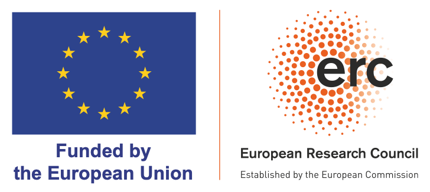
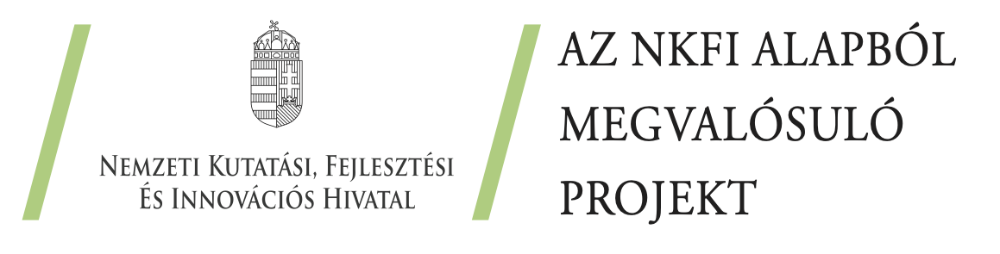

## {.quote-slide}

::: {.quote-container}
{.avatar}

> "I ship code I don't read."

[Peter Steinberger]{.speaker}
[PSPDFKit founder (2024)]{.source}
:::

## {.quote-slide}

::: {.quote-container}
{.avatar}

::: {.big-number-inline}
70–90%
:::

of code at Anthropic is written by Claude

[Dario Amodei]{.speaker}
[Axios AI+ Summit (2025)]{.source}
:::

## The AI coding revolution {.stat-slide}

::: {.big-number}
30%
:::

::: {.stat-context}
of new code at Google is AI-generated
:::

::: {.source}
Pichai (2024)
:::

## What is "vibe coding"?

- AI agent selects and assembles open source packages
- User describes intent, gets working software
- [User never reads docs, files bugs, or engages with maintainers]{.highlight}

## The puzzle

Usage [↑]{.highlight}

Engagement [↓]{.highlight}

How can both be true?

## Tailwind CSS: A case study

::: {.source}
npm downloads vs Stack Overflow questions
:::

## {.quote-slide}

::: {.quote-container}
{.avatar}

> "Traffic to our docs is down 40% despite Tailwind being more popular than ever. Revenue is down close to 80%."

[Adam Wathan]{.speaker}
[Tailwind CSS creator (2026)]{.source}
:::

## Stack Overflow is dying

::: {.source}
25% decline after ChatGPT launch (del Río-Chanona et al., 2024)
:::

## Two channels

::: {.two-col}
::: {.column}
**Productivity**

AI lowers cost of using and building on OSS
:::

::: {.column}
**Demand diversion**

Users don't engage, maintainers lose revenue
:::
:::

## How OSS maintainers earn returns

- Documentation visits → consulting leads
- Bug reports → reputation → job offers
- Stars/downloads → sponsorships

[All require direct engagement]{.highlight}

## A model of the OSS ecosystem

- Developers create packages, decide whether to share
- Users choose packages, choose how to use them
- Vibe coding: higher productivity, lower engagement

[π = π̄(1 - v)]{.equation}

Revenue falls with vibe coding share v

## Which channel wins?

Productivity gain: [~12%]{.highlight} cost reduction

Revenue loss: [~70%]{.highlight} at high adoption

[Demand diversion dominates]{.highlight}

## Long-run equilibrium

- Entry falls → fewer new packages
- Variety shrinks → less choice
- Quality declines → worse software

[Welfare can fall despite better AI]{.highlight}

## The magnification trap

The same feedback loop that grew OSS...

more entry → better ecosystem → lower costs → more entry

...now works in reverse

[less entry → worse ecosystem → higher costs → less entry]{.highlight}

## What would save OSS? {.stat-slide}

::: {.big-number}
84%
:::

::: {.stat-context}
of revenue must come from sources independent of how users access the software
:::

## A Spotify model for OSS

- AI platforms already track which packages they use
- Revenue sharing based on attributable usage
- Infrastructure for redistribution exists

[The technology is ready. The will is not.]{.highlight}

## Takeaway

Vibe coding is a [fundamental shift]{.highlight} in how software is produced and consumed.

The productivity gains are real. So is the threat to OSS.

::: {.source}
koren.mk
:::

## Acknowledgements {.disclaimer}

::: {.columns}
:::: {.column width=50%}

::::
:::: {.column width=50%}

::::
:::

This research was funded by the European Union under the Horizon Europe grant 101061123 and by the National Research, Development and Innovation Office (Forefront Research Excellence Program contract number 144193). Views and opinions expressed are those of the authors only and do not necessarily reflect those of the European Union, the European Commission, or the National Research, Development and Innovation Office.
