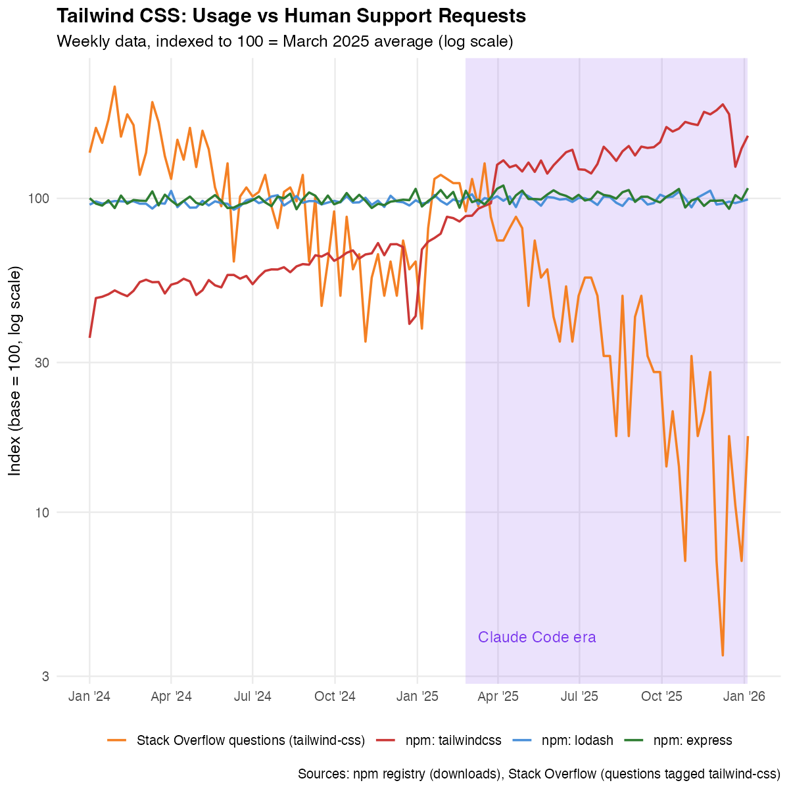
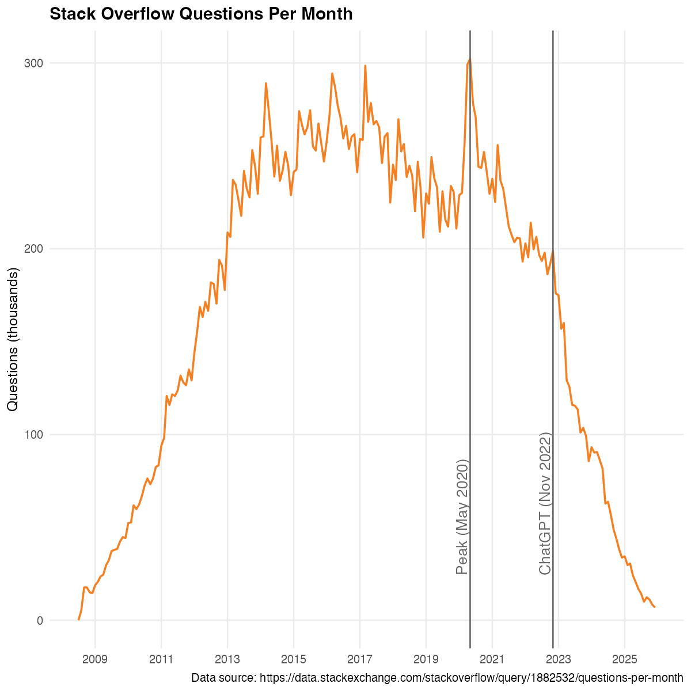

## The AI coding revolution

::: {.big-number}
30%
:::

of new code at Google is AI-generated

::: {.source}
Pichai (2024)
:::

## What is "vibe coding"?

- AI agent selects and assembles open source packages
- User describes intent, gets working software
- [User never reads docs, files bugs, or engages with maintainers]{.highlight}

## The puzzle

Usage [↑]{.highlight}

Engagement [↓]{.highlight}

How can both be true?

## Tailwind CSS: A case study

::: {.source}
npm downloads vs Stack Overflow questions
:::

## The creator's perspective

> "Traffic to our docs is down 40% despite Tailwind being more popular than ever. Revenue is down close to 80%."

::: {.source}
Adam Wathan, Tailwind CSS creator (2026)
:::

## Stack Overflow is dying

::: {.source}
25% decline after ChatGPT launch (del Río-Chanona et al., 2024)
:::

## Two channels

::: {.two-col}
::: {.column}
**Productivity**

AI lowers cost of using and building on OSS
:::

::: {.column}
**Demand diversion**

Users don't engage, maintainers lose revenue
:::
:::

## How OSS maintainers earn returns

- Documentation visits → consulting leads
- Bug reports → reputation → job offers
- Stars/downloads → sponsorships

[All require direct engagement]{.highlight}

## A model of the OSS ecosystem

- Developers create packages, decide whether to share
- Users choose packages, choose how to use them
- Vibe coding: higher productivity, lower engagement

[π = π̄(1 - v)]{.equation}

Revenue falls with vibe coding share v

## Which channel wins?

Productivity gain: [~12%]{.highlight} cost reduction

Revenue loss: [~70%]{.highlight} at high adoption

[Demand diversion dominates]{.highlight}

## Long-run equilibrium

- Entry falls → fewer new packages
- Variety shrinks → less choice
- Quality declines → worse software

[Welfare can fall despite better AI]{.highlight}

## The magnification trap

The same feedback loop that grew OSS...

more entry → better ecosystem → lower costs → more entry

...now works in reverse

[less entry → worse ecosystem → higher costs → less entry]{.highlight}

## What would save OSS?

::: {.big-number}
84%
:::

of revenue must come from sources independent of how users access the software

## A Spotify model for OSS

- AI platforms already track which packages they use
- Revenue sharing based on attributable usage
- Infrastructure for redistribution exists

[The technology is ready. The will is not.]{.highlight}

## Takeaway

Vibe coding is a [fundamental shift]{.highlight} in how software is produced and consumed.

The productivity gains are real. So is the threat to OSS.

::: {.source}
koren.mk · codedthinking.com
:::
