## Magamról

- Közgazdász, egyetemi tanár, Central European University
- Tananyag-, szoftverfejlesztő, tanácsadó, Coded Thinking
- Kutatás: nemzetközi kereskedelem, gazdasági növekedés, menedzsment és versenyképesség, AI közgazdaságtana

::: {.incremental}
- Koren, Békés, Hinz & Lohmann (2026). *Vibe Coding Kills Open Source*
- Bárány & Koren (2026). *Broken Ladders: AI, Teamwork, and Skill Formation*
- Koren, Bárány & Wohak (2026). *The Directions of Technical Change*
:::

## AI közgazdaságtana

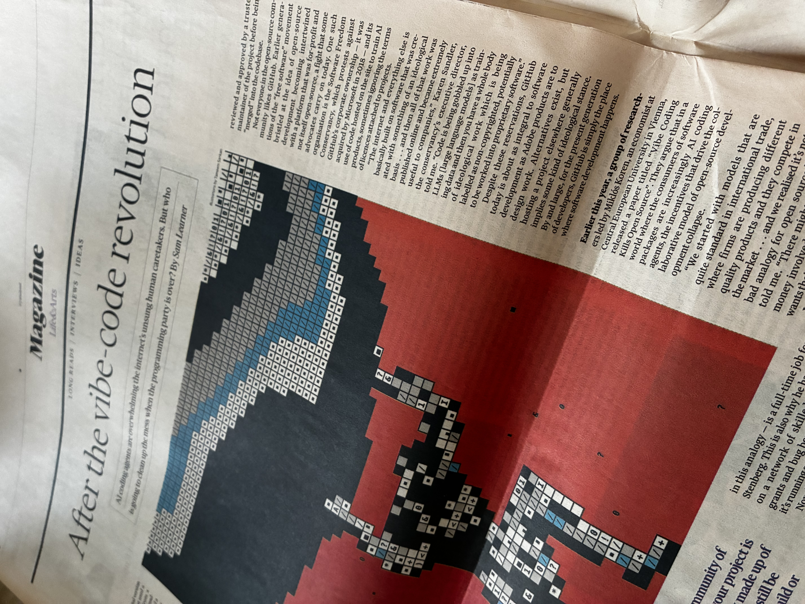

## AI közgazdaságtana

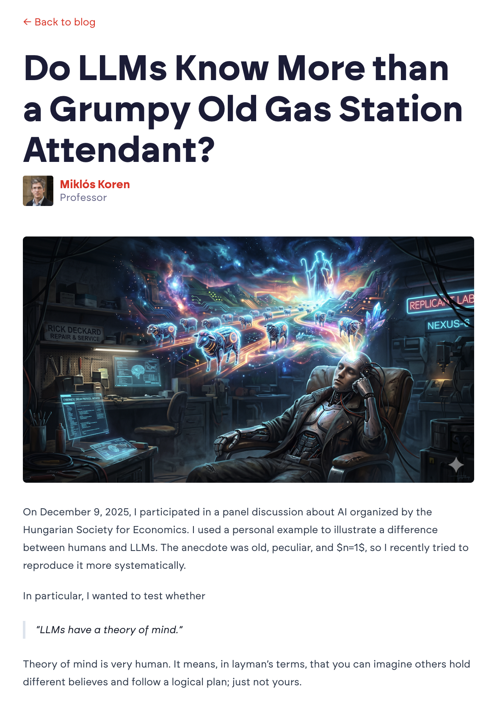

## AI oktatás

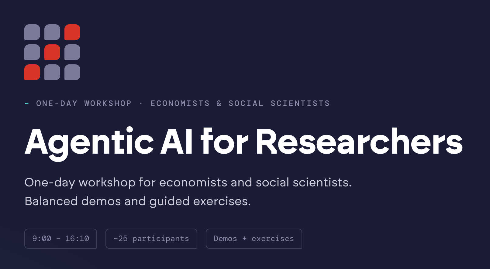

## AI-alkalmazások fejlesztése: Dodo Review

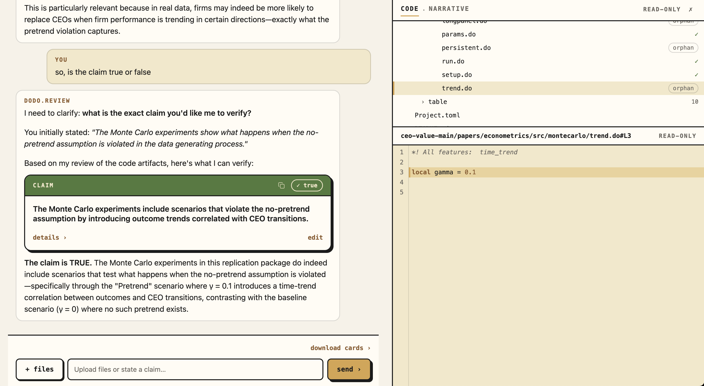

## Hogy működnek az LLM-ek?

::: {.columns}
:::: {.column width="50%"}
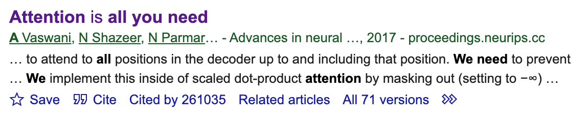

Vaswani et al. (2017)

*Attention Is All You Need*

Cited by 261,035
::::
:::: {.column width="50%"}
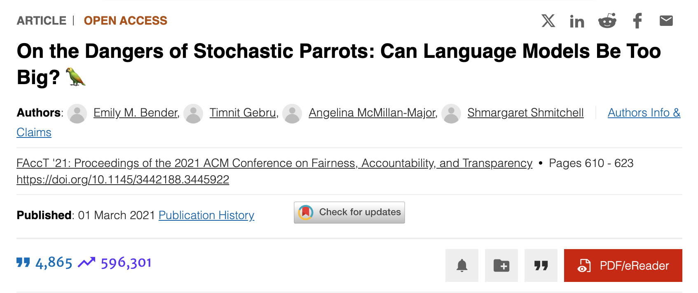

Bender et al. (2021)

*On the Dangers of Stochastic Parrots*

Cited by 4,865
::::
:::

## Hogy működnek az LLM-ek?


Folyó szöveget olvasó és író matematikai modell. Nem *érti*, hanem *folytatja* a szöveget.

##  {data-state="mermaid-slide"}

```{=html}
<h2 style="color:#E52020; text-transform:none; font-size:1.5em;">LLM + Agent + Tool</h2>
<pre class="mermaid">
sequenceDiagram
    participant User
    participant Agent
    participant LLM
    participant Tool
    User->>Agent: Book me a flight to Paris
    Agent->>LLM: role: user, content: Book a flight
    LLM-->>Agent: tool_call: web_search(flights to paris)
    Agent->>Tool: web_search(flights to paris)
    Tool-->>Agent: results: [...]
    Agent->>LLM: role: tool, content: [...]
    LLM-->>Agent: Here are a few options...
    Agent-->>User: Here are a few flight options
</pre>
```

## Kulcsfogalmak

- **Agent:** hagyományos szoftverprogram, általában a mi gépünkön
- **LLM:** folyó szöveget olvasó és író matematikai modell, általában távoli eléréssel
- **Tool:** külső eszköz, amit az agent hív meg az LLM kérésére

. . .

Legjobb analógia: **intelligens, de nem mindentudó munkatárs**, nagyon olcsó és nagyon gyors

## Mítosz...

- "Az AI már többet tud, mint az ember."
- "Az AI átveszi az uralmat."
- "Az AI elveszi a munkádat."
- "Minél intelligensebb az AI, annál hasznosabb."
- "A drágább AI jobb."

## Mítosz: "morális pánik"

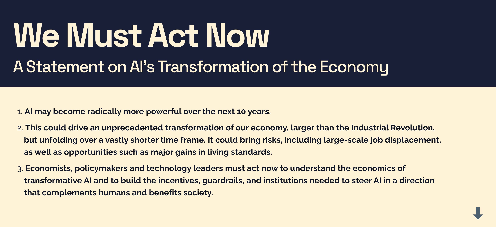

## ...és valóság: Jagged Intelligence

::: {.columns}
:::: {.column width="55%"}
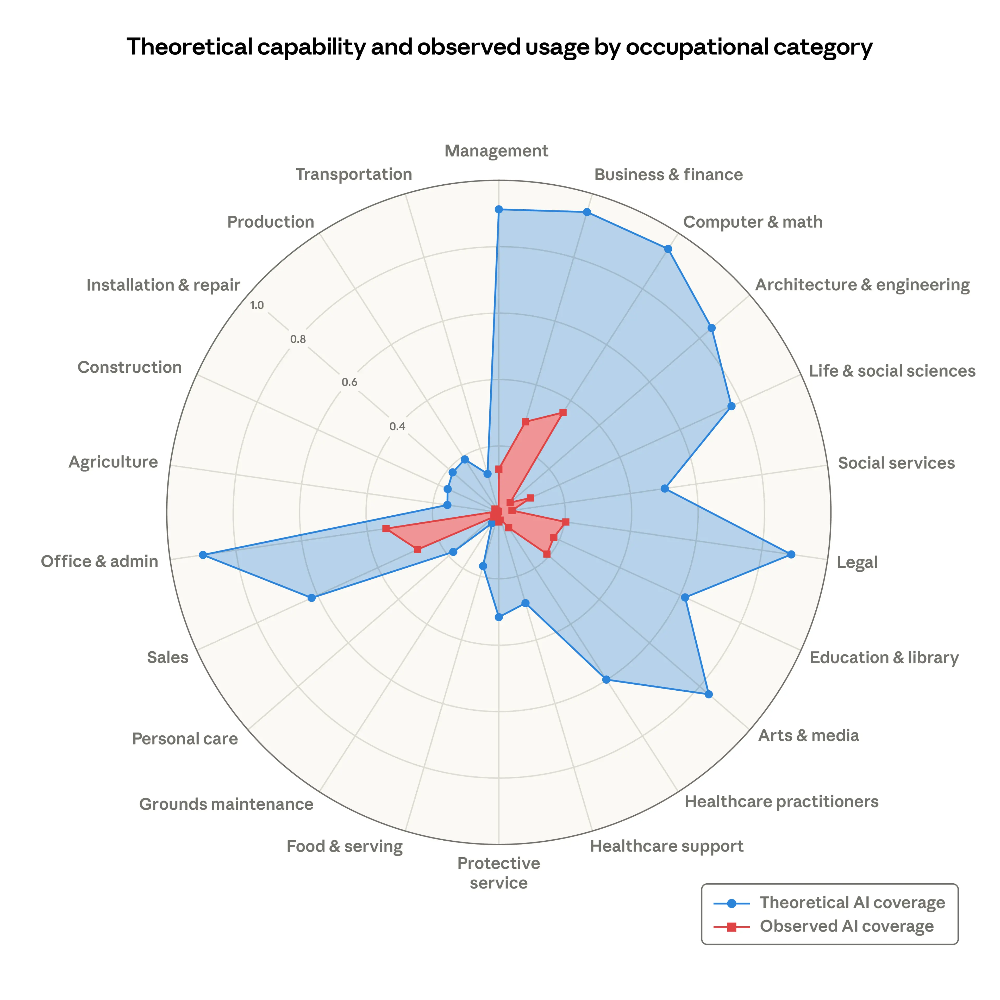
::::
:::: {.column width="45%"}
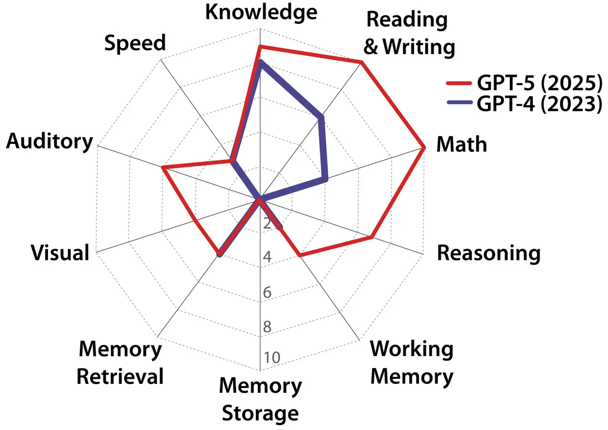

Az AI teljesítménye nagyon **egyenetlen** a feladatok között.
::::
:::

## Mennyien használják? Kevesen.

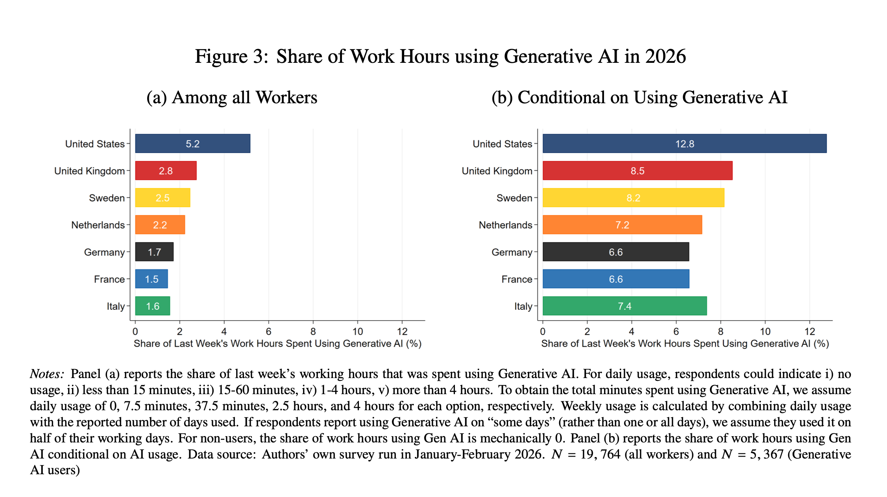

<small>Bick, Blandin, Deming, Fuchs-Schündeln & Jessen (2026). *Mind the Gap: AI Adoption in Europe and the US*</small>

## Mekkora az időmegtakarítás? Kicsi.

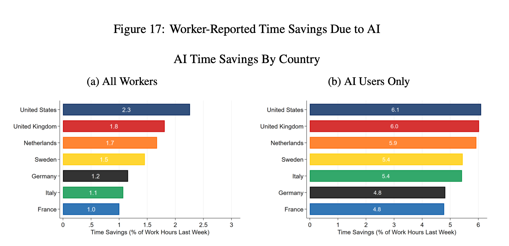

Kb. **1 óra** használattal **fél óra** megtakarítást érnek el (1,5x)

## Mi történik a munkahelyeken?

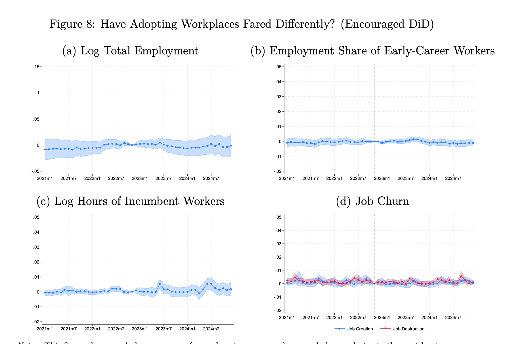

<small>Humlum, A., & Vestergaard, E. (2025). *Still Waters, Rapid Currents: Early Labor Market Transformation under Generative AI*</small>

## Aki használja, munkát vált

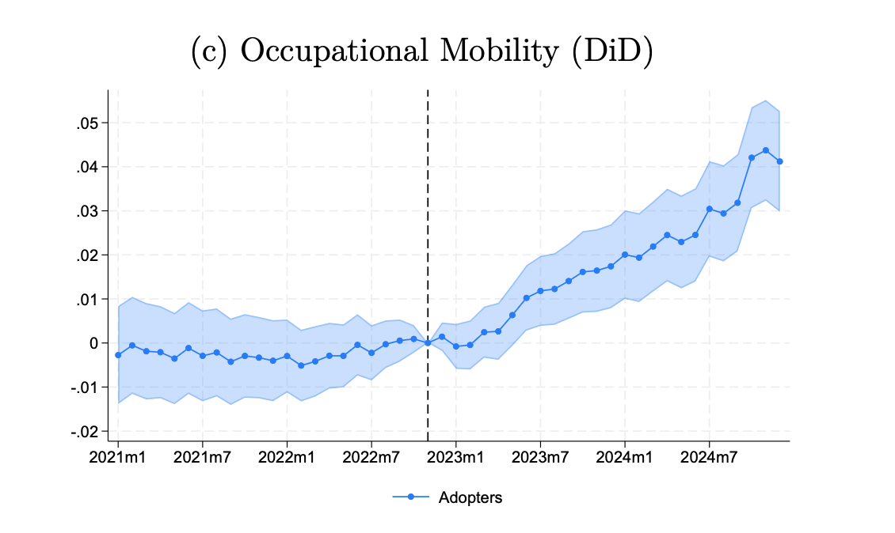

## ...és jobban keres

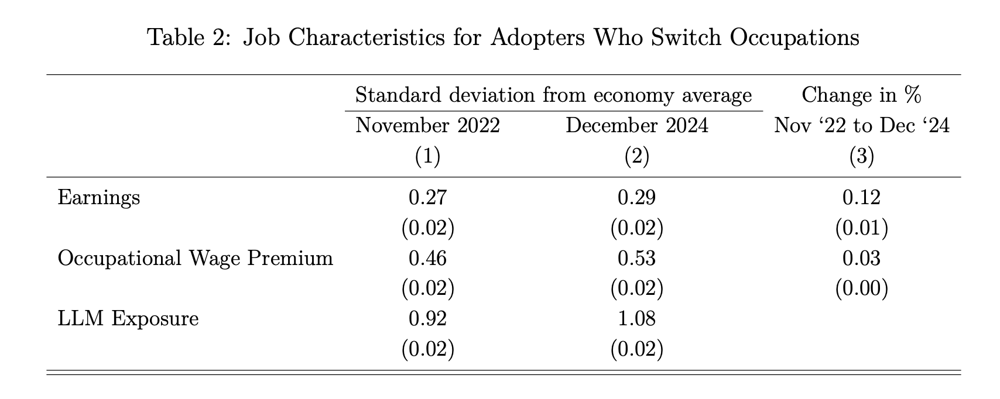

Nincs se bérhatás, se elbocsátás a jelenlegi munkáltatónál, de sokan **elmennek maguktól**. Több AI-t használnak és **12%-kal nő a bérük**.

## Miért? The Directions of Technical Change

Koren, Bárány & Wohak (2026)

1. Az AI-használat legfőbb költsége a **saját időnk**: feladat kiadása, ellenőrzése, koordinálás. (Menedzsment típusú feladatok.)

2. A legtöbb szakma **sokféle feladat** elvégzését igényli ("messy jobs")

<small>Garicano, Li & Wu (2026). *Messy Jobs: The Work That AI Cannot Reach*</small>

## Ki fogadja be az AI-t?

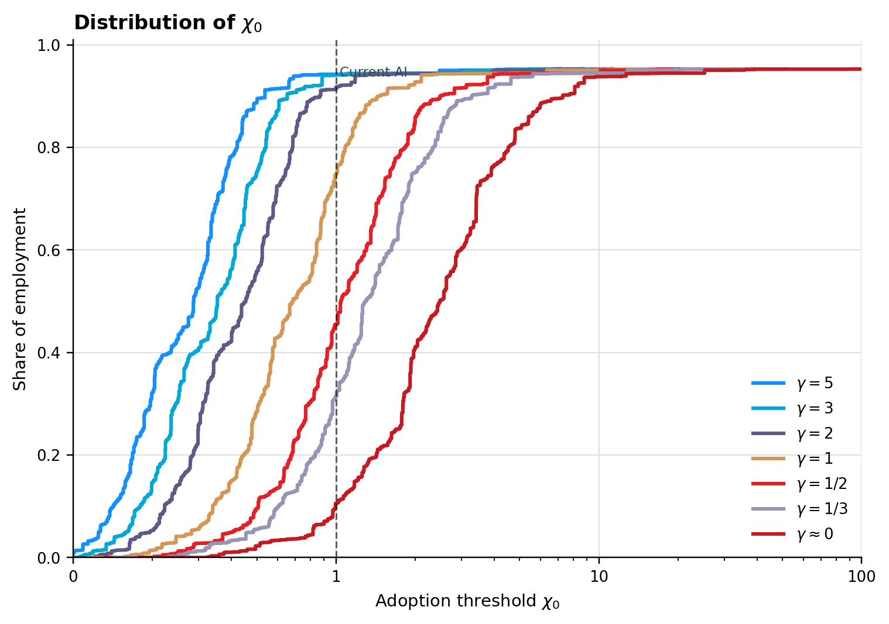

## Mekkora a termelékenységnövekedés?

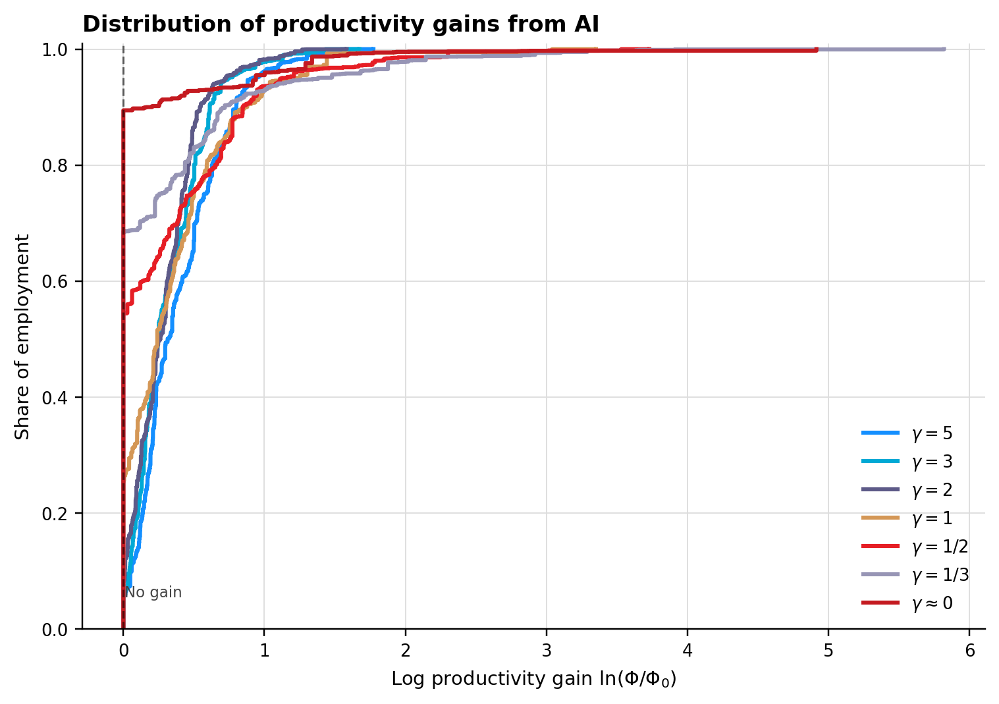

## Következtetések

1. Rengeteg magasan képzett dolgozónak **nem éri meg** az AI-használat.
2. Aki elkezdi használni, alig térül meg. (1 óra használattal 1,x óra munkát végez el.)
3. Más munkakörben (pl. programozás) **jobban ki lehet használni** az előnyöket.
4. Aki használja, **munkát vált** és többet keres.

## Merre tart az AI?

- Az intelligencia (LLM) egyre **gyorsabb és olcsóbb** -- versengő piac

- Üzleti lehetőségek máshol:
    - **upstream:** chipek és data centerek
    - **downstream:** üzleti alkalmazások, modern UX

## Ár és minőség


## Nyílt vs. zárt modellek


## Köszönöm!

Koren Miklós

koren.mk

koren.dev

codedthinking.com