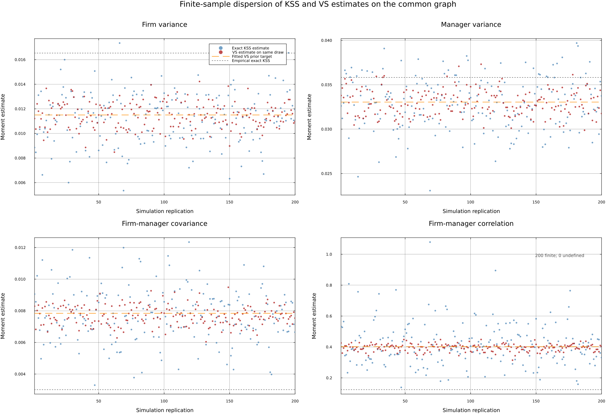

# Motivation

## Does the allocation of executive talent matter for GDP?

Misallocation lowers aggregate productivity \smallcite{Hsieh and Klenow 2009}

\pause

Executives are few, but their decisions scale with the firm.

Who runs which firm is a macro question.

<!-- TODO: add recent misallocation/talent-allocation citations from baby-boom repo and choo-siow-calvo issues -->

## A simple assignment model

Firm $i$ employs labor $L$ under fixed factors: fundamentals $A_i$ and executive talent $Z_m$,
$$
Y_{im} = A_i^{1-\nu} Z_m^{\nu} \cdot f(L)
$$
\pause
Diminishing returns to labor pin down firm scale. Substituting out labor, revenue is Cobb--Douglas in the *two fixed factors*:
$$
Y_{im} = A_i^{1-\nu} Z_m^{\nu}
$$

## Complementarity means assignment matters

$$
\frac{\partial^2 Y}{\partial A\, \partial Z} > 0
$$

The efficient allocation matches better executives to better firms \smallcite{Becker 1973, Lucas 1978}

## Sorting shows up directly in GDP

Sum over the $n$ matches. With $a=\ln A$, $z=\ln Z$ jointly normal,
$$
\frac{Y}{n} = \exp\Big\{(1-\nu)\mu_a + \nu\mu_z + \tfrac{1}{2}\big[(1-\nu)^2\sigma_a^2 + \nu^2\sigma_z^2\big] + \nu(1-\nu)\,\mathrm{Cov}(a,z)\Big\}
$$

\pause

> Holding marginal distributions fixed, GDP increases in $\mathrm{Cov}(a,z)$.

## Talent allocation in one picture

\begin{center}
\begin{tikzpicture}[
  frm/.style={rectangle, draw=black!70, fill=black!8, thick, minimum size=6mm, inner sep=1pt, font=\scriptsize},
  mgr/.style={circle, draw=black!70, fill=white, thick, minimum size=6mm, inner sep=1pt, font=\scriptsize},
  lnk/.style={dashed, black!60, thick},
  scale=0.82, every node/.style={transform shape}
]
\node[font=\small\bfseries] at (0,0.9) {firms, ranked};
\node[font=\small\bfseries] at (6,0.9) {executives, ranked};
\foreach \r in {1,...,8} {
  \node[frm] (a\r) at (0,-0.72*\r) {$A_{\r}$};
  \node[mgr] (z\r) at (6,-0.72*\r) {$Z_{\r}$};
}
\draw[lnk] (a1) -- (z2);
\draw[lnk] (a2) -- (z1);
\draw[lnk] (a3) -- (z3);
\draw[lnk] (a4) -- (z6);
\draw[lnk] (a5) -- (z4);
\draw[lnk] (a6) -- (z5);
\draw[lnk] (a7) -- (z8);
\draw[lnk] (a8) -- (z7);
\end{tikzpicture}
\end{center}

How far is the economy from the diagonal?

## The question, in two layers

### Layer 1: a macro question
How strongly are productive firms matched with talented executives?

\pause

### Layer 2: measuring something with nothing
Neither $A_i$ nor $Z_m$ is observable.

## How can we measure executive talent?

Surveys and diaries of what executives do \smallcite{Bandiera et al 2020}

Observable characteristics: education, experience, style

\pause

**From outcomes**: executives who move reveal their persistent contribution \smallcite{Bertrand and Schoar 2003, Abowd, Kramarz and Margolis 1999}

## What we do

1. Use the **mobility network**: chains of moves connect firms and executives that never meet
2. We do *not* estimate a latent talent for every executive
3. We estimate the parameters of a **sorting model**

## Our object of interest: four parameters

$(A_i, Z_m)$ of matched pairs jointly lognormal, plus match noise:
$$
y_{im} = a_i + z_m + \varepsilon_{im},
\qquad
\begin{pmatrix} a_i \\ z_m \end{pmatrix} \sim \mathcal{N}\left( \mathbf{0},
\begin{bmatrix} \sigma_a^2 & \rho\sigma_a\sigma_z \\ \rho\sigma_a\sigma_z & \sigma_z^2 \end{bmatrix}
\right)
$$

$$
\boldsymbol\theta = (\sigma_a, \quad \sigma_z, \quad \rho, \quad \sigma_\varepsilon)
$$

$\rho$ = sorting. How we estimate it: hold that thought.

# Prior art: fixed effects

## Mobility reveals talent

A firm switches executives; performance jumps.

An executive improves *every* firm they run.

\pause

Treat $a_i$, $z_m$ as *parameters* and run OLS with two sets of dummies:
$$
y_{im} = a_i + z_m + \varepsilon_{im}
$$

Labor: \smallcite{Abowd, Kramarz and Margolis 1999; Andrews et al 2008; Kline, Saggio and Sølvsten 2020}. Executives: \smallcite{Bertrand and Schoar 2003; Fenizia 2022; Metcalfe, Sollaci and Syverson 2023}

## Problem 1: fixed effects need a connected component

Effects are identified only *within* a connected component of the mobility graph.

Standard practice: keep the largest component, drop the rest.

## Problem 2: noise biases second moments

Because of $\varepsilon$ --- not lack of mobility --- estimated effects are noisy.

\pause

Second moments, exactly what we care about, are biased:
$\widehat{\mathrm{Var}}$ too big, $\widehat{\mathrm{Cov}}$ too small \smallcite{Andrews et al 2008; Koren, Orbán and Telegdy 2025}

Limited mobility makes both problems worse.

## Both problems are worse for executives

Executive mobility is rare: the graph is very sparse.

Hundreds of thousands of disconnected components.

Firm outcomes are noisy.

\pause

> Estimates are especially noisy --- *and* the usual corrections do not apply.

## The leave-one-out correction and leverage

Idea \smallcite{Kline, Saggio and Sølvsten 2020}: estimate each effect *without* observation $i$.

FE estimates are linear in outcomes; observation $i$ enters its own fitted value with weight $h_i$ = **leverage**. Bias correction re-weights by $1/(1-h_i)$.

\pause

### The catch
When $h_i = 1$, the effect is estimable *only* from observation $i$. The correction divides by zero.

**$h_i = 1$ exactly when edge $i$ is a bridge.**

## A detour: trees, forests, cycles, bridges

\begin{center}
\begin{tikzpicture}[
  nd/.style={circle, draw=black!70, fill=white, thick, minimum size=4.5mm, inner sep=0pt},
  ed/.style={draw=black!50, thick},
  brd/.style={draw=CTred, very thick},
  cyc/.style={draw=blue!60!black, very thick},
  lab/.style={font=\scriptsize\bfseries, align=center},
  scale=0.8, every node/.style={transform shape}
]
\node[lab] at (0,1.1) {a tree:\\ no cycles};
\node[nd] (t1) at (0,0) {};
\node[nd] (t2) at (-0.8,-1) {};
\node[nd] (t3) at (0.8,-1) {};
\node[nd] (t4) at (-1.3,-2) {};
\node[nd] (t5) at (-0.3,-2) {};
\draw[brd] (t1) -- (t2); \draw[brd] (t1) -- (t3);
\draw[brd] (t2) -- (t4); \draw[brd] (t2) -- (t5);
\node[lab] at (3.6,1.1) {a forest:\\ disjoint trees};
\node[nd] (f1) at (3.1,0) {};
\node[nd] (f2) at (3.1,-1) {};
\draw[brd] (f1) -- (f2);
\node[nd] (f3) at (4.1,-0.5) {};
\node[nd] (f4) at (4.1,-1.5) {};
\node[nd] (f5) at (4.7,-0.9) {};
\draw[brd] (f3) -- (f4); \draw[brd] (f3) -- (f5);
\node[lab] at (7.2,1.1) {a cycle:\\ two paths between nodes};
\node[nd] (c1) at (6.6,-0.2) {};
\node[nd] (c2) at (7.8,-0.2) {};
\node[nd] (c3) at (7.8,-1.4) {};
\node[nd] (c4) at (6.6,-1.4) {};
\draw[cyc] (c1) -- (c2) -- (c3) -- (c4) -- (c1);
\node[lab] at (11.4,1.1) {a bridge:\\ removing it disconnects};
\node[nd] (b1) at (10.2,-0.2) {};
\node[nd] (b2) at (10.2,-1.4) {};
\node[nd] (b3) at (10.9,-0.8) {};
\node[nd] (b4) at (11.9,-0.8) {};
\node[nd] (b5) at (12.6,-0.2) {};
\node[nd] (b6) at (12.6,-1.4) {};
\draw[cyc] (b1) -- (b2) -- (b3) -- (b1);
\draw[cyc] (b4) -- (b5) -- (b6) -- (b4);
\draw[brd] (b3) -- (b4);
\end{tikzpicture}
\end{center}

On a tree, *every* edge is a bridge. Bridges also connect cycles: the tree-like edges of a general graph.

## Which edges can the leave-out correction use?

\begin{center}
\begin{tikzpicture}[
  mgr/.style={circle, draw=black!70, fill=white, thick, minimum size=5mm, inner sep=0pt, font=\tiny},
  frm/.style={rectangle, draw=black!70, fill=black!8, thick, minimum size=5mm, inner sep=0pt, font=\tiny},
  brd/.style={draw=CTred, very thick},
  keep/.style={draw=blue!60!black, very thick},
  scale=0.9, every node/.style={transform shape}
]
\node[mgr] (m1) at (0,0) {};
\node[frm] (f1) at (1.5,0.6) {};
\node[frm] (f2) at (1.5,-0.6) {};
\node[mgr] (m2) at (3,0) {};
\node[frm] (f3) at (4.5,0.8) {};
\node[mgr] (m3) at (6,0.8) {};
\node[frm] (f4) at (4.5,-0.8) {};
\node[mgr] (m4) at (6,-0.8) {};
\node[frm] (f5) at (7.5,-0.8) {};
\node[mgr] (m5) at (9,-0.4) {};
\node[mgr] (m6) at (9,-1.4) {};
\draw[keep] (m1) -- (f1) -- (m2) -- (f2) -- (m1);
\draw[brd] (m2) -- (f3);
\draw[brd] (f3) -- (m3);
\draw[brd] (m2) -- (f4);
\draw[brd] (f4) -- (m4);
\draw[brd] (m4) -- (f5);
\draw[brd] (f5) -- (m5);
\draw[brd] (f5) -- (m6);
\node[font=\scriptsize, blue!60!black, anchor=west] at (0,-1.9) {\textbf{blue}: on a cycle, leverage $<1$ --- usable};
\node[font=\scriptsize, CTred, anchor=west] at (0,-2.4) {\textbf{red}: bridges, leverage $=1$ --- dropped};
\end{tikzpicture}
\end{center}

Squares are firms, circles are executives, edges are jobs.

## The Hungarian executive mobility network

Universe of Hungarian corporations and their chief executives, 1990--2022. An *observation* is an edge with an outcome: firm performance under that executive.

| | Value |
|:---|---:|
| Executives | 1,304,580 |
| Firms | 1,036,231 |
| Firm--executive edges | 1,937,552 |
| Connected components | 514,085 |
| **Bridge share of edges** | **81.8%** |
| Mean shortest path between executives (giant) | 19.5 |

The graph is close to a forest, with long, sparse chains.

## Leave-out estimation keeps one in ten observations

| Stage | Matched pairs | % |
|:---|---:|---:|
| All unique firm--executive pairs | 1,732,154 | 100.0% |
| Drop bridges (leverage $=1$) | 265,995 | 15.4% |
| Keep largest leave-out-connected block | 175,661 | **10.1%** |

<!-- TODO: notes mention a giant-component stage first and a 4.6% end point; committed kss_funnel.tex has the two stages above (10.1%). Reconcile. Giant component alone would keep 42.5% of edges. -->

\pause

The survivors are highly mobile executives at highly connected firms --- not representative.

For a macro question, dropping 90% of the economy will not do.

# Our approach: a random-effects model on the network

## We model the joint distribution of all outcomes

Instead of estimating 2.3 million fixed effects, model the **joint distribution** of 1.7 million outcomes:
$$
\mathbf{x} = (a_1,\ldots,a_{N_f},z_1,\ldots,z_{N_m})^\top \sim \mathcal{N}(\mathbf{0}, \mathbf{Q}^{-1}),
\qquad y_{im} = a_i + z_m + \varepsilon_{im}
$$

A **Gaussian Markov random field** \smallcite{Rue and Held 2005}: the sparse precision matrix $\mathbf{Q}$ encodes the mobility graph.

Same four parameters: $\sigma_a$, $\sigma_z$, $\rho$, $\sigma_\varepsilon$.

## Maximum likelihood

$$
\ell(\boldsymbol{\theta}) = -\frac{K}{2}\ln(2\pi) - \frac{1}{2}\ln\det\boldsymbol{\Omega} - \frac{1}{2}\mathbf{y}^\top\boldsymbol{\Omega}^{-1}\mathbf{y}
$$

$$
\boldsymbol{\Omega} = \mathbf{V}\mathbf{Q}^{-1}\mathbf{V}^\top + \sigma_\varepsilon^2\mathbf{R}
\qquad\text{($\mathbf V$ maps matches to types)}
$$

$$
\mathbf Q=\frac{1}{1-\rho^2}\,\mathbf S
\left[(1-\rho^2)\mathbf I+\rho^2\mathbf D-\rho\mathbf A\right]
\mathbf S,
\qquad \mathbf S=\operatorname{diag}(\sigma_a^{-1}\mathbf I_{N_f},\,\sigma_z^{-1}\mathbf I_{N_m})
$$

$\mathbf A$ = adjacency, $\mathbf D$ = degrees, $\rho$ on the edges, scales on the diagonal.

## The precision matrix, one edge at a time

Zoom in on a single firm--executive pair (degree 1 each):
$$
\mathbf{Q}_{\{i,m\}} = \frac{1}{1-\rho^2}
\begin{bmatrix}
\sigma_a^{-2} & -\rho\,\sigma_a^{-1}\sigma_z^{-1} \\
-\rho\,\sigma_a^{-1}\sigma_z^{-1} & \sigma_z^{-2}
\end{bmatrix}
\;\Longleftrightarrow\;
\operatorname{Var}\begin{pmatrix} a_i \\ z_m \end{pmatrix} =
\begin{bmatrix}
\sigma_a^{2} & \rho\,\sigma_a\sigma_z \\
\rho\,\sigma_a\sigma_z & \sigma_z^{2}
\end{bmatrix}
$$

Off-diagonal entries of $\mathbf{Q}$ are nonzero **only along observed edges**.

On a forest, every linked pair has correlation exactly $\rho$.

# Detour: Gaussian Markov random fields

## What is a Gaussian Markov random field?

Jointly normal variables with a **sparse precision matrix**.

\pause

Zero in $\mathbf{Q}$ $\Leftrightarrow$ conditional independence given everyone else.

*Conditional* dependence is local --- only direct neighbors.

*Unconditional* dependence travels along paths.

## The best-known GMRF: an AR(1)

$x_t = \rho x_{t-1} + u_t$ on a line graph:
$$
\mathbf{Q} \propto
\begin{bmatrix}
1 & -\rho & & \\
-\rho & 1+\rho^2 & -\rho & \\
 & -\rho & 1+\rho^2 & -\rho \\
 & & -\rho & 1
\end{bmatrix}
$$

\pause

Partial correlation: only with neighbors. Unconditional autocorrelation at lag $d$: $\rho^d$.

Sparse precision, dense covariance.

## On a tree, the GMRF looks just like an AR(1)

$$
\operatorname{Cov}(x_k, x_\ell) = \sigma_k \sigma_\ell\, \rho^{\,d(k,\ell)}
$$

A tree is a branching timeline: unique paths, geometric decay per hop.

Our variance-stable $\mathbf{Q}$ keeps marginals at $\sigma_a^2$, $\sigma_z^2$ on any forest.

## Real networks have cycles

Multiple paths push covariances above $\rho^d$.

The GMRF handles cycles exactly, through $\mathbf{Q}^{-1}$.

\pause

But where does this particular $\mathbf{Q}$ *come from*?

# Where the GMRF comes from: link formation

## A statistical model of link formation

Not a competitive equilibrium --- a selection model for which type pairs appear as links.

For equilibrium sorting with frictions, see \smallcite{Shimer and Smith 2000, Eeckhout and Kircher 2010, Bagger and Lentz 2019}

\pause

Before links form, firm and executive types are **independent**:
$$
a \sim \mathcal{N}(0, \omega_a^2), \qquad z \sim \mathcal{N}(0, \omega_z^2)
$$

Any correlation among *linked* pairs must come from link formation.

## Match or not: a logit

Payoff from matching: the surplus $a_i z_m$.

Payoff from not matching: outside options, quadratic in own type.

\pause

$$
\Pr(L_{im}=1\mid a_i,z_m)
=\frac{e^{\eta(a_i,z_m)}}{1+e^{\eta(a_i,z_m)}},
\qquad
\eta = \kappa+\frac{1}{\tau}
\Big[a_i z_m-\alpha_1a_i-\zeta_1z_m
-\frac{\alpha_2}{2}a_i^2-\frac{\zeta_2}{2}z_m^2\Big]
$$

$\tau$ scales match frictions. The cross derivative of $\eta$ is positive: complementarity.

## The likelihood of the observed graph

Joint density of types and links: prior $\times$ each edge that did or did not happen,
$$
p(\mathbf x, E) \propto p_0(\mathbf x)
\prod_{(i,m)\in E}\Pr(L_{im}{=}1\mid \mathbf x)
\prod_{(i,m)\notin E}\Pr(L_{im}{=}0\mid \mathbf x)
$$

\pause

Links are rare events. When $e^{\eta}$ is small,
$$
\Pr(L_{im}=1\mid a_i,z_m)\simeq e^{\eta(a_i,z_m)}
\qquad\text{and absent pairs drop out.}
$$

The **sparse-link approximation**: keep only the positive links.

## The tilted distribution is exactly our GMRF

Each observed link adds a quadratic term to the exponent:
$$
p_E^+(\mathbf x)
\propto p_0(\mathbf x)\prod_{(i,m)\in E}e^{\eta(a_i,z_m)}
\propto \exp\Big(-\frac12\mathbf x^\top\mathbf Q\mathbf x + \mathbf b^\top\mathbf x\Big)
$$

$$
\mathbf Q = \underbrace{\mathbf Q_0}_{\text{indep.\ prior}}
+ \underbrace{\frac{1}{\tau}\,\mathbf C \mathbf D}_{\text{repeated selection}}
- \underbrace{\frac{1}{\tau}\,\mathbf A}_{\text{complementarity}}
\;=\; \frac{1}{1-\rho^2}\mathbf S\left[(1-\rho^2)\mathbf I+\rho^2\mathbf D-\rho\mathbf A\right]\mathbf S
$$

> An equality, not an analogy: with $\tau = \sigma_a\sigma_z(1-\rho^2)/\rho$, link formation *generates* the variance-stable precision.

## When is the approximation valid?

The sparse-link approximation drops the shared logit denominators.

Valid when the graph is sparse and forest-like; dense cyclical regions invalidate it.

\pause

So we **prune** the few cycle-closing edges in the dense core --- keeping every node and every component --- and estimate on the nearly-forest graph.

Opposite of leave-out: KSS lives on the cycles, we lean on the trees. But we keep the data.

<!-- TODO: pruning reduces the KSS-usable subsample further (from 10.1% to maybe half); add exact number once computed -->

## Pruning: what the graph allows

{ height=72% }

<!-- TODO: user prefers "the pruning figure actually produced by Ulrich in a commit/PR"; this is the committed rho_vs_rhomax.png. Flagged: it may still show the wrong (stale) rho estimate; possibly exclude for the talk. -->

# Identification

## Covariance decays along the tree

For two outcomes whose executives are $h$ edges apart:
$$
\mathrm{Cov}(y_{i_1 m_1},\, y_{i_2 m_2}) \;=\; \rho^{\,h-2}\,(\sigma_a + \rho\sigma_z)^2
$$

\pause

The **level** mixes $\sigma_a$, $\sigma_z$, $\rho$.

The **speed of decay** is $\rho^2$ per two hops --- *nothing else*.

Four parameters, many covariance moments.

## Gregory Clark measured decay on family trees

Correlation of social status between relatives $d$ steps apart on the family tree \smallcite{Clark 2023, PNAS}:
$$
\mathrm{Corr}(y_i, y_j) = \theta^2 b^{\,d(i,j)}
$$

<!-- TODO: verify Clark's exact notation from the PNAS paper (persistence b, attenuation theta); also add the earlier reference Clark himself credits -->

\pause

His formula is nearly ours. We got the idea from him.

Family trees are trees; mobility networks are almost trees.

## Covariance decay in the Hungarian data

{ height=75% }

## Prima facie evidence of sorting

\begin{center}
\begin{tikzpicture}[
  mgr/.style={circle, draw=black!70, fill=white, thick, minimum size=7mm, inner sep=0pt, font=\scriptsize},
  frm/.style={rectangle, draw=black!70, fill=black!8, thick, minimum size=7mm, inner sep=0pt, font=\scriptsize},
  ed/.style={draw=black!50, thick},
  hi/.style={draw=CTred, very thick},
  scale=0.9, every node/.style={transform shape}
]
\node[mgr] (m1) at (0,0) {$m_1$};
\node[frm] (i1) at (2,0) {$i_1$};
\node[mgr] (m2) at (4,0) {$m_2$};
\node[frm] (i2) at (6,0) {$i_2$};
\node[mgr] (m3) at (8,0) {$m_3$};
\draw[hi] (m1) -- (i1);
\draw[ed] (i1) -- (m2);
\draw[ed] (m2) -- (i2);
\draw[hi] (i2) -- (m3);
\node[font=\scriptsize, anchor=north] at (1,-0.5) {outcome $y_{i_1 m_1}$};
\node[font=\scriptsize, anchor=north] at (7,-0.5) {outcome $y_{i_2 m_3}$};
\end{tikzpicture}
\end{center}

$m_1$ and $m_3$ never share a firm; $i_1$ and $i_2$ never share an executive. **No common shocks.**

\pause

Yet their outcomes are correlated --- and the model says by how much: $\rho^{2}(\sigma_a + \rho\sigma_z)^2$.

Ratios of such moments deliver $\rho^2$ by method of moments, before any likelihood.

## What about within-firm shocks over time?

Consecutive spells at the *same firm* share transitory conditions: correlated $\varepsilon$, not sorting.

\pause

But common shocks are **localized**. Sorting is identified by the **speed of decay over long chains**.

## Three fixes that agree

1. **Minimum distance**: drop the contaminated same-firm moment
2. **Firm-average**: allow arbitrary within-firm dependence
3. **AR(1) match shocks**: estimate the error process (fifth parameter $\eta$)

All three give $\rho$ between 0.52 and 0.55.

# Results

## Sorting is high: $\rho \approx 0.52$--$0.55$

Same graph, same outcomes (log real revenue, demeaned by year and industry):

| Parameter | Naive MLE | Min. distance | Firm-average | AR(1) MLE |
|:---|---:|---:|---:|---:|
| $\rho$ | 0.379 | 0.555 | 0.537 | **0.518** |
| Implied corr. $(a,z)$ | 0.381 | 0.555 | 0.544 | 0.525 |

\pause

The naive i.i.d.-error MLE is biased *down*: within-firm shocks masquerade as firm heterogeneity.

Preferred AR(1) fit: $\hat\sigma_a = 1.08$, $\hat\sigma_z = 0.24$, $\hat\sigma_\varepsilon = 1.72$, $\hat\eta = 0.51$.

## GMRF vs leave-out on the common subgraph

Comparison is only possible on the sample both can use: the leave-out-connected block.

| | KSS | GMRF (AR1) |
|:---|---:|---:|
| Implied corr. $(a,z)$ | TBD | TBD |

<!-- TODO: task to recompute AR(1) on the joint (common) subsample is running; fill in table when estimates land. Interim: on dense worker data the GMRF reproduces leave-out; on the sparse executive network the estimators diverge (Wohak and Koren 2025). -->

## Counterfactuals: what is sorting worth?

Expected revenue per match under the lognormal model:
$$
\frac{Y}{n} = \exp\left\{\mu_a+\mu_z+\mu_\varepsilon+\tfrac{1}{2}\big(V_a+V_z+V_\varepsilon+2\operatorname{Cov}(a,z)\big)\right\}
$$

Hold the marginal distributions fixed, change the allocation, and read off the change in expected output.

## Three counterfactuals

| Scenario | $\Delta$ expected output |
|:---|---:|
| Random assignment ($\rho = 0$) | $-12.9\%$ |
| Compress talent dispersion, mean-preserving ($\sigma_z \to 0$) | $-12.9\%$ |
| Perfect sorting ($\rho = 1$) | $\approx +45\%$ |

<!-- TODO: reconcile. Paper: rho=0 costs 12.9% (V_cross=0.275). Committed sorting_counterfactual.csv: random reassignment -16.5%, perfect +44.9% (different convention/vintage). sigma_z compression holding E[Z] fixed removes exactly the covariance term, hence equals the rho=0 number -->

\pause

Killing talent dispersion costs exactly as much as scrambling the allocation: executives matter through *where they are*.

Perfect sorting is an upper bound, not a policy.

# Threats to identification

## The threat: similarity, not propagation

Outcomes on the network are correlated. Is it sorting?

\pause

The spells are at different times --- this is *similarity*, not shock propagation.

Similarity could come from shared sector, region, or cohort: the homophily critique of network measurement.

(What we *measure* is homophily of latent types --- the threat is homophily in something else.)

<!-- TODO (t9x task filed): review network econometrics on homophily and longer paths — Graham (excess variance contrasts), post-2020 surveys -->

## Our response: the Markov property is testable

The GMRF makes a strong, discrete prediction:

> Conditional on your direct neighbors, the rest of the network is irrelevant.

\pause

An edge is a discrete event, not "being close". A vague similarity story predicts second- and third-degree correlation *beyond* what direct links carry.

Check: does conditioning on direct links kill the residual correlation?

<!-- TODO: two conditional-independence checks in progress (planned for tomorrow) -->

Later: controls for spatial and industry proximity (industry is already removed).

## Placebo: disconnected components

Executives in disjoint components live in the same country, often the same industry.

The model predicts their outcomes have **zero** covariance.

Any common-shock story predicts otherwise.

<!-- TODO: compute covariance across disjoint components; planned for tomorrow -->

# Related work

## Executive effects in the literature

**Fenizia (2022)**: Italian public managers, KSS. Excellent --- but retains only about 25% of managers. Exactly the problem we started from.

<!-- TODO: verify Fenizia retention share -->

**Metcalfe, Sollaci and Syverson (2023)**: retail managers, *negative* estimated correlation.

\pause

Noise does that: inflated variances shrink the correlation, and the mechanical negative covariance of the two noisy effects pushes it below zero. (Mechanics in appendix.)

## Our companion papers

**Wohak and Koren (2025)**: leave-out on sparse graphs. KSS and the GMRF use *opposite* parts of the graph --- cycles vs bridges. Even off the bridges, high leverage makes second-moment estimates noisy, and noise plus nonnegativity constraints means bias.

**Koren, Orbán and Telegdy (2025)**: CEO value. A time-series estimator that removes spurious pre-trends from within-firm error correlation; after the correction, executive changes look unrelated to prior performance in the same Hungarian data.

# Conclusion

## Which estimator, when?

| Network | Estimator |
|:---|:---|
| Dense (much mobility) | leave-out (KSS) --- little data lost |
| Sparse, forest-like | GMRF |
| In between | run both, compare |

\pause

Sparsity is where the GMRF is happy --- and where fixed effects break.

## The method travels

Sparse networks with latent node types are everywhere:

buyer--supplier networks, international trade, ...

The graph need not be bipartite.

## Conclusion

1. Sorting between executive talent and firm fundamentals is **high**: $\rho \approx 0.52$--$0.55$
2. Four parameters replace millions of fixed effects --- using **all** the data, not 10%
3. Identification is transparent: covariance decay along mobility chains, and it is testable
4. Random assignment would cost **12.9%** of revenue

# Appendix

## Acknowledgements

::: columns
:::: column
{width=80%}
::::
:::: column
{width=80%}
::::
:::

This research was funded by the European Research Council (ERC Advanced Grant agreement number 101097789) and by the National Research, Development and Innovation Office (Forefront Research Excellence Program contract number 144193). The views expressed are those of the authors and do not necessarily reflect the official view of the European Union, the European Research Council, or the National Research, Development and Innovation Office.

## Why fixed-effects correlations come out negative

The FE estimates are linear combinations of outcomes, including the noise.

Whenever the firm effect loads *positively* on a noise term, the executive effect at the same match loads *negatively*: the two dummies share the same variation.

\pause

Inflated variances bias the correlation toward zero; the mechanical negative covariance pushes it further down.

Consistent with the literature: estimated correlations below what we find, some negative.

## Leave-out is noisy even where it exists

{ height=72% }

Simulations on the common graph: KSS second moments (blue) disperse far more than the GMRF (red).

## Model fit: where log-revenue variance goes

| Component | Share |
|:---|---:|
| Firm effects | 28.4% |
| Executive effects | 1.4% |
| Sorting covariance | 6.6% |
| Match noise (within-firm correlated) | 63.5% |

The sorting covariance is several times the executive component.

## The bipartite mobility graph

{ width=48% } { width=48% }

The giant component holds 42% of edges; the rest are mostly single firm--executive pairs.

## Monte Carlo: correlated errors on the Hungarian graph

{ height=75% }
