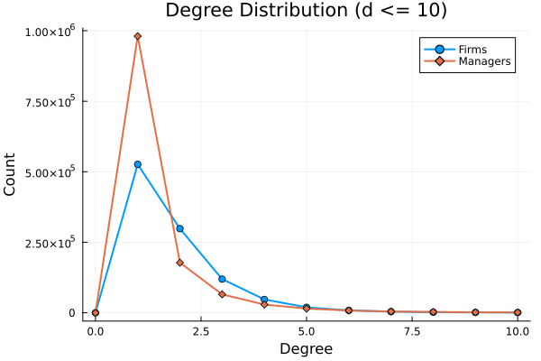
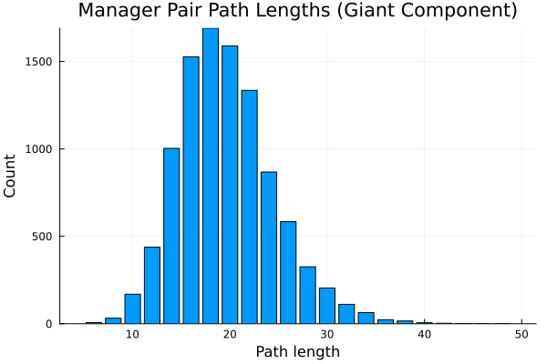
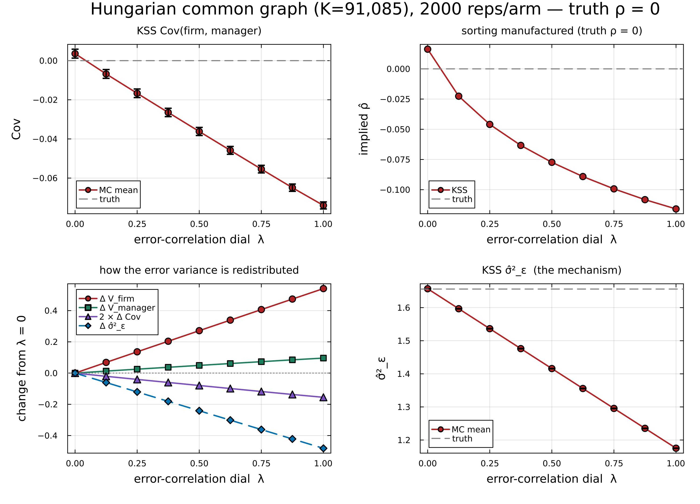
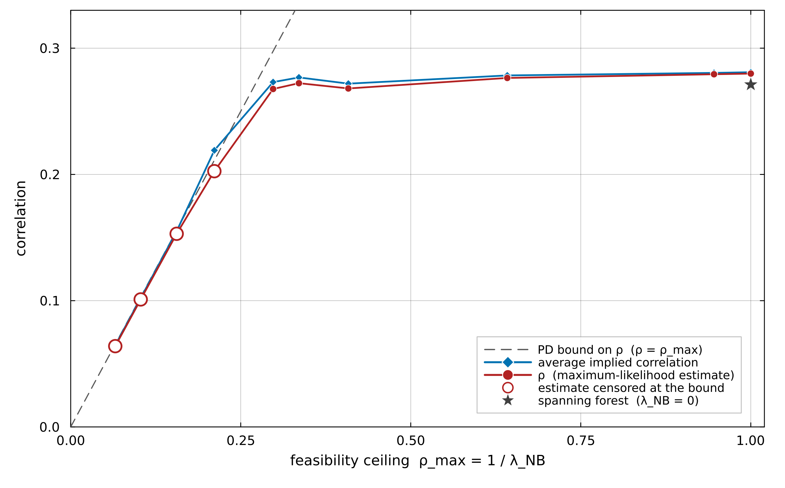

## Acknowledgements
::: {.columns}
:::: {.column width=50%}

::::
:::: {.column width=50%}

::::
:::

This research was funded by the European Research Council (ERC Advanced Grant agreement number 101097789) and by the National Research, Development and Innovation Office (Forefront Research Excellence Program contract number 144193). The views expressed are those of the authors and do not necessarily reflect the official view of the European Union, the European Research Council, or the National Research, Development and Innovation Office.

# Motivation

## Does the allocation of executive talent matter for GDP?

- Misallocation lowers aggregate productivity \smallcite{Hsieh and Klenow 2009}
- Talent is a fixed factor: who runs which firm matters
- Executives are few, but their decisions scale with firm size
- This is a macro question: we need the *whole* economy, not a selected sample

<!-- TODO: add recent misallocation/talent-allocation citations from baby-boom and choo-siow-calvo repos/issues -->

## A simple assignment model

Firm $i$ has fundamentals $A_i$, executive $m$ has talent $Z_m$. With variable inputs substituted out, revenue is Cobb--Douglas in the two *fixed factors*:
$$
Y_{im} = A_i^{1-\nu} Z_m^{\nu}
$$

### Two implications
- Diminishing returns to each factor pin down firm scale
- $\partial^2 Y / \partial A\, \partial Z > 0$: firm fundamentals and talent are **complements**

### Complementarity $\Rightarrow$ assignment matters
The efficient allocation matches better executives to better firms \smallcite{Becker 1973, Lucas 1978}

## Sorting shows up directly in GDP

Sum output across the $n$ matches in the economy. With $a=\ln A$, $z=\ln Z$ jointly normal (law of large numbers),
$$
\frac{Y}{n} = \exp\Big\{(1-\nu)\mu_a + \nu\mu_z + \tfrac{1}{2}\big[(1-\nu)^2\sigma_a^2 + \nu^2\sigma_z^2\big] + \nu(1-\nu)\,\mathrm{Cov}(a,z)\Big\}
$$

- Marginal distributions fixed: GDP is increasing in $\mathrm{Cov}(a,z)$
- **The covariance of talent and fundamentals across matches is an aggregate outcome**
- How large is it in the data?

## Talent allocation in one picture

\begin{center}
\begin{tikzpicture}[
  frm/.style={rectangle, draw=black!70, fill=black!8, thick, minimum size=6mm, inner sep=1pt, font=\scriptsize},
  mgr/.style={circle, draw=black!70, fill=white, thick, minimum size=6mm, inner sep=1pt, font=\scriptsize},
  lnk/.style={dashed, black!60, thick},
  scale=0.85, every node/.style={transform shape}
]
\node[font=\small\bfseries] at (0,0.9) {firms, ranked};
\node[font=\small\bfseries] at (6,0.9) {executives, ranked};
\foreach \r in {1,...,8} {
  \node[frm] (a\r) at (0,-0.75*\r) {$A_{\r}$};
  \node[mgr] (z\r) at (6,-0.75*\r) {$Z_{\r}$};
}
% imperfect positive sorting: mostly aligned, a few crossings
\draw[lnk] (a1) -- (z2);
\draw[lnk] (a2) -- (z1);
\draw[lnk] (a3) -- (z3);
\draw[lnk] (a4) -- (z6);
\draw[lnk] (a5) -- (z4);
\draw[lnk] (a6) -- (z5);
\draw[lnk] (a7) -- (z8);
\draw[lnk] (a8) -- (z7);
\end{tikzpicture}
\end{center}

Sorting is positive but imperfect. How far is the economy from the diagonal?

## The question and the challenge

### Layer 1: a macro question
How strongly are productive firms matched with talented executives, and what does the allocation contribute to aggregate output?

\pause

### Layer 2: measuring something with nothing
Neither firm fundamentals $A_i$ nor executive talent $Z_m$ is observable. How do you estimate a correlation between two latent variables?

## How can we measure executive talent?

- Surveys and diary studies of what executives do \smallcite{Bandiera et al 2020}
- Observable characteristics: education, experience, style
- **From outcomes:** executives who move reveal their persistent contribution \smallcite{Bertrand and Schoar 2003}
- Matched two-way decompositions in labor \smallcite{Abowd, Kramarz and Margolis 1999}

We follow the outcome-based route --- but with a twist.

## What we do

1. Use the **executive mobility network**: chains of moves connect firms and executives that never meet
2. We do *not* estimate a latent talent for every executive
3. We estimate the parameters of a **sorting model**, in particular $\mathrm{Corr}(a, z)$

## Our object of interest: four parameters

Model $(A_i, Z_m)$ of matched pairs as jointly lognormal, add match noise:
$$
y_{im} = a_i + z_m + \varepsilon_{im},
\qquad
\begin{pmatrix} a_i \\ z_m \end{pmatrix} \sim \mathcal{N}\left( \mathbf{0},
\begin{bmatrix} \sigma_a^2 & \rho\sigma_a\sigma_z \\ \rho\sigma_a\sigma_z & \sigma_z^2 \end{bmatrix}
\right)
$$

### Four parameters
$$
\sigma_a, \quad \sigma_z, \quad \rho, \quad \sigma_\varepsilon
$$

- $\rho$ = sorting: the correlation between firm fundamentals and executive talent
- We estimate these on the full economy, using the network
- How? Hold that thought --- first, what everyone else does

# Prior art: fixed effects

## Mobility reveals talent

- A firm switches executives; performance jumps
- An executive improves *every* firm they run
- Statistical evidence that their talent exceeds their predecessor's

### The fixed-effects route
Take logs of the lognormal model and treat $a_i$, $z_m$ as *parameters*:
$$
y_{im} = a_i + z_m + \varepsilon_{im} \quad \Rightarrow \quad \text{OLS with two sets of dummies}
$$

- Labor: \smallcite{Abowd, Kramarz and Margolis 1999; Andrews et al 2008; Kline, Saggio and Sølvsten 2020}
- Executives and managers: \smallcite{Bertrand and Schoar 2003; Fenizia 2022; Metcalfe, Sollaci and Syverson 2023}

## Two problems with fixed effects

### 1. Only works on a connected component
Effects are identified only *within* a connected component of the mobility graph. Standard practice: keep the largest one, drop the rest.

### 2. Noise makes second moments biased
Because of $\varepsilon$, estimated effects are noisy. Second moments --- exactly what we care about --- are biased: $\widehat{\mathrm{Var}}$ too big, $\widehat{\mathrm{Cov}}$ too small \smallcite{Andrews et al 2008; Koren, Orbán and Telegdy 2025}

Limited mobility makes both problems worse.

## Both problems are worse for executives

- Executive mobility graph is **very sparse**: few moves per person
- Hundreds of thousands of disconnected components
- Firm outcomes are noisy
- Estimates especially noisy --- *and* the usual corrections do not apply

Why corrections fail: next slide.

## The leave-one-out correction and leverage

Idea \smallcite{Kline, Saggio and Sølvsten 2020}: estimate each effect *without* observation $i$, so noise does not contaminate its own estimate.

- FE estimates are linear in outcomes; observation $i$ enters its own fitted value with weight $h_i$ = **leverage**
- Bias correction re-weights by $1/(1-h_i)$

\pause

### The catch
$h_i = 1$: the effect is estimable *only* from observation $i$. Dropping it, we know nothing --- the correction divides by zero.

**$h_i = 1$ exactly when edge $i$ is a bridge.**

## A detour: trees, forests, cycles, bridges

\begin{center}
\begin{tikzpicture}[
  nd/.style={circle, draw=black!70, fill=white, thick, minimum size=4.5mm, inner sep=0pt},
  ed/.style={draw=black!50, thick},
  brd/.style={draw=CTred, very thick},
  cyc/.style={draw=blue!60!black, very thick},
  lab/.style={font=\scriptsize\bfseries, align=center},
  scale=0.8, every node/.style={transform shape}
]
% tree
\node[lab] at (0,1.1) {a tree:\\ no cycles};
\node[nd] (t1) at (0,0) {};
\node[nd] (t2) at (-0.8,-1) {};
\node[nd] (t3) at (0.8,-1) {};
\node[nd] (t4) at (-1.3,-2) {};
\node[nd] (t5) at (-0.3,-2) {};
\draw[brd] (t1) -- (t2); \draw[brd] (t1) -- (t3);
\draw[brd] (t2) -- (t4); \draw[brd] (t2) -- (t5);

% forest
\node[lab] at (3.6,1.1) {a forest:\\ disjoint trees};
\node[nd] (f1) at (3.1,0) {};
\node[nd] (f2) at (3.1,-1) {};
\draw[brd] (f1) -- (f2);
\node[nd] (f3) at (4.1,-0.5) {};
\node[nd] (f4) at (4.1,-1.5) {};
\node[nd] (f5) at (4.7,-0.9) {};
\draw[brd] (f3) -- (f4); \draw[brd] (f3) -- (f5);

% cycle
\node[lab] at (7.2,1.1) {a cycle:\\ two paths between nodes};
\node[nd] (c1) at (6.6,-0.2) {};
\node[nd] (c2) at (7.8,-0.2) {};
\node[nd] (c3) at (7.8,-1.4) {};
\node[nd] (c4) at (6.6,-1.4) {};
\draw[cyc] (c1) -- (c2) -- (c3) -- (c4) -- (c1);

% bridge connecting two cycles
\node[lab] at (11.4,1.1) {a bridge:\\ removing it disconnects};
\node[nd] (b1) at (10.2,-0.2) {};
\node[nd] (b2) at (10.2,-1.4) {};
\node[nd] (b3) at (10.9,-0.8) {};
\node[nd] (b4) at (11.9,-0.8) {};
\node[nd] (b5) at (12.6,-0.2) {};
\node[nd] (b6) at (12.6,-1.4) {};
\draw[cyc] (b1) -- (b2) -- (b3) -- (b1);
\draw[cyc] (b4) -- (b5) -- (b6) -- (b4);
\draw[brd] (b3) -- (b4);
\end{tikzpicture}
\end{center}

- **Bridge** (red): the only path between its two sides --- leverage $= 1$
- On a tree, *every* edge is a bridge
- Bridges also connect cycles: tree-like edges in a general graph

## Which edges can the leave-out correction use?

\begin{center}
\begin{tikzpicture}[
  mgr/.style={circle, draw=black!70, fill=white, thick, minimum size=5mm, inner sep=0pt, font=\tiny},
  frm/.style={rectangle, draw=black!70, fill=black!8, thick, minimum size=5mm, inner sep=0pt, font=\tiny},
  brd/.style={draw=CTred, very thick},
  keep/.style={draw=blue!60!black, very thick},
  scale=0.9, every node/.style={transform shape}
]
% a mostly-tree bipartite network with one 4-cycle
\node[mgr] (m1) at (0,0) {};
\node[frm] (f1) at (1.5,0.6) {};
\node[frm] (f2) at (1.5,-0.6) {};
\node[mgr] (m2) at (3,0) {};
\node[frm] (f3) at (4.5,0.8) {};
\node[mgr] (m3) at (6,0.8) {};
\node[frm] (f4) at (4.5,-0.8) {};
\node[mgr] (m4) at (6,-0.8) {};
\node[frm] (f5) at (7.5,-0.8) {};
\node[mgr] (m5) at (9,-0.4) {};
\node[mgr] (m6) at (9,-1.4) {};
% cycle: m1-f1-m2-f2-m1
\draw[keep] (m1) -- (f1) -- (m2) -- (f2) -- (m1);
% bridges
\draw[brd] (m2) -- (f3);
\draw[brd] (f3) -- (m3);
\draw[brd] (m2) -- (f4);
\draw[brd] (f4) -- (m4);
\draw[brd] (m4) -- (f5);
\draw[brd] (f5) -- (m5);
\draw[brd] (f5) -- (m6);
\node[font=\scriptsize, blue!60!black, anchor=west] at (0,-1.8) {\textbf{blue}: on a cycle, leverage $<1$ --- usable};
\node[font=\scriptsize, CTred, anchor=west] at (0,-2.3) {\textbf{red}: bridges, leverage $=1$ --- dropped by leave-out};
\end{tikzpicture}
\end{center}

Squares are firms, circles are executives, edges are jobs. Leave-out keeps only edges on cycles.

## The Hungarian executive mobility network

Universe of Hungarian corporations and their registered chief executives, 1990--2022. An *observation* is an edge with an outcome: firm performance under that executive.

| | Value |
|:---|---:|
| Executives | 1,304,580 |
| Firms | 1,036,231 |
| Firm--executive edges | 1,937,552 |
| Connected components | 514,085 |
| **Bridge share of edges** | **81.8%** |
| Giant component: share of executives | 29.6% |
| Giant component: share of firms | 33.0% |
| Mean shortest path between executives (giant) | 19.5 |

The graph is close to a forest, with long, sparse chains.

## What is left after the standard corrections?

| Stage | Matched pairs | % |
|:---|---:|---:|
| All unique firm--executive pairs | 1,732,154 | 100.0% |
| Drop bridges (leverage $=1$) | 265,995 | 15.4% |
| Keep largest leave-out-connected block | 175,661 | **10.1%** |

<!-- TODO: notes mention a giant-component stage first and a 4.6% end point; committed kss_funnel.tex has the two stages above (10.1%). Reconcile. Giant component alone would keep 42.5% of edges. -->

- Leave-out estimation keeps **one in ten** matched pairs
- Survivors are highly mobile executives at highly connected firms --- not representative
- For a macro question about the whole economy, this will not do

# Our approach: a random-effects model on the network

## We model the joint distribution of all outcomes

Instead of estimating 2.3 million fixed effects, we model the **joint distribution** of all 1.7 million outcomes on the network:
$$
\mathbf{x} = (a_1,\ldots,a_{N_f},z_1,\ldots,z_{N_m})^\top \sim \mathcal{N}(\mathbf{0}, \mathbf{Q}^{-1}),
\qquad y_{im} = a_i + z_m + \varepsilon_{im}
$$

- $\mathbf{Q}$: sparse **precision matrix** encoding the mobility graph
- A **Gaussian Markov random field** \smallcite{Rue and Held 2005}
- Same four parameters as before: $\sigma_a$, $\sigma_z$, $\rho$, $\sigma_\varepsilon$

## The precision matrix, one edge at a time

$$
\mathbf Q=\frac{1}{1-\rho^2}\,\mathbf S
\left[(1-\rho^2)\mathbf I+\rho^2\mathbf D-\rho\mathbf A\right]
\mathbf S,
\qquad \mathbf S=\operatorname{diag}(\sigma_a^{-1}\mathbf I_{N_f},\,\sigma_z^{-1}\mathbf I_{N_m})
$$

$\mathbf A$: adjacency, $\mathbf D$: degrees. Zoom in on a single firm--executive pair (degree 1 each):
$$
\mathbf{Q}_{\{i,m\}} = \frac{1}{1-\rho^2}
\begin{bmatrix}
\sigma_a^{-2} & -\rho\,\sigma_a^{-1}\sigma_z^{-1} \\
-\rho\,\sigma_a^{-1}\sigma_z^{-1} & \sigma_z^{-2}
\end{bmatrix}
\;\Longleftrightarrow\;
\operatorname{Var}\begin{pmatrix} a_i \\ z_m \end{pmatrix} =
\begin{bmatrix}
\sigma_a^{2} & \rho\,\sigma_a\sigma_z \\
\rho\,\sigma_a\sigma_z & \sigma_z^{2}
\end{bmatrix}
$$

- Off-diagonal entries of $\mathbf{Q}$ are nonzero **only along observed edges**
- On a forest, every linked pair has correlation exactly $\rho$, variances $\sigma_a^2$, $\sigma_z^2$

# Detour: Gaussian Markov random fields

## What is a Gaussian Markov random field?

A way to model jointly normal variables with a **sparse precision matrix**.

- Zero in $\mathbf{Q} \Leftrightarrow$ conditional independence given everyone else
- *Conditional* dependence is local: only direct neighbors on the graph
- *Unconditional* dependence can reach far --- it travels along paths

The graph disciplines 2.3M-dimensional $\mathbf{x}$ with a handful of parameters.

## The best-known GMRF: an AR(1)

$x_t = \rho x_{t-1} + u_t$ on a line graph. Its precision matrix is tridiagonal:
$$
\mathbf{Q} \propto
\begin{bmatrix}
1 & -\rho & & \\
-\rho & 1+\rho^2 & -\rho & \\
 & -\rho & 1+\rho^2 & -\rho \\
 & & -\rho & 1
\end{bmatrix}
$$

- Partial correlation between neighbors: governed by $\rho$
- Unconditional autocorrelation at lag $d$: $\rho^d$ --- decays with distance
- Sparse precision, dense covariance

## On a tree, the GMRF looks just like an AR(1)

Claim: on a tree, the unconditional covariance between any two nodes at graph distance $d$ is
$$
\operatorname{Cov}(x_k, x_\ell) = \sigma_k \sigma_\ell\, \rho^{\,d(k,\ell)}
$$

- Exactly the AR(1) pattern --- the tree is a branching timeline
- Unique paths $\Rightarrow$ correlation decays geometrically per hop
- Our variance-stable $\mathbf{Q}$ keeps marginals at $\sigma_a^2$, $\sigma_z^2$ on any forest

## End of detour: real networks have cycles

- Cycles create multiple paths $\Rightarrow$ covariances above $\rho^d$
- The GMRF handles this exactly: all paths enter through $\mathbf{Q}^{-1}$
- We estimate by **maximum likelihood** (computation: a section of its own)
- And recall: our graph is 81.8% bridges --- *almost* a forest, so tree intuition nearly exact

# Identification: covariance decay along the network

## Covariance decays along the tree

For two outcomes whose executives are $h$ edges apart on a tree:
$$
\mathrm{Cov}(y_{i_1 m_1},\, y_{i_2 m_2}) \;=\; \rho^{\,h-2}\,(\sigma_a + \rho\sigma_z)^2
$$

- **Level** of covariance: mixes $\sigma_a$, $\sigma_z$, $\rho$
- **Speed of decay**: two extra hops multiply covariance by $\rho^2$ --- *nothing else*
- Four parameters, many covariance moments: over-identified
- Variance moments also load on $\sigma_\varepsilon^2$; covariances between distinct matches do not

Inspired by correlation decay across generations of family networks \smallcite{Clark 2014, Clark 2023}
<!-- TODO: add the reference Clark himself credits (check big-talk repo for cite) -->

## Prima facie evidence of sorting: the 3-hop covariance

\begin{center}
\begin{tikzpicture}[
  mgr/.style={circle, draw=black!70, fill=white, thick, minimum size=7mm, inner sep=0pt, font=\scriptsize},
  frm/.style={rectangle, draw=black!70, fill=black!8, thick, minimum size=7mm, inner sep=0pt, font=\scriptsize},
  ed/.style={draw=black!50, thick},
  hi/.style={draw=CTred, very thick},
  scale=0.9, every node/.style={transform shape}
]
\node[mgr] (m1) at (0,0) {$m_1$};
\node[frm] (i1) at (2,0) {$i_1$};
\node[mgr] (m2) at (4,0) {$m_2$};
\node[frm] (i2) at (6,0) {$i_2$};
\node[mgr] (m3) at (8,0) {$m_3$};
\draw[hi] (m1) -- (i1);
\draw[ed] (i1) -- (m2);
\draw[ed] (m2) -- (i2);
\draw[hi] (i2) -- (m3);
\node[font=\scriptsize, anchor=north] at (1,-0.5) {outcome $y_{i_1 m_1}$};
\node[font=\scriptsize, anchor=north] at (7,-0.5) {outcome $y_{i_2 m_3}$};
\end{tikzpicture}
\end{center}

- $m_1$ and $m_3$ never work at the same firm; $i_1$ and $i_2$ never share an executive
- **No common shocks** --- yet their outcomes are correlated in the data
- The model says exactly how much: $\rho^{2}(\sigma_a + \rho\sigma_z)^2$
- Ratios of such moments deliver $\rho^2$ by method of moments --- before any likelihood

## Covariance decay in the Hungarian data

{ height=75% }

<!-- Centered covariances on isolated shortest paths of length h; log scale. Decay speed matches the model fit. -->

## Placebo: disconnected components

- Model prediction: outcomes in *disjoint* components have **zero** covariance
- Any story of common industry or regional shocks predicts otherwise

<!-- TODO: compute covariance across disjoint components (placebo); planned, not yet run -->

## What about within-firm shocks over time?

Concern: consecutive spells at the *same firm* share transitory conditions --- correlated $\varepsilon$, not sorting.

### Why this is not our identification
- Common shocks are **localized**: they move nearby covariances
- Sorting is identified by the **speed of decay over long chains**

### Three fixes that agree
1. Minimum distance: drop the contaminated same-firm moment
2. Firm-average estimator: allow arbitrary within-firm dependence
3. AR(1) match shocks within firm: estimate the error process ($5$th parameter $\eta$)

<!-- DRAFT AHEAD: sections below drafted from the paper; awaiting rest of the plan notes -->

# Estimation and computation

## Maximum likelihood at scale

$$
\ell(\boldsymbol{\theta}) = -\tfrac{K}{2}\ln(2\pi) - \tfrac{1}{2}\ln\det\boldsymbol{\Omega} - \tfrac{1}{2}\mathbf{y}^\top\boldsymbol{\Omega}^{-1}\mathbf{y},
\qquad
\boldsymbol{\Omega} = \mathbf{V}\mathbf{Q}^{-1}\mathbf{V}^\top + \sigma_\varepsilon^2\mathbf{R}_\eta
$$

- $\boldsymbol{\Omega}$ is $1.7\text{M} \times 1.7\text{M}$ and dense --- direct inversion infeasible
- Woodbury: work with sparse $\mathbf{P} = \mathbf{Q} + \mathbf{V}^\top(\sigma_\varepsilon^2\mathbf{R}_\eta)^{-1}\mathbf{V}$ in node space
- Exact sparse Cholesky gives log-determinant and quadratic form
- 2.3M latent nodes; converges on a single machine (Julia)

## Keeping the model well-defined: pruning

- $\mathbf{Q} \succ 0$ requires $|\rho|\,\lambda_{NB} < 1$: a ceiling set by the graph's cycle structure (non-backtracking spectral radius)
- We prune a few cycle-closing edges in one dense region --- keeping *every* node and component
- Resulting ceiling: $\rho < 0.666$; estimates are interior
- The graph is fixed before seeing outcomes

# Results

## Sorting is high: $\rho \approx 0.52$--$0.55$

All estimators on the same graph and outcomes (log real revenue, demeaned by year and industry):

| Parameter | Naive MLE | Min. distance | Firm-average | AR(1) MLE |
|:---|---:|---:|---:|---:|
| $\rho$ | 0.379 | 0.555 | 0.537 | **0.518** |
| Implied corr. $(a,z)$ | 0.381 | 0.555 | 0.544 | 0.525 |

- Naive i.i.d.-error MLE is biased *down*: within-firm shocks masquerade as firm heterogeneity
- Three different corrections for within-firm dependence **agree**: $0.52$--$0.55$
- Preferred AR(1) fit: $\hat\sigma_a = 1.08$, $\hat\sigma_z = 0.24$, $\hat\sigma_\varepsilon = 1.72$, $\hat\eta = 0.51$

## Where does revenue variance come from?

At the preferred fit, share of log-revenue variance:

| Component | Share |
|:---|---:|
| Firm effects | 28.4% |
| Executive effects | 1.4% |
| Sorting covariance | 6.6% |
| Match noise (within-firm correlated) | 63.5% |

- Sorting covariance is **several times** the executive component
- Executives matter mostly through *where they are allocated*

## Random assignment would cost 12.9% of revenue

Log-normal accounting benchmark, marginals held fixed:
$$
\frac{Y}{n} = \exp\left\{\mu_a+\mu_z+\mu_\varepsilon+\tfrac{1}{2}(V_a+V_z+V_\varepsilon+V_{\mathrm{cross}})\right\},
\qquad V_{\mathrm{cross}} = 2\operatorname{Cov}(a,z)
$$

- Random assignment sets $V_{\mathrm{cross}} = 0.275 \to 0$
- Mean revenue falls by 0.138 log units $=$ **12.9%**
- Allocation of the observed sector, not an economy-wide GDP counterfactual

## Conclusion

1. Sorting between executive talent and firm fundamentals is **high**: $\rho \approx 0.52$--$0.55$
2. A four-parameter random-effects model replaces millions of fixed effects --- and uses **all** the data, not 10%
3. Identification: covariance decay along mobility chains --- transparent, testable
4. Allocation matters: random assignment would lower revenue by 12.9%

### Method travels
Any sparse bipartite matching network: workers--firms, students--schools, patients--providers

# Backup slides

## The bipartite mobility graph

- Nodes: firms (squares) and executives (circles); edges: unique firm--executive links
- 514,085 components; the giant holds 42% of edges, the rest mostly single pairs
- Degrees are tiny; paths are long

{ width=48% } { width=48% }

## Multi-executive spells

- A match cluster: firm interval with a constant set of co-present executives
- One outcome, one error term; design row loads $1/q$ on each of $q$ executives
- Avoids crediting every executive with the full firm outcome

## Monte Carlo: correlated errors on the Hungarian graph

{ height=75% }

## Feasibility ceiling and pruning diagnostics

{ height=75% }
